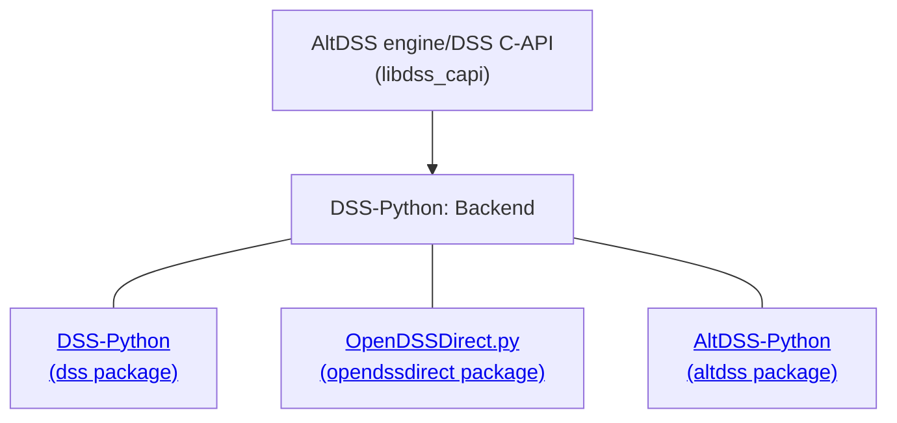

# OpenDSS: Overview of Python APIs

<!--
TODO:
- insert links to relevant official PDFs
- decide when to include benchmarks, and which ones (versions and so on)
- performance notes: add notes about specific DSS-Extensions features
-->

OpenDSS can be used and controlled through many different approaches. Using Python together with the OpenDSS allows using thousands of packages in the Python ecosystem. This was the main motivator for the inception of the DSS-Extensions project.

This document provides an overview of typical usage with the official implementation and the three options available on DSS-Extensions:



See also [the FAQ](https://github.com/dss-extensions/dss-extensions#faq) for more context.

## Official OpenDSS COM API (`OpenDSSEngine.DLL`)

When using the official COM implementation, the OpenDSS engine is used through `OpenDSSEngine.DLL`, part of the OpenDSS distribution. 

COM, "Component Object Model", is a Windows-specific technology available since the 1990's.

Usually, the required DLLs are automatically registered for COM interaction during the installation. If the user is manually installing, additional steps are required. There are 32-bit and a 64-bit versions of the engine, both are part of the official OpenDSS installation.

In Python, there are two main packages to interact with COM modules, `win32com` (part of the [`pywin32` distribution](https://github.com/mhammond/pywin32)) and [`comtypes`](https://github.com/enthought/comtypes). Both packages are available both through `pip` ([PyPI](https://pypi.org/), the Python Package Index) or through `conda` (the Anaconda ecosystem, including the wonderful [conda-forge](https://conda-forge.org/)). Since 2021, we recommend using `comtypes` if possible, so the code snippets below will use that. This recommendation is due to both its better performance when compared to `win32com`, and better/automatic handling of early-bindings code.

A minimal sample would be:

```python
import comtypes.client
dss = comtypes.client.CreateObject('OpenDSSEngine.DSS')

# Check the engine version
print(dss.Version)

# Load a circuit
dss.Text.Command = 'compile c:/my_folder/my_circuit1/master.dss'

# ...
```

### Handling the working directory (a.k.a. `cd`, `cwd`)

When the OpenDSS is loaded, some options stored in the Windows registry from the previous execution are loaded, including the last working directory. For example, suppose you ran a `compile` command with a file in the folder `c:\my_folder\my_circuit1` and exited OpenDSS — either through COM or through the GUI. By default, `c:\my_folder\my_circuit1` will be saved to the registry and restored in the next execution. This can be confusing and lead to unexpected behavior for new users when running scripts from other folders.

To avoid the issue, a typical idiom is:

```python
import os
import comtypes.client

# Save the current working directory path
old_cd = os.getcwd()

# OpenDSS may change the current working directory when loaded
dss = comtypes.client.CreateObject('OpenDSSEngine.DSS')

# Let's restore our working directory to the original, 
# before OpenDSS was loaded
os.chdir(old_cd)

# Continue as usual...

# Check the engine version
print(dss.Version)

# Load a circuit
dss.Text.Command = 'compile c:/my_folder/my_circuit1/master.dss'

# ...
```

## DSS-Extensions: DSS-Python 

For DSS-Extensions, users are not required to install the official OpenDSS, although we recommend new users to do so, especially to make it easier to follow legacy training material. DSS-Extensions use a customized engine with very good compatibility with the official OpenDSS engine, but better performance in some scenarios and a lot of extra features.

DSS-Python packages the OpenDSS engine as implemented in DSS-Extensions to mimic the organization of the COM implementation. As such, users can easily migrate from the official COM implementation to DSS-Python without rewriting all the code. In fact, some users keep a toggle to use both implementations.

DSS-Python is available for Windows, Linux, and macOS (including Apple M1 ARM machines, or "Apple Silicon" in marketing speak), while the official OpenDSS is official supported only on MS Windows.

Assuming recent DSS-Python versions (`dss-python>=0.12.1`) are installed (e.g. through `pip install dss-python`), you can use the following:

```python
from dss import dss

# Check the engine version
print(dss.Version)

# Load a circuit
dss.Text.Command = 'compile c:/my_folder/my_circuit1/master.dss'

# For modern DSS-Python versions, you can use this shortcut for Text.Command
dss('compile c:/my_folder/my_circuit1/master.dss')

# ...
```

Note that only the first two lines changed. Most of the official COM implementation is readily available otherwise. Some differences are inherit to the underlying difference OpenDSS engines. For example, plotting is different.

There are also a lot of extra features, some under development. These include multiple DSS engines in the same process, handling of ZIP files, and more. Please check [https://dss-extensions.org/DSS-Python/](https://dss-extensions.org/DSS-Python/). 


### More friendly types

Since DSS-Python v0.13, we added an option to toggle "advanced types". This feature is also available in OpenDSSDirect.py when the option to use NumPy arrays is enabled (check the docs).

Generally, the OpenDSS APIs return plain arrays. This happens even for data that represents matrices. Moreover, typically complex numbers are represented by pairs of floats. Since NumPy has good support for multi-dimensional arrays and complex numbers are simple in Python, we can use some new features of our DSS C-API library to provide user-friendly types with very low performance impact.

```python
from dss import dss

# Check the engine version
print(dss.Version)

# Load a circuit
dss.Text.Command = 'compile c:/my_folder/my_circuit1/master.dss'

dss.ActiveCircuit.Solution.Solve()

# Let's activate a CktElement
dss.ActiveCircuit.Vsources.First
CktElement = dss.ActiveCircuit.ActiveCktElement

# By default, for compatibility, these return a NumPy array with dtype=float64
volts_as_floats = dss.ActiveCircuit.AllBusVolts
yprim_as_floats = CktElement.Yprim

# It's simple to toggle the advanced types
dss.AdvancedTypes = True

# Now, this returns a NumPy array with dtype=complex128
volts = dss.ActiveCircuit.AllBusVolts

# And this returns a square complex matrix
yprim = CktElement.Yprim

```

### Patching and Pythonizing the official COM module

DSS-Python also ships with a small utility function to patch the COM implementations to provide some Pythonic extras and a few additional properties/functions. This patch works with both `comtypes` and `win32com`.

For example, most top-level APIs in DSS-Python support iteration and users can to this:

```python
for b in dss.ActiveCircuit.ActiveBus:
    print(b.Name, b.x, b.y)
```

To facilitate migration and cross-compatibility, users can call the function to patch and keep the same code with the COM-based implementation.

For a practical example, this fails:

```python
import comtypes.client
dss = comtypes.client.CreateObject('OpenDSSEngine.DSS')

dss.Text.Command = r'redirect "C:\Program Files\OpenDSS\IEEETestCases\13Bus\IEEE13Nodeckt.dss"'

for b in dss.ActiveCircuit.ActiveBus:
    print(b.Name, b.x, b.y)

for b in dss.ActiveCircuit.Loads:
    print(l.Name, l.kW)

```

You should get a message like `TypeError: 'POINTER(IBus)' object is not iterable` or `TypeError: 'POINTER(ILoads)' object is not iterable`.

But this works:

```python
from dss import patch_dss_com # import this
import comtypes.client

# Wrap the creation of the object
dss = patch_dss_com(comtypes.client.CreateObject('OpenDSSEngine.DSS'))

dss.Text.Command = r'redirect "C:\Program Files\OpenDSS\IEEETestCases\13Bus\IEEE13Nodeckt.dss"'

for b in dss.ActiveCircuit.ActiveBus:
    print(b.Name, b.x, b.y)

for l in dss.ActiveCircuit.Loads:
    print(l.Name, l.kW)
```
The output is what we expect:

```
sourcebus 200.0 400.0
650 200.0 350.0
rg60 200.0 300.0
633 350.0 250.0
634 400.0 250.0
671 200.0 100.0
645 100.0 250.0
646 0.0 250.0
692 250.0 100.0
675 400.0 100.0
611 0.0 100.0
652 100.0 0.0
670 200.0 200.0
632 200.0 250.0
680 200.0 0.0
684 100.0 100.0
671 1155.0
634a 160.0
634b 120.0
634c 120.0
645 170.0
646 230.0
692 170.0
675a 485.0
675b 68.0
675c 290.0
611 170.0
652 128.0
670a 17.0
670b 66.0
670c 117.0
```

Besides the iterators, a notable addition from this patch is adding the [`dss.ActiveCircuit.Monitors.AsMatrix()`](https://dss-extensions.org/DSS-Python/apidocs/dss/dss.IMonitors.html#dss.IMonitors.IMonitors.AsMatrix). This function is a utility function for performance that returns all monitor channels as a matrix, avoiding multiple round trips and redundant processing to extract the channels individually.

Note that this patch doesn't change the official engine, just adjusts the Python side to provide some convenience.

## DSS-Extensions: OpenDSSDirect.py

OpenDSSDirect.py (ODD.py for short) is a project that initially employed the official `OpenDSSDirect.DLL` (a.k.a. "Direct Connection Shared Library"/DCSL or "Direct DLL") to expose OpenDSS to Python users. When the DSS-Extensions project was created, ODD.py was migrated to use the lower-level tools from DSS-Python to expose the same Python API as before, but using the engine from DSS-Extensions.

**Sidenote:** `OpenDSSDirect.DLL` still exists. It bypasses some of the COM requirements, such as DLL registration, but the general performance should be the same as the COM DLL implementation — see, e.g., [page 27 here (under "Myths and legends about user interfaces")](https://sourceforge.net/p/electricdss/code/HEAD/tree/trunk/Training/Virtual-2022/session2/Session_2_2022_DMCR_v3.pdf?format=raw), from Session 2 of the OpenDSS Virtual Training 2022. There is no officially supported module for Python that uses `OpenDSSDirect.DLL` as of November 2022. Besides that, we only compare to the official COM implementation for conciseness.

Most of the features from DSS-Python are available in ODD.py, and it has a few extra utility functions.

Style-wise, the main difference from ODD.py and DSS-Python is that instead of Python properties, most access is done through plain function calls and the module/class organization is flatter.

More notes and API docs are available at [https://dss-extensions.org/OpenDSSDirect.py/](https://dss-extensions.org/OpenDSSDirect.py/).

```python
from opendssdirect import dss

# Check the engine version
print(dss.Basic.Version())

# Load a circuit
dss.Text.Command('compile c:/my_folder/my_circuit1/master.dss')

# You can also use the shortcut to achieve the same
dss('compile c:/my_folder/my_circuit1/master.dss')

# ...
```

## DSS-Extensions: AltDSS-Python

AltDSS-Python provides a new approach, representing a unified and extended API that allows manipulating directly in Python nearly all OpenDSS object types. Moreover, it encapsulates all separate concepts in a simple class.

The new features can be used together with both DSS-Python and OpenDSSDirect.py, allowing users to complement existing code instead of having to rewrite everything. 

```

```


Visit https://dss-extensions.org/AltDSS-Python/ for more information and a growing number of examples.

## General performance tips

This list is mostly API agnostic.

- Avoid using strings in general. Strings can be converted multiple times through the APIs (Python implementation, internal DSS API implementation, maybe OS specific details).
- If something is known to be static — e.g. list of line names — try caching (keeping a copy) at Python level to avoid the API overhead. Lists of strings (like `All...Names`) and arrays are especially heavy since a lot of processing may be required in the interface between languages.
- Use `idx` where possible to avoid passing strings avoid and a hashmap lookup. `idx` only passes a single integer through the APIs and activates the element directly, so it is fast. `Name` needs all the string work and a hashmap (somewhat equivalent to `dict` in Python) lookup, then activates the target element. Although the official OpenDSS implementation does not include `idx` for all component types, DSS-Extensions do. See the next section for details.
- For reading multiple channels from a single Monitor object, prefer using the `ByteStream` property/function or the `AsMatrix` extension (even with COM) as noted in a previous section.
- If you need to mutate an object or read a result and the target DSS class has a dedicated API, prefer using that instead of feeding strings through the `Text.Command` API. The dedicated APIs can change the target fields directly (this is especially true for DSS-Extensions), while `Text.Command` feeds the DSS parser first. In the end, using the dedicated APIs can avoid string formatting/interpolation and later parsing back those to integers/floats/etc. altogether.
- If your analysis requires running multiple scenarios of the same circuit, do try to keep the circuit in memory instead of reloading it. For that, save the list of changes done in the previous analysis step to undo them later, or just restore everything to a known state. This can bring a good performance bonus with medium and large circuits. Tiny circuits may not be affected, but that depends on a lot of factors, including the processor of the machine running the DSS engine.
- On Windows:
    - avoid circuits fragmented in too many files
    - try to exclude the circuit folders from your antivirus scans (especially real-time scans)
    - avoid disk operations in general since NTFS (the most common file system on Windows) is usually slow; if possible, use an API to read the results in memory instead of writing a text report and reading it back. This is not always possible, but many new users don't explore the API before deciding to use the slow approach of using reports.


## Property and function table

A common issue for new users (especially OpenDSSDirect.py users) is that the official OpenDSS documentation and examples usually represent the official COM implementation, as expected.

The following table shows how most (but not all) of the functions and properties are mapped. If the cell contains `()`, it means the field is exposed by a Python function, otherwise, it is a Python property. Each cell links to the relevant documentation page, which in turn can contain links to the official documentation, if available.

As a complement, we added the "API extension" column. If a check mark is present ("<span style="color:#009900">✓</span>"), that means the function/property is only available in the DSS-Extensions implementation amd users should beware if cross-compatibility with the official EPRI version is required. If no check mark is present, the COM implementation includes the function or property. That is, if there is no check mark for a row, users can replace "DSS-Python" with "COM implementation" as the API is the same for those cases.

We hope this table can elucidate some common doubts.

**Note:** As of OpenDSS v9.8.0.1, the `Storages` API is implemented, but it's not exposed for the user (in `dss.ActiveCircuit.Storages`), so it's marked as an extension below.

<table><thead><tr><th>API extension</th><th>DSS-Python</th><th>OpenDSSDirect.py</th></tr></thead>
<!--MAPPING_TABLE.BEGIN-->
<tbody>

<tr><td></td><td><a href="https://dss-extensions.org/DSS-Python/apidocs/dss/dss.IBus.html#dss.IBus.IBus.AllPCEatBus">dss.ActiveCircuit.ActiveBus.AllPCEatBus</a></td><td><a href="https://dss-extensions.org/OpenDSSDirect.py/opendssdirect.html#opendssdirect.Bus.IBus.AllPCEatBus">dss.Bus.AllPCEatBus()</a></td></tr>
<tr><td></td><td><a href="https://dss-extensions.org/DSS-Python/apidocs/dss/dss.IBus.html#dss.IBus.IBus.AllPDEatBus">dss.ActiveCircuit.ActiveBus.AllPDEatBus</a></td><td><a href="https://dss-extensions.org/OpenDSSDirect.py/opendssdirect.html#opendssdirect.Bus.IBus.AllPDEatBus">dss.Bus.AllPDEatBus()</a></td></tr>
<tr><td></td><td><a href="https://dss-extensions.org/DSS-Python/apidocs/dss/dss.IBus.html#dss.IBus.IBus.Coorddefined">dss.ActiveCircuit.ActiveBus.Coorddefined</a></td><td><a href="https://dss-extensions.org/OpenDSSDirect.py/opendssdirect.html#opendssdirect.Bus.IBus.Coorddefined">dss.Bus.Coorddefined()</a></td></tr>
<tr><td></td><td><a href="https://dss-extensions.org/DSS-Python/apidocs/dss/dss.IBus.html#dss.IBus.IBus.CplxSeqVoltages">dss.ActiveCircuit.ActiveBus.CplxSeqVoltages</a></td><td><a href="https://dss-extensions.org/OpenDSSDirect.py/opendssdirect.html#opendssdirect.Bus.IBus.CplxSeqVoltages">dss.Bus.CplxSeqVoltages()</a></td></tr>
<tr><td></td><td><a href="https://dss-extensions.org/DSS-Python/apidocs/dss/dss.IBus.html#dss.IBus.IBus.Cust_Duration">dss.ActiveCircuit.ActiveBus.Cust_Duration</a></td><td><a href="https://dss-extensions.org/OpenDSSDirect.py/opendssdirect.html#opendssdirect.Bus.IBus.Cust_Duration">dss.Bus.Cust_Duration()</a></td></tr>
<tr><td></td><td><a href="https://dss-extensions.org/DSS-Python/apidocs/dss/dss.IBus.html#dss.IBus.IBus.Cust_Interrupts">dss.ActiveCircuit.ActiveBus.Cust_Interrupts</a></td><td><a href="https://dss-extensions.org/OpenDSSDirect.py/opendssdirect.html#opendssdirect.Bus.IBus.Cust_Interrupts">dss.Bus.Cust_Interrupts()</a></td></tr>
<tr><td></td><td><a href="https://dss-extensions.org/DSS-Python/apidocs/dss/dss.IBus.html#dss.IBus.IBus.Distance">dss.ActiveCircuit.ActiveBus.Distance</a></td><td><a href="https://dss-extensions.org/OpenDSSDirect.py/opendssdirect.html#opendssdirect.Bus.IBus.Distance">dss.Bus.Distance()</a></td></tr>
<tr><td></td><td><a href="https://dss-extensions.org/DSS-Python/apidocs/dss/dss.IBus.html#dss.IBus.IBus.GetUniqueNodeNumber">dss.ActiveCircuit.ActiveBus.GetUniqueNodeNumber()</a></td><td><a href="https://dss-extensions.org/OpenDSSDirect.py/opendssdirect.html#opendssdirect.Bus.IBus.GetUniqueNodeNumber">dss.Bus.GetUniqueNodeNumber()</a></td></tr>
<tr><td></td><td><a href="https://dss-extensions.org/DSS-Python/apidocs/dss/dss.IBus.html#dss.IBus.IBus.Int_Duration">dss.ActiveCircuit.ActiveBus.Int_Duration</a></td><td><a href="https://dss-extensions.org/OpenDSSDirect.py/opendssdirect.html#opendssdirect.Bus.IBus.Int_Duration">dss.Bus.Int_Duration()</a></td></tr>
<tr><td></td><td><a href="https://dss-extensions.org/DSS-Python/apidocs/dss/dss.IBus.html#dss.IBus.IBus.Isc">dss.ActiveCircuit.ActiveBus.Isc</a></td><td><a href="https://dss-extensions.org/OpenDSSDirect.py/opendssdirect.html#opendssdirect.Bus.IBus.Isc">dss.Bus.Isc()</a></td></tr>
<tr><td></td><td><a href="https://dss-extensions.org/DSS-Python/apidocs/dss/dss.IBus.html#dss.IBus.IBus.Lambda">dss.ActiveCircuit.ActiveBus.Lambda</a></td><td><a href="https://dss-extensions.org/OpenDSSDirect.py/opendssdirect.html#opendssdirect.Bus.IBus.Lambda">dss.Bus.Lambda()</a></td></tr>
<tr><td></td><td><a href="https://dss-extensions.org/DSS-Python/apidocs/dss/dss.IBus.html#dss.IBus.IBus.LineList">dss.ActiveCircuit.ActiveBus.LineList</a></td><td><a href="https://dss-extensions.org/OpenDSSDirect.py/opendssdirect.html#opendssdirect.Bus.IBus.LineList">dss.Bus.LineList()</a></td></tr>
<tr><td></td><td><a href="https://dss-extensions.org/DSS-Python/apidocs/dss/dss.IBus.html#dss.IBus.IBus.LoadList">dss.ActiveCircuit.ActiveBus.LoadList</a></td><td><a href="https://dss-extensions.org/OpenDSSDirect.py/opendssdirect.html#opendssdirect.Bus.IBus.LoadList">dss.Bus.LoadList()</a></td></tr>
<tr><td></td><td><a href="https://dss-extensions.org/DSS-Python/apidocs/dss/dss.IBus.html#dss.IBus.IBus.N_Customers">dss.ActiveCircuit.ActiveBus.N_Customers</a></td><td><a href="https://dss-extensions.org/OpenDSSDirect.py/opendssdirect.html#opendssdirect.Bus.IBus.N_Customers">dss.Bus.N_Customers()</a></td></tr>
<tr><td></td><td><a href="https://dss-extensions.org/DSS-Python/apidocs/dss/dss.IBus.html#dss.IBus.IBus.N_interrupts">dss.ActiveCircuit.ActiveBus.N_interrupts</a></td><td><a href="https://dss-extensions.org/OpenDSSDirect.py/opendssdirect.html#opendssdirect.Bus.IBus.N_interrupts">dss.Bus.N_interrupts()</a></td></tr>
<tr><td></td><td><a href="https://dss-extensions.org/DSS-Python/apidocs/dss/dss.IBus.html#dss.IBus.IBus.Name">dss.ActiveCircuit.ActiveBus.Name</a></td><td><a href="https://dss-extensions.org/OpenDSSDirect.py/opendssdirect.html#opendssdirect.Bus.IBus.Name">dss.Bus.Name()</a></td></tr>
<tr><td></td><td><a href="https://dss-extensions.org/DSS-Python/apidocs/dss/dss.IBus.html#dss.IBus.IBus.Nodes">dss.ActiveCircuit.ActiveBus.Nodes</a></td><td><a href="https://dss-extensions.org/OpenDSSDirect.py/opendssdirect.html#opendssdirect.Bus.IBus.Nodes">dss.Bus.Nodes()</a></td></tr>
<tr><td></td><td><a href="https://dss-extensions.org/DSS-Python/apidocs/dss/dss.IBus.html#dss.IBus.IBus.NumNodes">dss.ActiveCircuit.ActiveBus.NumNodes</a></td><td><a href="https://dss-extensions.org/OpenDSSDirect.py/opendssdirect.html#opendssdirect.Bus.IBus.NumNodes">dss.Bus.NumNodes()</a></td></tr>
<tr><td></td><td><a href="https://dss-extensions.org/DSS-Python/apidocs/dss/dss.IBus.html#dss.IBus.IBus.SectionID">dss.ActiveCircuit.ActiveBus.SectionID</a></td><td><a href="https://dss-extensions.org/OpenDSSDirect.py/opendssdirect.html#opendssdirect.Bus.IBus.SectionID">dss.Bus.SectionID()</a></td></tr>
<tr><td></td><td><a href="https://dss-extensions.org/DSS-Python/apidocs/dss/dss.IBus.html#dss.IBus.IBus.SeqVoltages">dss.ActiveCircuit.ActiveBus.SeqVoltages</a></td><td><a href="https://dss-extensions.org/OpenDSSDirect.py/opendssdirect.html#opendssdirect.Bus.IBus.SeqVoltages">dss.Bus.SeqVoltages()</a></td></tr>
<tr><td></td><td><a href="https://dss-extensions.org/DSS-Python/apidocs/dss/dss.IBus.html#dss.IBus.IBus.TotalMiles">dss.ActiveCircuit.ActiveBus.TotalMiles</a></td><td><a href="https://dss-extensions.org/OpenDSSDirect.py/opendssdirect.html#opendssdirect.Bus.IBus.TotalMiles">dss.Bus.TotalMiles()</a></td></tr>
<tr><td></td><td><a href="https://dss-extensions.org/DSS-Python/apidocs/dss/dss.IBus.html#dss.IBus.IBus.VLL">dss.ActiveCircuit.ActiveBus.VLL</a></td><td><a href="https://dss-extensions.org/OpenDSSDirect.py/opendssdirect.html#opendssdirect.Bus.IBus.VLL">dss.Bus.VLL()</a></td></tr>
<tr><td></td><td><a href="https://dss-extensions.org/DSS-Python/apidocs/dss/dss.IBus.html#dss.IBus.IBus.VMagAngle">dss.ActiveCircuit.ActiveBus.VMagAngle</a></td><td><a href="https://dss-extensions.org/OpenDSSDirect.py/opendssdirect.html#opendssdirect.Bus.IBus.VMagAngle">dss.Bus.VMagAngle()</a></td></tr>
<tr><td></td><td><a href="https://dss-extensions.org/DSS-Python/apidocs/dss/dss.IBus.html#dss.IBus.IBus.Voc">dss.ActiveCircuit.ActiveBus.Voc</a></td><td><a href="https://dss-extensions.org/OpenDSSDirect.py/opendssdirect.html#opendssdirect.Bus.IBus.Voc">dss.Bus.Voc()</a></td></tr>
<tr><td></td><td><a href="https://dss-extensions.org/DSS-Python/apidocs/dss/dss.IBus.html#dss.IBus.IBus.Voltages">dss.ActiveCircuit.ActiveBus.Voltages</a></td><td><a href="https://dss-extensions.org/OpenDSSDirect.py/opendssdirect.html#opendssdirect.Bus.IBus.Voltages">dss.Bus.Voltages()</a></td></tr>
<tr><td></td><td><a href="https://dss-extensions.org/DSS-Python/apidocs/dss/dss.IBus.html#dss.IBus.IBus.YscMatrix">dss.ActiveCircuit.ActiveBus.YscMatrix</a></td><td><a href="https://dss-extensions.org/OpenDSSDirect.py/opendssdirect.html#opendssdirect.Bus.IBus.YscMatrix">dss.Bus.YscMatrix()</a></td></tr>
<tr><td></td><td><a href="https://dss-extensions.org/DSS-Python/apidocs/dss/dss.IBus.html#dss.IBus.IBus.Zsc0">dss.ActiveCircuit.ActiveBus.Zsc0</a></td><td><a href="https://dss-extensions.org/OpenDSSDirect.py/opendssdirect.html#opendssdirect.Bus.IBus.Zsc0">dss.Bus.Zsc0()</a></td></tr>
<tr><td></td><td><a href="https://dss-extensions.org/DSS-Python/apidocs/dss/dss.IBus.html#dss.IBus.IBus.Zsc1">dss.ActiveCircuit.ActiveBus.Zsc1</a></td><td><a href="https://dss-extensions.org/OpenDSSDirect.py/opendssdirect.html#opendssdirect.Bus.IBus.Zsc1">dss.Bus.Zsc1()</a></td></tr>
<tr><td></td><td><a href="https://dss-extensions.org/DSS-Python/apidocs/dss/dss.IBus.html#dss.IBus.IBus.ZscMatrix">dss.ActiveCircuit.ActiveBus.ZscMatrix</a></td><td><a href="https://dss-extensions.org/OpenDSSDirect.py/opendssdirect.html#opendssdirect.Bus.IBus.ZscMatrix">dss.Bus.ZscMatrix()</a></td></tr>
<tr><td></td><td><a href="https://dss-extensions.org/DSS-Python/apidocs/dss/dss.IBus.html#dss.IBus.IBus.ZscRefresh">dss.ActiveCircuit.ActiveBus.ZscRefresh()</a></td><td><a href="https://dss-extensions.org/OpenDSSDirect.py/opendssdirect.html#opendssdirect.Bus.IBus.ZscRefresh">dss.Bus.ZscRefresh()</a></td></tr>
<tr><td></td><td><a href="https://dss-extensions.org/DSS-Python/apidocs/dss/dss.IBus.html#dss.IBus.IBus.kVBase">dss.ActiveCircuit.ActiveBus.kVBase</a></td><td><a href="https://dss-extensions.org/OpenDSSDirect.py/opendssdirect.html#opendssdirect.Bus.IBus.kVBase">dss.Bus.kVBase()</a></td></tr>
<tr><td></td><td><a href="https://dss-extensions.org/DSS-Python/apidocs/dss/dss.IBus.html#dss.IBus.IBus.puVLL">dss.ActiveCircuit.ActiveBus.puVLL</a></td><td><a href="https://dss-extensions.org/OpenDSSDirect.py/opendssdirect.html#opendssdirect.Bus.IBus.puVLL">dss.Bus.puVLL()</a></td></tr>
<tr><td></td><td><a href="https://dss-extensions.org/DSS-Python/apidocs/dss/dss.IBus.html#dss.IBus.IBus.puVmagAngle">dss.ActiveCircuit.ActiveBus.puVmagAngle</a></td><td><a href="https://dss-extensions.org/OpenDSSDirect.py/opendssdirect.html#opendssdirect.Bus.IBus.puVmagAngle">dss.Bus.puVmagAngle()</a></td></tr>
<tr><td></td><td><a href="https://dss-extensions.org/DSS-Python/apidocs/dss/dss.IBus.html#dss.IBus.IBus.puVoltages">dss.ActiveCircuit.ActiveBus.puVoltages</a></td><td><a href="https://dss-extensions.org/OpenDSSDirect.py/opendssdirect.html#opendssdirect.Bus.IBus.PuVoltage">dss.Bus.PuVoltage()</a></td></tr>
<tr><td></td><td><a href="https://dss-extensions.org/DSS-Python/apidocs/dss/dss.IBus.html#dss.IBus.IBus.x">dss.ActiveCircuit.ActiveBus.x</a></td><td><a href="https://dss-extensions.org/OpenDSSDirect.py/opendssdirect.html#opendssdirect.Bus.IBus.X">dss.Bus.X()</a></td></tr>
<tr><td></td><td><a href="https://dss-extensions.org/DSS-Python/apidocs/dss/dss.IBus.html#dss.IBus.IBus.y">dss.ActiveCircuit.ActiveBus.y</a></td><td><a href="https://dss-extensions.org/OpenDSSDirect.py/opendssdirect.html#opendssdirect.Bus.IBus.Y">dss.Bus.Y()</a></td></tr>
<tr><td></td><td><a href="https://dss-extensions.org/DSS-Python/apidocs/dss/dss.IDSSElement.html#dss.IDSSElement.IDSSElement.AllPropertyNames">dss.ActiveCircuit.ActiveDSSElement.AllPropertyNames</a></td><td><a href="https://dss-extensions.org/OpenDSSDirect.py/opendssdirect.html#opendssdirect.Element.IElement.AllPropertyNames">dss.Element.AllPropertyNames()</a></td></tr>
<tr><td></td><td><a href="https://dss-extensions.org/DSS-Python/apidocs/dss/dss.IDSSElement.html#dss.IDSSElement.IDSSElement.Name">dss.ActiveCircuit.ActiveDSSElement.Name</a></td><td><a href="https://dss-extensions.org/OpenDSSDirect.py/opendssdirect.html#opendssdirect.Element.IElement.Name">dss.Element.Name()</a></td></tr>
<tr><td></td><td><a href="https://dss-extensions.org/DSS-Python/apidocs/dss/dss.IDSSElement.html#dss.IDSSElement.IDSSElement.NumProperties">dss.ActiveCircuit.ActiveDSSElement.NumProperties</a></td><td><a href="https://dss-extensions.org/OpenDSSDirect.py/opendssdirect.html#opendssdirect.Element.IElement.NumProperties">dss.Element.NumProperties()</a></td></tr>
<tr><td></td><td><a href="https://dss-extensions.org/DSS-Python/apidocs/dss/dss.IDSSProperty.html#dss.IDSSProperty.IDSSProperty.Description">dss.ActiveCircuit.ActiveDSSElement.Properties.Description</a></td><td><a href="https://dss-extensions.org/OpenDSSDirect.py/opendssdirect.html#opendssdirect.Properties.IProperties.Description">dss.Properties.Description()</a></td></tr>
<tr><td></td><td><a href="https://dss-extensions.org/DSS-Python/apidocs/dss/dss.IDSSProperty.html#dss.IDSSProperty.IDSSProperty.Name">dss.ActiveCircuit.ActiveDSSElement.Properties.Name</a></td><td><a href="https://dss-extensions.org/OpenDSSDirect.py/opendssdirect.html#opendssdirect.Properties.IProperties.Name">dss.Properties.Name()</a></td></tr>
<tr><td></td><td><a href="https://dss-extensions.org/DSS-Python/apidocs/dss/dss.IDSSProperty.html#dss.IDSSProperty.IDSSProperty.Val">dss.ActiveCircuit.ActiveDSSElement.Properties.Val</a></td><td><a href="https://dss-extensions.org/OpenDSSDirect.py/opendssdirect.html#opendssdirect.Properties.IProperties.Value">dss.Properties.Value()</a></td></tr>
<tr><td><span style="color:#009900">✓</span></td><td><a href="https://dss-extensions.org/DSS-Python/apidocs/dss/dss.IDSSElement.html#dss.IDSSElement.IDSSElement.ToJSON">dss.ActiveCircuit.ActiveDSSElement.ToJSON()</a></td><td><a href="https://dss-extensions.org/OpenDSSDirect.py/opendssdirect.html#opendssdirect.Element.IElement.ToJSON">dss.Element.ToJSON()</a></td></tr>
<tr><td></td><td><a href="https://dss-extensions.org/DSS-Python/apidocs/dss/dss.ICktElement.html#dss.ICktElement.ICktElement.AllPropertyNames">dss.ActiveCircuit.ActiveElement.AllPropertyNames</a></td><td><a href="https://dss-extensions.org/OpenDSSDirect.py/opendssdirect.html#opendssdirect.CktElement.ICktElement.AllPropertyNames">dss.CktElement.AllPropertyNames()</a></td></tr>
<tr><td></td><td><a href="https://dss-extensions.org/DSS-Python/apidocs/dss/dss.ICktElement.html#dss.ICktElement.ICktElement.AllVariableNames">dss.ActiveCircuit.ActiveElement.AllVariableNames</a></td><td><a href="https://dss-extensions.org/OpenDSSDirect.py/opendssdirect.html#opendssdirect.CktElement.ICktElement.AllVariableNames">dss.CktElement.AllVariableNames()</a></td></tr>
<tr><td></td><td><a href="https://dss-extensions.org/DSS-Python/apidocs/dss/dss.ICktElement.html#dss.ICktElement.ICktElement.AllVariableValues">dss.ActiveCircuit.ActiveElement.AllVariableValues</a></td><td><a href="https://dss-extensions.org/OpenDSSDirect.py/opendssdirect.html#opendssdirect.CktElement.ICktElement.AllVariableValues">dss.CktElement.AllVariableValues()</a></td></tr>
<tr><td></td><td><a href="https://dss-extensions.org/DSS-Python/apidocs/dss/dss.ICktElement.html#dss.ICktElement.ICktElement.BusNames">dss.ActiveCircuit.ActiveElement.BusNames</a></td><td><a href="https://dss-extensions.org/OpenDSSDirect.py/opendssdirect.html#opendssdirect.CktElement.ICktElement.BusNames">dss.CktElement.BusNames()</a></td></tr>
<tr><td></td><td><a href="https://dss-extensions.org/DSS-Python/apidocs/dss/dss.ICktElement.html#dss.ICktElement.ICktElement.Close">dss.ActiveCircuit.ActiveElement.Close()</a></td><td><a href="https://dss-extensions.org/OpenDSSDirect.py/opendssdirect.html#opendssdirect.CktElement.ICktElement.Close">dss.CktElement.Close()</a></td></tr>
<tr><td></td><td><a href="https://dss-extensions.org/DSS-Python/apidocs/dss/dss.ICktElement.html#dss.ICktElement.ICktElement.Controller">dss.ActiveCircuit.ActiveElement.Controller()</a></td><td><a href="https://dss-extensions.org/OpenDSSDirect.py/opendssdirect.html#opendssdirect.CktElement.ICktElement.Controller">dss.CktElement.Controller()</a></td></tr>
<tr><td></td><td><a href="https://dss-extensions.org/DSS-Python/apidocs/dss/dss.ICktElement.html#dss.ICktElement.ICktElement.CplxSeqCurrents">dss.ActiveCircuit.ActiveElement.CplxSeqCurrents</a></td><td><a href="https://dss-extensions.org/OpenDSSDirect.py/opendssdirect.html#opendssdirect.CktElement.ICktElement.CplxSeqCurrents">dss.CktElement.CplxSeqCurrents()</a></td></tr>
<tr><td></td><td><a href="https://dss-extensions.org/DSS-Python/apidocs/dss/dss.ICktElement.html#dss.ICktElement.ICktElement.CplxSeqVoltages">dss.ActiveCircuit.ActiveElement.CplxSeqVoltages</a></td><td><a href="https://dss-extensions.org/OpenDSSDirect.py/opendssdirect.html#opendssdirect.CktElement.ICktElement.CplxSeqVoltages">dss.CktElement.CplxSeqVoltages()</a></td></tr>
<tr><td></td><td><a href="https://dss-extensions.org/DSS-Python/apidocs/dss/dss.ICktElement.html#dss.ICktElement.ICktElement.Currents">dss.ActiveCircuit.ActiveElement.Currents</a></td><td><a href="https://dss-extensions.org/OpenDSSDirect.py/opendssdirect.html#opendssdirect.CktElement.ICktElement.Currents">dss.CktElement.Currents()</a></td></tr>
<tr><td></td><td><a href="https://dss-extensions.org/DSS-Python/apidocs/dss/dss.ICktElement.html#dss.ICktElement.ICktElement.CurrentsMagAng">dss.ActiveCircuit.ActiveElement.CurrentsMagAng</a></td><td><a href="https://dss-extensions.org/OpenDSSDirect.py/opendssdirect.html#opendssdirect.CktElement.ICktElement.CurrentsMagAng">dss.CktElement.CurrentsMagAng()</a></td></tr>
<tr><td></td><td><a href="https://dss-extensions.org/DSS-Python/apidocs/dss/dss.ICktElement.html#dss.ICktElement.ICktElement.DisplayName">dss.ActiveCircuit.ActiveElement.DisplayName</a></td><td><a href="https://dss-extensions.org/OpenDSSDirect.py/opendssdirect.html#opendssdirect.CktElement.ICktElement.DisplayName">dss.CktElement.DisplayName()</a></td></tr>
<tr><td></td><td><a href="https://dss-extensions.org/DSS-Python/apidocs/dss/dss.ICktElement.html#dss.ICktElement.ICktElement.EmergAmps">dss.ActiveCircuit.ActiveElement.EmergAmps</a></td><td><a href="https://dss-extensions.org/OpenDSSDirect.py/opendssdirect.html#opendssdirect.CktElement.ICktElement.EmergAmps">dss.CktElement.EmergAmps()</a></td></tr>
<tr><td></td><td><a href="https://dss-extensions.org/DSS-Python/apidocs/dss/dss.ICktElement.html#dss.ICktElement.ICktElement.Enabled">dss.ActiveCircuit.ActiveElement.Enabled</a></td><td><a href="https://dss-extensions.org/OpenDSSDirect.py/opendssdirect.html#opendssdirect.CktElement.ICktElement.Enabled">dss.CktElement.Enabled()</a></td></tr>
<tr><td></td><td><a href="https://dss-extensions.org/DSS-Python/apidocs/dss/dss.ICktElement.html#dss.ICktElement.ICktElement.EnergyMeter">dss.ActiveCircuit.ActiveElement.EnergyMeter</a></td><td><a href="https://dss-extensions.org/OpenDSSDirect.py/opendssdirect.html#opendssdirect.CktElement.ICktElement.EnergyMeter">dss.CktElement.EnergyMeter()</a></td></tr>
<tr><td></td><td><a href="https://dss-extensions.org/DSS-Python/apidocs/dss/dss.ICktElement.html#dss.ICktElement.ICktElement.GUID">dss.ActiveCircuit.ActiveElement.GUID</a></td><td><a href="https://dss-extensions.org/OpenDSSDirect.py/opendssdirect.html#opendssdirect.CktElement.ICktElement.GUID">dss.CktElement.GUID()</a></td></tr>
<tr><td></td><td><a href="https://dss-extensions.org/DSS-Python/apidocs/dss/dss.ICktElement.html#dss.ICktElement.ICktElement.Handle">dss.ActiveCircuit.ActiveElement.Handle</a></td><td><a href="https://dss-extensions.org/OpenDSSDirect.py/opendssdirect.html#opendssdirect.CktElement.ICktElement.Handle">dss.CktElement.Handle()</a></td></tr>
<tr><td></td><td><a href="https://dss-extensions.org/DSS-Python/apidocs/dss/dss.ICktElement.html#dss.ICktElement.ICktElement.HasOCPDevice">dss.ActiveCircuit.ActiveElement.HasOCPDevice</a></td><td><a href="https://dss-extensions.org/OpenDSSDirect.py/opendssdirect.html#opendssdirect.CktElement.ICktElement.HasOCPDevice">dss.CktElement.HasOCPDevice()</a></td></tr>
<tr><td></td><td><a href="https://dss-extensions.org/DSS-Python/apidocs/dss/dss.ICktElement.html#dss.ICktElement.ICktElement.HasSwitchControl">dss.ActiveCircuit.ActiveElement.HasSwitchControl</a></td><td><a href="https://dss-extensions.org/OpenDSSDirect.py/opendssdirect.html#opendssdirect.CktElement.ICktElement.HasSwitchControl">dss.CktElement.HasSwitchControl()</a></td></tr>
<tr><td></td><td><a href="https://dss-extensions.org/DSS-Python/apidocs/dss/dss.ICktElement.html#dss.ICktElement.ICktElement.HasVoltControl">dss.ActiveCircuit.ActiveElement.HasVoltControl</a></td><td><a href="https://dss-extensions.org/OpenDSSDirect.py/opendssdirect.html#opendssdirect.CktElement.ICktElement.HasVoltControl">dss.CktElement.HasVoltControl()</a></td></tr>
<tr><td><span style="color:#009900">✓</span></td><td><a href="https://dss-extensions.org/DSS-Python/apidocs/dss/dss.ICktElement.html#dss.ICktElement.ICktElement.IsIsolated">dss.ActiveCircuit.ActiveElement.IsIsolated</a></td><td><a href="https://dss-extensions.org/OpenDSSDirect.py/opendssdirect.html#opendssdirect.CktElement.ICktElement.IsIsolated">dss.CktElement.IsIsolated()</a></td></tr>
<tr><td></td><td><a href="https://dss-extensions.org/DSS-Python/apidocs/dss/dss.ICktElement.html#dss.ICktElement.ICktElement.IsOpen">dss.ActiveCircuit.ActiveElement.IsOpen()</a></td><td><a href="https://dss-extensions.org/OpenDSSDirect.py/opendssdirect.html#opendssdirect.CktElement.ICktElement.IsOpen">dss.CktElement.IsOpen()</a></td></tr>
<tr><td></td><td><a href="https://dss-extensions.org/DSS-Python/apidocs/dss/dss.ICktElement.html#dss.ICktElement.ICktElement.Losses">dss.ActiveCircuit.ActiveElement.Losses</a></td><td><a href="https://dss-extensions.org/OpenDSSDirect.py/opendssdirect.html#opendssdirect.CktElement.ICktElement.Losses">dss.CktElement.Losses()</a></td></tr>
<tr><td></td><td><a href="https://dss-extensions.org/DSS-Python/apidocs/dss/dss.ICktElement.html#dss.ICktElement.ICktElement.Name">dss.ActiveCircuit.ActiveElement.Name</a></td><td><a href="https://dss-extensions.org/OpenDSSDirect.py/opendssdirect.html#opendssdirect.CktElement.ICktElement.Name">dss.CktElement.Name()</a></td></tr>
<tr><td></td><td><a href="https://dss-extensions.org/DSS-Python/apidocs/dss/dss.ICktElement.html#dss.ICktElement.ICktElement.NodeOrder">dss.ActiveCircuit.ActiveElement.NodeOrder</a></td><td><a href="https://dss-extensions.org/OpenDSSDirect.py/opendssdirect.html#opendssdirect.CktElement.ICktElement.NodeOrder">dss.CktElement.NodeOrder()</a></td></tr>
<tr><td><span style="color:#009900">✓</span></td><td><a href="https://dss-extensions.org/DSS-Python/apidocs/dss/dss.ICktElement.html#dss.ICktElement.ICktElement.NodeRef">dss.ActiveCircuit.ActiveElement.NodeRef</a></td><td><a href="https://dss-extensions.org/OpenDSSDirect.py/opendssdirect.html#opendssdirect.CktElement.ICktElement.NodeRef">dss.CktElement.NodeRef()</a></td></tr>
<tr><td></td><td><a href="https://dss-extensions.org/DSS-Python/apidocs/dss/dss.ICktElement.html#dss.ICktElement.ICktElement.NormalAmps">dss.ActiveCircuit.ActiveElement.NormalAmps</a></td><td><a href="https://dss-extensions.org/OpenDSSDirect.py/opendssdirect.html#opendssdirect.CktElement.ICktElement.NormalAmps">dss.CktElement.NormalAmps()</a></td></tr>
<tr><td></td><td><a href="https://dss-extensions.org/DSS-Python/apidocs/dss/dss.ICktElement.html#dss.ICktElement.ICktElement.NumConductors">dss.ActiveCircuit.ActiveElement.NumConductors</a></td><td><a href="https://dss-extensions.org/OpenDSSDirect.py/opendssdirect.html#opendssdirect.CktElement.ICktElement.NumConductors">dss.CktElement.NumConductors()</a></td></tr>
<tr><td></td><td><a href="https://dss-extensions.org/DSS-Python/apidocs/dss/dss.ICktElement.html#dss.ICktElement.ICktElement.NumControls">dss.ActiveCircuit.ActiveElement.NumControls</a></td><td><a href="https://dss-extensions.org/OpenDSSDirect.py/opendssdirect.html#opendssdirect.CktElement.ICktElement.NumControls">dss.CktElement.NumControls()</a></td></tr>
<tr><td></td><td><a href="https://dss-extensions.org/DSS-Python/apidocs/dss/dss.ICktElement.html#dss.ICktElement.ICktElement.NumPhases">dss.ActiveCircuit.ActiveElement.NumPhases</a></td><td><a href="https://dss-extensions.org/OpenDSSDirect.py/opendssdirect.html#opendssdirect.CktElement.ICktElement.NumPhases">dss.CktElement.NumPhases()</a></td></tr>
<tr><td></td><td><a href="https://dss-extensions.org/DSS-Python/apidocs/dss/dss.ICktElement.html#dss.ICktElement.ICktElement.NumProperties">dss.ActiveCircuit.ActiveElement.NumProperties</a></td><td><a href="https://dss-extensions.org/OpenDSSDirect.py/opendssdirect.html#opendssdirect.CktElement.ICktElement.NumProperties">dss.CktElement.NumProperties()</a></td></tr>
<tr><td></td><td><a href="https://dss-extensions.org/DSS-Python/apidocs/dss/dss.ICktElement.html#dss.ICktElement.ICktElement.NumTerminals">dss.ActiveCircuit.ActiveElement.NumTerminals</a></td><td><a href="https://dss-extensions.org/OpenDSSDirect.py/opendssdirect.html#opendssdirect.CktElement.ICktElement.NumTerminals">dss.CktElement.NumTerminals()</a></td></tr>
<tr><td></td><td><a href="https://dss-extensions.org/DSS-Python/apidocs/dss/dss.ICktElement.html#dss.ICktElement.ICktElement.OCPDevIndex">dss.ActiveCircuit.ActiveElement.OCPDevIndex</a></td><td><a href="https://dss-extensions.org/OpenDSSDirect.py/opendssdirect.html#opendssdirect.CktElement.ICktElement.OCPDevIndex">dss.CktElement.OCPDevIndex()</a></td></tr>
<tr><td></td><td><a href="https://dss-extensions.org/DSS-Python/apidocs/dss/dss.ICktElement.html#dss.ICktElement.ICktElement.OCPDevType">dss.ActiveCircuit.ActiveElement.OCPDevType</a></td><td><a href="https://dss-extensions.org/OpenDSSDirect.py/opendssdirect.html#opendssdirect.CktElement.ICktElement.OCPDevType">dss.CktElement.OCPDevType()</a></td></tr>
<tr><td></td><td><a href="https://dss-extensions.org/DSS-Python/apidocs/dss/dss.ICktElement.html#dss.ICktElement.ICktElement.Open">dss.ActiveCircuit.ActiveElement.Open()</a></td><td><a href="https://dss-extensions.org/OpenDSSDirect.py/opendssdirect.html#opendssdirect.CktElement.ICktElement.Open">dss.CktElement.Open()</a></td></tr>
<tr><td></td><td><a href="https://dss-extensions.org/DSS-Python/apidocs/dss/dss.ICktElement.html#dss.ICktElement.ICktElement.PhaseLosses">dss.ActiveCircuit.ActiveElement.PhaseLosses</a></td><td><a href="https://dss-extensions.org/OpenDSSDirect.py/opendssdirect.html#opendssdirect.CktElement.ICktElement.PhaseLosses">dss.CktElement.PhaseLosses()</a></td></tr>
<tr><td></td><td><a href="https://dss-extensions.org/DSS-Python/apidocs/dss/dss.ICktElement.html#dss.ICktElement.ICktElement.Powers">dss.ActiveCircuit.ActiveElement.Powers</a></td><td><a href="https://dss-extensions.org/OpenDSSDirect.py/opendssdirect.html#opendssdirect.CktElement.ICktElement.Powers">dss.CktElement.Powers()</a></td></tr>
<tr><td></td><td><a href="https://dss-extensions.org/DSS-Python/apidocs/dss/dss.ICktElement.html#dss.ICktElement.ICktElement.Residuals">dss.ActiveCircuit.ActiveElement.Residuals</a></td><td><a href="https://dss-extensions.org/OpenDSSDirect.py/opendssdirect.html#opendssdirect.CktElement.ICktElement.Residuals">dss.CktElement.Residuals()</a></td></tr>
<tr><td></td><td><a href="https://dss-extensions.org/DSS-Python/apidocs/dss/dss.ICktElement.html#dss.ICktElement.ICktElement.SeqCurrents">dss.ActiveCircuit.ActiveElement.SeqCurrents</a></td><td><a href="https://dss-extensions.org/OpenDSSDirect.py/opendssdirect.html#opendssdirect.CktElement.ICktElement.SeqCurrents">dss.CktElement.SeqCurrents()</a></td></tr>
<tr><td></td><td><a href="https://dss-extensions.org/DSS-Python/apidocs/dss/dss.ICktElement.html#dss.ICktElement.ICktElement.SeqPowers">dss.ActiveCircuit.ActiveElement.SeqPowers</a></td><td><a href="https://dss-extensions.org/OpenDSSDirect.py/opendssdirect.html#opendssdirect.CktElement.ICktElement.SeqPowers">dss.CktElement.SeqPowers()</a></td></tr>
<tr><td></td><td><a href="https://dss-extensions.org/DSS-Python/apidocs/dss/dss.ICktElement.html#dss.ICktElement.ICktElement.SeqVoltages">dss.ActiveCircuit.ActiveElement.SeqVoltages</a></td><td><a href="https://dss-extensions.org/OpenDSSDirect.py/opendssdirect.html#opendssdirect.CktElement.ICktElement.SeqVoltages">dss.CktElement.SeqVoltages()</a></td></tr>
<tr><td></td><td><a href="https://dss-extensions.org/DSS-Python/apidocs/dss/dss.ICktElement.html#dss.ICktElement.ICktElement.TotalPowers">dss.ActiveCircuit.ActiveElement.TotalPowers</a></td><td><a href="https://dss-extensions.org/OpenDSSDirect.py/opendssdirect.html#opendssdirect.CktElement.ICktElement.TotalPowers">dss.CktElement.TotalPowers()</a></td></tr>
<tr><td></td><td><a href="https://dss-extensions.org/DSS-Python/apidocs/dss/dss.ICktElement.html#dss.ICktElement.ICktElement.Variable">dss.ActiveCircuit.ActiveElement.Variable()</a></td><td><a href="https://dss-extensions.org/OpenDSSDirect.py/opendssdirect.html#opendssdirect.CktElement.ICktElement.Variable">dss.CktElement.Variable()</a></td></tr>
<tr><td></td><td><a href="https://dss-extensions.org/DSS-Python/apidocs/dss/dss.ICktElement.html#dss.ICktElement.ICktElement.Variablei">dss.ActiveCircuit.ActiveElement.Variablei()</a></td><td><a href="https://dss-extensions.org/OpenDSSDirect.py/opendssdirect.html#opendssdirect.CktElement.ICktElement.Variablei">dss.CktElement.Variablei()</a></td></tr>
<tr><td></td><td><a href="https://dss-extensions.org/DSS-Python/apidocs/dss/dss.ICktElement.html#dss.ICktElement.ICktElement.Voltages">dss.ActiveCircuit.ActiveElement.Voltages</a></td><td><a href="https://dss-extensions.org/OpenDSSDirect.py/opendssdirect.html#opendssdirect.CktElement.ICktElement.Voltages">dss.CktElement.Voltages()</a></td></tr>
<tr><td></td><td><a href="https://dss-extensions.org/DSS-Python/apidocs/dss/dss.ICktElement.html#dss.ICktElement.ICktElement.VoltagesMagAng">dss.ActiveCircuit.ActiveElement.VoltagesMagAng</a></td><td><a href="https://dss-extensions.org/OpenDSSDirect.py/opendssdirect.html#opendssdirect.CktElement.ICktElement.VoltagesMagAng">dss.CktElement.VoltagesMagAng()</a></td></tr>
<tr><td></td><td><a href="https://dss-extensions.org/DSS-Python/apidocs/dss/dss.ICktElement.html#dss.ICktElement.ICktElement.Yprim">dss.ActiveCircuit.ActiveElement.Yprim</a></td><td><a href="https://dss-extensions.org/OpenDSSDirect.py/opendssdirect.html#opendssdirect.CktElement.ICktElement.YPrim">dss.CktElement.YPrim()</a></td></tr>
<tr><td><span style="color:#009900">✓</span></td><td><a href="https://dss-extensions.org/DSS-Python/apidocs/dss/dss.ICktElement.html#dss.ICktElement.ICktElement.setVariableByIndex">dss.ActiveCircuit.ActiveElement.setVariableByIndex()</a></td><td><a href="https://dss-extensions.org/OpenDSSDirect.py/opendssdirect.html#opendssdirect.CktElement.ICktElement.setVariableByIndex">dss.CktElement.setVariableByIndex()</a></td></tr>
<tr><td><span style="color:#009900">✓</span></td><td><a href="https://dss-extensions.org/DSS-Python/apidocs/dss/dss.ICktElement.html#dss.ICktElement.ICktElement.setVariableByName">dss.ActiveCircuit.ActiveElement.setVariableByName()</a></td><td><a href="https://dss-extensions.org/OpenDSSDirect.py/opendssdirect.html#opendssdirect.CktElement.ICktElement.setVariableByName">dss.CktElement.setVariableByName()</a></td></tr>
<tr><td></td><td><a href="https://dss-extensions.org/DSS-Python/apidocs/dss/dss.ICircuit.html#dss.ICircuit.ICircuit.AllBusDistances">dss.ActiveCircuit.AllBusDistances</a></td><td><a href="https://dss-extensions.org/OpenDSSDirect.py/opendssdirect.html#opendssdirect.Circuit.ICircuit.AllBusDistances">dss.Circuit.AllBusDistances()</a></td></tr>
<tr><td></td><td><a href="https://dss-extensions.org/DSS-Python/apidocs/dss/dss.ICircuit.html#dss.ICircuit.ICircuit.AllBusNames">dss.ActiveCircuit.AllBusNames</a></td><td><a href="https://dss-extensions.org/OpenDSSDirect.py/opendssdirect.html#opendssdirect.Circuit.ICircuit.AllBusNames">dss.Circuit.AllBusNames()</a></td></tr>
<tr><td></td><td><a href="https://dss-extensions.org/DSS-Python/apidocs/dss/dss.ICircuit.html#dss.ICircuit.ICircuit.AllBusVmag">dss.ActiveCircuit.AllBusVmag</a></td><td><a href="https://dss-extensions.org/OpenDSSDirect.py/opendssdirect.html#opendssdirect.Circuit.ICircuit.AllBusVMag">dss.Circuit.AllBusVMag()</a></td></tr>
<tr><td></td><td><a href="https://dss-extensions.org/DSS-Python/apidocs/dss/dss.ICircuit.html#dss.ICircuit.ICircuit.AllBusVmagPu">dss.ActiveCircuit.AllBusVmagPu</a></td><td><a href="https://dss-extensions.org/OpenDSSDirect.py/opendssdirect.html#opendssdirect.Circuit.ICircuit.AllBusMagPu">dss.Circuit.AllBusMagPu()</a></td></tr>
<tr><td></td><td><a href="https://dss-extensions.org/DSS-Python/apidocs/dss/dss.ICircuit.html#dss.ICircuit.ICircuit.AllBusVolts">dss.ActiveCircuit.AllBusVolts</a></td><td><a href="https://dss-extensions.org/OpenDSSDirect.py/opendssdirect.html#opendssdirect.Circuit.ICircuit.AllBusVolts">dss.Circuit.AllBusVolts()</a></td></tr>
<tr><td></td><td><a href="https://dss-extensions.org/DSS-Python/apidocs/dss/dss.ICircuit.html#dss.ICircuit.ICircuit.AllElementLosses">dss.ActiveCircuit.AllElementLosses</a></td><td><a href="https://dss-extensions.org/OpenDSSDirect.py/opendssdirect.html#opendssdirect.Circuit.ICircuit.AllElementLosses">dss.Circuit.AllElementLosses()</a></td></tr>
<tr><td></td><td><a href="https://dss-extensions.org/DSS-Python/apidocs/dss/dss.ICircuit.html#dss.ICircuit.ICircuit.AllElementNames">dss.ActiveCircuit.AllElementNames</a></td><td><a href="https://dss-extensions.org/OpenDSSDirect.py/opendssdirect.html#opendssdirect.Circuit.ICircuit.AllElementNames">dss.Circuit.AllElementNames()</a></td></tr>
<tr><td></td><td><a href="https://dss-extensions.org/DSS-Python/apidocs/dss/dss.ICircuit.html#dss.ICircuit.ICircuit.AllNodeDistances">dss.ActiveCircuit.AllNodeDistances</a></td><td><a href="https://dss-extensions.org/OpenDSSDirect.py/opendssdirect.html#opendssdirect.Circuit.ICircuit.AllNodeDistances">dss.Circuit.AllNodeDistances()</a></td></tr>
<tr><td></td><td><a href="https://dss-extensions.org/DSS-Python/apidocs/dss/dss.ICircuit.html#dss.ICircuit.ICircuit.AllNodeDistancesByPhase">dss.ActiveCircuit.AllNodeDistancesByPhase()</a></td><td><a href="https://dss-extensions.org/OpenDSSDirect.py/opendssdirect.html#opendssdirect.Circuit.ICircuit.AllNodeDistancesByPhase">dss.Circuit.AllNodeDistancesByPhase()</a></td></tr>
<tr><td></td><td><a href="https://dss-extensions.org/DSS-Python/apidocs/dss/dss.ICircuit.html#dss.ICircuit.ICircuit.AllNodeNames">dss.ActiveCircuit.AllNodeNames</a></td><td><a href="https://dss-extensions.org/OpenDSSDirect.py/opendssdirect.html#opendssdirect.Circuit.ICircuit.AllNodeNames">dss.Circuit.AllNodeNames()</a></td></tr>
<tr><td></td><td><a href="https://dss-extensions.org/DSS-Python/apidocs/dss/dss.ICircuit.html#dss.ICircuit.ICircuit.AllNodeNamesByPhase">dss.ActiveCircuit.AllNodeNamesByPhase()</a></td><td><a href="https://dss-extensions.org/OpenDSSDirect.py/opendssdirect.html#opendssdirect.Circuit.ICircuit.AllNodeNamesByPhase">dss.Circuit.AllNodeNamesByPhase()</a></td></tr>
<tr><td></td><td><a href="https://dss-extensions.org/DSS-Python/apidocs/dss/dss.ICircuit.html#dss.ICircuit.ICircuit.AllNodeVmagByPhase">dss.ActiveCircuit.AllNodeVmagByPhase()</a></td><td><a href="https://dss-extensions.org/OpenDSSDirect.py/opendssdirect.html#opendssdirect.Circuit.ICircuit.AllNodeVmagByPhase">dss.Circuit.AllNodeVmagByPhase()</a></td></tr>
<tr><td></td><td><a href="https://dss-extensions.org/DSS-Python/apidocs/dss/dss.ICircuit.html#dss.ICircuit.ICircuit.AllNodeVmagPUByPhase">dss.ActiveCircuit.AllNodeVmagPUByPhase()</a></td><td><a href="https://dss-extensions.org/OpenDSSDirect.py/opendssdirect.html#opendssdirect.Circuit.ICircuit.AllNodeVmagPUByPhase">dss.Circuit.AllNodeVmagPUByPhase()</a></td></tr>
<tr><td><span style="color:#009900">✓</span></td><td><a href="https://dss-extensions.org/DSS-Python/apidocs/dss/dss.ICNData.html#dss.ICNData.ICNData.AllNames">dss.ActiveCircuit.CNData.AllNames</a></td><td><a href="https://dss-extensions.org/OpenDSSDirect.py/opendssdirect.html#opendssdirect.CNData.ICNData.AllNames">dss.CNData.AllNames()</a></td></tr>
<tr><td><span style="color:#009900">✓</span></td><td><a href="https://dss-extensions.org/DSS-Python/apidocs/dss/dss.ICNData.html#dss.ICNData.ICNData.Count">dss.ActiveCircuit.CNData.Count</a></td><td><a href="https://dss-extensions.org/OpenDSSDirect.py/opendssdirect.html#opendssdirect.CNData.ICNData.Count">dss.CNData.Count()</a></td></tr>
<tr><td><span style="color:#009900">✓</span></td><td><a href="https://dss-extensions.org/DSS-Python/apidocs/dss/dss.ICNData.html#dss.ICNData.ICNData.DiaCable">dss.ActiveCircuit.CNData.DiaCable</a></td><td><a href="https://dss-extensions.org/OpenDSSDirect.py/opendssdirect.html#opendssdirect.CNData.ICNData.DiaCable">dss.CNData.DiaCable()</a></td></tr>
<tr><td><span style="color:#009900">✓</span></td><td><a href="https://dss-extensions.org/DSS-Python/apidocs/dss/dss.ICNData.html#dss.ICNData.ICNData.DiaIns">dss.ActiveCircuit.CNData.DiaIns</a></td><td><a href="https://dss-extensions.org/OpenDSSDirect.py/opendssdirect.html#opendssdirect.CNData.ICNData.DiaIns">dss.CNData.DiaIns()</a></td></tr>
<tr><td><span style="color:#009900">✓</span></td><td><a href="https://dss-extensions.org/DSS-Python/apidocs/dss/dss.ICNData.html#dss.ICNData.ICNData.DiaStrand">dss.ActiveCircuit.CNData.DiaStrand</a></td><td><a href="https://dss-extensions.org/OpenDSSDirect.py/opendssdirect.html#opendssdirect.CNData.ICNData.DiaStrand">dss.CNData.DiaStrand()</a></td></tr>
<tr><td><span style="color:#009900">✓</span></td><td><a href="https://dss-extensions.org/DSS-Python/apidocs/dss/dss.ICNData.html#dss.ICNData.ICNData.Diameter">dss.ActiveCircuit.CNData.Diameter</a></td><td><a href="https://dss-extensions.org/OpenDSSDirect.py/opendssdirect.html#opendssdirect.CNData.ICNData.Diameter">dss.CNData.Diameter()</a></td></tr>
<tr><td><span style="color:#009900">✓</span></td><td><a href="https://dss-extensions.org/DSS-Python/apidocs/dss/dss.ICNData.html#dss.ICNData.ICNData.EmergAmps">dss.ActiveCircuit.CNData.EmergAmps</a></td><td><a href="https://dss-extensions.org/OpenDSSDirect.py/opendssdirect.html#opendssdirect.CNData.ICNData.EmergAmps">dss.CNData.EmergAmps()</a></td></tr>
<tr><td><span style="color:#009900">✓</span></td><td><a href="https://dss-extensions.org/DSS-Python/apidocs/dss/dss.ICNData.html#dss.ICNData.ICNData.EpsR">dss.ActiveCircuit.CNData.EpsR</a></td><td><a href="https://dss-extensions.org/OpenDSSDirect.py/opendssdirect.html#opendssdirect.CNData.ICNData.EpsR">dss.CNData.EpsR()</a></td></tr>
<tr><td><span style="color:#009900">✓</span></td><td><a href="https://dss-extensions.org/DSS-Python/apidocs/dss/dss.ICNData.html#dss.ICNData.ICNData.First">dss.ActiveCircuit.CNData.First</a></td><td><a href="https://dss-extensions.org/OpenDSSDirect.py/opendssdirect.html#opendssdirect.CNData.ICNData.First">dss.CNData.First()</a></td></tr>
<tr><td><span style="color:#009900">✓</span></td><td><a href="https://dss-extensions.org/DSS-Python/apidocs/dss/dss.ICNData.html#dss.ICNData.ICNData.GMRUnits">dss.ActiveCircuit.CNData.GMRUnits</a></td><td><a href="https://dss-extensions.org/OpenDSSDirect.py/opendssdirect.html#opendssdirect.CNData.ICNData.GMRUnits">dss.CNData.GMRUnits()</a></td></tr>
<tr><td><span style="color:#009900">✓</span></td><td><a href="https://dss-extensions.org/DSS-Python/apidocs/dss/dss.ICNData.html#dss.ICNData.ICNData.GMRac">dss.ActiveCircuit.CNData.GMRac</a></td><td><a href="https://dss-extensions.org/OpenDSSDirect.py/opendssdirect.html#opendssdirect.CNData.ICNData.GMRac">dss.CNData.GMRac()</a></td></tr>
<tr><td><span style="color:#009900">✓</span></td><td><a href="https://dss-extensions.org/DSS-Python/apidocs/dss/dss.ICNData.html#dss.ICNData.ICNData.GmrStrand">dss.ActiveCircuit.CNData.GmrStrand</a></td><td><a href="https://dss-extensions.org/OpenDSSDirect.py/opendssdirect.html#opendssdirect.CNData.ICNData.GmrStrand">dss.CNData.GmrStrand()</a></td></tr>
<tr><td><span style="color:#009900">✓</span></td><td><a href="https://dss-extensions.org/DSS-Python/apidocs/dss/dss.ICNData.html#dss.ICNData.ICNData.InsLayer">dss.ActiveCircuit.CNData.InsLayer</a></td><td><a href="https://dss-extensions.org/OpenDSSDirect.py/opendssdirect.html#opendssdirect.CNData.ICNData.InsLayer">dss.CNData.InsLayer()</a></td></tr>
<tr><td><span style="color:#009900">✓</span></td><td><a href="https://dss-extensions.org/DSS-Python/apidocs/dss/dss.ICNData.html#dss.ICNData.ICNData.Name">dss.ActiveCircuit.CNData.Name</a></td><td><a href="https://dss-extensions.org/OpenDSSDirect.py/opendssdirect.html#opendssdirect.CNData.ICNData.Name">dss.CNData.Name()</a></td></tr>
<tr><td><span style="color:#009900">✓</span></td><td><a href="https://dss-extensions.org/DSS-Python/apidocs/dss/dss.ICNData.html#dss.ICNData.ICNData.Next">dss.ActiveCircuit.CNData.Next</a></td><td><a href="https://dss-extensions.org/OpenDSSDirect.py/opendssdirect.html#opendssdirect.CNData.ICNData.Next">dss.CNData.Next()</a></td></tr>
<tr><td><span style="color:#009900">✓</span></td><td><a href="https://dss-extensions.org/DSS-Python/apidocs/dss/dss.ICNData.html#dss.ICNData.ICNData.NormAmps">dss.ActiveCircuit.CNData.NormAmps</a></td><td><a href="https://dss-extensions.org/OpenDSSDirect.py/opendssdirect.html#opendssdirect.CNData.ICNData.NormAmps">dss.CNData.NormAmps()</a></td></tr>
<tr><td><span style="color:#009900">✓</span></td><td><a href="https://dss-extensions.org/DSS-Python/apidocs/dss/dss.ICNData.html#dss.ICNData.ICNData.RStrand">dss.ActiveCircuit.CNData.RStrand</a></td><td><a href="https://dss-extensions.org/OpenDSSDirect.py/opendssdirect.html#opendssdirect.CNData.ICNData.RStrand">dss.CNData.RStrand()</a></td></tr>
<tr><td><span style="color:#009900">✓</span></td><td><a href="https://dss-extensions.org/DSS-Python/apidocs/dss/dss.ICNData.html#dss.ICNData.ICNData.Rac">dss.ActiveCircuit.CNData.Rac</a></td><td><a href="https://dss-extensions.org/OpenDSSDirect.py/opendssdirect.html#opendssdirect.CNData.ICNData.Rac">dss.CNData.Rac()</a></td></tr>
<tr><td><span style="color:#009900">✓</span></td><td><a href="https://dss-extensions.org/DSS-Python/apidocs/dss/dss.ICNData.html#dss.ICNData.ICNData.Radius">dss.ActiveCircuit.CNData.Radius</a></td><td><a href="https://dss-extensions.org/OpenDSSDirect.py/opendssdirect.html#opendssdirect.CNData.ICNData.Radius">dss.CNData.Radius()</a></td></tr>
<tr><td><span style="color:#009900">✓</span></td><td><a href="https://dss-extensions.org/DSS-Python/apidocs/dss/dss.ICNData.html#dss.ICNData.ICNData.RadiusUnits">dss.ActiveCircuit.CNData.RadiusUnits</a></td><td><a href="https://dss-extensions.org/OpenDSSDirect.py/opendssdirect.html#opendssdirect.CNData.ICNData.RadiusUnits">dss.CNData.RadiusUnits()</a></td></tr>
<tr><td><span style="color:#009900">✓</span></td><td><a href="https://dss-extensions.org/DSS-Python/apidocs/dss/dss.ICNData.html#dss.ICNData.ICNData.Rdc">dss.ActiveCircuit.CNData.Rdc</a></td><td><a href="https://dss-extensions.org/OpenDSSDirect.py/opendssdirect.html#opendssdirect.CNData.ICNData.Rdc">dss.CNData.Rdc()</a></td></tr>
<tr><td><span style="color:#009900">✓</span></td><td><a href="https://dss-extensions.org/DSS-Python/apidocs/dss/dss.ICNData.html#dss.ICNData.ICNData.ResistanceUnits">dss.ActiveCircuit.CNData.ResistanceUnits</a></td><td><a href="https://dss-extensions.org/OpenDSSDirect.py/opendssdirect.html#opendssdirect.CNData.ICNData.ResistanceUnits">dss.CNData.ResistanceUnits()</a></td></tr>
<tr><td><span style="color:#009900">✓</span></td><td><a href="https://dss-extensions.org/DSS-Python/apidocs/dss/dss.ICNData.html#dss.ICNData.ICNData.idx">dss.ActiveCircuit.CNData.idx</a></td><td><a href="https://dss-extensions.org/OpenDSSDirect.py/opendssdirect.html#opendssdirect.CNData.ICNData.Idx">dss.CNData.Idx()</a></td></tr>
<tr><td><span style="color:#009900">✓</span></td><td><a href="https://dss-extensions.org/DSS-Python/apidocs/dss/dss.ICNData.html#dss.ICNData.ICNData.k">dss.ActiveCircuit.CNData.k</a></td><td><a href="https://dss-extensions.org/OpenDSSDirect.py/opendssdirect.html#opendssdirect.CNData.ICNData.k">dss.CNData.k()</a></td></tr>
<tr><td></td><td><a href="https://dss-extensions.org/DSS-Python/apidocs/dss/dss.ICapControls.html#dss.ICapControls.ICapControls.AllNames">dss.ActiveCircuit.CapControls.AllNames</a></td><td><a href="https://dss-extensions.org/OpenDSSDirect.py/opendssdirect.html#opendssdirect.CapControls.ICapControls.AllNames">dss.CapControls.AllNames()</a></td></tr>
<tr><td></td><td><a href="https://dss-extensions.org/DSS-Python/apidocs/dss/dss.ICapControls.html#dss.ICapControls.ICapControls.CTratio">dss.ActiveCircuit.CapControls.CTratio</a></td><td><a href="https://dss-extensions.org/OpenDSSDirect.py/opendssdirect.html#opendssdirect.CapControls.ICapControls.CTRatio">dss.CapControls.CTRatio()</a></td></tr>
<tr><td></td><td><a href="https://dss-extensions.org/DSS-Python/apidocs/dss/dss.ICapControls.html#dss.ICapControls.ICapControls.Capacitor">dss.ActiveCircuit.CapControls.Capacitor</a></td><td><a href="https://dss-extensions.org/OpenDSSDirect.py/opendssdirect.html#opendssdirect.CapControls.ICapControls.Capacitor">dss.CapControls.Capacitor()</a></td></tr>
<tr><td></td><td><a href="https://dss-extensions.org/DSS-Python/apidocs/dss/dss.ICapControls.html#dss.ICapControls.ICapControls.Count">dss.ActiveCircuit.CapControls.Count</a></td><td><a href="https://dss-extensions.org/OpenDSSDirect.py/opendssdirect.html#opendssdirect.CapControls.ICapControls.Count">dss.CapControls.Count()</a></td></tr>
<tr><td></td><td><a href="https://dss-extensions.org/DSS-Python/apidocs/dss/dss.ICapControls.html#dss.ICapControls.ICapControls.DeadTime">dss.ActiveCircuit.CapControls.DeadTime</a></td><td><a href="https://dss-extensions.org/OpenDSSDirect.py/opendssdirect.html#opendssdirect.CapControls.ICapControls.DeadTime">dss.CapControls.DeadTime()</a></td></tr>
<tr><td></td><td><a href="https://dss-extensions.org/DSS-Python/apidocs/dss/dss.ICapControls.html#dss.ICapControls.ICapControls.Delay">dss.ActiveCircuit.CapControls.Delay</a></td><td><a href="https://dss-extensions.org/OpenDSSDirect.py/opendssdirect.html#opendssdirect.CapControls.ICapControls.Delay">dss.CapControls.Delay()</a></td></tr>
<tr><td></td><td><a href="https://dss-extensions.org/DSS-Python/apidocs/dss/dss.ICapControls.html#dss.ICapControls.ICapControls.DelayOff">dss.ActiveCircuit.CapControls.DelayOff</a></td><td><a href="https://dss-extensions.org/OpenDSSDirect.py/opendssdirect.html#opendssdirect.CapControls.ICapControls.DelayOff">dss.CapControls.DelayOff()</a></td></tr>
<tr><td></td><td><a href="https://dss-extensions.org/DSS-Python/apidocs/dss/dss.ICapControls.html#dss.ICapControls.ICapControls.First">dss.ActiveCircuit.CapControls.First</a></td><td><a href="https://dss-extensions.org/OpenDSSDirect.py/opendssdirect.html#opendssdirect.CapControls.ICapControls.First">dss.CapControls.First()</a></td></tr>
<tr><td></td><td><a href="https://dss-extensions.org/DSS-Python/apidocs/dss/dss.ICapControls.html#dss.ICapControls.ICapControls.Mode">dss.ActiveCircuit.CapControls.Mode</a></td><td><a href="https://dss-extensions.org/OpenDSSDirect.py/opendssdirect.html#opendssdirect.CapControls.ICapControls.Mode">dss.CapControls.Mode()</a></td></tr>
<tr><td></td><td><a href="https://dss-extensions.org/DSS-Python/apidocs/dss/dss.ICapControls.html#dss.ICapControls.ICapControls.MonitoredObj">dss.ActiveCircuit.CapControls.MonitoredObj</a></td><td><a href="https://dss-extensions.org/OpenDSSDirect.py/opendssdirect.html#opendssdirect.CapControls.ICapControls.MonitoredObj">dss.CapControls.MonitoredObj()</a></td></tr>
<tr><td></td><td><a href="https://dss-extensions.org/DSS-Python/apidocs/dss/dss.ICapControls.html#dss.ICapControls.ICapControls.MonitoredTerm">dss.ActiveCircuit.CapControls.MonitoredTerm</a></td><td><a href="https://dss-extensions.org/OpenDSSDirect.py/opendssdirect.html#opendssdirect.CapControls.ICapControls.MonitoredTerm">dss.CapControls.MonitoredTerm()</a></td></tr>
<tr><td></td><td><a href="https://dss-extensions.org/DSS-Python/apidocs/dss/dss.ICapControls.html#dss.ICapControls.ICapControls.Name">dss.ActiveCircuit.CapControls.Name</a></td><td><a href="https://dss-extensions.org/OpenDSSDirect.py/opendssdirect.html#opendssdirect.CapControls.ICapControls.Name">dss.CapControls.Name()</a></td></tr>
<tr><td></td><td><a href="https://dss-extensions.org/DSS-Python/apidocs/dss/dss.ICapControls.html#dss.ICapControls.ICapControls.Next">dss.ActiveCircuit.CapControls.Next</a></td><td><a href="https://dss-extensions.org/OpenDSSDirect.py/opendssdirect.html#opendssdirect.CapControls.ICapControls.Next">dss.CapControls.Next()</a></td></tr>
<tr><td></td><td><a href="https://dss-extensions.org/DSS-Python/apidocs/dss/dss.ICapControls.html#dss.ICapControls.ICapControls.OFFSetting">dss.ActiveCircuit.CapControls.OFFSetting</a></td><td><a href="https://dss-extensions.org/OpenDSSDirect.py/opendssdirect.html#opendssdirect.CapControls.ICapControls.OFFSetting">dss.CapControls.OFFSetting()</a></td></tr>
<tr><td></td><td><a href="https://dss-extensions.org/DSS-Python/apidocs/dss/dss.ICapControls.html#dss.ICapControls.ICapControls.ONSetting">dss.ActiveCircuit.CapControls.ONSetting</a></td><td><a href="https://dss-extensions.org/OpenDSSDirect.py/opendssdirect.html#opendssdirect.CapControls.ICapControls.ONSetting">dss.CapControls.ONSetting()</a></td></tr>
<tr><td></td><td><a href="https://dss-extensions.org/DSS-Python/apidocs/dss/dss.ICapControls.html#dss.ICapControls.ICapControls.PTratio">dss.ActiveCircuit.CapControls.PTratio</a></td><td><a href="https://dss-extensions.org/OpenDSSDirect.py/opendssdirect.html#opendssdirect.CapControls.ICapControls.PTRatio">dss.CapControls.PTRatio()</a></td></tr>
<tr><td></td><td><a href="https://dss-extensions.org/DSS-Python/apidocs/dss/dss.ICapControls.html#dss.ICapControls.ICapControls.Reset">dss.ActiveCircuit.CapControls.Reset()</a></td><td><a href="https://dss-extensions.org/OpenDSSDirect.py/opendssdirect.html#opendssdirect.CapControls.ICapControls.Reset">dss.CapControls.Reset()</a></td></tr>
<tr><td></td><td><a href="https://dss-extensions.org/DSS-Python/apidocs/dss/dss.ICapControls.html#dss.ICapControls.ICapControls.UseVoltOverride">dss.ActiveCircuit.CapControls.UseVoltOverride</a></td><td><a href="https://dss-extensions.org/OpenDSSDirect.py/opendssdirect.html#opendssdirect.CapControls.ICapControls.UseVoltOverride">dss.CapControls.UseVoltOverride()</a></td></tr>
<tr><td></td><td><a href="https://dss-extensions.org/DSS-Python/apidocs/dss/dss.ICapControls.html#dss.ICapControls.ICapControls.Vmax">dss.ActiveCircuit.CapControls.Vmax</a></td><td><a href="https://dss-extensions.org/OpenDSSDirect.py/opendssdirect.html#opendssdirect.CapControls.ICapControls.Vmax">dss.CapControls.Vmax()</a></td></tr>
<tr><td></td><td><a href="https://dss-extensions.org/DSS-Python/apidocs/dss/dss.ICapControls.html#dss.ICapControls.ICapControls.Vmin">dss.ActiveCircuit.CapControls.Vmin</a></td><td><a href="https://dss-extensions.org/OpenDSSDirect.py/opendssdirect.html#opendssdirect.CapControls.ICapControls.Vmin">dss.CapControls.Vmin()</a></td></tr>
<tr><td><span style="color:#009900">✓</span></td><td><a href="https://dss-extensions.org/DSS-Python/apidocs/dss/dss.ICapControls.html#dss.ICapControls.ICapControls.idx">dss.ActiveCircuit.CapControls.idx</a></td><td><a href="https://dss-extensions.org/OpenDSSDirect.py/opendssdirect.html#opendssdirect.CapControls.ICapControls.Idx">dss.CapControls.Idx()</a></td></tr>
<tr><td></td><td><a href="https://dss-extensions.org/DSS-Python/apidocs/dss/dss.ICapacitors.html#dss.ICapacitors.ICapacitors.AddStep">dss.ActiveCircuit.Capacitors.AddStep()</a></td><td><a href="https://dss-extensions.org/OpenDSSDirect.py/opendssdirect.html#opendssdirect.Capacitors.ICapacitors.AddStep">dss.Capacitors.AddStep()</a></td></tr>
<tr><td></td><td><a href="https://dss-extensions.org/DSS-Python/apidocs/dss/dss.ICapacitors.html#dss.ICapacitors.ICapacitors.AllNames">dss.ActiveCircuit.Capacitors.AllNames</a></td><td><a href="https://dss-extensions.org/OpenDSSDirect.py/opendssdirect.html#opendssdirect.Capacitors.ICapacitors.AllNames">dss.Capacitors.AllNames()</a></td></tr>
<tr><td></td><td><a href="https://dss-extensions.org/DSS-Python/apidocs/dss/dss.ICapacitors.html#dss.ICapacitors.ICapacitors.AvailableSteps">dss.ActiveCircuit.Capacitors.AvailableSteps</a></td><td><a href="https://dss-extensions.org/OpenDSSDirect.py/opendssdirect.html#opendssdirect.Capacitors.ICapacitors.AvailableSteps">dss.Capacitors.AvailableSteps()</a></td></tr>
<tr><td></td><td><a href="https://dss-extensions.org/DSS-Python/apidocs/dss/dss.ICapacitors.html#dss.ICapacitors.ICapacitors.Close">dss.ActiveCircuit.Capacitors.Close()</a></td><td><a href="https://dss-extensions.org/OpenDSSDirect.py/opendssdirect.html#opendssdirect.Capacitors.ICapacitors.Close">dss.Capacitors.Close()</a></td></tr>
<tr><td></td><td><a href="https://dss-extensions.org/DSS-Python/apidocs/dss/dss.ICapacitors.html#dss.ICapacitors.ICapacitors.Count">dss.ActiveCircuit.Capacitors.Count</a></td><td><a href="https://dss-extensions.org/OpenDSSDirect.py/opendssdirect.html#opendssdirect.Capacitors.ICapacitors.Count">dss.Capacitors.Count()</a></td></tr>
<tr><td></td><td><a href="https://dss-extensions.org/DSS-Python/apidocs/dss/dss.ICapacitors.html#dss.ICapacitors.ICapacitors.First">dss.ActiveCircuit.Capacitors.First</a></td><td><a href="https://dss-extensions.org/OpenDSSDirect.py/opendssdirect.html#opendssdirect.Capacitors.ICapacitors.First">dss.Capacitors.First()</a></td></tr>
<tr><td></td><td><a href="https://dss-extensions.org/DSS-Python/apidocs/dss/dss.ICapacitors.html#dss.ICapacitors.ICapacitors.IsDelta">dss.ActiveCircuit.Capacitors.IsDelta</a></td><td><a href="https://dss-extensions.org/OpenDSSDirect.py/opendssdirect.html#opendssdirect.Capacitors.ICapacitors.IsDelta">dss.Capacitors.IsDelta()</a></td></tr>
<tr><td></td><td><a href="https://dss-extensions.org/DSS-Python/apidocs/dss/dss.ICapacitors.html#dss.ICapacitors.ICapacitors.Name">dss.ActiveCircuit.Capacitors.Name</a></td><td><a href="https://dss-extensions.org/OpenDSSDirect.py/opendssdirect.html#opendssdirect.Capacitors.ICapacitors.Name">dss.Capacitors.Name()</a></td></tr>
<tr><td></td><td><a href="https://dss-extensions.org/DSS-Python/apidocs/dss/dss.ICapacitors.html#dss.ICapacitors.ICapacitors.Next">dss.ActiveCircuit.Capacitors.Next</a></td><td><a href="https://dss-extensions.org/OpenDSSDirect.py/opendssdirect.html#opendssdirect.Capacitors.ICapacitors.Next">dss.Capacitors.Next()</a></td></tr>
<tr><td></td><td><a href="https://dss-extensions.org/DSS-Python/apidocs/dss/dss.ICapacitors.html#dss.ICapacitors.ICapacitors.NumSteps">dss.ActiveCircuit.Capacitors.NumSteps</a></td><td><a href="https://dss-extensions.org/OpenDSSDirect.py/opendssdirect.html#opendssdirect.Capacitors.ICapacitors.NumSteps">dss.Capacitors.NumSteps()</a></td></tr>
<tr><td></td><td><a href="https://dss-extensions.org/DSS-Python/apidocs/dss/dss.ICapacitors.html#dss.ICapacitors.ICapacitors.Open">dss.ActiveCircuit.Capacitors.Open()</a></td><td><a href="https://dss-extensions.org/OpenDSSDirect.py/opendssdirect.html#opendssdirect.Capacitors.ICapacitors.Open">dss.Capacitors.Open()</a></td></tr>
<tr><td></td><td><a href="https://dss-extensions.org/DSS-Python/apidocs/dss/dss.ICapacitors.html#dss.ICapacitors.ICapacitors.States">dss.ActiveCircuit.Capacitors.States</a></td><td><a href="https://dss-extensions.org/OpenDSSDirect.py/opendssdirect.html#opendssdirect.Capacitors.ICapacitors.States">dss.Capacitors.States()</a></td></tr>
<tr><td></td><td><a href="https://dss-extensions.org/DSS-Python/apidocs/dss/dss.ICapacitors.html#dss.ICapacitors.ICapacitors.SubtractStep">dss.ActiveCircuit.Capacitors.SubtractStep()</a></td><td><a href="https://dss-extensions.org/OpenDSSDirect.py/opendssdirect.html#opendssdirect.Capacitors.ICapacitors.SubtractStep">dss.Capacitors.SubtractStep()</a></td></tr>
<tr><td><span style="color:#009900">✓</span></td><td><a href="https://dss-extensions.org/DSS-Python/apidocs/dss/dss.ICapacitors.html#dss.ICapacitors.ICapacitors.idx">dss.ActiveCircuit.Capacitors.idx</a></td><td><a href="https://dss-extensions.org/OpenDSSDirect.py/opendssdirect.html#opendssdirect.Capacitors.ICapacitors.Idx">dss.Capacitors.Idx()</a></td></tr>
<tr><td></td><td><a href="https://dss-extensions.org/DSS-Python/apidocs/dss/dss.ICapacitors.html#dss.ICapacitors.ICapacitors.kV">dss.ActiveCircuit.Capacitors.kV</a></td><td><a href="https://dss-extensions.org/OpenDSSDirect.py/opendssdirect.html#opendssdirect.Capacitors.ICapacitors.kV">dss.Capacitors.kV()</a></td></tr>
<tr><td></td><td><a href="https://dss-extensions.org/DSS-Python/apidocs/dss/dss.ICapacitors.html#dss.ICapacitors.ICapacitors.kvar">dss.ActiveCircuit.Capacitors.kvar</a></td><td><a href="https://dss-extensions.org/OpenDSSDirect.py/opendssdirect.html#opendssdirect.Capacitors.ICapacitors.kvar">dss.Capacitors.kvar()</a></td></tr>
<tr><td></td><td><a href="https://dss-extensions.org/DSS-Python/apidocs/dss/dss.ICircuit.html#dss.ICircuit.ICircuit.Capacity">dss.ActiveCircuit.Capacity()</a></td><td><a href="https://dss-extensions.org/OpenDSSDirect.py/opendssdirect.html#opendssdirect.Circuit.ICircuit.Capacity">dss.Circuit.Capacity()</a></td></tr>
<tr><td></td><td><a href="https://dss-extensions.org/DSS-Python/apidocs/dss/dss.ICtrlQueue.html#dss.ICtrlQueue.ICtrlQueue.Action">dss.ActiveCircuit.CtrlQueue.Action</a></td><td><a href="https://dss-extensions.org/OpenDSSDirect.py/opendssdirect.html#opendssdirect.CtrlQueue.ICtrlQueue.Action">dss.CtrlQueue.Action()</a></td></tr>
<tr><td></td><td><a href="https://dss-extensions.org/DSS-Python/apidocs/dss/dss.ICtrlQueue.html#dss.ICtrlQueue.ICtrlQueue.ActionCode">dss.ActiveCircuit.CtrlQueue.ActionCode</a></td><td><a href="https://dss-extensions.org/OpenDSSDirect.py/opendssdirect.html#opendssdirect.CtrlQueue.ICtrlQueue.ActionCode">dss.CtrlQueue.ActionCode()</a></td></tr>
<tr><td></td><td><a href="https://dss-extensions.org/DSS-Python/apidocs/dss/dss.ICtrlQueue.html#dss.ICtrlQueue.ICtrlQueue.ClearActions">dss.ActiveCircuit.CtrlQueue.ClearActions()</a></td><td><a href="https://dss-extensions.org/OpenDSSDirect.py/opendssdirect.html#opendssdirect.CtrlQueue.ICtrlQueue.ClearActions">dss.CtrlQueue.ClearActions()</a></td></tr>
<tr><td></td><td><a href="https://dss-extensions.org/DSS-Python/apidocs/dss/dss.ICtrlQueue.html#dss.ICtrlQueue.ICtrlQueue.ClearQueue">dss.ActiveCircuit.CtrlQueue.ClearQueue()</a></td><td><a href="https://dss-extensions.org/OpenDSSDirect.py/opendssdirect.html#opendssdirect.CtrlQueue.ICtrlQueue.ClearQueue">dss.CtrlQueue.ClearQueue()</a></td></tr>
<tr><td></td><td><a href="https://dss-extensions.org/DSS-Python/apidocs/dss/dss.ICtrlQueue.html#dss.ICtrlQueue.ICtrlQueue.Delete">dss.ActiveCircuit.CtrlQueue.Delete()</a></td><td><a href="https://dss-extensions.org/OpenDSSDirect.py/opendssdirect.html#opendssdirect.CtrlQueue.ICtrlQueue.Delete">dss.CtrlQueue.Delete()</a></td></tr>
<tr><td></td><td><a href="https://dss-extensions.org/DSS-Python/apidocs/dss/dss.ICtrlQueue.html#dss.ICtrlQueue.ICtrlQueue.DeviceHandle">dss.ActiveCircuit.CtrlQueue.DeviceHandle</a></td><td><a href="https://dss-extensions.org/OpenDSSDirect.py/opendssdirect.html#opendssdirect.CtrlQueue.ICtrlQueue.DeviceHandle">dss.CtrlQueue.DeviceHandle()</a></td></tr>
<tr><td></td><td><a href="https://dss-extensions.org/DSS-Python/apidocs/dss/dss.ICtrlQueue.html#dss.ICtrlQueue.ICtrlQueue.DoAllQueue">dss.ActiveCircuit.CtrlQueue.DoAllQueue()</a></td><td><a href="https://dss-extensions.org/OpenDSSDirect.py/opendssdirect.html#opendssdirect.CtrlQueue.ICtrlQueue.DoAllQueue">dss.CtrlQueue.DoAllQueue()</a></td></tr>
<tr><td></td><td><a href="https://dss-extensions.org/DSS-Python/apidocs/dss/dss.ICtrlQueue.html#dss.ICtrlQueue.ICtrlQueue.NumActions">dss.ActiveCircuit.CtrlQueue.NumActions</a></td><td><a href="https://dss-extensions.org/OpenDSSDirect.py/opendssdirect.html#opendssdirect.CtrlQueue.ICtrlQueue.NumActions">dss.CtrlQueue.NumActions()</a></td></tr>
<tr><td></td><td><a href="https://dss-extensions.org/DSS-Python/apidocs/dss/dss.ICtrlQueue.html#dss.ICtrlQueue.ICtrlQueue.PopAction">dss.ActiveCircuit.CtrlQueue.PopAction</a></td><td><a href="https://dss-extensions.org/OpenDSSDirect.py/opendssdirect.html#opendssdirect.CtrlQueue.ICtrlQueue.PopAction">dss.CtrlQueue.PopAction()</a></td></tr>
<tr><td></td><td><a href="https://dss-extensions.org/DSS-Python/apidocs/dss/dss.ICtrlQueue.html#dss.ICtrlQueue.ICtrlQueue.Push">dss.ActiveCircuit.CtrlQueue.Push()</a></td><td><a href="https://dss-extensions.org/OpenDSSDirect.py/opendssdirect.html#opendssdirect.CtrlQueue.ICtrlQueue.Push">dss.CtrlQueue.Push()</a></td></tr>
<tr><td></td><td><a href="https://dss-extensions.org/DSS-Python/apidocs/dss/dss.ICtrlQueue.html#dss.ICtrlQueue.ICtrlQueue.Queue">dss.ActiveCircuit.CtrlQueue.Queue</a></td><td><a href="https://dss-extensions.org/OpenDSSDirect.py/opendssdirect.html#opendssdirect.CtrlQueue.ICtrlQueue.Queue">dss.CtrlQueue.Queue()</a></td></tr>
<tr><td></td><td><a href="https://dss-extensions.org/DSS-Python/apidocs/dss/dss.ICtrlQueue.html#dss.ICtrlQueue.ICtrlQueue.QueueSize">dss.ActiveCircuit.CtrlQueue.QueueSize</a></td><td><a href="https://dss-extensions.org/OpenDSSDirect.py/opendssdirect.html#opendssdirect.CtrlQueue.ICtrlQueue.QueueSize">dss.CtrlQueue.QueueSize()</a></td></tr>
<tr><td></td><td><a href="https://dss-extensions.org/DSS-Python/apidocs/dss/dss.ICtrlQueue.html#dss.ICtrlQueue.ICtrlQueue.Show">dss.ActiveCircuit.CtrlQueue.Show()</a></td><td><a href="https://dss-extensions.org/OpenDSSDirect.py/opendssdirect.html#opendssdirect.CtrlQueue.ICtrlQueue.Show">dss.CtrlQueue.Show()</a></td></tr>
<tr><td></td><td><a href="https://dss-extensions.org/DSS-Python/apidocs/dss/dss.ICircuit.html#dss.ICircuit.ICircuit.Disable">dss.ActiveCircuit.Disable()</a></td><td><a href="https://dss-extensions.org/OpenDSSDirect.py/opendssdirect.html#opendssdirect.Circuit.ICircuit.Disable">dss.Circuit.Disable()</a></td></tr>
<tr><td></td><td><a href="https://dss-extensions.org/DSS-Python/apidocs/dss/dss.ICircuit.html#dss.ICircuit.ICircuit.Enable">dss.ActiveCircuit.Enable()</a></td><td><a href="https://dss-extensions.org/OpenDSSDirect.py/opendssdirect.html#opendssdirect.Circuit.ICircuit.Enable">dss.Circuit.Enable()</a></td></tr>
<tr><td></td><td><a href="https://dss-extensions.org/DSS-Python/apidocs/dss/dss.ICircuit.html#dss.ICircuit.ICircuit.EndOfTimeStepUpdate">dss.ActiveCircuit.EndOfTimeStepUpdate()</a></td><td><a href="https://dss-extensions.org/OpenDSSDirect.py/opendssdirect.html#opendssdirect.Circuit.ICircuit.EndOfTimeStepUpdate">dss.Circuit.EndOfTimeStepUpdate()</a></td></tr>
<tr><td></td><td><a href="https://dss-extensions.org/DSS-Python/apidocs/dss/dss.ICircuit.html#dss.ICircuit.ICircuit.FirstElement">dss.ActiveCircuit.FirstElement()</a></td><td><a href="https://dss-extensions.org/OpenDSSDirect.py/opendssdirect.html#opendssdirect.Circuit.ICircuit.FirstElement">dss.Circuit.FirstElement()</a></td></tr>
<tr><td></td><td><a href="https://dss-extensions.org/DSS-Python/apidocs/dss/dss.ICircuit.html#dss.ICircuit.ICircuit.FirstPCElement">dss.ActiveCircuit.FirstPCElement()</a></td><td><a href="https://dss-extensions.org/OpenDSSDirect.py/opendssdirect.html#opendssdirect.Circuit.ICircuit.FirstPCElement">dss.Circuit.FirstPCElement()</a></td></tr>
<tr><td></td><td><a href="https://dss-extensions.org/DSS-Python/apidocs/dss/dss.ICircuit.html#dss.ICircuit.ICircuit.FirstPDElement">dss.ActiveCircuit.FirstPDElement()</a></td><td><a href="https://dss-extensions.org/OpenDSSDirect.py/opendssdirect.html#opendssdirect.Circuit.ICircuit.FirstPDElement">dss.Circuit.FirstPDElement()</a></td></tr>
<tr><td></td><td><a href="https://dss-extensions.org/DSS-Python/apidocs/dss/dss.IFuses.html#dss.IFuses.IFuses.AllNames">dss.ActiveCircuit.Fuses.AllNames</a></td><td><a href="https://dss-extensions.org/OpenDSSDirect.py/opendssdirect.html#opendssdirect.Fuses.IFuses.AllNames">dss.Fuses.AllNames()</a></td></tr>
<tr><td></td><td><a href="https://dss-extensions.org/DSS-Python/apidocs/dss/dss.IFuses.html#dss.IFuses.IFuses.Close">dss.ActiveCircuit.Fuses.Close()</a></td><td><a href="https://dss-extensions.org/OpenDSSDirect.py/opendssdirect.html#opendssdirect.Fuses.IFuses.Close">dss.Fuses.Close()</a></td></tr>
<tr><td></td><td><a href="https://dss-extensions.org/DSS-Python/apidocs/dss/dss.IFuses.html#dss.IFuses.IFuses.Count">dss.ActiveCircuit.Fuses.Count</a></td><td><a href="https://dss-extensions.org/OpenDSSDirect.py/opendssdirect.html#opendssdirect.Fuses.IFuses.Count">dss.Fuses.Count()</a></td></tr>
<tr><td></td><td><a href="https://dss-extensions.org/DSS-Python/apidocs/dss/dss.IFuses.html#dss.IFuses.IFuses.Delay">dss.ActiveCircuit.Fuses.Delay</a></td><td><a href="https://dss-extensions.org/OpenDSSDirect.py/opendssdirect.html#opendssdirect.Fuses.IFuses.Delay">dss.Fuses.Delay()</a></td></tr>
<tr><td></td><td><a href="https://dss-extensions.org/DSS-Python/apidocs/dss/dss.IFuses.html#dss.IFuses.IFuses.First">dss.ActiveCircuit.Fuses.First</a></td><td><a href="https://dss-extensions.org/OpenDSSDirect.py/opendssdirect.html#opendssdirect.Fuses.IFuses.First">dss.Fuses.First()</a></td></tr>
<tr><td></td><td><a href="https://dss-extensions.org/DSS-Python/apidocs/dss/dss.IFuses.html#dss.IFuses.IFuses.IsBlown">dss.ActiveCircuit.Fuses.IsBlown()</a></td><td><a href="https://dss-extensions.org/OpenDSSDirect.py/opendssdirect.html#opendssdirect.Fuses.IFuses.IsBlown">dss.Fuses.IsBlown()</a></td></tr>
<tr><td></td><td><a href="https://dss-extensions.org/DSS-Python/apidocs/dss/dss.IFuses.html#dss.IFuses.IFuses.MonitoredObj">dss.ActiveCircuit.Fuses.MonitoredObj</a></td><td><a href="https://dss-extensions.org/OpenDSSDirect.py/opendssdirect.html#opendssdirect.Fuses.IFuses.MonitoredObj">dss.Fuses.MonitoredObj()</a></td></tr>
<tr><td></td><td><a href="https://dss-extensions.org/DSS-Python/apidocs/dss/dss.IFuses.html#dss.IFuses.IFuses.MonitoredTerm">dss.ActiveCircuit.Fuses.MonitoredTerm</a></td><td><a href="https://dss-extensions.org/OpenDSSDirect.py/opendssdirect.html#opendssdirect.Fuses.IFuses.MonitoredTerm">dss.Fuses.MonitoredTerm()</a></td></tr>
<tr><td></td><td><a href="https://dss-extensions.org/DSS-Python/apidocs/dss/dss.IFuses.html#dss.IFuses.IFuses.Name">dss.ActiveCircuit.Fuses.Name</a></td><td><a href="https://dss-extensions.org/OpenDSSDirect.py/opendssdirect.html#opendssdirect.Fuses.IFuses.Name">dss.Fuses.Name()</a></td></tr>
<tr><td></td><td><a href="https://dss-extensions.org/DSS-Python/apidocs/dss/dss.IFuses.html#dss.IFuses.IFuses.Next">dss.ActiveCircuit.Fuses.Next</a></td><td><a href="https://dss-extensions.org/OpenDSSDirect.py/opendssdirect.html#opendssdirect.Fuses.IFuses.Next">dss.Fuses.Next()</a></td></tr>
<tr><td></td><td><a href="https://dss-extensions.org/DSS-Python/apidocs/dss/dss.IFuses.html#dss.IFuses.IFuses.NumPhases">dss.ActiveCircuit.Fuses.NumPhases</a></td><td><a href="https://dss-extensions.org/OpenDSSDirect.py/opendssdirect.html#opendssdirect.Fuses.IFuses.NumPhases">dss.Fuses.NumPhases()</a></td></tr>
<tr><td></td><td><a href="https://dss-extensions.org/DSS-Python/apidocs/dss/dss.IFuses.html#dss.IFuses.IFuses.Open">dss.ActiveCircuit.Fuses.Open()</a></td><td><a href="https://dss-extensions.org/OpenDSSDirect.py/opendssdirect.html#opendssdirect.Fuses.IFuses.Open">dss.Fuses.Open()</a></td></tr>
<tr><td></td><td><a href="https://dss-extensions.org/DSS-Python/apidocs/dss/dss.IFuses.html#dss.IFuses.IFuses.RatedCurrent">dss.ActiveCircuit.Fuses.RatedCurrent</a></td><td><a href="https://dss-extensions.org/OpenDSSDirect.py/opendssdirect.html#opendssdirect.Fuses.IFuses.RatedCurrent">dss.Fuses.RatedCurrent()</a></td></tr>
<tr><td></td><td><a href="https://dss-extensions.org/DSS-Python/apidocs/dss/dss.IFuses.html#dss.IFuses.IFuses.SwitchedObj">dss.ActiveCircuit.Fuses.SwitchedObj</a></td><td><a href="https://dss-extensions.org/OpenDSSDirect.py/opendssdirect.html#opendssdirect.Fuses.IFuses.SwitchedObj">dss.Fuses.SwitchedObj()</a></td></tr>
<tr><td></td><td><a href="https://dss-extensions.org/DSS-Python/apidocs/dss/dss.IFuses.html#dss.IFuses.IFuses.SwitchedTerm">dss.ActiveCircuit.Fuses.SwitchedTerm</a></td><td><a href="https://dss-extensions.org/OpenDSSDirect.py/opendssdirect.html#opendssdirect.Fuses.IFuses.SwitchedTerm">dss.Fuses.SwitchedTerm()</a></td></tr>
<tr><td></td><td><a href="https://dss-extensions.org/DSS-Python/apidocs/dss/dss.IFuses.html#dss.IFuses.IFuses.TCCcurve">dss.ActiveCircuit.Fuses.TCCcurve</a></td><td><a href="https://dss-extensions.org/OpenDSSDirect.py/opendssdirect.html#opendssdirect.Fuses.IFuses.TCCCurve">dss.Fuses.TCCCurve()</a></td></tr>
<tr><td></td><td><a href="https://dss-extensions.org/DSS-Python/apidocs/dss/dss.IFuses.html#dss.IFuses.IFuses.idx">dss.ActiveCircuit.Fuses.idx</a></td><td><a href="https://dss-extensions.org/OpenDSSDirect.py/opendssdirect.html#opendssdirect.Fuses.IFuses.Idx">dss.Fuses.Idx()</a></td></tr>
<tr><td></td><td><a href="https://dss-extensions.org/DSS-Python/apidocs/dss/dss.IGenerators.html#dss.IGenerators.IGenerators.AllNames">dss.ActiveCircuit.Generators.AllNames</a></td><td><a href="https://dss-extensions.org/OpenDSSDirect.py/opendssdirect.html#opendssdirect.Generators.IGenerators.AllNames">dss.Generators.AllNames()</a></td></tr>
<tr><td><span style="color:#009900">✓</span></td><td><a href="https://dss-extensions.org/DSS-Python/apidocs/dss/dss.IGenerators.html#dss.IGenerators.IGenerators.Bus1">dss.ActiveCircuit.Generators.Bus1</a></td><td><a href="https://dss-extensions.org/OpenDSSDirect.py/opendssdirect.html#opendssdirect.Generators.IGenerators.Bus1">dss.Generators.Bus1()</a></td></tr>
<tr><td><span style="color:#009900">✓</span></td><td><a href="https://dss-extensions.org/DSS-Python/apidocs/dss/dss.IGenerators.html#dss.IGenerators.IGenerators.Class">dss.ActiveCircuit.Generators.Class</a></td><td><a href="https://dss-extensions.org/OpenDSSDirect.py/opendssdirect.html#opendssdirect.Generators.IGenerators.Class">dss.Generators.Class()</a></td></tr>
<tr><td></td><td><a href="https://dss-extensions.org/DSS-Python/apidocs/dss/dss.IGenerators.html#dss.IGenerators.IGenerators.Count">dss.ActiveCircuit.Generators.Count</a></td><td><a href="https://dss-extensions.org/OpenDSSDirect.py/opendssdirect.html#opendssdirect.Generators.IGenerators.Count">dss.Generators.Count()</a></td></tr>
<tr><td></td><td><a href="https://dss-extensions.org/DSS-Python/apidocs/dss/dss.IGenerators.html#dss.IGenerators.IGenerators.First">dss.ActiveCircuit.Generators.First</a></td><td><a href="https://dss-extensions.org/OpenDSSDirect.py/opendssdirect.html#opendssdirect.Generators.IGenerators.First">dss.Generators.First()</a></td></tr>
<tr><td></td><td><a href="https://dss-extensions.org/DSS-Python/apidocs/dss/dss.IGenerators.html#dss.IGenerators.IGenerators.ForcedON">dss.ActiveCircuit.Generators.ForcedON</a></td><td><a href="https://dss-extensions.org/OpenDSSDirect.py/opendssdirect.html#opendssdirect.Generators.IGenerators.ForcedON">dss.Generators.ForcedON()</a></td></tr>
<tr><td><span style="color:#009900">✓</span></td><td><a href="https://dss-extensions.org/DSS-Python/apidocs/dss/dss.IGenerators.html#dss.IGenerators.IGenerators.IsDelta">dss.ActiveCircuit.Generators.IsDelta</a></td><td><a href="https://dss-extensions.org/OpenDSSDirect.py/opendssdirect.html#opendssdirect.Generators.IGenerators.IsDelta">dss.Generators.IsDelta()</a></td></tr>
<tr><td></td><td><a href="https://dss-extensions.org/DSS-Python/apidocs/dss/dss.IGenerators.html#dss.IGenerators.IGenerators.Model">dss.ActiveCircuit.Generators.Model</a></td><td><a href="https://dss-extensions.org/OpenDSSDirect.py/opendssdirect.html#opendssdirect.Generators.IGenerators.Model">dss.Generators.Model()</a></td></tr>
<tr><td></td><td><a href="https://dss-extensions.org/DSS-Python/apidocs/dss/dss.IGenerators.html#dss.IGenerators.IGenerators.Name">dss.ActiveCircuit.Generators.Name</a></td><td><a href="https://dss-extensions.org/OpenDSSDirect.py/opendssdirect.html#opendssdirect.Generators.IGenerators.Name">dss.Generators.Name()</a></td></tr>
<tr><td></td><td><a href="https://dss-extensions.org/DSS-Python/apidocs/dss/dss.IGenerators.html#dss.IGenerators.IGenerators.Next">dss.ActiveCircuit.Generators.Next</a></td><td><a href="https://dss-extensions.org/OpenDSSDirect.py/opendssdirect.html#opendssdirect.Generators.IGenerators.Next">dss.Generators.Next()</a></td></tr>
<tr><td></td><td><a href="https://dss-extensions.org/DSS-Python/apidocs/dss/dss.IGenerators.html#dss.IGenerators.IGenerators.PF">dss.ActiveCircuit.Generators.PF</a></td><td><a href="https://dss-extensions.org/OpenDSSDirect.py/opendssdirect.html#opendssdirect.Generators.IGenerators.PF">dss.Generators.PF()</a></td></tr>
<tr><td></td><td><a href="https://dss-extensions.org/DSS-Python/apidocs/dss/dss.IGenerators.html#dss.IGenerators.IGenerators.Phases">dss.ActiveCircuit.Generators.Phases</a></td><td><a href="https://dss-extensions.org/OpenDSSDirect.py/opendssdirect.html#opendssdirect.Generators.IGenerators.Phases">dss.Generators.Phases()</a></td></tr>
<tr><td></td><td><a href="https://dss-extensions.org/DSS-Python/apidocs/dss/dss.IGenerators.html#dss.IGenerators.IGenerators.RegisterNames">dss.ActiveCircuit.Generators.RegisterNames</a></td><td><a href="https://dss-extensions.org/OpenDSSDirect.py/opendssdirect.html#opendssdirect.Generators.IGenerators.RegisterNames">dss.Generators.RegisterNames()</a></td></tr>
<tr><td></td><td><a href="https://dss-extensions.org/DSS-Python/apidocs/dss/dss.IGenerators.html#dss.IGenerators.IGenerators.RegisterValues">dss.ActiveCircuit.Generators.RegisterValues</a></td><td><a href="https://dss-extensions.org/OpenDSSDirect.py/opendssdirect.html#opendssdirect.Generators.IGenerators.RegisterValues">dss.Generators.RegisterValues()</a></td></tr>
<tr><td><span style="color:#009900">✓</span></td><td><a href="https://dss-extensions.org/DSS-Python/apidocs/dss/dss.IGenerators.html#dss.IGenerators.IGenerators.Status">dss.ActiveCircuit.Generators.Status</a></td><td><a href="https://dss-extensions.org/OpenDSSDirect.py/opendssdirect.html#opendssdirect.Generators.IGenerators.Status">dss.Generators.Status()</a></td></tr>
<tr><td></td><td><a href="https://dss-extensions.org/DSS-Python/apidocs/dss/dss.IGenerators.html#dss.IGenerators.IGenerators.Vmaxpu">dss.ActiveCircuit.Generators.Vmaxpu</a></td><td><a href="https://dss-extensions.org/OpenDSSDirect.py/opendssdirect.html#opendssdirect.Generators.IGenerators.Vmaxpu">dss.Generators.Vmaxpu()</a></td></tr>
<tr><td></td><td><a href="https://dss-extensions.org/DSS-Python/apidocs/dss/dss.IGenerators.html#dss.IGenerators.IGenerators.Vminpu">dss.ActiveCircuit.Generators.Vminpu</a></td><td><a href="https://dss-extensions.org/OpenDSSDirect.py/opendssdirect.html#opendssdirect.Generators.IGenerators.Vminpu">dss.Generators.Vminpu()</a></td></tr>
<tr><td><span style="color:#009900">✓</span></td><td><a href="https://dss-extensions.org/DSS-Python/apidocs/dss/dss.IGenerators.html#dss.IGenerators.IGenerators.Yearly">dss.ActiveCircuit.Generators.Yearly</a></td><td><a href="https://dss-extensions.org/OpenDSSDirect.py/opendssdirect.html#opendssdirect.Generators.IGenerators.Yearly">dss.Generators.Yearly()</a></td></tr>
<tr><td><span style="color:#009900">✓</span></td><td><a href="https://dss-extensions.org/DSS-Python/apidocs/dss/dss.IGenerators.html#dss.IGenerators.IGenerators.daily">dss.ActiveCircuit.Generators.daily</a></td><td><a href="https://dss-extensions.org/OpenDSSDirect.py/opendssdirect.html#opendssdirect.Generators.IGenerators.daily">dss.Generators.daily()</a></td></tr>
<tr><td><span style="color:#009900">✓</span></td><td><a href="https://dss-extensions.org/DSS-Python/apidocs/dss/dss.IGenerators.html#dss.IGenerators.IGenerators.duty">dss.ActiveCircuit.Generators.duty</a></td><td><a href="https://dss-extensions.org/OpenDSSDirect.py/opendssdirect.html#opendssdirect.Generators.IGenerators.duty">dss.Generators.duty()</a></td></tr>
<tr><td></td><td><a href="https://dss-extensions.org/DSS-Python/apidocs/dss/dss.IGenerators.html#dss.IGenerators.IGenerators.idx">dss.ActiveCircuit.Generators.idx</a></td><td><a href="https://dss-extensions.org/OpenDSSDirect.py/opendssdirect.html#opendssdirect.Generators.IGenerators.Idx">dss.Generators.Idx()</a></td></tr>
<tr><td></td><td><a href="https://dss-extensions.org/DSS-Python/apidocs/dss/dss.IGenerators.html#dss.IGenerators.IGenerators.kV">dss.ActiveCircuit.Generators.kV</a></td><td><a href="https://dss-extensions.org/OpenDSSDirect.py/opendssdirect.html#opendssdirect.Generators.IGenerators.kV">dss.Generators.kV()</a></td></tr>
<tr><td></td><td><a href="https://dss-extensions.org/DSS-Python/apidocs/dss/dss.IGenerators.html#dss.IGenerators.IGenerators.kVArated">dss.ActiveCircuit.Generators.kVArated</a></td><td><a href="https://dss-extensions.org/OpenDSSDirect.py/opendssdirect.html#opendssdirect.Generators.IGenerators.kVARated">dss.Generators.kVARated()</a></td></tr>
<tr><td></td><td><a href="https://dss-extensions.org/DSS-Python/apidocs/dss/dss.IGenerators.html#dss.IGenerators.IGenerators.kW">dss.ActiveCircuit.Generators.kW</a></td><td><a href="https://dss-extensions.org/OpenDSSDirect.py/opendssdirect.html#opendssdirect.Generators.IGenerators.kW">dss.Generators.kW()</a></td></tr>
<tr><td><span style="color:#009900">✓</span></td><td><a href="https://dss-extensions.org/DSS-Python/apidocs/dss/dss.IGenerators.html#dss.IGenerators.IGenerators.kva">dss.ActiveCircuit.Generators.kva</a></td><td><a href="https://dss-extensions.org/OpenDSSDirect.py/opendssdirect.html#opendssdirect.Generators.IGenerators.kva">dss.Generators.kva()</a></td></tr>
<tr><td></td><td><a href="https://dss-extensions.org/DSS-Python/apidocs/dss/dss.IGenerators.html#dss.IGenerators.IGenerators.kvar">dss.ActiveCircuit.Generators.kvar</a></td><td><a href="https://dss-extensions.org/OpenDSSDirect.py/opendssdirect.html#opendssdirect.Generators.IGenerators.kvar">dss.Generators.kvar()</a></td></tr>
<tr><td></td><td><a href="https://dss-extensions.org/DSS-Python/apidocs/dss/dss.IISources.html#dss.IISources.IISources.AllNames">dss.ActiveCircuit.ISources.AllNames</a></td><td><a href="https://dss-extensions.org/OpenDSSDirect.py/opendssdirect.html#opendssdirect.Isource.IIsource.AllNames">dss.Isource.AllNames()</a></td></tr>
<tr><td></td><td><a href="https://dss-extensions.org/DSS-Python/apidocs/dss/dss.IISources.html#dss.IISources.IISources.Amps">dss.ActiveCircuit.ISources.Amps</a></td><td><a href="https://dss-extensions.org/OpenDSSDirect.py/opendssdirect.html#opendssdirect.Isource.IIsource.Amps">dss.Isource.Amps()</a></td></tr>
<tr><td></td><td><a href="https://dss-extensions.org/DSS-Python/apidocs/dss/dss.IISources.html#dss.IISources.IISources.AngleDeg">dss.ActiveCircuit.ISources.AngleDeg</a></td><td><a href="https://dss-extensions.org/OpenDSSDirect.py/opendssdirect.html#opendssdirect.Isource.IIsource.AngleDeg">dss.Isource.AngleDeg()</a></td></tr>
<tr><td></td><td><a href="https://dss-extensions.org/DSS-Python/apidocs/dss/dss.IISources.html#dss.IISources.IISources.Count">dss.ActiveCircuit.ISources.Count</a></td><td><a href="https://dss-extensions.org/OpenDSSDirect.py/opendssdirect.html#opendssdirect.Isource.IIsource.Count">dss.Isource.Count()</a></td></tr>
<tr><td></td><td><a href="https://dss-extensions.org/DSS-Python/apidocs/dss/dss.IISources.html#dss.IISources.IISources.First">dss.ActiveCircuit.ISources.First</a></td><td><a href="https://dss-extensions.org/OpenDSSDirect.py/opendssdirect.html#opendssdirect.Isource.IIsource.First">dss.Isource.First()</a></td></tr>
<tr><td></td><td><a href="https://dss-extensions.org/DSS-Python/apidocs/dss/dss.IISources.html#dss.IISources.IISources.Frequency">dss.ActiveCircuit.ISources.Frequency</a></td><td><a href="https://dss-extensions.org/OpenDSSDirect.py/opendssdirect.html#opendssdirect.Isource.IIsource.Frequency">dss.Isource.Frequency()</a></td></tr>
<tr><td></td><td><a href="https://dss-extensions.org/DSS-Python/apidocs/dss/dss.IISources.html#dss.IISources.IISources.Name">dss.ActiveCircuit.ISources.Name</a></td><td><a href="https://dss-extensions.org/OpenDSSDirect.py/opendssdirect.html#opendssdirect.Isource.IIsource.Name">dss.Isource.Name()</a></td></tr>
<tr><td></td><td><a href="https://dss-extensions.org/DSS-Python/apidocs/dss/dss.IISources.html#dss.IISources.IISources.Next">dss.ActiveCircuit.ISources.Next</a></td><td><a href="https://dss-extensions.org/OpenDSSDirect.py/opendssdirect.html#opendssdirect.Isource.IIsource.Next">dss.Isource.Next()</a></td></tr>
<tr><td><span style="color:#009900">✓</span></td><td><a href="https://dss-extensions.org/DSS-Python/apidocs/dss/dss.IISources.html#dss.IISources.IISources.idx">dss.ActiveCircuit.ISources.idx</a></td><td><a href="https://dss-extensions.org/OpenDSSDirect.py/opendssdirect.html#opendssdirect.Isource.IIsource.Idx">dss.Isource.Idx()</a></td></tr>
<tr><td></td><td><a href="https://dss-extensions.org/DSS-Python/apidocs/dss/dss.ILineCodes.html#dss.ILineCodes.ILineCodes.AllNames">dss.ActiveCircuit.LineCodes.AllNames</a></td><td><a href="https://dss-extensions.org/OpenDSSDirect.py/opendssdirect.html#opendssdirect.LineCodes.ILineCodes.AllNames">dss.LineCodes.AllNames()</a></td></tr>
<tr><td></td><td><a href="https://dss-extensions.org/DSS-Python/apidocs/dss/dss.ILineCodes.html#dss.ILineCodes.ILineCodes.C0">dss.ActiveCircuit.LineCodes.C0</a></td><td><a href="https://dss-extensions.org/OpenDSSDirect.py/opendssdirect.html#opendssdirect.LineCodes.ILineCodes.C0">dss.LineCodes.C0()</a></td></tr>
<tr><td></td><td><a href="https://dss-extensions.org/DSS-Python/apidocs/dss/dss.ILineCodes.html#dss.ILineCodes.ILineCodes.C1">dss.ActiveCircuit.LineCodes.C1</a></td><td><a href="https://dss-extensions.org/OpenDSSDirect.py/opendssdirect.html#opendssdirect.LineCodes.ILineCodes.C1">dss.LineCodes.C1()</a></td></tr>
<tr><td></td><td><a href="https://dss-extensions.org/DSS-Python/apidocs/dss/dss.ILineCodes.html#dss.ILineCodes.ILineCodes.Cmatrix">dss.ActiveCircuit.LineCodes.Cmatrix</a></td><td><a href="https://dss-extensions.org/OpenDSSDirect.py/opendssdirect.html#opendssdirect.LineCodes.ILineCodes.Cmatrix">dss.LineCodes.Cmatrix()</a></td></tr>
<tr><td></td><td><a href="https://dss-extensions.org/DSS-Python/apidocs/dss/dss.ILineCodes.html#dss.ILineCodes.ILineCodes.Count">dss.ActiveCircuit.LineCodes.Count</a></td><td><a href="https://dss-extensions.org/OpenDSSDirect.py/opendssdirect.html#opendssdirect.LineCodes.ILineCodes.Count">dss.LineCodes.Count()</a></td></tr>
<tr><td></td><td><a href="https://dss-extensions.org/DSS-Python/apidocs/dss/dss.ILineCodes.html#dss.ILineCodes.ILineCodes.EmergAmps">dss.ActiveCircuit.LineCodes.EmergAmps</a></td><td><a href="https://dss-extensions.org/OpenDSSDirect.py/opendssdirect.html#opendssdirect.LineCodes.ILineCodes.EmergAmps">dss.LineCodes.EmergAmps()</a></td></tr>
<tr><td></td><td><a href="https://dss-extensions.org/DSS-Python/apidocs/dss/dss.ILineCodes.html#dss.ILineCodes.ILineCodes.First">dss.ActiveCircuit.LineCodes.First</a></td><td><a href="https://dss-extensions.org/OpenDSSDirect.py/opendssdirect.html#opendssdirect.LineCodes.ILineCodes.First">dss.LineCodes.First()</a></td></tr>
<tr><td></td><td><a href="https://dss-extensions.org/DSS-Python/apidocs/dss/dss.ILineCodes.html#dss.ILineCodes.ILineCodes.IsZ1Z0">dss.ActiveCircuit.LineCodes.IsZ1Z0</a></td><td><a href="https://dss-extensions.org/OpenDSSDirect.py/opendssdirect.html#opendssdirect.LineCodes.ILineCodes.IsZ1Z0">dss.LineCodes.IsZ1Z0()</a></td></tr>
<tr><td></td><td><a href="https://dss-extensions.org/DSS-Python/apidocs/dss/dss.ILineCodes.html#dss.ILineCodes.ILineCodes.Name">dss.ActiveCircuit.LineCodes.Name</a></td><td><a href="https://dss-extensions.org/OpenDSSDirect.py/opendssdirect.html#opendssdirect.LineCodes.ILineCodes.Name">dss.LineCodes.Name()</a></td></tr>
<tr><td></td><td><a href="https://dss-extensions.org/DSS-Python/apidocs/dss/dss.ILineCodes.html#dss.ILineCodes.ILineCodes.Next">dss.ActiveCircuit.LineCodes.Next</a></td><td><a href="https://dss-extensions.org/OpenDSSDirect.py/opendssdirect.html#opendssdirect.LineCodes.ILineCodes.Next">dss.LineCodes.Next()</a></td></tr>
<tr><td></td><td><a href="https://dss-extensions.org/DSS-Python/apidocs/dss/dss.ILineCodes.html#dss.ILineCodes.ILineCodes.NormAmps">dss.ActiveCircuit.LineCodes.NormAmps</a></td><td><a href="https://dss-extensions.org/OpenDSSDirect.py/opendssdirect.html#opendssdirect.LineCodes.ILineCodes.NormAmps">dss.LineCodes.NormAmps()</a></td></tr>
<tr><td></td><td><a href="https://dss-extensions.org/DSS-Python/apidocs/dss/dss.ILineCodes.html#dss.ILineCodes.ILineCodes.Phases">dss.ActiveCircuit.LineCodes.Phases</a></td><td><a href="https://dss-extensions.org/OpenDSSDirect.py/opendssdirect.html#opendssdirect.LineCodes.ILineCodes.Phases">dss.LineCodes.Phases()</a></td></tr>
<tr><td></td><td><a href="https://dss-extensions.org/DSS-Python/apidocs/dss/dss.ILineCodes.html#dss.ILineCodes.ILineCodes.R0">dss.ActiveCircuit.LineCodes.R0</a></td><td><a href="https://dss-extensions.org/OpenDSSDirect.py/opendssdirect.html#opendssdirect.LineCodes.ILineCodes.R0">dss.LineCodes.R0()</a></td></tr>
<tr><td></td><td><a href="https://dss-extensions.org/DSS-Python/apidocs/dss/dss.ILineCodes.html#dss.ILineCodes.ILineCodes.R1">dss.ActiveCircuit.LineCodes.R1</a></td><td><a href="https://dss-extensions.org/OpenDSSDirect.py/opendssdirect.html#opendssdirect.LineCodes.ILineCodes.R1">dss.LineCodes.R1()</a></td></tr>
<tr><td></td><td><a href="https://dss-extensions.org/DSS-Python/apidocs/dss/dss.ILineCodes.html#dss.ILineCodes.ILineCodes.Rmatrix">dss.ActiveCircuit.LineCodes.Rmatrix</a></td><td><a href="https://dss-extensions.org/OpenDSSDirect.py/opendssdirect.html#opendssdirect.LineCodes.ILineCodes.Rmatrix">dss.LineCodes.Rmatrix()</a></td></tr>
<tr><td></td><td><a href="https://dss-extensions.org/DSS-Python/apidocs/dss/dss.ILineCodes.html#dss.ILineCodes.ILineCodes.Units">dss.ActiveCircuit.LineCodes.Units</a></td><td><a href="https://dss-extensions.org/OpenDSSDirect.py/opendssdirect.html#opendssdirect.LineCodes.ILineCodes.Units">dss.LineCodes.Units()</a></td></tr>
<tr><td></td><td><a href="https://dss-extensions.org/DSS-Python/apidocs/dss/dss.ILineCodes.html#dss.ILineCodes.ILineCodes.X0">dss.ActiveCircuit.LineCodes.X0</a></td><td><a href="https://dss-extensions.org/OpenDSSDirect.py/opendssdirect.html#opendssdirect.LineCodes.ILineCodes.X0">dss.LineCodes.X0()</a></td></tr>
<tr><td></td><td><a href="https://dss-extensions.org/DSS-Python/apidocs/dss/dss.ILineCodes.html#dss.ILineCodes.ILineCodes.X1">dss.ActiveCircuit.LineCodes.X1</a></td><td><a href="https://dss-extensions.org/OpenDSSDirect.py/opendssdirect.html#opendssdirect.LineCodes.ILineCodes.X1">dss.LineCodes.X1()</a></td></tr>
<tr><td></td><td><a href="https://dss-extensions.org/DSS-Python/apidocs/dss/dss.ILineCodes.html#dss.ILineCodes.ILineCodes.Xmatrix">dss.ActiveCircuit.LineCodes.Xmatrix</a></td><td><a href="https://dss-extensions.org/OpenDSSDirect.py/opendssdirect.html#opendssdirect.LineCodes.ILineCodes.Xmatrix">dss.LineCodes.Xmatrix()</a></td></tr>
<tr><td><span style="color:#009900">✓</span></td><td><a href="https://dss-extensions.org/DSS-Python/apidocs/dss/dss.ILineCodes.html#dss.ILineCodes.ILineCodes.idx">dss.ActiveCircuit.LineCodes.idx</a></td><td><a href="https://dss-extensions.org/OpenDSSDirect.py/opendssdirect.html#opendssdirect.LineCodes.ILineCodes.Idx">dss.LineCodes.Idx()</a></td></tr>
<tr><td><span style="color:#009900">✓</span></td><td><a href="https://dss-extensions.org/DSS-Python/apidocs/dss/dss.ILineGeometries.html#dss.ILineGeometries.ILineGeometries.AllNames">dss.ActiveCircuit.LineGeometries.AllNames</a></td><td><a href="https://dss-extensions.org/OpenDSSDirect.py/opendssdirect.html#opendssdirect.LineGeometries.ILineGeometries.AllNames">dss.LineGeometries.AllNames()</a></td></tr>
<tr><td><span style="color:#009900">✓</span></td><td><a href="https://dss-extensions.org/DSS-Python/apidocs/dss/dss.ILineGeometries.html#dss.ILineGeometries.ILineGeometries.Cmatrix">dss.ActiveCircuit.LineGeometries.Cmatrix()</a></td><td><a href="https://dss-extensions.org/OpenDSSDirect.py/opendssdirect.html#opendssdirect.LineGeometries.ILineGeometries.Cmatrix">dss.LineGeometries.Cmatrix()</a></td></tr>
<tr><td><span style="color:#009900">✓</span></td><td><a href="https://dss-extensions.org/DSS-Python/apidocs/dss/dss.ILineGeometries.html#dss.ILineGeometries.ILineGeometries.Conductors">dss.ActiveCircuit.LineGeometries.Conductors</a></td><td><a href="https://dss-extensions.org/OpenDSSDirect.py/opendssdirect.html#opendssdirect.LineGeometries.ILineGeometries.Conductors">dss.LineGeometries.Conductors()</a></td></tr>
<tr><td><span style="color:#009900">✓</span></td><td><a href="https://dss-extensions.org/DSS-Python/apidocs/dss/dss.ILineGeometries.html#dss.ILineGeometries.ILineGeometries.Count">dss.ActiveCircuit.LineGeometries.Count</a></td><td><a href="https://dss-extensions.org/OpenDSSDirect.py/opendssdirect.html#opendssdirect.LineGeometries.ILineGeometries.Count">dss.LineGeometries.Count()</a></td></tr>
<tr><td><span style="color:#009900">✓</span></td><td><a href="https://dss-extensions.org/DSS-Python/apidocs/dss/dss.ILineGeometries.html#dss.ILineGeometries.ILineGeometries.EmergAmps">dss.ActiveCircuit.LineGeometries.EmergAmps</a></td><td><a href="https://dss-extensions.org/OpenDSSDirect.py/opendssdirect.html#opendssdirect.LineGeometries.ILineGeometries.EmergAmps">dss.LineGeometries.EmergAmps()</a></td></tr>
<tr><td><span style="color:#009900">✓</span></td><td><a href="https://dss-extensions.org/DSS-Python/apidocs/dss/dss.ILineGeometries.html#dss.ILineGeometries.ILineGeometries.First">dss.ActiveCircuit.LineGeometries.First</a></td><td><a href="https://dss-extensions.org/OpenDSSDirect.py/opendssdirect.html#opendssdirect.LineGeometries.ILineGeometries.First">dss.LineGeometries.First()</a></td></tr>
<tr><td><span style="color:#009900">✓</span></td><td><a href="https://dss-extensions.org/DSS-Python/apidocs/dss/dss.ILineGeometries.html#dss.ILineGeometries.ILineGeometries.Name">dss.ActiveCircuit.LineGeometries.Name</a></td><td><a href="https://dss-extensions.org/OpenDSSDirect.py/opendssdirect.html#opendssdirect.LineGeometries.ILineGeometries.Name">dss.LineGeometries.Name()</a></td></tr>
<tr><td><span style="color:#009900">✓</span></td><td><a href="https://dss-extensions.org/DSS-Python/apidocs/dss/dss.ILineGeometries.html#dss.ILineGeometries.ILineGeometries.Next">dss.ActiveCircuit.LineGeometries.Next</a></td><td><a href="https://dss-extensions.org/OpenDSSDirect.py/opendssdirect.html#opendssdirect.LineGeometries.ILineGeometries.Next">dss.LineGeometries.Next()</a></td></tr>
<tr><td><span style="color:#009900">✓</span></td><td><a href="https://dss-extensions.org/DSS-Python/apidocs/dss/dss.ILineGeometries.html#dss.ILineGeometries.ILineGeometries.NormAmps">dss.ActiveCircuit.LineGeometries.NormAmps</a></td><td><a href="https://dss-extensions.org/OpenDSSDirect.py/opendssdirect.html#opendssdirect.LineGeometries.ILineGeometries.NormAmps">dss.LineGeometries.NormAmps()</a></td></tr>
<tr><td><span style="color:#009900">✓</span></td><td><a href="https://dss-extensions.org/DSS-Python/apidocs/dss/dss.ILineGeometries.html#dss.ILineGeometries.ILineGeometries.Phases">dss.ActiveCircuit.LineGeometries.Phases</a></td><td><a href="https://dss-extensions.org/OpenDSSDirect.py/opendssdirect.html#opendssdirect.LineGeometries.ILineGeometries.Phases">dss.LineGeometries.Phases()</a></td></tr>
<tr><td><span style="color:#009900">✓</span></td><td><a href="https://dss-extensions.org/DSS-Python/apidocs/dss/dss.ILineGeometries.html#dss.ILineGeometries.ILineGeometries.Reduce">dss.ActiveCircuit.LineGeometries.Reduce</a></td><td><a href="https://dss-extensions.org/OpenDSSDirect.py/opendssdirect.html#opendssdirect.LineGeometries.ILineGeometries.Reduce">dss.LineGeometries.Reduce()</a></td></tr>
<tr><td><span style="color:#009900">✓</span></td><td><a href="https://dss-extensions.org/DSS-Python/apidocs/dss/dss.ILineGeometries.html#dss.ILineGeometries.ILineGeometries.RhoEarth">dss.ActiveCircuit.LineGeometries.RhoEarth</a></td><td><a href="https://dss-extensions.org/OpenDSSDirect.py/opendssdirect.html#opendssdirect.LineGeometries.ILineGeometries.RhoEarth">dss.LineGeometries.RhoEarth()</a></td></tr>
<tr><td><span style="color:#009900">✓</span></td><td><a href="https://dss-extensions.org/DSS-Python/apidocs/dss/dss.ILineGeometries.html#dss.ILineGeometries.ILineGeometries.Rmatrix">dss.ActiveCircuit.LineGeometries.Rmatrix()</a></td><td><a href="https://dss-extensions.org/OpenDSSDirect.py/opendssdirect.html#opendssdirect.LineGeometries.ILineGeometries.Rmatrix">dss.LineGeometries.Rmatrix()</a></td></tr>
<tr><td><span style="color:#009900">✓</span></td><td><a href="https://dss-extensions.org/DSS-Python/apidocs/dss/dss.ILineGeometries.html#dss.ILineGeometries.ILineGeometries.Units">dss.ActiveCircuit.LineGeometries.Units</a></td><td><a href="https://dss-extensions.org/OpenDSSDirect.py/opendssdirect.html#opendssdirect.LineGeometries.ILineGeometries.Units">dss.LineGeometries.Units()</a></td></tr>
<tr><td><span style="color:#009900">✓</span></td><td><a href="https://dss-extensions.org/DSS-Python/apidocs/dss/dss.ILineGeometries.html#dss.ILineGeometries.ILineGeometries.Xcoords">dss.ActiveCircuit.LineGeometries.Xcoords</a></td><td><a href="https://dss-extensions.org/OpenDSSDirect.py/opendssdirect.html#opendssdirect.LineGeometries.ILineGeometries.Xcoords">dss.LineGeometries.Xcoords()</a></td></tr>
<tr><td><span style="color:#009900">✓</span></td><td><a href="https://dss-extensions.org/DSS-Python/apidocs/dss/dss.ILineGeometries.html#dss.ILineGeometries.ILineGeometries.Xmatrix">dss.ActiveCircuit.LineGeometries.Xmatrix()</a></td><td><a href="https://dss-extensions.org/OpenDSSDirect.py/opendssdirect.html#opendssdirect.LineGeometries.ILineGeometries.Xmatrix">dss.LineGeometries.Xmatrix()</a></td></tr>
<tr><td><span style="color:#009900">✓</span></td><td><a href="https://dss-extensions.org/DSS-Python/apidocs/dss/dss.ILineGeometries.html#dss.ILineGeometries.ILineGeometries.Ycoords">dss.ActiveCircuit.LineGeometries.Ycoords</a></td><td><a href="https://dss-extensions.org/OpenDSSDirect.py/opendssdirect.html#opendssdirect.LineGeometries.ILineGeometries.Ycoords">dss.LineGeometries.Ycoords()</a></td></tr>
<tr><td><span style="color:#009900">✓</span></td><td><a href="https://dss-extensions.org/DSS-Python/apidocs/dss/dss.ILineGeometries.html#dss.ILineGeometries.ILineGeometries.Zmatrix">dss.ActiveCircuit.LineGeometries.Zmatrix()</a></td><td><a href="https://dss-extensions.org/OpenDSSDirect.py/opendssdirect.html#opendssdirect.LineGeometries.ILineGeometries.Zmatrix">dss.LineGeometries.Zmatrix()</a></td></tr>
<tr><td><span style="color:#009900">✓</span></td><td><a href="https://dss-extensions.org/DSS-Python/apidocs/dss/dss.ILineGeometries.html#dss.ILineGeometries.ILineGeometries.idx">dss.ActiveCircuit.LineGeometries.idx</a></td><td><a href="https://dss-extensions.org/OpenDSSDirect.py/opendssdirect.html#opendssdirect.LineGeometries.ILineGeometries.Idx">dss.LineGeometries.Idx()</a></td></tr>
<tr><td></td><td><a href="https://dss-extensions.org/DSS-Python/apidocs/dss/dss.ICircuit.html#dss.ICircuit.ICircuit.LineLosses">dss.ActiveCircuit.LineLosses</a></td><td><a href="https://dss-extensions.org/OpenDSSDirect.py/opendssdirect.html#opendssdirect.Circuit.ICircuit.LineLosses">dss.Circuit.LineLosses()</a></td></tr>
<tr><td><span style="color:#009900">✓</span></td><td><a href="https://dss-extensions.org/DSS-Python/apidocs/dss/dss.ILineSpacings.html#dss.ILineSpacings.ILineSpacings.AllNames">dss.ActiveCircuit.LineSpacings.AllNames</a></td><td><a href="https://dss-extensions.org/OpenDSSDirect.py/opendssdirect.html#opendssdirect.LineSpacings.ILineSpacings.AllNames">dss.LineSpacings.AllNames()</a></td></tr>
<tr><td><span style="color:#009900">✓</span></td><td><a href="https://dss-extensions.org/DSS-Python/apidocs/dss/dss.ILineSpacings.html#dss.ILineSpacings.ILineSpacings.Count">dss.ActiveCircuit.LineSpacings.Count</a></td><td><a href="https://dss-extensions.org/OpenDSSDirect.py/opendssdirect.html#opendssdirect.LineSpacings.ILineSpacings.Count">dss.LineSpacings.Count()</a></td></tr>
<tr><td><span style="color:#009900">✓</span></td><td><a href="https://dss-extensions.org/DSS-Python/apidocs/dss/dss.ILineSpacings.html#dss.ILineSpacings.ILineSpacings.First">dss.ActiveCircuit.LineSpacings.First</a></td><td><a href="https://dss-extensions.org/OpenDSSDirect.py/opendssdirect.html#opendssdirect.LineSpacings.ILineSpacings.First">dss.LineSpacings.First()</a></td></tr>
<tr><td><span style="color:#009900">✓</span></td><td><a href="https://dss-extensions.org/DSS-Python/apidocs/dss/dss.ILineSpacings.html#dss.ILineSpacings.ILineSpacings.Name">dss.ActiveCircuit.LineSpacings.Name</a></td><td><a href="https://dss-extensions.org/OpenDSSDirect.py/opendssdirect.html#opendssdirect.LineSpacings.ILineSpacings.Name">dss.LineSpacings.Name()</a></td></tr>
<tr><td><span style="color:#009900">✓</span></td><td><a href="https://dss-extensions.org/DSS-Python/apidocs/dss/dss.ILineSpacings.html#dss.ILineSpacings.ILineSpacings.Nconds">dss.ActiveCircuit.LineSpacings.Nconds</a></td><td><a href="https://dss-extensions.org/OpenDSSDirect.py/opendssdirect.html#opendssdirect.LineSpacings.ILineSpacings.Nconds">dss.LineSpacings.Nconds()</a></td></tr>
<tr><td><span style="color:#009900">✓</span></td><td><a href="https://dss-extensions.org/DSS-Python/apidocs/dss/dss.ILineSpacings.html#dss.ILineSpacings.ILineSpacings.Next">dss.ActiveCircuit.LineSpacings.Next</a></td><td><a href="https://dss-extensions.org/OpenDSSDirect.py/opendssdirect.html#opendssdirect.LineSpacings.ILineSpacings.Next">dss.LineSpacings.Next()</a></td></tr>
<tr><td><span style="color:#009900">✓</span></td><td><a href="https://dss-extensions.org/DSS-Python/apidocs/dss/dss.ILineSpacings.html#dss.ILineSpacings.ILineSpacings.Phases">dss.ActiveCircuit.LineSpacings.Phases</a></td><td><a href="https://dss-extensions.org/OpenDSSDirect.py/opendssdirect.html#opendssdirect.LineSpacings.ILineSpacings.Phases">dss.LineSpacings.Phases()</a></td></tr>
<tr><td><span style="color:#009900">✓</span></td><td><a href="https://dss-extensions.org/DSS-Python/apidocs/dss/dss.ILineSpacings.html#dss.ILineSpacings.ILineSpacings.Units">dss.ActiveCircuit.LineSpacings.Units</a></td><td><a href="https://dss-extensions.org/OpenDSSDirect.py/opendssdirect.html#opendssdirect.LineSpacings.ILineSpacings.Units">dss.LineSpacings.Units()</a></td></tr>
<tr><td><span style="color:#009900">✓</span></td><td><a href="https://dss-extensions.org/DSS-Python/apidocs/dss/dss.ILineSpacings.html#dss.ILineSpacings.ILineSpacings.Xcoords">dss.ActiveCircuit.LineSpacings.Xcoords</a></td><td><a href="https://dss-extensions.org/OpenDSSDirect.py/opendssdirect.html#opendssdirect.LineSpacings.ILineSpacings.Xcoords">dss.LineSpacings.Xcoords()</a></td></tr>
<tr><td><span style="color:#009900">✓</span></td><td><a href="https://dss-extensions.org/DSS-Python/apidocs/dss/dss.ILineSpacings.html#dss.ILineSpacings.ILineSpacings.Ycoords">dss.ActiveCircuit.LineSpacings.Ycoords</a></td><td><a href="https://dss-extensions.org/OpenDSSDirect.py/opendssdirect.html#opendssdirect.LineSpacings.ILineSpacings.Ycoords">dss.LineSpacings.Ycoords()</a></td></tr>
<tr><td><span style="color:#009900">✓</span></td><td><a href="https://dss-extensions.org/DSS-Python/apidocs/dss/dss.ILineSpacings.html#dss.ILineSpacings.ILineSpacings.idx">dss.ActiveCircuit.LineSpacings.idx</a></td><td><a href="https://dss-extensions.org/OpenDSSDirect.py/opendssdirect.html#opendssdirect.LineSpacings.ILineSpacings.Idx">dss.LineSpacings.Idx()</a></td></tr>
<tr><td></td><td><a href="https://dss-extensions.org/DSS-Python/apidocs/dss/dss.ILines.html#dss.ILines.ILines.AllNames">dss.ActiveCircuit.Lines.AllNames</a></td><td><a href="https://dss-extensions.org/OpenDSSDirect.py/opendssdirect.html#opendssdirect.Lines.ILines.AllNames">dss.Lines.AllNames()</a></td></tr>
<tr><td></td><td><a href="https://dss-extensions.org/DSS-Python/apidocs/dss/dss.ILines.html#dss.ILines.ILines.Bus1">dss.ActiveCircuit.Lines.Bus1</a></td><td><a href="https://dss-extensions.org/OpenDSSDirect.py/opendssdirect.html#opendssdirect.Lines.ILines.Bus1">dss.Lines.Bus1()</a></td></tr>
<tr><td></td><td><a href="https://dss-extensions.org/DSS-Python/apidocs/dss/dss.ILines.html#dss.ILines.ILines.Bus2">dss.ActiveCircuit.Lines.Bus2</a></td><td><a href="https://dss-extensions.org/OpenDSSDirect.py/opendssdirect.html#opendssdirect.Lines.ILines.Bus2">dss.Lines.Bus2()</a></td></tr>
<tr><td></td><td><a href="https://dss-extensions.org/DSS-Python/apidocs/dss/dss.ILines.html#dss.ILines.ILines.C0">dss.ActiveCircuit.Lines.C0</a></td><td><a href="https://dss-extensions.org/OpenDSSDirect.py/opendssdirect.html#opendssdirect.Lines.ILines.C0">dss.Lines.C0()</a></td></tr>
<tr><td></td><td><a href="https://dss-extensions.org/DSS-Python/apidocs/dss/dss.ILines.html#dss.ILines.ILines.C1">dss.ActiveCircuit.Lines.C1</a></td><td><a href="https://dss-extensions.org/OpenDSSDirect.py/opendssdirect.html#opendssdirect.Lines.ILines.C1">dss.Lines.C1()</a></td></tr>
<tr><td></td><td><a href="https://dss-extensions.org/DSS-Python/apidocs/dss/dss.ILines.html#dss.ILines.ILines.Cmatrix">dss.ActiveCircuit.Lines.Cmatrix</a></td><td><a href="https://dss-extensions.org/OpenDSSDirect.py/opendssdirect.html#opendssdirect.Lines.ILines.CMatrix">dss.Lines.CMatrix()</a></td></tr>
<tr><td></td><td><a href="https://dss-extensions.org/DSS-Python/apidocs/dss/dss.ILines.html#dss.ILines.ILines.Count">dss.ActiveCircuit.Lines.Count</a></td><td><a href="https://dss-extensions.org/OpenDSSDirect.py/opendssdirect.html#opendssdirect.Lines.ILines.Count">dss.Lines.Count()</a></td></tr>
<tr><td></td><td><a href="https://dss-extensions.org/DSS-Python/apidocs/dss/dss.ILines.html#dss.ILines.ILines.EmergAmps">dss.ActiveCircuit.Lines.EmergAmps</a></td><td><a href="https://dss-extensions.org/OpenDSSDirect.py/opendssdirect.html#opendssdirect.Lines.ILines.EmergAmps">dss.Lines.EmergAmps()</a></td></tr>
<tr><td></td><td><a href="https://dss-extensions.org/DSS-Python/apidocs/dss/dss.ILines.html#dss.ILines.ILines.First">dss.ActiveCircuit.Lines.First</a></td><td><a href="https://dss-extensions.org/OpenDSSDirect.py/opendssdirect.html#opendssdirect.Lines.ILines.First">dss.Lines.First()</a></td></tr>
<tr><td></td><td><a href="https://dss-extensions.org/DSS-Python/apidocs/dss/dss.ILines.html#dss.ILines.ILines.Geometry">dss.ActiveCircuit.Lines.Geometry</a></td><td><a href="https://dss-extensions.org/OpenDSSDirect.py/opendssdirect.html#opendssdirect.Lines.ILines.Geometry">dss.Lines.Geometry()</a></td></tr>
<tr><td><span style="color:#009900">✓</span></td><td><a href="https://dss-extensions.org/DSS-Python/apidocs/dss/dss.ILines.html#dss.ILines.ILines.IsSwitch">dss.ActiveCircuit.Lines.IsSwitch</a></td><td><a href="https://dss-extensions.org/OpenDSSDirect.py/opendssdirect.html#opendssdirect.Lines.ILines.IsSwitch">dss.Lines.IsSwitch()</a></td></tr>
<tr><td></td><td><a href="https://dss-extensions.org/DSS-Python/apidocs/dss/dss.ILines.html#dss.ILines.ILines.Length">dss.ActiveCircuit.Lines.Length</a></td><td><a href="https://dss-extensions.org/OpenDSSDirect.py/opendssdirect.html#opendssdirect.Lines.ILines.Length">dss.Lines.Length()</a></td></tr>
<tr><td></td><td><a href="https://dss-extensions.org/DSS-Python/apidocs/dss/dss.ILines.html#dss.ILines.ILines.LineCode">dss.ActiveCircuit.Lines.LineCode</a></td><td><a href="https://dss-extensions.org/OpenDSSDirect.py/opendssdirect.html#opendssdirect.Lines.ILines.LineCode">dss.Lines.LineCode()</a></td></tr>
<tr><td></td><td><a href="https://dss-extensions.org/DSS-Python/apidocs/dss/dss.ILines.html#dss.ILines.ILines.Name">dss.ActiveCircuit.Lines.Name</a></td><td><a href="https://dss-extensions.org/OpenDSSDirect.py/opendssdirect.html#opendssdirect.Lines.ILines.Name">dss.Lines.Name()</a></td></tr>
<tr><td></td><td><a href="https://dss-extensions.org/DSS-Python/apidocs/dss/dss.ILines.html#dss.ILines.ILines.New">dss.ActiveCircuit.Lines.New()</a></td><td><a href="https://dss-extensions.org/OpenDSSDirect.py/opendssdirect.html#opendssdirect.Lines.ILines.New">dss.Lines.New()</a></td></tr>
<tr><td></td><td><a href="https://dss-extensions.org/DSS-Python/apidocs/dss/dss.ILines.html#dss.ILines.ILines.Next">dss.ActiveCircuit.Lines.Next</a></td><td><a href="https://dss-extensions.org/OpenDSSDirect.py/opendssdirect.html#opendssdirect.Lines.ILines.Next">dss.Lines.Next()</a></td></tr>
<tr><td></td><td><a href="https://dss-extensions.org/DSS-Python/apidocs/dss/dss.ILines.html#dss.ILines.ILines.NormAmps">dss.ActiveCircuit.Lines.NormAmps</a></td><td><a href="https://dss-extensions.org/OpenDSSDirect.py/opendssdirect.html#opendssdirect.Lines.ILines.NormAmps">dss.Lines.NormAmps()</a></td></tr>
<tr><td></td><td><a href="https://dss-extensions.org/DSS-Python/apidocs/dss/dss.ILines.html#dss.ILines.ILines.NumCust">dss.ActiveCircuit.Lines.NumCust</a></td><td><a href="https://dss-extensions.org/OpenDSSDirect.py/opendssdirect.html#opendssdirect.Lines.ILines.NumCust">dss.Lines.NumCust()</a></td></tr>
<tr><td></td><td><a href="https://dss-extensions.org/DSS-Python/apidocs/dss/dss.ILines.html#dss.ILines.ILines.Parent">dss.ActiveCircuit.Lines.Parent</a></td><td><a href="https://dss-extensions.org/OpenDSSDirect.py/opendssdirect.html#opendssdirect.Lines.ILines.Parent">dss.Lines.Parent()</a></td></tr>
<tr><td></td><td><a href="https://dss-extensions.org/DSS-Python/apidocs/dss/dss.ILines.html#dss.ILines.ILines.Phases">dss.ActiveCircuit.Lines.Phases</a></td><td><a href="https://dss-extensions.org/OpenDSSDirect.py/opendssdirect.html#opendssdirect.Lines.ILines.Phases">dss.Lines.Phases()</a></td></tr>
<tr><td></td><td><a href="https://dss-extensions.org/DSS-Python/apidocs/dss/dss.ILines.html#dss.ILines.ILines.R0">dss.ActiveCircuit.Lines.R0</a></td><td><a href="https://dss-extensions.org/OpenDSSDirect.py/opendssdirect.html#opendssdirect.Lines.ILines.R0">dss.Lines.R0()</a></td></tr>
<tr><td></td><td><a href="https://dss-extensions.org/DSS-Python/apidocs/dss/dss.ILines.html#dss.ILines.ILines.R1">dss.ActiveCircuit.Lines.R1</a></td><td><a href="https://dss-extensions.org/OpenDSSDirect.py/opendssdirect.html#opendssdirect.Lines.ILines.R1">dss.Lines.R1()</a></td></tr>
<tr><td></td><td><a href="https://dss-extensions.org/DSS-Python/apidocs/dss/dss.ILines.html#dss.ILines.ILines.Rg">dss.ActiveCircuit.Lines.Rg</a></td><td><a href="https://dss-extensions.org/OpenDSSDirect.py/opendssdirect.html#opendssdirect.Lines.ILines.Rg">dss.Lines.Rg()</a></td></tr>
<tr><td></td><td><a href="https://dss-extensions.org/DSS-Python/apidocs/dss/dss.ILines.html#dss.ILines.ILines.Rho">dss.ActiveCircuit.Lines.Rho</a></td><td><a href="https://dss-extensions.org/OpenDSSDirect.py/opendssdirect.html#opendssdirect.Lines.ILines.Rho">dss.Lines.Rho()</a></td></tr>
<tr><td></td><td><a href="https://dss-extensions.org/DSS-Python/apidocs/dss/dss.ILines.html#dss.ILines.ILines.Rmatrix">dss.ActiveCircuit.Lines.Rmatrix</a></td><td><a href="https://dss-extensions.org/OpenDSSDirect.py/opendssdirect.html#opendssdirect.Lines.ILines.RMatrix">dss.Lines.RMatrix()</a></td></tr>
<tr><td></td><td><a href="https://dss-extensions.org/DSS-Python/apidocs/dss/dss.ILines.html#dss.ILines.ILines.SeasonRating">dss.ActiveCircuit.Lines.SeasonRating</a></td><td><a href="https://dss-extensions.org/OpenDSSDirect.py/opendssdirect.html#opendssdirect.Lines.ILines.SeasonRating">dss.Lines.SeasonRating()</a></td></tr>
<tr><td></td><td><a href="https://dss-extensions.org/DSS-Python/apidocs/dss/dss.ILines.html#dss.ILines.ILines.Spacing">dss.ActiveCircuit.Lines.Spacing</a></td><td><a href="https://dss-extensions.org/OpenDSSDirect.py/opendssdirect.html#opendssdirect.Lines.ILines.Spacing">dss.Lines.Spacing()</a></td></tr>
<tr><td></td><td><a href="https://dss-extensions.org/DSS-Python/apidocs/dss/dss.ILines.html#dss.ILines.ILines.TotalCust">dss.ActiveCircuit.Lines.TotalCust</a></td><td><a href="https://dss-extensions.org/OpenDSSDirect.py/opendssdirect.html#opendssdirect.Lines.ILines.TotalCust">dss.Lines.TotalCust()</a></td></tr>
<tr><td></td><td><a href="https://dss-extensions.org/DSS-Python/apidocs/dss/dss.ILines.html#dss.ILines.ILines.Units">dss.ActiveCircuit.Lines.Units</a></td><td><a href="https://dss-extensions.org/OpenDSSDirect.py/opendssdirect.html#opendssdirect.Lines.ILines.Units">dss.Lines.Units()</a></td></tr>
<tr><td></td><td><a href="https://dss-extensions.org/DSS-Python/apidocs/dss/dss.ILines.html#dss.ILines.ILines.X0">dss.ActiveCircuit.Lines.X0</a></td><td><a href="https://dss-extensions.org/OpenDSSDirect.py/opendssdirect.html#opendssdirect.Lines.ILines.X0">dss.Lines.X0()</a></td></tr>
<tr><td></td><td><a href="https://dss-extensions.org/DSS-Python/apidocs/dss/dss.ILines.html#dss.ILines.ILines.X1">dss.ActiveCircuit.Lines.X1</a></td><td><a href="https://dss-extensions.org/OpenDSSDirect.py/opendssdirect.html#opendssdirect.Lines.ILines.X1">dss.Lines.X1()</a></td></tr>
<tr><td></td><td><a href="https://dss-extensions.org/DSS-Python/apidocs/dss/dss.ILines.html#dss.ILines.ILines.Xg">dss.ActiveCircuit.Lines.Xg</a></td><td><a href="https://dss-extensions.org/OpenDSSDirect.py/opendssdirect.html#opendssdirect.Lines.ILines.Xg">dss.Lines.Xg()</a></td></tr>
<tr><td></td><td><a href="https://dss-extensions.org/DSS-Python/apidocs/dss/dss.ILines.html#dss.ILines.ILines.Xmatrix">dss.ActiveCircuit.Lines.Xmatrix</a></td><td><a href="https://dss-extensions.org/OpenDSSDirect.py/opendssdirect.html#opendssdirect.Lines.ILines.XMatrix">dss.Lines.XMatrix()</a></td></tr>
<tr><td></td><td><a href="https://dss-extensions.org/DSS-Python/apidocs/dss/dss.ILines.html#dss.ILines.ILines.Yprim">dss.ActiveCircuit.Lines.Yprim</a></td><td><a href="https://dss-extensions.org/OpenDSSDirect.py/opendssdirect.html#opendssdirect.Lines.ILines.Yprim">dss.Lines.Yprim()</a></td></tr>
<tr><td><span style="color:#009900">✓</span></td><td><a href="https://dss-extensions.org/DSS-Python/apidocs/dss/dss.ILines.html#dss.ILines.ILines.idx">dss.ActiveCircuit.Lines.idx</a></td><td><a href="https://dss-extensions.org/OpenDSSDirect.py/opendssdirect.html#opendssdirect.Lines.ILines.Idx">dss.Lines.Idx()</a></td></tr>
<tr><td></td><td><a href="https://dss-extensions.org/DSS-Python/apidocs/dss/dss.ILoadShapes.html#dss.ILoadShapes.ILoadShapes.AllNames">dss.ActiveCircuit.LoadShapes.AllNames</a></td><td><a href="https://dss-extensions.org/OpenDSSDirect.py/opendssdirect.html#opendssdirect.LoadShape.ILoadShape.AllNames">dss.LoadShape.AllNames()</a></td></tr>
<tr><td></td><td><a href="https://dss-extensions.org/DSS-Python/apidocs/dss/dss.ILoadShapes.html#dss.ILoadShapes.ILoadShapes.Count">dss.ActiveCircuit.LoadShapes.Count</a></td><td><a href="https://dss-extensions.org/OpenDSSDirect.py/opendssdirect.html#opendssdirect.LoadShape.ILoadShape.Count">dss.LoadShape.Count()</a></td></tr>
<tr><td></td><td><a href="https://dss-extensions.org/DSS-Python/apidocs/dss/dss.ILoadShapes.html#dss.ILoadShapes.ILoadShapes.First">dss.ActiveCircuit.LoadShapes.First</a></td><td><a href="https://dss-extensions.org/OpenDSSDirect.py/opendssdirect.html#opendssdirect.LoadShape.ILoadShape.First">dss.LoadShape.First()</a></td></tr>
<tr><td></td><td><a href="https://dss-extensions.org/DSS-Python/apidocs/dss/dss.ILoadShapes.html#dss.ILoadShapes.ILoadShapes.HrInterval">dss.ActiveCircuit.LoadShapes.HrInterval</a></td><td><a href="https://dss-extensions.org/OpenDSSDirect.py/opendssdirect.html#opendssdirect.LoadShape.ILoadShape.HrInterval">dss.LoadShape.HrInterval()</a></td></tr>
<tr><td></td><td><a href="https://dss-extensions.org/DSS-Python/apidocs/dss/dss.ILoadShapes.html#dss.ILoadShapes.ILoadShapes.MinInterval">dss.ActiveCircuit.LoadShapes.MinInterval</a></td><td><a href="https://dss-extensions.org/OpenDSSDirect.py/opendssdirect.html#opendssdirect.LoadShape.ILoadShape.MinInterval">dss.LoadShape.MinInterval()</a></td></tr>
<tr><td></td><td><a href="https://dss-extensions.org/DSS-Python/apidocs/dss/dss.ILoadShapes.html#dss.ILoadShapes.ILoadShapes.Name">dss.ActiveCircuit.LoadShapes.Name</a></td><td><a href="https://dss-extensions.org/OpenDSSDirect.py/opendssdirect.html#opendssdirect.LoadShape.ILoadShape.Name">dss.LoadShape.Name()</a></td></tr>
<tr><td></td><td><a href="https://dss-extensions.org/DSS-Python/apidocs/dss/dss.ILoadShapes.html#dss.ILoadShapes.ILoadShapes.New">dss.ActiveCircuit.LoadShapes.New()</a></td><td><a href="https://dss-extensions.org/OpenDSSDirect.py/opendssdirect.html#opendssdirect.LoadShape.ILoadShape.New">dss.LoadShape.New()</a></td></tr>
<tr><td></td><td><a href="https://dss-extensions.org/DSS-Python/apidocs/dss/dss.ILoadShapes.html#dss.ILoadShapes.ILoadShapes.Next">dss.ActiveCircuit.LoadShapes.Next</a></td><td><a href="https://dss-extensions.org/OpenDSSDirect.py/opendssdirect.html#opendssdirect.LoadShape.ILoadShape.Next">dss.LoadShape.Next()</a></td></tr>
<tr><td></td><td><a href="https://dss-extensions.org/DSS-Python/apidocs/dss/dss.ILoadShapes.html#dss.ILoadShapes.ILoadShapes.Normalize">dss.ActiveCircuit.LoadShapes.Normalize()</a></td><td><a href="https://dss-extensions.org/OpenDSSDirect.py/opendssdirect.html#opendssdirect.LoadShape.ILoadShape.Normalize">dss.LoadShape.Normalize()</a></td></tr>
<tr><td></td><td><a href="https://dss-extensions.org/DSS-Python/apidocs/dss/dss.ILoadShapes.html#dss.ILoadShapes.ILoadShapes.Npts">dss.ActiveCircuit.LoadShapes.Npts</a></td><td><a href="https://dss-extensions.org/OpenDSSDirect.py/opendssdirect.html#opendssdirect.LoadShape.ILoadShape.Npts">dss.LoadShape.Npts()</a></td></tr>
<tr><td><span style="color:#009900">✓</span></td><td><a href="https://dss-extensions.org/DSS-Python/apidocs/dss/dss.ILoadShapes.html#dss.ILoadShapes.ILoadShapes.PBase">dss.ActiveCircuit.LoadShapes.PBase</a></td><td><a href="https://dss-extensions.org/OpenDSSDirect.py/opendssdirect.html#opendssdirect.LoadShape.ILoadShape.PBase">dss.LoadShape.PBase()</a></td></tr>
<tr><td></td><td><a href="https://dss-extensions.org/DSS-Python/apidocs/dss/dss.ILoadShapes.html#dss.ILoadShapes.ILoadShapes.Pmult">dss.ActiveCircuit.LoadShapes.Pmult</a></td><td><a href="https://dss-extensions.org/OpenDSSDirect.py/opendssdirect.html#opendssdirect.LoadShape.ILoadShape.PMult">dss.LoadShape.PMult()</a></td></tr>
<tr><td><span style="color:#009900">✓</span></td><td><a href="https://dss-extensions.org/DSS-Python/apidocs/dss/dss.ILoadShapes.html#dss.ILoadShapes.ILoadShapes.QBase">dss.ActiveCircuit.LoadShapes.QBase</a></td><td><a href="https://dss-extensions.org/OpenDSSDirect.py/opendssdirect.html#opendssdirect.LoadShape.ILoadShape.QBase">dss.LoadShape.QBase()</a></td></tr>
<tr><td></td><td><a href="https://dss-extensions.org/DSS-Python/apidocs/dss/dss.ILoadShapes.html#dss.ILoadShapes.ILoadShapes.Qmult">dss.ActiveCircuit.LoadShapes.Qmult</a></td><td><a href="https://dss-extensions.org/OpenDSSDirect.py/opendssdirect.html#opendssdirect.LoadShape.ILoadShape.QMult">dss.LoadShape.QMult()</a></td></tr>
<tr><td></td><td><a href="https://dss-extensions.org/DSS-Python/apidocs/dss/dss.ILoadShapes.html#dss.ILoadShapes.ILoadShapes.TimeArray">dss.ActiveCircuit.LoadShapes.TimeArray</a></td><td><a href="https://dss-extensions.org/OpenDSSDirect.py/opendssdirect.html#opendssdirect.LoadShape.ILoadShape.TimeArray">dss.LoadShape.TimeArray()</a></td></tr>
<tr><td></td><td><a href="https://dss-extensions.org/DSS-Python/apidocs/dss/dss.ILoadShapes.html#dss.ILoadShapes.ILoadShapes.UseActual">dss.ActiveCircuit.LoadShapes.UseActual</a></td><td><a href="https://dss-extensions.org/OpenDSSDirect.py/opendssdirect.html#opendssdirect.LoadShape.ILoadShape.UseActual">dss.LoadShape.UseActual()</a></td></tr>
<tr><td><span style="color:#009900">✓</span></td><td><a href="https://dss-extensions.org/DSS-Python/apidocs/dss/dss.ILoadShapes.html#dss.ILoadShapes.ILoadShapes.idx">dss.ActiveCircuit.LoadShapes.idx</a></td><td><a href="https://dss-extensions.org/OpenDSSDirect.py/opendssdirect.html#opendssdirect.LoadShape.ILoadShape.Idx">dss.LoadShape.Idx()</a></td></tr>
<tr><td><span style="color:#009900">✓</span></td><td><a href="https://dss-extensions.org/DSS-Python/apidocs/dss/dss.ILoadShapes.html#dss.ILoadShapes.ILoadShapes.sInterval">dss.ActiveCircuit.LoadShapes.sInterval</a></td><td><a href="https://dss-extensions.org/OpenDSSDirect.py/opendssdirect.html#opendssdirect.LoadShape.ILoadShape.SInterval">dss.LoadShape.SInterval()</a></td></tr>
<tr><td></td><td><a href="https://dss-extensions.org/DSS-Python/apidocs/dss/dss.ILoads.html#dss.ILoads.ILoads.AllNames">dss.ActiveCircuit.Loads.AllNames</a></td><td><a href="https://dss-extensions.org/OpenDSSDirect.py/opendssdirect.html#opendssdirect.Loads.ILoads.AllNames">dss.Loads.AllNames()</a></td></tr>
<tr><td></td><td><a href="https://dss-extensions.org/DSS-Python/apidocs/dss/dss.ILoads.html#dss.ILoads.ILoads.AllocationFactor">dss.ActiveCircuit.Loads.AllocationFactor</a></td><td><a href="https://dss-extensions.org/OpenDSSDirect.py/opendssdirect.html#opendssdirect.Loads.ILoads.AllocationFactor">dss.Loads.AllocationFactor()</a></td></tr>
<tr><td></td><td><a href="https://dss-extensions.org/DSS-Python/apidocs/dss/dss.ILoads.html#dss.ILoads.ILoads.CVRcurve">dss.ActiveCircuit.Loads.CVRcurve</a></td><td><a href="https://dss-extensions.org/OpenDSSDirect.py/opendssdirect.html#opendssdirect.Loads.ILoads.CVRCurve">dss.Loads.CVRCurve()</a></td></tr>
<tr><td></td><td><a href="https://dss-extensions.org/DSS-Python/apidocs/dss/dss.ILoads.html#dss.ILoads.ILoads.CVRvars">dss.ActiveCircuit.Loads.CVRvars</a></td><td><a href="https://dss-extensions.org/OpenDSSDirect.py/opendssdirect.html#opendssdirect.Loads.ILoads.CVRvars">dss.Loads.CVRvars()</a></td></tr>
<tr><td></td><td><a href="https://dss-extensions.org/DSS-Python/apidocs/dss/dss.ILoads.html#dss.ILoads.ILoads.CVRwatts">dss.ActiveCircuit.Loads.CVRwatts</a></td><td><a href="https://dss-extensions.org/OpenDSSDirect.py/opendssdirect.html#opendssdirect.Loads.ILoads.CVRwatts">dss.Loads.CVRwatts()</a></td></tr>
<tr><td></td><td><a href="https://dss-extensions.org/DSS-Python/apidocs/dss/dss.ILoads.html#dss.ILoads.ILoads.Cfactor">dss.ActiveCircuit.Loads.Cfactor</a></td><td><a href="https://dss-extensions.org/OpenDSSDirect.py/opendssdirect.html#opendssdirect.Loads.ILoads.CFactor">dss.Loads.CFactor()</a></td></tr>
<tr><td></td><td><a href="https://dss-extensions.org/DSS-Python/apidocs/dss/dss.ILoads.html#dss.ILoads.ILoads.Class">dss.ActiveCircuit.Loads.Class</a></td><td><a href="https://dss-extensions.org/OpenDSSDirect.py/opendssdirect.html#opendssdirect.Loads.ILoads.Class">dss.Loads.Class()</a></td></tr>
<tr><td></td><td><a href="https://dss-extensions.org/DSS-Python/apidocs/dss/dss.ILoads.html#dss.ILoads.ILoads.Count">dss.ActiveCircuit.Loads.Count</a></td><td><a href="https://dss-extensions.org/OpenDSSDirect.py/opendssdirect.html#opendssdirect.Loads.ILoads.Count">dss.Loads.Count()</a></td></tr>
<tr><td></td><td><a href="https://dss-extensions.org/DSS-Python/apidocs/dss/dss.ILoads.html#dss.ILoads.ILoads.First">dss.ActiveCircuit.Loads.First</a></td><td><a href="https://dss-extensions.org/OpenDSSDirect.py/opendssdirect.html#opendssdirect.Loads.ILoads.First">dss.Loads.First()</a></td></tr>
<tr><td></td><td><a href="https://dss-extensions.org/DSS-Python/apidocs/dss/dss.ILoads.html#dss.ILoads.ILoads.Growth">dss.ActiveCircuit.Loads.Growth</a></td><td><a href="https://dss-extensions.org/OpenDSSDirect.py/opendssdirect.html#opendssdirect.Loads.ILoads.Growth">dss.Loads.Growth()</a></td></tr>
<tr><td></td><td><a href="https://dss-extensions.org/DSS-Python/apidocs/dss/dss.ILoads.html#dss.ILoads.ILoads.IsDelta">dss.ActiveCircuit.Loads.IsDelta</a></td><td><a href="https://dss-extensions.org/OpenDSSDirect.py/opendssdirect.html#opendssdirect.Loads.ILoads.IsDelta">dss.Loads.IsDelta()</a></td></tr>
<tr><td></td><td><a href="https://dss-extensions.org/DSS-Python/apidocs/dss/dss.ILoads.html#dss.ILoads.ILoads.Model">dss.ActiveCircuit.Loads.Model</a></td><td><a href="https://dss-extensions.org/OpenDSSDirect.py/opendssdirect.html#opendssdirect.Loads.ILoads.Model">dss.Loads.Model()</a></td></tr>
<tr><td></td><td><a href="https://dss-extensions.org/DSS-Python/apidocs/dss/dss.ILoads.html#dss.ILoads.ILoads.Name">dss.ActiveCircuit.Loads.Name</a></td><td><a href="https://dss-extensions.org/OpenDSSDirect.py/opendssdirect.html#opendssdirect.Loads.ILoads.Name">dss.Loads.Name()</a></td></tr>
<tr><td></td><td><a href="https://dss-extensions.org/DSS-Python/apidocs/dss/dss.ILoads.html#dss.ILoads.ILoads.Next">dss.ActiveCircuit.Loads.Next</a></td><td><a href="https://dss-extensions.org/OpenDSSDirect.py/opendssdirect.html#opendssdirect.Loads.ILoads.Next">dss.Loads.Next()</a></td></tr>
<tr><td></td><td><a href="https://dss-extensions.org/DSS-Python/apidocs/dss/dss.ILoads.html#dss.ILoads.ILoads.NumCust">dss.ActiveCircuit.Loads.NumCust</a></td><td><a href="https://dss-extensions.org/OpenDSSDirect.py/opendssdirect.html#opendssdirect.Loads.ILoads.NumCust">dss.Loads.NumCust()</a></td></tr>
<tr><td></td><td><a href="https://dss-extensions.org/DSS-Python/apidocs/dss/dss.ILoads.html#dss.ILoads.ILoads.PF">dss.ActiveCircuit.Loads.PF</a></td><td><a href="https://dss-extensions.org/OpenDSSDirect.py/opendssdirect.html#opendssdirect.Loads.ILoads.PF">dss.Loads.PF()</a></td></tr>
<tr><td></td><td><a href="https://dss-extensions.org/DSS-Python/apidocs/dss/dss.ILoads.html#dss.ILoads.ILoads.PctMean">dss.ActiveCircuit.Loads.PctMean</a></td><td><a href="https://dss-extensions.org/OpenDSSDirect.py/opendssdirect.html#opendssdirect.Loads.ILoads.PctMean">dss.Loads.PctMean()</a></td></tr>
<tr><td></td><td><a href="https://dss-extensions.org/DSS-Python/apidocs/dss/dss.ILoads.html#dss.ILoads.ILoads.PctStdDev">dss.ActiveCircuit.Loads.PctStdDev</a></td><td><a href="https://dss-extensions.org/OpenDSSDirect.py/opendssdirect.html#opendssdirect.Loads.ILoads.PctStdDev">dss.Loads.PctStdDev()</a></td></tr>
<tr><td><span style="color:#009900">✓</span></td><td><a href="https://dss-extensions.org/DSS-Python/apidocs/dss/dss.ILoads.html#dss.ILoads.ILoads.Phases">dss.ActiveCircuit.Loads.Phases</a></td><td><a href="https://dss-extensions.org/OpenDSSDirect.py/opendssdirect.html#opendssdirect.Loads.ILoads.Phases">dss.Loads.Phases()</a></td></tr>
<tr><td></td><td><a href="https://dss-extensions.org/DSS-Python/apidocs/dss/dss.ILoads.html#dss.ILoads.ILoads.RelWeight">dss.ActiveCircuit.Loads.RelWeight</a></td><td><a href="https://dss-extensions.org/OpenDSSDirect.py/opendssdirect.html#opendssdirect.Loads.ILoads.RelWeighting">dss.Loads.RelWeighting()</a></td></tr>
<tr><td></td><td><a href="https://dss-extensions.org/DSS-Python/apidocs/dss/dss.ILoads.html#dss.ILoads.ILoads.Rneut">dss.ActiveCircuit.Loads.Rneut</a></td><td><a href="https://dss-extensions.org/OpenDSSDirect.py/opendssdirect.html#opendssdirect.Loads.ILoads.Rneut">dss.Loads.Rneut()</a></td></tr>
<tr><td></td><td><a href="https://dss-extensions.org/DSS-Python/apidocs/dss/dss.ILoads.html#dss.ILoads.ILoads.Spectrum">dss.ActiveCircuit.Loads.Spectrum</a></td><td><a href="https://dss-extensions.org/OpenDSSDirect.py/opendssdirect.html#opendssdirect.Loads.ILoads.Spectrum">dss.Loads.Spectrum()</a></td></tr>
<tr><td></td><td><a href="https://dss-extensions.org/DSS-Python/apidocs/dss/dss.ILoads.html#dss.ILoads.ILoads.Status">dss.ActiveCircuit.Loads.Status</a></td><td><a href="https://dss-extensions.org/OpenDSSDirect.py/opendssdirect.html#opendssdirect.Loads.ILoads.Status">dss.Loads.Status()</a></td></tr>
<tr><td></td><td><a href="https://dss-extensions.org/DSS-Python/apidocs/dss/dss.ILoads.html#dss.ILoads.ILoads.Vmaxpu">dss.ActiveCircuit.Loads.Vmaxpu</a></td><td><a href="https://dss-extensions.org/OpenDSSDirect.py/opendssdirect.html#opendssdirect.Loads.ILoads.Vmaxpu">dss.Loads.Vmaxpu()</a></td></tr>
<tr><td></td><td><a href="https://dss-extensions.org/DSS-Python/apidocs/dss/dss.ILoads.html#dss.ILoads.ILoads.Vminemerg">dss.ActiveCircuit.Loads.Vminemerg</a></td><td><a href="https://dss-extensions.org/OpenDSSDirect.py/opendssdirect.html#opendssdirect.Loads.ILoads.VminEmerg">dss.Loads.VminEmerg()</a></td></tr>
<tr><td></td><td><a href="https://dss-extensions.org/DSS-Python/apidocs/dss/dss.ILoads.html#dss.ILoads.ILoads.Vminnorm">dss.ActiveCircuit.Loads.Vminnorm</a></td><td><a href="https://dss-extensions.org/OpenDSSDirect.py/opendssdirect.html#opendssdirect.Loads.ILoads.VminNorm">dss.Loads.VminNorm()</a></td></tr>
<tr><td></td><td><a href="https://dss-extensions.org/DSS-Python/apidocs/dss/dss.ILoads.html#dss.ILoads.ILoads.Vminpu">dss.ActiveCircuit.Loads.Vminpu</a></td><td><a href="https://dss-extensions.org/OpenDSSDirect.py/opendssdirect.html#opendssdirect.Loads.ILoads.Vminpu">dss.Loads.Vminpu()</a></td></tr>
<tr><td></td><td><a href="https://dss-extensions.org/DSS-Python/apidocs/dss/dss.ILoads.html#dss.ILoads.ILoads.Xneut">dss.ActiveCircuit.Loads.Xneut</a></td><td><a href="https://dss-extensions.org/OpenDSSDirect.py/opendssdirect.html#opendssdirect.Loads.ILoads.Xneut">dss.Loads.Xneut()</a></td></tr>
<tr><td></td><td><a href="https://dss-extensions.org/DSS-Python/apidocs/dss/dss.ILoads.html#dss.ILoads.ILoads.Yearly">dss.ActiveCircuit.Loads.Yearly</a></td><td><a href="https://dss-extensions.org/OpenDSSDirect.py/opendssdirect.html#opendssdirect.Loads.ILoads.Yearly">dss.Loads.Yearly()</a></td></tr>
<tr><td></td><td><a href="https://dss-extensions.org/DSS-Python/apidocs/dss/dss.ILoads.html#dss.ILoads.ILoads.ZIPV">dss.ActiveCircuit.Loads.ZIPV</a></td><td><a href="https://dss-extensions.org/OpenDSSDirect.py/opendssdirect.html#opendssdirect.Loads.ILoads.ZipV">dss.Loads.ZipV()</a></td></tr>
<tr><td></td><td><a href="https://dss-extensions.org/DSS-Python/apidocs/dss/dss.ILoads.html#dss.ILoads.ILoads.daily">dss.ActiveCircuit.Loads.daily</a></td><td><a href="https://dss-extensions.org/OpenDSSDirect.py/opendssdirect.html#opendssdirect.Loads.ILoads.Daily">dss.Loads.Daily()</a></td></tr>
<tr><td></td><td><a href="https://dss-extensions.org/DSS-Python/apidocs/dss/dss.ILoads.html#dss.ILoads.ILoads.duty">dss.ActiveCircuit.Loads.duty</a></td><td><a href="https://dss-extensions.org/OpenDSSDirect.py/opendssdirect.html#opendssdirect.Loads.ILoads.Duty">dss.Loads.Duty()</a></td></tr>
<tr><td></td><td><a href="https://dss-extensions.org/DSS-Python/apidocs/dss/dss.ILoads.html#dss.ILoads.ILoads.idx">dss.ActiveCircuit.Loads.idx</a></td><td><a href="https://dss-extensions.org/OpenDSSDirect.py/opendssdirect.html#opendssdirect.Loads.ILoads.Idx">dss.Loads.Idx()</a></td></tr>
<tr><td></td><td><a href="https://dss-extensions.org/DSS-Python/apidocs/dss/dss.ILoads.html#dss.ILoads.ILoads.kV">dss.ActiveCircuit.Loads.kV</a></td><td><a href="https://dss-extensions.org/OpenDSSDirect.py/opendssdirect.html#opendssdirect.Loads.ILoads.kV">dss.Loads.kV()</a></td></tr>
<tr><td></td><td><a href="https://dss-extensions.org/DSS-Python/apidocs/dss/dss.ILoads.html#dss.ILoads.ILoads.kW">dss.ActiveCircuit.Loads.kW</a></td><td><a href="https://dss-extensions.org/OpenDSSDirect.py/opendssdirect.html#opendssdirect.Loads.ILoads.kW">dss.Loads.kW()</a></td></tr>
<tr><td></td><td><a href="https://dss-extensions.org/DSS-Python/apidocs/dss/dss.ILoads.html#dss.ILoads.ILoads.kva">dss.ActiveCircuit.Loads.kva</a></td><td><a href="https://dss-extensions.org/OpenDSSDirect.py/opendssdirect.html#opendssdirect.Loads.ILoads.kVABase">dss.Loads.kVABase()</a></td></tr>
<tr><td></td><td><a href="https://dss-extensions.org/DSS-Python/apidocs/dss/dss.ILoads.html#dss.ILoads.ILoads.kvar">dss.ActiveCircuit.Loads.kvar</a></td><td><a href="https://dss-extensions.org/OpenDSSDirect.py/opendssdirect.html#opendssdirect.Loads.ILoads.kvar">dss.Loads.kvar()</a></td></tr>
<tr><td></td><td><a href="https://dss-extensions.org/DSS-Python/apidocs/dss/dss.ILoads.html#dss.ILoads.ILoads.kwh">dss.ActiveCircuit.Loads.kwh</a></td><td><a href="https://dss-extensions.org/OpenDSSDirect.py/opendssdirect.html#opendssdirect.Loads.ILoads.kWh">dss.Loads.kWh()</a></td></tr>
<tr><td></td><td><a href="https://dss-extensions.org/DSS-Python/apidocs/dss/dss.ILoads.html#dss.ILoads.ILoads.kwhdays">dss.ActiveCircuit.Loads.kwhdays</a></td><td><a href="https://dss-extensions.org/OpenDSSDirect.py/opendssdirect.html#opendssdirect.Loads.ILoads.kWhDays">dss.Loads.kWhDays()</a></td></tr>
<tr><td></td><td><a href="https://dss-extensions.org/DSS-Python/apidocs/dss/dss.ILoads.html#dss.ILoads.ILoads.pctSeriesRL">dss.ActiveCircuit.Loads.pctSeriesRL</a></td><td><a href="https://dss-extensions.org/OpenDSSDirect.py/opendssdirect.html#opendssdirect.Loads.ILoads.puSeriesRL">dss.Loads.puSeriesRL()</a></td></tr>
<tr><td></td><td><a href="https://dss-extensions.org/DSS-Python/apidocs/dss/dss.ILoads.html#dss.ILoads.ILoads.xfkVA">dss.ActiveCircuit.Loads.xfkVA</a></td><td><a href="https://dss-extensions.org/OpenDSSDirect.py/opendssdirect.html#opendssdirect.Loads.ILoads.XfkVA">dss.Loads.XfkVA()</a></td></tr>
<tr><td></td><td><a href="https://dss-extensions.org/DSS-Python/apidocs/dss/dss.ICircuit.html#dss.ICircuit.ICircuit.Losses">dss.ActiveCircuit.Losses</a></td><td><a href="https://dss-extensions.org/OpenDSSDirect.py/opendssdirect.html#opendssdirect.Circuit.ICircuit.Losses">dss.Circuit.Losses()</a></td></tr>
<tr><td></td><td><a href="https://dss-extensions.org/DSS-Python/apidocs/dss/dss.IMeters.html#dss.IMeters.IMeters.AllBranchesInZone">dss.ActiveCircuit.Meters.AllBranchesInZone</a></td><td><a href="https://dss-extensions.org/OpenDSSDirect.py/opendssdirect.html#opendssdirect.Meters.IMeters.AllBranchesInZone">dss.Meters.AllBranchesInZone()</a></td></tr>
<tr><td></td><td><a href="https://dss-extensions.org/DSS-Python/apidocs/dss/dss.IMeters.html#dss.IMeters.IMeters.AllEndElements">dss.ActiveCircuit.Meters.AllEndElements</a></td><td><a href="https://dss-extensions.org/OpenDSSDirect.py/opendssdirect.html#opendssdirect.Meters.IMeters.AllEndElements">dss.Meters.AllEndElements()</a></td></tr>
<tr><td></td><td><a href="https://dss-extensions.org/DSS-Python/apidocs/dss/dss.IMeters.html#dss.IMeters.IMeters.AllNames">dss.ActiveCircuit.Meters.AllNames</a></td><td><a href="https://dss-extensions.org/OpenDSSDirect.py/opendssdirect.html#opendssdirect.Meters.IMeters.AllNames">dss.Meters.AllNames()</a></td></tr>
<tr><td></td><td><a href="https://dss-extensions.org/DSS-Python/apidocs/dss/dss.IMeters.html#dss.IMeters.IMeters.AllocFactors">dss.ActiveCircuit.Meters.AllocFactors</a></td><td><a href="https://dss-extensions.org/OpenDSSDirect.py/opendssdirect.html#opendssdirect.Meters.IMeters.AllocFactors">dss.Meters.AllocFactors()</a></td></tr>
<tr><td></td><td><a href="https://dss-extensions.org/DSS-Python/apidocs/dss/dss.IMeters.html#dss.IMeters.IMeters.AvgRepairTime">dss.ActiveCircuit.Meters.AvgRepairTime</a></td><td><a href="https://dss-extensions.org/OpenDSSDirect.py/opendssdirect.html#opendssdirect.Meters.IMeters.AvgRepairTime">dss.Meters.AvgRepairTime()</a></td></tr>
<tr><td></td><td><a href="https://dss-extensions.org/DSS-Python/apidocs/dss/dss.IMeters.html#dss.IMeters.IMeters.CalcCurrent">dss.ActiveCircuit.Meters.CalcCurrent</a></td><td><a href="https://dss-extensions.org/OpenDSSDirect.py/opendssdirect.html#opendssdirect.Meters.IMeters.CalcCurrent">dss.Meters.CalcCurrent()</a></td></tr>
<tr><td></td><td><a href="https://dss-extensions.org/DSS-Python/apidocs/dss/dss.IMeters.html#dss.IMeters.IMeters.CloseAllDIFiles">dss.ActiveCircuit.Meters.CloseAllDIFiles()</a></td><td><a href="https://dss-extensions.org/OpenDSSDirect.py/opendssdirect.html#opendssdirect.Meters.IMeters.CloseAllDIFiles">dss.Meters.CloseAllDIFiles()</a></td></tr>
<tr><td></td><td><a href="https://dss-extensions.org/DSS-Python/apidocs/dss/dss.IMeters.html#dss.IMeters.IMeters.Count">dss.ActiveCircuit.Meters.Count</a></td><td><a href="https://dss-extensions.org/OpenDSSDirect.py/opendssdirect.html#opendssdirect.Meters.IMeters.Count">dss.Meters.Count()</a></td></tr>
<tr><td></td><td><a href="https://dss-extensions.org/DSS-Python/apidocs/dss/dss.IMeters.html#dss.IMeters.IMeters.CountBranches">dss.ActiveCircuit.Meters.CountBranches</a></td><td><a href="https://dss-extensions.org/OpenDSSDirect.py/opendssdirect.html#opendssdirect.Meters.IMeters.CountBranches">dss.Meters.CountBranches()</a></td></tr>
<tr><td></td><td><a href="https://dss-extensions.org/DSS-Python/apidocs/dss/dss.IMeters.html#dss.IMeters.IMeters.CountEndElements">dss.ActiveCircuit.Meters.CountEndElements</a></td><td><a href="https://dss-extensions.org/OpenDSSDirect.py/opendssdirect.html#opendssdirect.Meters.IMeters.CountEndElements">dss.Meters.CountEndElements()</a></td></tr>
<tr><td></td><td><a href="https://dss-extensions.org/DSS-Python/apidocs/dss/dss.IMeters.html#dss.IMeters.IMeters.CustInterrupts">dss.ActiveCircuit.Meters.CustInterrupts</a></td><td><a href="https://dss-extensions.org/OpenDSSDirect.py/opendssdirect.html#opendssdirect.Meters.IMeters.CustInterrupts">dss.Meters.CustInterrupts()</a></td></tr>
<tr><td></td><td><a href="https://dss-extensions.org/DSS-Python/apidocs/dss/dss.IMeters.html#dss.IMeters.IMeters.DIFilesAreOpen">dss.ActiveCircuit.Meters.DIFilesAreOpen</a></td><td><a href="https://dss-extensions.org/OpenDSSDirect.py/opendssdirect.html#opendssdirect.Meters.IMeters.DIFilesAreOpen">dss.Meters.DIFilesAreOpen()</a></td></tr>
<tr><td></td><td><a href="https://dss-extensions.org/DSS-Python/apidocs/dss/dss.IMeters.html#dss.IMeters.IMeters.DoReliabilityCalc">dss.ActiveCircuit.Meters.DoReliabilityCalc()</a></td><td><a href="https://dss-extensions.org/OpenDSSDirect.py/opendssdirect.html#opendssdirect.Meters.IMeters.DoReliabilityCalc">dss.Meters.DoReliabilityCalc()</a></td></tr>
<tr><td></td><td><a href="https://dss-extensions.org/DSS-Python/apidocs/dss/dss.IMeters.html#dss.IMeters.IMeters.FaultRateXRepairHrs">dss.ActiveCircuit.Meters.FaultRateXRepairHrs</a></td><td><a href="https://dss-extensions.org/OpenDSSDirect.py/opendssdirect.html#opendssdirect.Meters.IMeters.FaultRateXRepairHrs">dss.Meters.FaultRateXRepairHrs()</a></td></tr>
<tr><td></td><td><a href="https://dss-extensions.org/DSS-Python/apidocs/dss/dss.IMeters.html#dss.IMeters.IMeters.First">dss.ActiveCircuit.Meters.First</a></td><td><a href="https://dss-extensions.org/OpenDSSDirect.py/opendssdirect.html#opendssdirect.Meters.IMeters.First">dss.Meters.First()</a></td></tr>
<tr><td></td><td><a href="https://dss-extensions.org/DSS-Python/apidocs/dss/dss.IMeters.html#dss.IMeters.IMeters.MeteredElement">dss.ActiveCircuit.Meters.MeteredElement</a></td><td><a href="https://dss-extensions.org/OpenDSSDirect.py/opendssdirect.html#opendssdirect.Meters.IMeters.MeteredElement">dss.Meters.MeteredElement()</a></td></tr>
<tr><td></td><td><a href="https://dss-extensions.org/DSS-Python/apidocs/dss/dss.IMeters.html#dss.IMeters.IMeters.MeteredTerminal">dss.ActiveCircuit.Meters.MeteredTerminal</a></td><td><a href="https://dss-extensions.org/OpenDSSDirect.py/opendssdirect.html#opendssdirect.Meters.IMeters.MeteredTerminal">dss.Meters.MeteredTerminal()</a></td></tr>
<tr><td></td><td><a href="https://dss-extensions.org/DSS-Python/apidocs/dss/dss.IMeters.html#dss.IMeters.IMeters.Name">dss.ActiveCircuit.Meters.Name</a></td><td><a href="https://dss-extensions.org/OpenDSSDirect.py/opendssdirect.html#opendssdirect.Meters.IMeters.Name">dss.Meters.Name()</a></td></tr>
<tr><td></td><td><a href="https://dss-extensions.org/DSS-Python/apidocs/dss/dss.IMeters.html#dss.IMeters.IMeters.Next">dss.ActiveCircuit.Meters.Next</a></td><td><a href="https://dss-extensions.org/OpenDSSDirect.py/opendssdirect.html#opendssdirect.Meters.IMeters.Next">dss.Meters.Next()</a></td></tr>
<tr><td></td><td><a href="https://dss-extensions.org/DSS-Python/apidocs/dss/dss.IMeters.html#dss.IMeters.IMeters.NumSectionBranches">dss.ActiveCircuit.Meters.NumSectionBranches</a></td><td><a href="https://dss-extensions.org/OpenDSSDirect.py/opendssdirect.html#opendssdirect.Meters.IMeters.NumSectionBranches">dss.Meters.NumSectionBranches()</a></td></tr>
<tr><td></td><td><a href="https://dss-extensions.org/DSS-Python/apidocs/dss/dss.IMeters.html#dss.IMeters.IMeters.NumSectionCustomers">dss.ActiveCircuit.Meters.NumSectionCustomers</a></td><td><a href="https://dss-extensions.org/OpenDSSDirect.py/opendssdirect.html#opendssdirect.Meters.IMeters.NumSectionCustomers">dss.Meters.NumSectionCustomers()</a></td></tr>
<tr><td></td><td><a href="https://dss-extensions.org/DSS-Python/apidocs/dss/dss.IMeters.html#dss.IMeters.IMeters.NumSections">dss.ActiveCircuit.Meters.NumSections</a></td><td><a href="https://dss-extensions.org/OpenDSSDirect.py/opendssdirect.html#opendssdirect.Meters.IMeters.NumSections">dss.Meters.NumSections()</a></td></tr>
<tr><td></td><td><a href="https://dss-extensions.org/DSS-Python/apidocs/dss/dss.IMeters.html#dss.IMeters.IMeters.OCPDeviceType">dss.ActiveCircuit.Meters.OCPDeviceType</a></td><td><a href="https://dss-extensions.org/OpenDSSDirect.py/opendssdirect.html#opendssdirect.Meters.IMeters.OCPDeviceType">dss.Meters.OCPDeviceType()</a></td></tr>
<tr><td></td><td><a href="https://dss-extensions.org/DSS-Python/apidocs/dss/dss.IMeters.html#dss.IMeters.IMeters.OpenAllDIFiles">dss.ActiveCircuit.Meters.OpenAllDIFiles()</a></td><td><a href="https://dss-extensions.org/OpenDSSDirect.py/opendssdirect.html#opendssdirect.Meters.IMeters.OpenAllDIFiles">dss.Meters.OpenAllDIFiles()</a></td></tr>
<tr><td></td><td><a href="https://dss-extensions.org/DSS-Python/apidocs/dss/dss.IMeters.html#dss.IMeters.IMeters.Peakcurrent">dss.ActiveCircuit.Meters.Peakcurrent</a></td><td><a href="https://dss-extensions.org/OpenDSSDirect.py/opendssdirect.html#opendssdirect.Meters.IMeters.PeakCurrent">dss.Meters.PeakCurrent()</a></td></tr>
<tr><td></td><td><a href="https://dss-extensions.org/DSS-Python/apidocs/dss/dss.IMeters.html#dss.IMeters.IMeters.RegisterNames">dss.ActiveCircuit.Meters.RegisterNames</a></td><td><a href="https://dss-extensions.org/OpenDSSDirect.py/opendssdirect.html#opendssdirect.Meters.IMeters.RegisterNames">dss.Meters.RegisterNames()</a></td></tr>
<tr><td></td><td><a href="https://dss-extensions.org/DSS-Python/apidocs/dss/dss.IMeters.html#dss.IMeters.IMeters.RegisterValues">dss.ActiveCircuit.Meters.RegisterValues</a></td><td><a href="https://dss-extensions.org/OpenDSSDirect.py/opendssdirect.html#opendssdirect.Meters.IMeters.RegisterValues">dss.Meters.RegisterValues()</a></td></tr>
<tr><td></td><td><a href="https://dss-extensions.org/DSS-Python/apidocs/dss/dss.IMeters.html#dss.IMeters.IMeters.Reset">dss.ActiveCircuit.Meters.Reset()</a></td><td><a href="https://dss-extensions.org/OpenDSSDirect.py/opendssdirect.html#opendssdirect.Meters.IMeters.Reset">dss.Meters.Reset()</a></td></tr>
<tr><td></td><td><a href="https://dss-extensions.org/DSS-Python/apidocs/dss/dss.IMeters.html#dss.IMeters.IMeters.ResetAll">dss.ActiveCircuit.Meters.ResetAll()</a></td><td><a href="https://dss-extensions.org/OpenDSSDirect.py/opendssdirect.html#opendssdirect.Meters.IMeters.ResetAll">dss.Meters.ResetAll()</a></td></tr>
<tr><td></td><td><a href="https://dss-extensions.org/DSS-Python/apidocs/dss/dss.IMeters.html#dss.IMeters.IMeters.SAIDI">dss.ActiveCircuit.Meters.SAIDI</a></td><td><a href="https://dss-extensions.org/OpenDSSDirect.py/opendssdirect.html#opendssdirect.Meters.IMeters.SAIDI">dss.Meters.SAIDI()</a></td></tr>
<tr><td></td><td><a href="https://dss-extensions.org/DSS-Python/apidocs/dss/dss.IMeters.html#dss.IMeters.IMeters.SAIFI">dss.ActiveCircuit.Meters.SAIFI</a></td><td><a href="https://dss-extensions.org/OpenDSSDirect.py/opendssdirect.html#opendssdirect.Meters.IMeters.SAIFI">dss.Meters.SAIFI()</a></td></tr>
<tr><td></td><td><a href="https://dss-extensions.org/DSS-Python/apidocs/dss/dss.IMeters.html#dss.IMeters.IMeters.SAIFIKW">dss.ActiveCircuit.Meters.SAIFIKW</a></td><td><a href="https://dss-extensions.org/OpenDSSDirect.py/opendssdirect.html#opendssdirect.Meters.IMeters.SAIFIkW">dss.Meters.SAIFIkW()</a></td></tr>
<tr><td></td><td><a href="https://dss-extensions.org/DSS-Python/apidocs/dss/dss.IMeters.html#dss.IMeters.IMeters.Sample">dss.ActiveCircuit.Meters.Sample()</a></td><td><a href="https://dss-extensions.org/OpenDSSDirect.py/opendssdirect.html#opendssdirect.Meters.IMeters.Sample">dss.Meters.Sample()</a></td></tr>
<tr><td></td><td><a href="https://dss-extensions.org/DSS-Python/apidocs/dss/dss.IMeters.html#dss.IMeters.IMeters.SampleAll">dss.ActiveCircuit.Meters.SampleAll()</a></td><td><a href="https://dss-extensions.org/OpenDSSDirect.py/opendssdirect.html#opendssdirect.Meters.IMeters.SampleAll">dss.Meters.SampleAll()</a></td></tr>
<tr><td></td><td><a href="https://dss-extensions.org/DSS-Python/apidocs/dss/dss.IMeters.html#dss.IMeters.IMeters.Save">dss.ActiveCircuit.Meters.Save()</a></td><td><a href="https://dss-extensions.org/OpenDSSDirect.py/opendssdirect.html#opendssdirect.Meters.IMeters.Save">dss.Meters.Save()</a></td></tr>
<tr><td></td><td><a href="https://dss-extensions.org/DSS-Python/apidocs/dss/dss.IMeters.html#dss.IMeters.IMeters.SaveAll">dss.ActiveCircuit.Meters.SaveAll()</a></td><td><a href="https://dss-extensions.org/OpenDSSDirect.py/opendssdirect.html#opendssdirect.Meters.IMeters.SaveAll">dss.Meters.SaveAll()</a></td></tr>
<tr><td></td><td><a href="https://dss-extensions.org/DSS-Python/apidocs/dss/dss.IMeters.html#dss.IMeters.IMeters.SectSeqIdx">dss.ActiveCircuit.Meters.SectSeqIdx</a></td><td><a href="https://dss-extensions.org/OpenDSSDirect.py/opendssdirect.html#opendssdirect.Meters.IMeters.SectSeqidx">dss.Meters.SectSeqidx()</a></td></tr>
<tr><td></td><td><a href="https://dss-extensions.org/DSS-Python/apidocs/dss/dss.IMeters.html#dss.IMeters.IMeters.SectTotalCust">dss.ActiveCircuit.Meters.SectTotalCust</a></td><td><a href="https://dss-extensions.org/OpenDSSDirect.py/opendssdirect.html#opendssdirect.Meters.IMeters.SectTotalCust">dss.Meters.SectTotalCust()</a></td></tr>
<tr><td></td><td><a href="https://dss-extensions.org/DSS-Python/apidocs/dss/dss.IMeters.html#dss.IMeters.IMeters.SeqListSize">dss.ActiveCircuit.Meters.SeqListSize</a></td><td><a href="https://dss-extensions.org/OpenDSSDirect.py/opendssdirect.html#opendssdirect.Meters.IMeters.SeqListSize">dss.Meters.SeqListSize()</a></td></tr>
<tr><td></td><td><a href="https://dss-extensions.org/DSS-Python/apidocs/dss/dss.IMeters.html#dss.IMeters.IMeters.SequenceIndex">dss.ActiveCircuit.Meters.SequenceIndex</a></td><td><a href="https://dss-extensions.org/OpenDSSDirect.py/opendssdirect.html#opendssdirect.Meters.IMeters.SequenceList">dss.Meters.SequenceList()</a></td></tr>
<tr><td></td><td><a href="https://dss-extensions.org/DSS-Python/apidocs/dss/dss.IMeters.html#dss.IMeters.IMeters.SetActiveSection">dss.ActiveCircuit.Meters.SetActiveSection()</a></td><td><a href="https://dss-extensions.org/OpenDSSDirect.py/opendssdirect.html#opendssdirect.Meters.IMeters.SetActiveSection">dss.Meters.SetActiveSection()</a></td></tr>
<tr><td></td><td><a href="https://dss-extensions.org/DSS-Python/apidocs/dss/dss.IMeters.html#dss.IMeters.IMeters.SumBranchFltRates">dss.ActiveCircuit.Meters.SumBranchFltRates</a></td><td><a href="https://dss-extensions.org/OpenDSSDirect.py/opendssdirect.html#opendssdirect.Meters.IMeters.SumBranchFltRates">dss.Meters.SumBranchFltRates()</a></td></tr>
<tr><td></td><td><a href="https://dss-extensions.org/DSS-Python/apidocs/dss/dss.IMeters.html#dss.IMeters.IMeters.TotalCustomers">dss.ActiveCircuit.Meters.TotalCustomers</a></td><td><a href="https://dss-extensions.org/OpenDSSDirect.py/opendssdirect.html#opendssdirect.Meters.IMeters.TotalCustomers">dss.Meters.TotalCustomers()</a></td></tr>
<tr><td></td><td><a href="https://dss-extensions.org/DSS-Python/apidocs/dss/dss.IMeters.html#dss.IMeters.IMeters.Totals">dss.ActiveCircuit.Meters.Totals</a></td><td><a href="https://dss-extensions.org/OpenDSSDirect.py/opendssdirect.html#opendssdirect.Meters.IMeters.Totals">dss.Meters.Totals()</a></td></tr>
<tr><td></td><td><a href="https://dss-extensions.org/DSS-Python/apidocs/dss/dss.IMeters.html#dss.IMeters.IMeters.ZonePCE">dss.ActiveCircuit.Meters.ZonePCE</a></td><td><a href="https://dss-extensions.org/OpenDSSDirect.py/opendssdirect.html#opendssdirect.Meters.IMeters.ZonePCE">dss.Meters.ZonePCE()</a></td></tr>
<tr><td><span style="color:#009900">✓</span></td><td><a href="https://dss-extensions.org/DSS-Python/apidocs/dss/dss.IMeters.html#dss.IMeters.IMeters.idx">dss.ActiveCircuit.Meters.idx</a></td><td><a href="https://dss-extensions.org/OpenDSSDirect.py/opendssdirect.html#opendssdirect.Meters.IMeters.Idx">dss.Meters.Idx()</a></td></tr>
<tr><td></td><td><a href="https://dss-extensions.org/DSS-Python/apidocs/dss/dss.IMonitors.html#dss.IMonitors.IMonitors.AllNames">dss.ActiveCircuit.Monitors.AllNames</a></td><td><a href="https://dss-extensions.org/OpenDSSDirect.py/opendssdirect.html#opendssdirect.Monitors.IMonitors.AllNames">dss.Monitors.AllNames()</a></td></tr>
<tr><td><span style="color:#009900">✓</span></td><td><a href="https://dss-extensions.org/DSS-Python/apidocs/dss/dss.IMonitors.html#dss.IMonitors.IMonitors.AsMatrix">dss.ActiveCircuit.Monitors.AsMatrix()</a></td><td><a href="https://dss-extensions.org/OpenDSSDirect.py/opendssdirect.html#opendssdirect.Monitors.IMonitors.AsMatrix">dss.Monitors.AsMatrix()</a></td></tr>
<tr><td></td><td><a href="https://dss-extensions.org/DSS-Python/apidocs/dss/dss.IMonitors.html#dss.IMonitors.IMonitors.ByteStream">dss.ActiveCircuit.Monitors.ByteStream</a></td><td><a href="https://dss-extensions.org/OpenDSSDirect.py/opendssdirect.html#opendssdirect.Monitors.IMonitors.ByteStream">dss.Monitors.ByteStream()</a></td></tr>
<tr><td></td><td><a href="https://dss-extensions.org/DSS-Python/apidocs/dss/dss.IMonitors.html#dss.IMonitors.IMonitors.Channel">dss.ActiveCircuit.Monitors.Channel()</a></td><td><a href="https://dss-extensions.org/OpenDSSDirect.py/opendssdirect.html#opendssdirect.Monitors.IMonitors.Channel">dss.Monitors.Channel()</a></td></tr>
<tr><td></td><td><a href="https://dss-extensions.org/DSS-Python/apidocs/dss/dss.IMonitors.html#dss.IMonitors.IMonitors.Count">dss.ActiveCircuit.Monitors.Count</a></td><td><a href="https://dss-extensions.org/OpenDSSDirect.py/opendssdirect.html#opendssdirect.Monitors.IMonitors.Count">dss.Monitors.Count()</a></td></tr>
<tr><td></td><td><a href="https://dss-extensions.org/DSS-Python/apidocs/dss/dss.IMonitors.html#dss.IMonitors.IMonitors.Element">dss.ActiveCircuit.Monitors.Element</a></td><td><a href="https://dss-extensions.org/OpenDSSDirect.py/opendssdirect.html#opendssdirect.Monitors.IMonitors.Element">dss.Monitors.Element()</a></td></tr>
<tr><td></td><td><a href="https://dss-extensions.org/DSS-Python/apidocs/dss/dss.IMonitors.html#dss.IMonitors.IMonitors.FileName">dss.ActiveCircuit.Monitors.FileName</a></td><td><a href="https://dss-extensions.org/OpenDSSDirect.py/opendssdirect.html#opendssdirect.Monitors.IMonitors.FileName">dss.Monitors.FileName()</a></td></tr>
<tr><td></td><td><a href="https://dss-extensions.org/DSS-Python/apidocs/dss/dss.IMonitors.html#dss.IMonitors.IMonitors.FileVersion">dss.ActiveCircuit.Monitors.FileVersion</a></td><td><a href="https://dss-extensions.org/OpenDSSDirect.py/opendssdirect.html#opendssdirect.Monitors.IMonitors.FileVersion">dss.Monitors.FileVersion()</a></td></tr>
<tr><td></td><td><a href="https://dss-extensions.org/DSS-Python/apidocs/dss/dss.IMonitors.html#dss.IMonitors.IMonitors.First">dss.ActiveCircuit.Monitors.First</a></td><td><a href="https://dss-extensions.org/OpenDSSDirect.py/opendssdirect.html#opendssdirect.Monitors.IMonitors.First">dss.Monitors.First()</a></td></tr>
<tr><td></td><td><a href="https://dss-extensions.org/DSS-Python/apidocs/dss/dss.IMonitors.html#dss.IMonitors.IMonitors.Header">dss.ActiveCircuit.Monitors.Header</a></td><td><a href="https://dss-extensions.org/OpenDSSDirect.py/opendssdirect.html#opendssdirect.Monitors.IMonitors.Header">dss.Monitors.Header()</a></td></tr>
<tr><td></td><td><a href="https://dss-extensions.org/DSS-Python/apidocs/dss/dss.IMonitors.html#dss.IMonitors.IMonitors.Mode">dss.ActiveCircuit.Monitors.Mode</a></td><td><a href="https://dss-extensions.org/OpenDSSDirect.py/opendssdirect.html#opendssdirect.Monitors.IMonitors.Mode">dss.Monitors.Mode()</a></td></tr>
<tr><td></td><td><a href="https://dss-extensions.org/DSS-Python/apidocs/dss/dss.IMonitors.html#dss.IMonitors.IMonitors.Name">dss.ActiveCircuit.Monitors.Name</a></td><td><a href="https://dss-extensions.org/OpenDSSDirect.py/opendssdirect.html#opendssdirect.Monitors.IMonitors.Name">dss.Monitors.Name()</a></td></tr>
<tr><td></td><td><a href="https://dss-extensions.org/DSS-Python/apidocs/dss/dss.IMonitors.html#dss.IMonitors.IMonitors.Next">dss.ActiveCircuit.Monitors.Next</a></td><td><a href="https://dss-extensions.org/OpenDSSDirect.py/opendssdirect.html#opendssdirect.Monitors.IMonitors.Next">dss.Monitors.Next()</a></td></tr>
<tr><td></td><td><a href="https://dss-extensions.org/DSS-Python/apidocs/dss/dss.IMonitors.html#dss.IMonitors.IMonitors.NumChannels">dss.ActiveCircuit.Monitors.NumChannels</a></td><td><a href="https://dss-extensions.org/OpenDSSDirect.py/opendssdirect.html#opendssdirect.Monitors.IMonitors.NumChannels">dss.Monitors.NumChannels()</a></td></tr>
<tr><td></td><td><a href="https://dss-extensions.org/DSS-Python/apidocs/dss/dss.IMonitors.html#dss.IMonitors.IMonitors.Process">dss.ActiveCircuit.Monitors.Process()</a></td><td><a href="https://dss-extensions.org/OpenDSSDirect.py/opendssdirect.html#opendssdirect.Monitors.IMonitors.Process">dss.Monitors.Process()</a></td></tr>
<tr><td></td><td><a href="https://dss-extensions.org/DSS-Python/apidocs/dss/dss.IMonitors.html#dss.IMonitors.IMonitors.ProcessAll">dss.ActiveCircuit.Monitors.ProcessAll()</a></td><td><a href="https://dss-extensions.org/OpenDSSDirect.py/opendssdirect.html#opendssdirect.Monitors.IMonitors.ProcessAll">dss.Monitors.ProcessAll()</a></td></tr>
<tr><td></td><td><a href="https://dss-extensions.org/DSS-Python/apidocs/dss/dss.IMonitors.html#dss.IMonitors.IMonitors.RecordSize">dss.ActiveCircuit.Monitors.RecordSize</a></td><td><a href="https://dss-extensions.org/OpenDSSDirect.py/opendssdirect.html#opendssdirect.Monitors.IMonitors.RecordSize">dss.Monitors.RecordSize()</a></td></tr>
<tr><td></td><td><a href="https://dss-extensions.org/DSS-Python/apidocs/dss/dss.IMonitors.html#dss.IMonitors.IMonitors.Reset">dss.ActiveCircuit.Monitors.Reset()</a></td><td><a href="https://dss-extensions.org/OpenDSSDirect.py/opendssdirect.html#opendssdirect.Monitors.IMonitors.Reset">dss.Monitors.Reset()</a></td></tr>
<tr><td></td><td><a href="https://dss-extensions.org/DSS-Python/apidocs/dss/dss.IMonitors.html#dss.IMonitors.IMonitors.ResetAll">dss.ActiveCircuit.Monitors.ResetAll()</a></td><td><a href="https://dss-extensions.org/OpenDSSDirect.py/opendssdirect.html#opendssdirect.Monitors.IMonitors.ResetAll">dss.Monitors.ResetAll()</a></td></tr>
<tr><td></td><td><a href="https://dss-extensions.org/DSS-Python/apidocs/dss/dss.IMonitors.html#dss.IMonitors.IMonitors.Sample">dss.ActiveCircuit.Monitors.Sample()</a></td><td><a href="https://dss-extensions.org/OpenDSSDirect.py/opendssdirect.html#opendssdirect.Monitors.IMonitors.Sample">dss.Monitors.Sample()</a></td></tr>
<tr><td></td><td><a href="https://dss-extensions.org/DSS-Python/apidocs/dss/dss.IMonitors.html#dss.IMonitors.IMonitors.SampleAll">dss.ActiveCircuit.Monitors.SampleAll()</a></td><td><a href="https://dss-extensions.org/OpenDSSDirect.py/opendssdirect.html#opendssdirect.Monitors.IMonitors.SampleAll">dss.Monitors.SampleAll()</a></td></tr>
<tr><td></td><td><a href="https://dss-extensions.org/DSS-Python/apidocs/dss/dss.IMonitors.html#dss.IMonitors.IMonitors.SampleCount">dss.ActiveCircuit.Monitors.SampleCount</a></td><td><a href="https://dss-extensions.org/OpenDSSDirect.py/opendssdirect.html#opendssdirect.Monitors.IMonitors.SampleCount">dss.Monitors.SampleCount()</a></td></tr>
<tr><td></td><td><a href="https://dss-extensions.org/DSS-Python/apidocs/dss/dss.IMonitors.html#dss.IMonitors.IMonitors.Save">dss.ActiveCircuit.Monitors.Save()</a></td><td><a href="https://dss-extensions.org/OpenDSSDirect.py/opendssdirect.html#opendssdirect.Monitors.IMonitors.Save">dss.Monitors.Save()</a></td></tr>
<tr><td></td><td><a href="https://dss-extensions.org/DSS-Python/apidocs/dss/dss.IMonitors.html#dss.IMonitors.IMonitors.SaveAll">dss.ActiveCircuit.Monitors.SaveAll()</a></td><td><a href="https://dss-extensions.org/OpenDSSDirect.py/opendssdirect.html#opendssdirect.Monitors.IMonitors.SaveAll">dss.Monitors.SaveAll()</a></td></tr>
<tr><td></td><td><a href="https://dss-extensions.org/DSS-Python/apidocs/dss/dss.IMonitors.html#dss.IMonitors.IMonitors.Show">dss.ActiveCircuit.Monitors.Show()</a></td><td><a href="https://dss-extensions.org/OpenDSSDirect.py/opendssdirect.html#opendssdirect.Monitors.IMonitors.Show">dss.Monitors.Show()</a></td></tr>
<tr><td></td><td><a href="https://dss-extensions.org/DSS-Python/apidocs/dss/dss.IMonitors.html#dss.IMonitors.IMonitors.Terminal">dss.ActiveCircuit.Monitors.Terminal</a></td><td><a href="https://dss-extensions.org/OpenDSSDirect.py/opendssdirect.html#opendssdirect.Monitors.IMonitors.Terminal">dss.Monitors.Terminal()</a></td></tr>
<tr><td></td><td><a href="https://dss-extensions.org/DSS-Python/apidocs/dss/dss.IMonitors.html#dss.IMonitors.IMonitors.dblFreq">dss.ActiveCircuit.Monitors.dblFreq</a></td><td><a href="https://dss-extensions.org/OpenDSSDirect.py/opendssdirect.html#opendssdirect.Monitors.IMonitors.dblFreq">dss.Monitors.dblFreq()</a></td></tr>
<tr><td></td><td><a href="https://dss-extensions.org/DSS-Python/apidocs/dss/dss.IMonitors.html#dss.IMonitors.IMonitors.dblHour">dss.ActiveCircuit.Monitors.dblHour</a></td><td><a href="https://dss-extensions.org/OpenDSSDirect.py/opendssdirect.html#opendssdirect.Monitors.IMonitors.dblHour">dss.Monitors.dblHour()</a></td></tr>
<tr><td><span style="color:#009900">✓</span></td><td><a href="https://dss-extensions.org/DSS-Python/apidocs/dss/dss.IMonitors.html#dss.IMonitors.IMonitors.idx">dss.ActiveCircuit.Monitors.idx</a></td><td><a href="https://dss-extensions.org/OpenDSSDirect.py/opendssdirect.html#opendssdirect.Monitors.IMonitors.Idx">dss.Monitors.Idx()</a></td></tr>
<tr><td></td><td><a href="https://dss-extensions.org/DSS-Python/apidocs/dss/dss.ICircuit.html#dss.ICircuit.ICircuit.Name">dss.ActiveCircuit.Name</a></td><td><a href="https://dss-extensions.org/OpenDSSDirect.py/opendssdirect.html#opendssdirect.Circuit.ICircuit.Name">dss.Circuit.Name()</a></td></tr>
<tr><td></td><td><a href="https://dss-extensions.org/DSS-Python/apidocs/dss/dss.ICircuit.html#dss.ICircuit.ICircuit.NextElement">dss.ActiveCircuit.NextElement()</a></td><td><a href="https://dss-extensions.org/OpenDSSDirect.py/opendssdirect.html#opendssdirect.Circuit.ICircuit.NextElement">dss.Circuit.NextElement()</a></td></tr>
<tr><td></td><td><a href="https://dss-extensions.org/DSS-Python/apidocs/dss/dss.ICircuit.html#dss.ICircuit.ICircuit.NextPCElement">dss.ActiveCircuit.NextPCElement()</a></td><td><a href="https://dss-extensions.org/OpenDSSDirect.py/opendssdirect.html#opendssdirect.Circuit.ICircuit.NextPCElement">dss.Circuit.NextPCElement()</a></td></tr>
<tr><td></td><td><a href="https://dss-extensions.org/DSS-Python/apidocs/dss/dss.ICircuit.html#dss.ICircuit.ICircuit.NextPDElement">dss.ActiveCircuit.NextPDElement()</a></td><td><a href="https://dss-extensions.org/OpenDSSDirect.py/opendssdirect.html#opendssdirect.Circuit.ICircuit.NextPDElement">dss.Circuit.NextPDElement()</a></td></tr>
<tr><td></td><td><a href="https://dss-extensions.org/DSS-Python/apidocs/dss/dss.ICircuit.html#dss.ICircuit.ICircuit.NumBuses">dss.ActiveCircuit.NumBuses</a></td><td><a href="https://dss-extensions.org/OpenDSSDirect.py/opendssdirect.html#opendssdirect.Circuit.ICircuit.NumBuses">dss.Circuit.NumBuses()</a></td></tr>
<tr><td></td><td><a href="https://dss-extensions.org/DSS-Python/apidocs/dss/dss.ICircuit.html#dss.ICircuit.ICircuit.NumCktElements">dss.ActiveCircuit.NumCktElements</a></td><td><a href="https://dss-extensions.org/OpenDSSDirect.py/opendssdirect.html#opendssdirect.Circuit.ICircuit.NumCktElements">dss.Circuit.NumCktElements()</a></td></tr>
<tr><td></td><td><a href="https://dss-extensions.org/DSS-Python/apidocs/dss/dss.ICircuit.html#dss.ICircuit.ICircuit.NumNodes">dss.ActiveCircuit.NumNodes</a></td><td><a href="https://dss-extensions.org/OpenDSSDirect.py/opendssdirect.html#opendssdirect.Circuit.ICircuit.NumNodes">dss.Circuit.NumNodes()</a></td></tr>
<tr><td></td><td><a href="https://dss-extensions.org/DSS-Python/apidocs/dss/dss.IPDElements.html#dss.IPDElements.IPDElements.AccumulatedL">dss.ActiveCircuit.PDElements.AccumulatedL</a></td><td><a href="https://dss-extensions.org/OpenDSSDirect.py/opendssdirect.html#opendssdirect.PDElements.IPDElements.AccumulatedL">dss.PDElements.AccumulatedL()</a></td></tr>
<tr><td><span style="color:#009900">✓</span></td><td><a href="https://dss-extensions.org/DSS-Python/apidocs/dss/dss.IPDElements.html#dss.IPDElements.IPDElements.AllCplxSeqCurrents">dss.ActiveCircuit.PDElements.AllCplxSeqCurrents</a></td><td><a href="https://dss-extensions.org/OpenDSSDirect.py/opendssdirect.html#opendssdirect.PDElements.IPDElements.AllCplxSeqCurrents">dss.PDElements.AllCplxSeqCurrents()</a></td></tr>
<tr><td><span style="color:#009900">✓</span></td><td><a href="https://dss-extensions.org/DSS-Python/apidocs/dss/dss.IPDElements.html#dss.IPDElements.IPDElements.AllCurrents">dss.ActiveCircuit.PDElements.AllCurrents</a></td><td><a href="https://dss-extensions.org/OpenDSSDirect.py/opendssdirect.html#opendssdirect.PDElements.IPDElements.AllCurrents">dss.PDElements.AllCurrents()</a></td></tr>
<tr><td><span style="color:#009900">✓</span></td><td><a href="https://dss-extensions.org/DSS-Python/apidocs/dss/dss.IPDElements.html#dss.IPDElements.IPDElements.AllCurrentsMagAng">dss.ActiveCircuit.PDElements.AllCurrentsMagAng</a></td><td><a href="https://dss-extensions.org/OpenDSSDirect.py/opendssdirect.html#opendssdirect.PDElements.IPDElements.AllCurrentsMagAng">dss.PDElements.AllCurrentsMagAng()</a></td></tr>
<tr><td><span style="color:#009900">✓</span></td><td><a href="https://dss-extensions.org/DSS-Python/apidocs/dss/dss.IPDElements.html#dss.IPDElements.IPDElements.AllMaxCurrents">dss.ActiveCircuit.PDElements.AllMaxCurrents()</a></td><td><a href="https://dss-extensions.org/OpenDSSDirect.py/opendssdirect.html#opendssdirect.PDElements.IPDElements.AllMaxCurrents">dss.PDElements.AllMaxCurrents()</a></td></tr>
<tr><td><span style="color:#009900">✓</span></td><td><a href="https://dss-extensions.org/DSS-Python/apidocs/dss/dss.IPDElements.html#dss.IPDElements.IPDElements.AllNames">dss.ActiveCircuit.PDElements.AllNames</a></td><td><a href="https://dss-extensions.org/OpenDSSDirect.py/opendssdirect.html#opendssdirect.PDElements.IPDElements.AllNames">dss.PDElements.AllNames()</a></td></tr>
<tr><td><span style="color:#009900">✓</span></td><td><a href="https://dss-extensions.org/DSS-Python/apidocs/dss/dss.IPDElements.html#dss.IPDElements.IPDElements.AllNumConductors">dss.ActiveCircuit.PDElements.AllNumConductors</a></td><td><a href="https://dss-extensions.org/OpenDSSDirect.py/opendssdirect.html#opendssdirect.PDElements.IPDElements.AllNumConductors">dss.PDElements.AllNumConductors()</a></td></tr>
<tr><td><span style="color:#009900">✓</span></td><td><a href="https://dss-extensions.org/DSS-Python/apidocs/dss/dss.IPDElements.html#dss.IPDElements.IPDElements.AllNumPhases">dss.ActiveCircuit.PDElements.AllNumPhases</a></td><td><a href="https://dss-extensions.org/OpenDSSDirect.py/opendssdirect.html#opendssdirect.PDElements.IPDElements.AllNumPhases">dss.PDElements.AllNumPhases()</a></td></tr>
<tr><td><span style="color:#009900">✓</span></td><td><a href="https://dss-extensions.org/DSS-Python/apidocs/dss/dss.IPDElements.html#dss.IPDElements.IPDElements.AllNumTerminals">dss.ActiveCircuit.PDElements.AllNumTerminals</a></td><td><a href="https://dss-extensions.org/OpenDSSDirect.py/opendssdirect.html#opendssdirect.PDElements.IPDElements.AllNumTerminals">dss.PDElements.AllNumTerminals()</a></td></tr>
<tr><td><span style="color:#009900">✓</span></td><td><a href="https://dss-extensions.org/DSS-Python/apidocs/dss/dss.IPDElements.html#dss.IPDElements.IPDElements.AllPctEmerg">dss.ActiveCircuit.PDElements.AllPctEmerg()</a></td><td><a href="https://dss-extensions.org/OpenDSSDirect.py/opendssdirect.html#opendssdirect.PDElements.IPDElements.AllPctEmerg">dss.PDElements.AllPctEmerg()</a></td></tr>
<tr><td><span style="color:#009900">✓</span></td><td><a href="https://dss-extensions.org/DSS-Python/apidocs/dss/dss.IPDElements.html#dss.IPDElements.IPDElements.AllPctNorm">dss.ActiveCircuit.PDElements.AllPctNorm()</a></td><td><a href="https://dss-extensions.org/OpenDSSDirect.py/opendssdirect.html#opendssdirect.PDElements.IPDElements.AllPctNorm">dss.PDElements.AllPctNorm()</a></td></tr>
<tr><td><span style="color:#009900">✓</span></td><td><a href="https://dss-extensions.org/DSS-Python/apidocs/dss/dss.IPDElements.html#dss.IPDElements.IPDElements.AllPowers">dss.ActiveCircuit.PDElements.AllPowers</a></td><td><a href="https://dss-extensions.org/OpenDSSDirect.py/opendssdirect.html#opendssdirect.PDElements.IPDElements.AllPowers">dss.PDElements.AllPowers()</a></td></tr>
<tr><td><span style="color:#009900">✓</span></td><td><a href="https://dss-extensions.org/DSS-Python/apidocs/dss/dss.IPDElements.html#dss.IPDElements.IPDElements.AllSeqCurrents">dss.ActiveCircuit.PDElements.AllSeqCurrents</a></td><td><a href="https://dss-extensions.org/OpenDSSDirect.py/opendssdirect.html#opendssdirect.PDElements.IPDElements.AllSeqCurrents">dss.PDElements.AllSeqCurrents()</a></td></tr>
<tr><td><span style="color:#009900">✓</span></td><td><a href="https://dss-extensions.org/DSS-Python/apidocs/dss/dss.IPDElements.html#dss.IPDElements.IPDElements.AllSeqPowers">dss.ActiveCircuit.PDElements.AllSeqPowers</a></td><td><a href="https://dss-extensions.org/OpenDSSDirect.py/opendssdirect.html#opendssdirect.PDElements.IPDElements.AllSeqPowers">dss.PDElements.AllSeqPowers()</a></td></tr>
<tr><td></td><td><a href="https://dss-extensions.org/DSS-Python/apidocs/dss/dss.IPDElements.html#dss.IPDElements.IPDElements.Count">dss.ActiveCircuit.PDElements.Count</a></td><td><a href="https://dss-extensions.org/OpenDSSDirect.py/opendssdirect.html#opendssdirect.PDElements.IPDElements.Count">dss.PDElements.Count()</a></td></tr>
<tr><td></td><td><a href="https://dss-extensions.org/DSS-Python/apidocs/dss/dss.IPDElements.html#dss.IPDElements.IPDElements.FaultRate">dss.ActiveCircuit.PDElements.FaultRate</a></td><td><a href="https://dss-extensions.org/OpenDSSDirect.py/opendssdirect.html#opendssdirect.PDElements.IPDElements.FaultRate">dss.PDElements.FaultRate()</a></td></tr>
<tr><td></td><td><a href="https://dss-extensions.org/DSS-Python/apidocs/dss/dss.IPDElements.html#dss.IPDElements.IPDElements.First">dss.ActiveCircuit.PDElements.First</a></td><td><a href="https://dss-extensions.org/OpenDSSDirect.py/opendssdirect.html#opendssdirect.PDElements.IPDElements.First">dss.PDElements.First()</a></td></tr>
<tr><td></td><td><a href="https://dss-extensions.org/DSS-Python/apidocs/dss/dss.IPDElements.html#dss.IPDElements.IPDElements.FromTerminal">dss.ActiveCircuit.PDElements.FromTerminal</a></td><td><a href="https://dss-extensions.org/OpenDSSDirect.py/opendssdirect.html#opendssdirect.PDElements.IPDElements.FromTerminal">dss.PDElements.FromTerminal()</a></td></tr>
<tr><td></td><td><a href="https://dss-extensions.org/DSS-Python/apidocs/dss/dss.IPDElements.html#dss.IPDElements.IPDElements.IsShunt">dss.ActiveCircuit.PDElements.IsShunt</a></td><td><a href="https://dss-extensions.org/OpenDSSDirect.py/opendssdirect.html#opendssdirect.PDElements.IPDElements.IsShunt">dss.PDElements.IsShunt()</a></td></tr>
<tr><td></td><td><a href="https://dss-extensions.org/DSS-Python/apidocs/dss/dss.IPDElements.html#dss.IPDElements.IPDElements.Lambda">dss.ActiveCircuit.PDElements.Lambda</a></td><td><a href="https://dss-extensions.org/OpenDSSDirect.py/opendssdirect.html#opendssdirect.PDElements.IPDElements.Lambda">dss.PDElements.Lambda()</a></td></tr>
<tr><td></td><td><a href="https://dss-extensions.org/DSS-Python/apidocs/dss/dss.IPDElements.html#dss.IPDElements.IPDElements.Name">dss.ActiveCircuit.PDElements.Name</a></td><td><a href="https://dss-extensions.org/OpenDSSDirect.py/opendssdirect.html#opendssdirect.PDElements.IPDElements.Name">dss.PDElements.Name()</a></td></tr>
<tr><td></td><td><a href="https://dss-extensions.org/DSS-Python/apidocs/dss/dss.IPDElements.html#dss.IPDElements.IPDElements.Next">dss.ActiveCircuit.PDElements.Next</a></td><td><a href="https://dss-extensions.org/OpenDSSDirect.py/opendssdirect.html#opendssdirect.PDElements.IPDElements.Next">dss.PDElements.Next()</a></td></tr>
<tr><td></td><td><a href="https://dss-extensions.org/DSS-Python/apidocs/dss/dss.IPDElements.html#dss.IPDElements.IPDElements.Numcustomers">dss.ActiveCircuit.PDElements.Numcustomers</a></td><td><a href="https://dss-extensions.org/OpenDSSDirect.py/opendssdirect.html#opendssdirect.PDElements.IPDElements.NumCustomers">dss.PDElements.NumCustomers()</a></td></tr>
<tr><td></td><td><a href="https://dss-extensions.org/DSS-Python/apidocs/dss/dss.IPDElements.html#dss.IPDElements.IPDElements.ParentPDElement">dss.ActiveCircuit.PDElements.ParentPDElement</a></td><td><a href="https://dss-extensions.org/OpenDSSDirect.py/opendssdirect.html#opendssdirect.PDElements.IPDElements.ParentPDElement">dss.PDElements.ParentPDElement()</a></td></tr>
<tr><td></td><td><a href="https://dss-extensions.org/DSS-Python/apidocs/dss/dss.IPDElements.html#dss.IPDElements.IPDElements.RepairTime">dss.ActiveCircuit.PDElements.RepairTime</a></td><td><a href="https://dss-extensions.org/OpenDSSDirect.py/opendssdirect.html#opendssdirect.PDElements.IPDElements.RepairTime">dss.PDElements.RepairTime()</a></td></tr>
<tr><td></td><td><a href="https://dss-extensions.org/DSS-Python/apidocs/dss/dss.IPDElements.html#dss.IPDElements.IPDElements.SectionID">dss.ActiveCircuit.PDElements.SectionID</a></td><td><a href="https://dss-extensions.org/OpenDSSDirect.py/opendssdirect.html#opendssdirect.PDElements.IPDElements.SectionID">dss.PDElements.SectionID()</a></td></tr>
<tr><td></td><td><a href="https://dss-extensions.org/DSS-Python/apidocs/dss/dss.IPDElements.html#dss.IPDElements.IPDElements.TotalMiles">dss.ActiveCircuit.PDElements.TotalMiles</a></td><td><a href="https://dss-extensions.org/OpenDSSDirect.py/opendssdirect.html#opendssdirect.PDElements.IPDElements.TotalMiles">dss.PDElements.TotalMiles()</a></td></tr>
<tr><td><span style="color:#009900">✓</span></td><td><a href="https://dss-extensions.org/DSS-Python/apidocs/dss/dss.IPDElements.html#dss.IPDElements.IPDElements.Totalcustomers">dss.ActiveCircuit.PDElements.Totalcustomers</a></td><td><a href="https://dss-extensions.org/OpenDSSDirect.py/opendssdirect.html#opendssdirect.PDElements.IPDElements.TotalCustomers">dss.PDElements.TotalCustomers()</a></td></tr>
<tr><td></td><td><a href="https://dss-extensions.org/DSS-Python/apidocs/dss/dss.IPDElements.html#dss.IPDElements.IPDElements.pctPermanent">dss.ActiveCircuit.PDElements.pctPermanent</a></td><td><a href="https://dss-extensions.org/OpenDSSDirect.py/opendssdirect.html#opendssdirect.PDElements.IPDElements.PctPermanent">dss.PDElements.PctPermanent()</a></td></tr>
<tr><td></td><td><a href="https://dss-extensions.org/DSS-Python/apidocs/dss/dss.IPVSystems.html#dss.IPVSystems.IPVSystems.AllNames">dss.ActiveCircuit.PVSystems.AllNames</a></td><td><a href="https://dss-extensions.org/OpenDSSDirect.py/opendssdirect.html#opendssdirect.PVsystems.IPVsystems.AllNames">dss.PVsystems.AllNames()</a></td></tr>
<tr><td></td><td><a href="https://dss-extensions.org/DSS-Python/apidocs/dss/dss.IPVSystems.html#dss.IPVSystems.IPVSystems.Count">dss.ActiveCircuit.PVSystems.Count</a></td><td><a href="https://dss-extensions.org/OpenDSSDirect.py/opendssdirect.html#opendssdirect.PVsystems.IPVsystems.Count">dss.PVsystems.Count()</a></td></tr>
<tr><td></td><td><a href="https://dss-extensions.org/DSS-Python/apidocs/dss/dss.IPVSystems.html#dss.IPVSystems.IPVSystems.First">dss.ActiveCircuit.PVSystems.First</a></td><td><a href="https://dss-extensions.org/OpenDSSDirect.py/opendssdirect.html#opendssdirect.PVsystems.IPVsystems.First">dss.PVsystems.First()</a></td></tr>
<tr><td></td><td><a href="https://dss-extensions.org/DSS-Python/apidocs/dss/dss.IPVSystems.html#dss.IPVSystems.IPVSystems.Irradiance">dss.ActiveCircuit.PVSystems.Irradiance</a></td><td><a href="https://dss-extensions.org/OpenDSSDirect.py/opendssdirect.html#opendssdirect.PVsystems.IPVsystems.Irradiance">dss.PVsystems.Irradiance()</a></td></tr>
<tr><td></td><td><a href="https://dss-extensions.org/DSS-Python/apidocs/dss/dss.IPVSystems.html#dss.IPVSystems.IPVSystems.IrradianceNow">dss.ActiveCircuit.PVSystems.IrradianceNow</a></td><td><a href="https://dss-extensions.org/OpenDSSDirect.py/opendssdirect.html#opendssdirect.PVsystems.IPVsystems.IrradianceNow">dss.PVsystems.IrradianceNow()</a></td></tr>
<tr><td></td><td><a href="https://dss-extensions.org/DSS-Python/apidocs/dss/dss.IPVSystems.html#dss.IPVSystems.IPVSystems.Name">dss.ActiveCircuit.PVSystems.Name</a></td><td><a href="https://dss-extensions.org/OpenDSSDirect.py/opendssdirect.html#opendssdirect.PVsystems.IPVsystems.Name">dss.PVsystems.Name()</a></td></tr>
<tr><td></td><td><a href="https://dss-extensions.org/DSS-Python/apidocs/dss/dss.IPVSystems.html#dss.IPVSystems.IPVSystems.Next">dss.ActiveCircuit.PVSystems.Next</a></td><td><a href="https://dss-extensions.org/OpenDSSDirect.py/opendssdirect.html#opendssdirect.PVsystems.IPVsystems.Next">dss.PVsystems.Next()</a></td></tr>
<tr><td></td><td><a href="https://dss-extensions.org/DSS-Python/apidocs/dss/dss.IPVSystems.html#dss.IPVSystems.IPVSystems.PF">dss.ActiveCircuit.PVSystems.PF</a></td><td><a href="https://dss-extensions.org/OpenDSSDirect.py/opendssdirect.html#opendssdirect.PVsystems.IPVsystems.pf">dss.PVsystems.pf()</a></td></tr>
<tr><td></td><td><a href="https://dss-extensions.org/DSS-Python/apidocs/dss/dss.IPVSystems.html#dss.IPVSystems.IPVSystems.Pmpp">dss.ActiveCircuit.PVSystems.Pmpp</a></td><td><a href="https://dss-extensions.org/OpenDSSDirect.py/opendssdirect.html#opendssdirect.PVsystems.IPVsystems.Pmpp">dss.PVsystems.Pmpp()</a></td></tr>
<tr><td></td><td><a href="https://dss-extensions.org/DSS-Python/apidocs/dss/dss.IPVSystems.html#dss.IPVSystems.IPVSystems.RegisterNames">dss.ActiveCircuit.PVSystems.RegisterNames</a></td><td><a href="https://dss-extensions.org/OpenDSSDirect.py/opendssdirect.html#opendssdirect.PVsystems.IPVsystems.RegisterNames">dss.PVsystems.RegisterNames()</a></td></tr>
<tr><td></td><td><a href="https://dss-extensions.org/DSS-Python/apidocs/dss/dss.IPVSystems.html#dss.IPVSystems.IPVSystems.RegisterValues">dss.ActiveCircuit.PVSystems.RegisterValues</a></td><td><a href="https://dss-extensions.org/OpenDSSDirect.py/opendssdirect.html#opendssdirect.PVsystems.IPVsystems.RegisterValues">dss.PVsystems.RegisterValues()</a></td></tr>
<tr><td><span style="color:#009900">✓</span></td><td><a href="https://dss-extensions.org/DSS-Python/apidocs/dss/dss.IPVSystems.html#dss.IPVSystems.IPVSystems.Tdaily">dss.ActiveCircuit.PVSystems.Tdaily</a></td><td><a href="https://dss-extensions.org/OpenDSSDirect.py/opendssdirect.html#opendssdirect.PVsystems.IPVsystems.Tdaily">dss.PVsystems.Tdaily()</a></td></tr>
<tr><td><span style="color:#009900">✓</span></td><td><a href="https://dss-extensions.org/DSS-Python/apidocs/dss/dss.IPVSystems.html#dss.IPVSystems.IPVSystems.Tduty">dss.ActiveCircuit.PVSystems.Tduty</a></td><td><a href="https://dss-extensions.org/OpenDSSDirect.py/opendssdirect.html#opendssdirect.PVsystems.IPVsystems.Tduty">dss.PVsystems.Tduty()</a></td></tr>
<tr><td><span style="color:#009900">✓</span></td><td><a href="https://dss-extensions.org/DSS-Python/apidocs/dss/dss.IPVSystems.html#dss.IPVSystems.IPVSystems.Tyearly">dss.ActiveCircuit.PVSystems.Tyearly</a></td><td><a href="https://dss-extensions.org/OpenDSSDirect.py/opendssdirect.html#opendssdirect.PVsystems.IPVsystems.Tyearly">dss.PVsystems.Tyearly()</a></td></tr>
<tr><td><span style="color:#009900">✓</span></td><td><a href="https://dss-extensions.org/DSS-Python/apidocs/dss/dss.IPVSystems.html#dss.IPVSystems.IPVSystems.daily">dss.ActiveCircuit.PVSystems.daily</a></td><td><a href="https://dss-extensions.org/OpenDSSDirect.py/opendssdirect.html#opendssdirect.PVsystems.IPVsystems.daily">dss.PVsystems.daily()</a></td></tr>
<tr><td><span style="color:#009900">✓</span></td><td><a href="https://dss-extensions.org/DSS-Python/apidocs/dss/dss.IPVSystems.html#dss.IPVSystems.IPVSystems.duty">dss.ActiveCircuit.PVSystems.duty</a></td><td><a href="https://dss-extensions.org/OpenDSSDirect.py/opendssdirect.html#opendssdirect.PVsystems.IPVsystems.duty">dss.PVsystems.duty()</a></td></tr>
<tr><td></td><td><a href="https://dss-extensions.org/DSS-Python/apidocs/dss/dss.IPVSystems.html#dss.IPVSystems.IPVSystems.idx">dss.ActiveCircuit.PVSystems.idx</a></td><td><a href="https://dss-extensions.org/OpenDSSDirect.py/opendssdirect.html#opendssdirect.PVsystems.IPVsystems.Idx">dss.PVsystems.Idx()</a></td></tr>
<tr><td></td><td><a href="https://dss-extensions.org/DSS-Python/apidocs/dss/dss.IPVSystems.html#dss.IPVSystems.IPVSystems.kVArated">dss.ActiveCircuit.PVSystems.kVArated</a></td><td><a href="https://dss-extensions.org/OpenDSSDirect.py/opendssdirect.html#opendssdirect.PVsystems.IPVsystems.kVARated">dss.PVsystems.kVARated()</a></td></tr>
<tr><td></td><td><a href="https://dss-extensions.org/DSS-Python/apidocs/dss/dss.IPVSystems.html#dss.IPVSystems.IPVSystems.kW">dss.ActiveCircuit.PVSystems.kW</a></td><td><a href="https://dss-extensions.org/OpenDSSDirect.py/opendssdirect.html#opendssdirect.PVsystems.IPVsystems.kW">dss.PVsystems.kW()</a></td></tr>
<tr><td></td><td><a href="https://dss-extensions.org/DSS-Python/apidocs/dss/dss.IPVSystems.html#dss.IPVSystems.IPVSystems.kvar">dss.ActiveCircuit.PVSystems.kvar</a></td><td><a href="https://dss-extensions.org/OpenDSSDirect.py/opendssdirect.html#opendssdirect.PVsystems.IPVsystems.kvar">dss.PVsystems.kvar()</a></td></tr>
<tr><td><span style="color:#009900">✓</span></td><td><a href="https://dss-extensions.org/DSS-Python/apidocs/dss/dss.IPVSystems.html#dss.IPVSystems.IPVSystems.yearly">dss.ActiveCircuit.PVSystems.yearly</a></td><td><a href="https://dss-extensions.org/OpenDSSDirect.py/opendssdirect.html#opendssdirect.PVsystems.IPVsystems.yearly">dss.PVsystems.yearly()</a></td></tr>
<tr><td></td><td><a href="https://dss-extensions.org/DSS-Python/apidocs/dss/dss.IParallel.html#dss.IParallel.IParallel.ActiveActor">dss.ActiveCircuit.Parallel.ActiveActor</a></td><td><a href="https://dss-extensions.org/OpenDSSDirect.py/opendssdirect.html#opendssdirect.Parallel.IParallel.ActiveActor">dss.Parallel.ActiveActor()</a></td></tr>
<tr><td></td><td><a href="https://dss-extensions.org/DSS-Python/apidocs/dss/dss.IParallel.html#dss.IParallel.IParallel.ActiveParallel">dss.ActiveCircuit.Parallel.ActiveParallel</a></td><td><a href="https://dss-extensions.org/OpenDSSDirect.py/opendssdirect.html#opendssdirect.Parallel.IParallel.ActiveParallel">dss.Parallel.ActiveParallel()</a></td></tr>
<tr><td></td><td><a href="https://dss-extensions.org/DSS-Python/apidocs/dss/dss.IParallel.html#dss.IParallel.IParallel.ActorCPU">dss.ActiveCircuit.Parallel.ActorCPU</a></td><td><a href="https://dss-extensions.org/OpenDSSDirect.py/opendssdirect.html#opendssdirect.Parallel.IParallel.ActorCPU">dss.Parallel.ActorCPU()</a></td></tr>
<tr><td></td><td><a href="https://dss-extensions.org/DSS-Python/apidocs/dss/dss.IParallel.html#dss.IParallel.IParallel.ActorProgress">dss.ActiveCircuit.Parallel.ActorProgress</a></td><td><a href="https://dss-extensions.org/OpenDSSDirect.py/opendssdirect.html#opendssdirect.Parallel.IParallel.ActorProgress">dss.Parallel.ActorProgress()</a></td></tr>
<tr><td></td><td><a href="https://dss-extensions.org/DSS-Python/apidocs/dss/dss.IParallel.html#dss.IParallel.IParallel.ActorStatus">dss.ActiveCircuit.Parallel.ActorStatus</a></td><td><a href="https://dss-extensions.org/OpenDSSDirect.py/opendssdirect.html#opendssdirect.Parallel.IParallel.ActorStatus">dss.Parallel.ActorStatus()</a></td></tr>
<tr><td></td><td><a href="https://dss-extensions.org/DSS-Python/apidocs/dss/dss.IParallel.html#dss.IParallel.IParallel.ConcatenateReports">dss.ActiveCircuit.Parallel.ConcatenateReports</a></td><td><a href="https://dss-extensions.org/OpenDSSDirect.py/opendssdirect.html#opendssdirect.Parallel.IParallel.ConcatenateReports">dss.Parallel.ConcatenateReports()</a></td></tr>
<tr><td></td><td><a href="https://dss-extensions.org/DSS-Python/apidocs/dss/dss.IParallel.html#dss.IParallel.IParallel.CreateActor">dss.ActiveCircuit.Parallel.CreateActor()</a></td><td><a href="https://dss-extensions.org/OpenDSSDirect.py/opendssdirect.html#opendssdirect.Parallel.IParallel.CreateActor">dss.Parallel.CreateActor()</a></td></tr>
<tr><td></td><td><a href="https://dss-extensions.org/DSS-Python/apidocs/dss/dss.IParallel.html#dss.IParallel.IParallel.NumCPUs">dss.ActiveCircuit.Parallel.NumCPUs</a></td><td><a href="https://dss-extensions.org/OpenDSSDirect.py/opendssdirect.html#opendssdirect.Parallel.IParallel.NumCPUs">dss.Parallel.NumCPUs()</a></td></tr>
<tr><td></td><td><a href="https://dss-extensions.org/DSS-Python/apidocs/dss/dss.IParallel.html#dss.IParallel.IParallel.NumCores">dss.ActiveCircuit.Parallel.NumCores</a></td><td><a href="https://dss-extensions.org/OpenDSSDirect.py/opendssdirect.html#opendssdirect.Parallel.IParallel.NumCores">dss.Parallel.NumCores()</a></td></tr>
<tr><td></td><td><a href="https://dss-extensions.org/DSS-Python/apidocs/dss/dss.IParallel.html#dss.IParallel.IParallel.NumOfActors">dss.ActiveCircuit.Parallel.NumOfActors</a></td><td><a href="https://dss-extensions.org/OpenDSSDirect.py/opendssdirect.html#opendssdirect.Parallel.IParallel.NumOfActors">dss.Parallel.NumOfActors()</a></td></tr>
<tr><td></td><td><a href="https://dss-extensions.org/DSS-Python/apidocs/dss/dss.IParallel.html#dss.IParallel.IParallel.Wait">dss.ActiveCircuit.Parallel.Wait()</a></td><td><a href="https://dss-extensions.org/OpenDSSDirect.py/opendssdirect.html#opendssdirect.Parallel.IParallel.Wait">dss.Parallel.Wait()</a></td></tr>
<tr><td></td><td><a href="https://dss-extensions.org/DSS-Python/apidocs/dss/dss.ICircuit.html#dss.ICircuit.ICircuit.ParentPDElement">dss.ActiveCircuit.ParentPDElement</a></td><td><a href="https://dss-extensions.org/OpenDSSDirect.py/opendssdirect.html#opendssdirect.Circuit.ICircuit.ParentPDElement">dss.Circuit.ParentPDElement()</a></td></tr>
<tr><td><span style="color:#009900">✓</span></td><td><a href="https://dss-extensions.org/DSS-Python/apidocs/dss/dss.IReactors.html#dss.IReactors.IReactors.AllNames">dss.ActiveCircuit.Reactors.AllNames</a></td><td><a href="https://dss-extensions.org/OpenDSSDirect.py/opendssdirect.html#opendssdirect.Reactors.IReactors.AllNames">dss.Reactors.AllNames()</a></td></tr>
<tr><td><span style="color:#009900">✓</span></td><td><a href="https://dss-extensions.org/DSS-Python/apidocs/dss/dss.IReactors.html#dss.IReactors.IReactors.Bus1">dss.ActiveCircuit.Reactors.Bus1</a></td><td><a href="https://dss-extensions.org/OpenDSSDirect.py/opendssdirect.html#opendssdirect.Reactors.IReactors.Bus1">dss.Reactors.Bus1()</a></td></tr>
<tr><td><span style="color:#009900">✓</span></td><td><a href="https://dss-extensions.org/DSS-Python/apidocs/dss/dss.IReactors.html#dss.IReactors.IReactors.Bus2">dss.ActiveCircuit.Reactors.Bus2</a></td><td><a href="https://dss-extensions.org/OpenDSSDirect.py/opendssdirect.html#opendssdirect.Reactors.IReactors.Bus2">dss.Reactors.Bus2()</a></td></tr>
<tr><td><span style="color:#009900">✓</span></td><td><a href="https://dss-extensions.org/DSS-Python/apidocs/dss/dss.IReactors.html#dss.IReactors.IReactors.Count">dss.ActiveCircuit.Reactors.Count</a></td><td><a href="https://dss-extensions.org/OpenDSSDirect.py/opendssdirect.html#opendssdirect.Reactors.IReactors.Count">dss.Reactors.Count()</a></td></tr>
<tr><td><span style="color:#009900">✓</span></td><td><a href="https://dss-extensions.org/DSS-Python/apidocs/dss/dss.IReactors.html#dss.IReactors.IReactors.First">dss.ActiveCircuit.Reactors.First</a></td><td><a href="https://dss-extensions.org/OpenDSSDirect.py/opendssdirect.html#opendssdirect.Reactors.IReactors.First">dss.Reactors.First()</a></td></tr>
<tr><td><span style="color:#009900">✓</span></td><td><a href="https://dss-extensions.org/DSS-Python/apidocs/dss/dss.IReactors.html#dss.IReactors.IReactors.IsDelta">dss.ActiveCircuit.Reactors.IsDelta</a></td><td><a href="https://dss-extensions.org/OpenDSSDirect.py/opendssdirect.html#opendssdirect.Reactors.IReactors.IsDelta">dss.Reactors.IsDelta()</a></td></tr>
<tr><td><span style="color:#009900">✓</span></td><td><a href="https://dss-extensions.org/DSS-Python/apidocs/dss/dss.IReactors.html#dss.IReactors.IReactors.LCurve">dss.ActiveCircuit.Reactors.LCurve</a></td><td><a href="https://dss-extensions.org/OpenDSSDirect.py/opendssdirect.html#opendssdirect.Reactors.IReactors.LCurve">dss.Reactors.LCurve()</a></td></tr>
<tr><td><span style="color:#009900">✓</span></td><td><a href="https://dss-extensions.org/DSS-Python/apidocs/dss/dss.IReactors.html#dss.IReactors.IReactors.LmH">dss.ActiveCircuit.Reactors.LmH</a></td><td><a href="https://dss-extensions.org/OpenDSSDirect.py/opendssdirect.html#opendssdirect.Reactors.IReactors.LmH">dss.Reactors.LmH()</a></td></tr>
<tr><td><span style="color:#009900">✓</span></td><td><a href="https://dss-extensions.org/DSS-Python/apidocs/dss/dss.IReactors.html#dss.IReactors.IReactors.Name">dss.ActiveCircuit.Reactors.Name</a></td><td><a href="https://dss-extensions.org/OpenDSSDirect.py/opendssdirect.html#opendssdirect.Reactors.IReactors.Name">dss.Reactors.Name()</a></td></tr>
<tr><td><span style="color:#009900">✓</span></td><td><a href="https://dss-extensions.org/DSS-Python/apidocs/dss/dss.IReactors.html#dss.IReactors.IReactors.Next">dss.ActiveCircuit.Reactors.Next</a></td><td><a href="https://dss-extensions.org/OpenDSSDirect.py/opendssdirect.html#opendssdirect.Reactors.IReactors.Next">dss.Reactors.Next()</a></td></tr>
<tr><td><span style="color:#009900">✓</span></td><td><a href="https://dss-extensions.org/DSS-Python/apidocs/dss/dss.IReactors.html#dss.IReactors.IReactors.Parallel">dss.ActiveCircuit.Reactors.Parallel</a></td><td><a href="https://dss-extensions.org/OpenDSSDirect.py/opendssdirect.html#opendssdirect.Reactors.IReactors.Parallel">dss.Reactors.Parallel()</a></td></tr>
<tr><td><span style="color:#009900">✓</span></td><td><a href="https://dss-extensions.org/DSS-Python/apidocs/dss/dss.IReactors.html#dss.IReactors.IReactors.Phases">dss.ActiveCircuit.Reactors.Phases</a></td><td><a href="https://dss-extensions.org/OpenDSSDirect.py/opendssdirect.html#opendssdirect.Reactors.IReactors.Phases">dss.Reactors.Phases()</a></td></tr>
<tr><td><span style="color:#009900">✓</span></td><td><a href="https://dss-extensions.org/DSS-Python/apidocs/dss/dss.IReactors.html#dss.IReactors.IReactors.R">dss.ActiveCircuit.Reactors.R</a></td><td><a href="https://dss-extensions.org/OpenDSSDirect.py/opendssdirect.html#opendssdirect.Reactors.IReactors.R">dss.Reactors.R()</a></td></tr>
<tr><td><span style="color:#009900">✓</span></td><td><a href="https://dss-extensions.org/DSS-Python/apidocs/dss/dss.IReactors.html#dss.IReactors.IReactors.RCurve">dss.ActiveCircuit.Reactors.RCurve</a></td><td><a href="https://dss-extensions.org/OpenDSSDirect.py/opendssdirect.html#opendssdirect.Reactors.IReactors.RCurve">dss.Reactors.RCurve()</a></td></tr>
<tr><td><span style="color:#009900">✓</span></td><td><a href="https://dss-extensions.org/DSS-Python/apidocs/dss/dss.IReactors.html#dss.IReactors.IReactors.Rmatrix">dss.ActiveCircuit.Reactors.Rmatrix</a></td><td><a href="https://dss-extensions.org/OpenDSSDirect.py/opendssdirect.html#opendssdirect.Reactors.IReactors.Rmatrix">dss.Reactors.Rmatrix()</a></td></tr>
<tr><td><span style="color:#009900">✓</span></td><td><a href="https://dss-extensions.org/DSS-Python/apidocs/dss/dss.IReactors.html#dss.IReactors.IReactors.Rp">dss.ActiveCircuit.Reactors.Rp</a></td><td><a href="https://dss-extensions.org/OpenDSSDirect.py/opendssdirect.html#opendssdirect.Reactors.IReactors.Rp">dss.Reactors.Rp()</a></td></tr>
<tr><td><span style="color:#009900">✓</span></td><td><a href="https://dss-extensions.org/DSS-Python/apidocs/dss/dss.IReactors.html#dss.IReactors.IReactors.SpecType">dss.ActiveCircuit.Reactors.SpecType</a></td><td><a href="https://dss-extensions.org/OpenDSSDirect.py/opendssdirect.html#opendssdirect.Reactors.IReactors.SpecType">dss.Reactors.SpecType()</a></td></tr>
<tr><td><span style="color:#009900">✓</span></td><td><a href="https://dss-extensions.org/DSS-Python/apidocs/dss/dss.IReactors.html#dss.IReactors.IReactors.X">dss.ActiveCircuit.Reactors.X</a></td><td><a href="https://dss-extensions.org/OpenDSSDirect.py/opendssdirect.html#opendssdirect.Reactors.IReactors.X">dss.Reactors.X()</a></td></tr>
<tr><td><span style="color:#009900">✓</span></td><td><a href="https://dss-extensions.org/DSS-Python/apidocs/dss/dss.IReactors.html#dss.IReactors.IReactors.Xmatrix">dss.ActiveCircuit.Reactors.Xmatrix</a></td><td><a href="https://dss-extensions.org/OpenDSSDirect.py/opendssdirect.html#opendssdirect.Reactors.IReactors.Xmatrix">dss.Reactors.Xmatrix()</a></td></tr>
<tr><td><span style="color:#009900">✓</span></td><td><a href="https://dss-extensions.org/DSS-Python/apidocs/dss/dss.IReactors.html#dss.IReactors.IReactors.Z">dss.ActiveCircuit.Reactors.Z</a></td><td><a href="https://dss-extensions.org/OpenDSSDirect.py/opendssdirect.html#opendssdirect.Reactors.IReactors.Z">dss.Reactors.Z()</a></td></tr>
<tr><td><span style="color:#009900">✓</span></td><td><a href="https://dss-extensions.org/DSS-Python/apidocs/dss/dss.IReactors.html#dss.IReactors.IReactors.Z0">dss.ActiveCircuit.Reactors.Z0</a></td><td><a href="https://dss-extensions.org/OpenDSSDirect.py/opendssdirect.html#opendssdirect.Reactors.IReactors.Z0">dss.Reactors.Z0()</a></td></tr>
<tr><td><span style="color:#009900">✓</span></td><td><a href="https://dss-extensions.org/DSS-Python/apidocs/dss/dss.IReactors.html#dss.IReactors.IReactors.Z1">dss.ActiveCircuit.Reactors.Z1</a></td><td><a href="https://dss-extensions.org/OpenDSSDirect.py/opendssdirect.html#opendssdirect.Reactors.IReactors.Z1">dss.Reactors.Z1()</a></td></tr>
<tr><td><span style="color:#009900">✓</span></td><td><a href="https://dss-extensions.org/DSS-Python/apidocs/dss/dss.IReactors.html#dss.IReactors.IReactors.Z2">dss.ActiveCircuit.Reactors.Z2</a></td><td><a href="https://dss-extensions.org/OpenDSSDirect.py/opendssdirect.html#opendssdirect.Reactors.IReactors.Z2">dss.Reactors.Z2()</a></td></tr>
<tr><td><span style="color:#009900">✓</span></td><td><a href="https://dss-extensions.org/DSS-Python/apidocs/dss/dss.IReactors.html#dss.IReactors.IReactors.idx">dss.ActiveCircuit.Reactors.idx</a></td><td><a href="https://dss-extensions.org/OpenDSSDirect.py/opendssdirect.html#opendssdirect.Reactors.IReactors.Idx">dss.Reactors.Idx()</a></td></tr>
<tr><td><span style="color:#009900">✓</span></td><td><a href="https://dss-extensions.org/DSS-Python/apidocs/dss/dss.IReactors.html#dss.IReactors.IReactors.kV">dss.ActiveCircuit.Reactors.kV</a></td><td><a href="https://dss-extensions.org/OpenDSSDirect.py/opendssdirect.html#opendssdirect.Reactors.IReactors.kV">dss.Reactors.kV()</a></td></tr>
<tr><td><span style="color:#009900">✓</span></td><td><a href="https://dss-extensions.org/DSS-Python/apidocs/dss/dss.IReactors.html#dss.IReactors.IReactors.kvar">dss.ActiveCircuit.Reactors.kvar</a></td><td><a href="https://dss-extensions.org/OpenDSSDirect.py/opendssdirect.html#opendssdirect.Reactors.IReactors.kvar">dss.Reactors.kvar()</a></td></tr>
<tr><td></td><td><a href="https://dss-extensions.org/DSS-Python/apidocs/dss/dss.IReclosers.html#dss.IReclosers.IReclosers.AllNames">dss.ActiveCircuit.Reclosers.AllNames</a></td><td><a href="https://dss-extensions.org/OpenDSSDirect.py/opendssdirect.html#opendssdirect.Reclosers.IReclosers.AllNames">dss.Reclosers.AllNames()</a></td></tr>
<tr><td></td><td><a href="https://dss-extensions.org/DSS-Python/apidocs/dss/dss.IReclosers.html#dss.IReclosers.IReclosers.Close">dss.ActiveCircuit.Reclosers.Close()</a></td><td><a href="https://dss-extensions.org/OpenDSSDirect.py/opendssdirect.html#opendssdirect.Reclosers.IReclosers.Close">dss.Reclosers.Close()</a></td></tr>
<tr><td></td><td><a href="https://dss-extensions.org/DSS-Python/apidocs/dss/dss.IReclosers.html#dss.IReclosers.IReclosers.Count">dss.ActiveCircuit.Reclosers.Count</a></td><td><a href="https://dss-extensions.org/OpenDSSDirect.py/opendssdirect.html#opendssdirect.Reclosers.IReclosers.Count">dss.Reclosers.Count()</a></td></tr>
<tr><td></td><td><a href="https://dss-extensions.org/DSS-Python/apidocs/dss/dss.IReclosers.html#dss.IReclosers.IReclosers.First">dss.ActiveCircuit.Reclosers.First</a></td><td><a href="https://dss-extensions.org/OpenDSSDirect.py/opendssdirect.html#opendssdirect.Reclosers.IReclosers.First">dss.Reclosers.First()</a></td></tr>
<tr><td></td><td><a href="https://dss-extensions.org/DSS-Python/apidocs/dss/dss.IReclosers.html#dss.IReclosers.IReclosers.GroundInst">dss.ActiveCircuit.Reclosers.GroundInst</a></td><td><a href="https://dss-extensions.org/OpenDSSDirect.py/opendssdirect.html#opendssdirect.Reclosers.IReclosers.GroundInst">dss.Reclosers.GroundInst()</a></td></tr>
<tr><td></td><td><a href="https://dss-extensions.org/DSS-Python/apidocs/dss/dss.IReclosers.html#dss.IReclosers.IReclosers.GroundTrip">dss.ActiveCircuit.Reclosers.GroundTrip</a></td><td><a href="https://dss-extensions.org/OpenDSSDirect.py/opendssdirect.html#opendssdirect.Reclosers.IReclosers.GroundTrip">dss.Reclosers.GroundTrip()</a></td></tr>
<tr><td></td><td><a href="https://dss-extensions.org/DSS-Python/apidocs/dss/dss.IReclosers.html#dss.IReclosers.IReclosers.MonitoredObj">dss.ActiveCircuit.Reclosers.MonitoredObj</a></td><td><a href="https://dss-extensions.org/OpenDSSDirect.py/opendssdirect.html#opendssdirect.Reclosers.IReclosers.MonitoredObj">dss.Reclosers.MonitoredObj()</a></td></tr>
<tr><td></td><td><a href="https://dss-extensions.org/DSS-Python/apidocs/dss/dss.IReclosers.html#dss.IReclosers.IReclosers.MonitoredTerm">dss.ActiveCircuit.Reclosers.MonitoredTerm</a></td><td><a href="https://dss-extensions.org/OpenDSSDirect.py/opendssdirect.html#opendssdirect.Reclosers.IReclosers.MonitoredTerm">dss.Reclosers.MonitoredTerm()</a></td></tr>
<tr><td></td><td><a href="https://dss-extensions.org/DSS-Python/apidocs/dss/dss.IReclosers.html#dss.IReclosers.IReclosers.Name">dss.ActiveCircuit.Reclosers.Name</a></td><td><a href="https://dss-extensions.org/OpenDSSDirect.py/opendssdirect.html#opendssdirect.Reclosers.IReclosers.Name">dss.Reclosers.Name()</a></td></tr>
<tr><td></td><td><a href="https://dss-extensions.org/DSS-Python/apidocs/dss/dss.IReclosers.html#dss.IReclosers.IReclosers.Next">dss.ActiveCircuit.Reclosers.Next</a></td><td><a href="https://dss-extensions.org/OpenDSSDirect.py/opendssdirect.html#opendssdirect.Reclosers.IReclosers.Next">dss.Reclosers.Next()</a></td></tr>
<tr><td></td><td><a href="https://dss-extensions.org/DSS-Python/apidocs/dss/dss.IReclosers.html#dss.IReclosers.IReclosers.NumFast">dss.ActiveCircuit.Reclosers.NumFast</a></td><td><a href="https://dss-extensions.org/OpenDSSDirect.py/opendssdirect.html#opendssdirect.Reclosers.IReclosers.NumFast">dss.Reclosers.NumFast()</a></td></tr>
<tr><td></td><td><a href="https://dss-extensions.org/DSS-Python/apidocs/dss/dss.IReclosers.html#dss.IReclosers.IReclosers.Open">dss.ActiveCircuit.Reclosers.Open()</a></td><td><a href="https://dss-extensions.org/OpenDSSDirect.py/opendssdirect.html#opendssdirect.Reclosers.IReclosers.Open">dss.Reclosers.Open()</a></td></tr>
<tr><td></td><td><a href="https://dss-extensions.org/DSS-Python/apidocs/dss/dss.IReclosers.html#dss.IReclosers.IReclosers.PhaseInst">dss.ActiveCircuit.Reclosers.PhaseInst</a></td><td><a href="https://dss-extensions.org/OpenDSSDirect.py/opendssdirect.html#opendssdirect.Reclosers.IReclosers.PhaseInst">dss.Reclosers.PhaseInst()</a></td></tr>
<tr><td></td><td><a href="https://dss-extensions.org/DSS-Python/apidocs/dss/dss.IReclosers.html#dss.IReclosers.IReclosers.PhaseTrip">dss.ActiveCircuit.Reclosers.PhaseTrip</a></td><td><a href="https://dss-extensions.org/OpenDSSDirect.py/opendssdirect.html#opendssdirect.Reclosers.IReclosers.PhaseTrip">dss.Reclosers.PhaseTrip()</a></td></tr>
<tr><td></td><td><a href="https://dss-extensions.org/DSS-Python/apidocs/dss/dss.IReclosers.html#dss.IReclosers.IReclosers.RecloseIntervals">dss.ActiveCircuit.Reclosers.RecloseIntervals</a></td><td><a href="https://dss-extensions.org/OpenDSSDirect.py/opendssdirect.html#opendssdirect.Reclosers.IReclosers.RecloseIntervals">dss.Reclosers.RecloseIntervals()</a></td></tr>
<tr><td></td><td><a href="https://dss-extensions.org/DSS-Python/apidocs/dss/dss.IReclosers.html#dss.IReclosers.IReclosers.Shots">dss.ActiveCircuit.Reclosers.Shots</a></td><td><a href="https://dss-extensions.org/OpenDSSDirect.py/opendssdirect.html#opendssdirect.Reclosers.IReclosers.Shots">dss.Reclosers.Shots()</a></td></tr>
<tr><td></td><td><a href="https://dss-extensions.org/DSS-Python/apidocs/dss/dss.IReclosers.html#dss.IReclosers.IReclosers.SwitchedObj">dss.ActiveCircuit.Reclosers.SwitchedObj</a></td><td><a href="https://dss-extensions.org/OpenDSSDirect.py/opendssdirect.html#opendssdirect.Reclosers.IReclosers.SwitchedObj">dss.Reclosers.SwitchedObj()</a></td></tr>
<tr><td></td><td><a href="https://dss-extensions.org/DSS-Python/apidocs/dss/dss.IReclosers.html#dss.IReclosers.IReclosers.SwitchedTerm">dss.ActiveCircuit.Reclosers.SwitchedTerm</a></td><td><a href="https://dss-extensions.org/OpenDSSDirect.py/opendssdirect.html#opendssdirect.Reclosers.IReclosers.SwitchedTerm">dss.Reclosers.SwitchedTerm()</a></td></tr>
<tr><td></td><td><a href="https://dss-extensions.org/DSS-Python/apidocs/dss/dss.IReclosers.html#dss.IReclosers.IReclosers.idx">dss.ActiveCircuit.Reclosers.idx</a></td><td><a href="https://dss-extensions.org/OpenDSSDirect.py/opendssdirect.html#opendssdirect.Reclosers.IReclosers.Idx">dss.Reclosers.Idx()</a></td></tr>
<tr><td></td><td><a href="https://dss-extensions.org/DSS-Python/apidocs/dss/dss.IReduceCkt.html#dss.IReduceCkt.IReduceCkt.Do1phLaterals">dss.ActiveCircuit.ReduceCkt.Do1phLaterals()</a></td><td><a href="https://dss-extensions.org/OpenDSSDirect.py/opendssdirect.html#opendssdirect.ReduceCkt.IReduceCkt.Do1phLaterals">dss.ReduceCkt.Do1phLaterals()</a></td></tr>
<tr><td></td><td><a href="https://dss-extensions.org/DSS-Python/apidocs/dss/dss.IReduceCkt.html#dss.IReduceCkt.IReduceCkt.DoBranchRemove">dss.ActiveCircuit.ReduceCkt.DoBranchRemove()</a></td><td><a href="https://dss-extensions.org/OpenDSSDirect.py/opendssdirect.html#opendssdirect.ReduceCkt.IReduceCkt.DoBranchRemove">dss.ReduceCkt.DoBranchRemove()</a></td></tr>
<tr><td></td><td><a href="https://dss-extensions.org/DSS-Python/apidocs/dss/dss.IReduceCkt.html#dss.IReduceCkt.IReduceCkt.DoDangling">dss.ActiveCircuit.ReduceCkt.DoDangling()</a></td><td><a href="https://dss-extensions.org/OpenDSSDirect.py/opendssdirect.html#opendssdirect.ReduceCkt.IReduceCkt.DoDangling">dss.ReduceCkt.DoDangling()</a></td></tr>
<tr><td></td><td><a href="https://dss-extensions.org/DSS-Python/apidocs/dss/dss.IReduceCkt.html#dss.IReduceCkt.IReduceCkt.DoDefault">dss.ActiveCircuit.ReduceCkt.DoDefault()</a></td><td><a href="https://dss-extensions.org/OpenDSSDirect.py/opendssdirect.html#opendssdirect.ReduceCkt.IReduceCkt.DoDefault">dss.ReduceCkt.DoDefault()</a></td></tr>
<tr><td></td><td><a href="https://dss-extensions.org/DSS-Python/apidocs/dss/dss.IReduceCkt.html#dss.IReduceCkt.IReduceCkt.DoLoopBreak">dss.ActiveCircuit.ReduceCkt.DoLoopBreak()</a></td><td><a href="https://dss-extensions.org/OpenDSSDirect.py/opendssdirect.html#opendssdirect.ReduceCkt.IReduceCkt.DoLoopBreak">dss.ReduceCkt.DoLoopBreak()</a></td></tr>
<tr><td></td><td><a href="https://dss-extensions.org/DSS-Python/apidocs/dss/dss.IReduceCkt.html#dss.IReduceCkt.IReduceCkt.DoParallelLines">dss.ActiveCircuit.ReduceCkt.DoParallelLines()</a></td><td><a href="https://dss-extensions.org/OpenDSSDirect.py/opendssdirect.html#opendssdirect.ReduceCkt.IReduceCkt.DoParallelLines">dss.ReduceCkt.DoParallelLines()</a></td></tr>
<tr><td></td><td><a href="https://dss-extensions.org/DSS-Python/apidocs/dss/dss.IReduceCkt.html#dss.IReduceCkt.IReduceCkt.DoShortLines">dss.ActiveCircuit.ReduceCkt.DoShortLines()</a></td><td><a href="https://dss-extensions.org/OpenDSSDirect.py/opendssdirect.html#opendssdirect.ReduceCkt.IReduceCkt.DoShortLines">dss.ReduceCkt.DoShortLines()</a></td></tr>
<tr><td></td><td><a href="https://dss-extensions.org/DSS-Python/apidocs/dss/dss.IReduceCkt.html#dss.IReduceCkt.IReduceCkt.DoSwitches">dss.ActiveCircuit.ReduceCkt.DoSwitches()</a></td><td><a href="https://dss-extensions.org/OpenDSSDirect.py/opendssdirect.html#opendssdirect.ReduceCkt.IReduceCkt.DoSwitches">dss.ReduceCkt.DoSwitches()</a></td></tr>
<tr><td></td><td><a href="https://dss-extensions.org/DSS-Python/apidocs/dss/dss.IReduceCkt.html#dss.IReduceCkt.IReduceCkt.EditString">dss.ActiveCircuit.ReduceCkt.EditString</a></td><td><a href="https://dss-extensions.org/OpenDSSDirect.py/opendssdirect.html#opendssdirect.ReduceCkt.IReduceCkt.EditString">dss.ReduceCkt.EditString()</a></td></tr>
<tr><td></td><td><a href="https://dss-extensions.org/DSS-Python/apidocs/dss/dss.IReduceCkt.html#dss.IReduceCkt.IReduceCkt.EnergyMeter">dss.ActiveCircuit.ReduceCkt.EnergyMeter</a></td><td><a href="https://dss-extensions.org/OpenDSSDirect.py/opendssdirect.html#opendssdirect.ReduceCkt.IReduceCkt.EnergyMeter">dss.ReduceCkt.EnergyMeter()</a></td></tr>
<tr><td></td><td><a href="https://dss-extensions.org/DSS-Python/apidocs/dss/dss.IReduceCkt.html#dss.IReduceCkt.IReduceCkt.KeepLoad">dss.ActiveCircuit.ReduceCkt.KeepLoad</a></td><td><a href="https://dss-extensions.org/OpenDSSDirect.py/opendssdirect.html#opendssdirect.ReduceCkt.IReduceCkt.KeepLoad">dss.ReduceCkt.KeepLoad()</a></td></tr>
<tr><td></td><td><a href="https://dss-extensions.org/DSS-Python/apidocs/dss/dss.IReduceCkt.html#dss.IReduceCkt.IReduceCkt.SaveCircuit">dss.ActiveCircuit.ReduceCkt.SaveCircuit()</a></td><td><a href="https://dss-extensions.org/OpenDSSDirect.py/opendssdirect.html#opendssdirect.ReduceCkt.IReduceCkt.SaveCircuit">dss.ReduceCkt.SaveCircuit()</a></td></tr>
<tr><td></td><td><a href="https://dss-extensions.org/DSS-Python/apidocs/dss/dss.IReduceCkt.html#dss.IReduceCkt.IReduceCkt.StartPDElement">dss.ActiveCircuit.ReduceCkt.StartPDElement</a></td><td><a href="https://dss-extensions.org/OpenDSSDirect.py/opendssdirect.html#opendssdirect.ReduceCkt.IReduceCkt.StartPDElement">dss.ReduceCkt.StartPDElement()</a></td></tr>
<tr><td></td><td><a href="https://dss-extensions.org/DSS-Python/apidocs/dss/dss.IReduceCkt.html#dss.IReduceCkt.IReduceCkt.Zmag">dss.ActiveCircuit.ReduceCkt.Zmag</a></td><td><a href="https://dss-extensions.org/OpenDSSDirect.py/opendssdirect.html#opendssdirect.ReduceCkt.IReduceCkt.Zmag">dss.ReduceCkt.Zmag()</a></td></tr>
<tr><td></td><td><a href="https://dss-extensions.org/DSS-Python/apidocs/dss/dss.IRegControls.html#dss.IRegControls.IRegControls.AllNames">dss.ActiveCircuit.RegControls.AllNames</a></td><td><a href="https://dss-extensions.org/OpenDSSDirect.py/opendssdirect.html#opendssdirect.RegControls.IRegControls.AllNames">dss.RegControls.AllNames()</a></td></tr>
<tr><td></td><td><a href="https://dss-extensions.org/DSS-Python/apidocs/dss/dss.IRegControls.html#dss.IRegControls.IRegControls.CTPrimary">dss.ActiveCircuit.RegControls.CTPrimary</a></td><td><a href="https://dss-extensions.org/OpenDSSDirect.py/opendssdirect.html#opendssdirect.RegControls.IRegControls.CTPrimary">dss.RegControls.CTPrimary()</a></td></tr>
<tr><td></td><td><a href="https://dss-extensions.org/DSS-Python/apidocs/dss/dss.IRegControls.html#dss.IRegControls.IRegControls.Count">dss.ActiveCircuit.RegControls.Count</a></td><td><a href="https://dss-extensions.org/OpenDSSDirect.py/opendssdirect.html#opendssdirect.RegControls.IRegControls.Count">dss.RegControls.Count()</a></td></tr>
<tr><td></td><td><a href="https://dss-extensions.org/DSS-Python/apidocs/dss/dss.IRegControls.html#dss.IRegControls.IRegControls.Delay">dss.ActiveCircuit.RegControls.Delay</a></td><td><a href="https://dss-extensions.org/OpenDSSDirect.py/opendssdirect.html#opendssdirect.RegControls.IRegControls.Delay">dss.RegControls.Delay()</a></td></tr>
<tr><td></td><td><a href="https://dss-extensions.org/DSS-Python/apidocs/dss/dss.IRegControls.html#dss.IRegControls.IRegControls.First">dss.ActiveCircuit.RegControls.First</a></td><td><a href="https://dss-extensions.org/OpenDSSDirect.py/opendssdirect.html#opendssdirect.RegControls.IRegControls.First">dss.RegControls.First()</a></td></tr>
<tr><td></td><td><a href="https://dss-extensions.org/DSS-Python/apidocs/dss/dss.IRegControls.html#dss.IRegControls.IRegControls.ForwardBand">dss.ActiveCircuit.RegControls.ForwardBand</a></td><td><a href="https://dss-extensions.org/OpenDSSDirect.py/opendssdirect.html#opendssdirect.RegControls.IRegControls.ForwardBand">dss.RegControls.ForwardBand()</a></td></tr>
<tr><td></td><td><a href="https://dss-extensions.org/DSS-Python/apidocs/dss/dss.IRegControls.html#dss.IRegControls.IRegControls.ForwardR">dss.ActiveCircuit.RegControls.ForwardR</a></td><td><a href="https://dss-extensions.org/OpenDSSDirect.py/opendssdirect.html#opendssdirect.RegControls.IRegControls.ForwardR">dss.RegControls.ForwardR()</a></td></tr>
<tr><td></td><td><a href="https://dss-extensions.org/DSS-Python/apidocs/dss/dss.IRegControls.html#dss.IRegControls.IRegControls.ForwardVreg">dss.ActiveCircuit.RegControls.ForwardVreg</a></td><td><a href="https://dss-extensions.org/OpenDSSDirect.py/opendssdirect.html#opendssdirect.RegControls.IRegControls.ForwardVreg">dss.RegControls.ForwardVreg()</a></td></tr>
<tr><td></td><td><a href="https://dss-extensions.org/DSS-Python/apidocs/dss/dss.IRegControls.html#dss.IRegControls.IRegControls.ForwardX">dss.ActiveCircuit.RegControls.ForwardX</a></td><td><a href="https://dss-extensions.org/OpenDSSDirect.py/opendssdirect.html#opendssdirect.RegControls.IRegControls.ForwardX">dss.RegControls.ForwardX()</a></td></tr>
<tr><td></td><td><a href="https://dss-extensions.org/DSS-Python/apidocs/dss/dss.IRegControls.html#dss.IRegControls.IRegControls.IsInverseTime">dss.ActiveCircuit.RegControls.IsInverseTime</a></td><td><a href="https://dss-extensions.org/OpenDSSDirect.py/opendssdirect.html#opendssdirect.RegControls.IRegControls.IsInverseTime">dss.RegControls.IsInverseTime()</a></td></tr>
<tr><td></td><td><a href="https://dss-extensions.org/DSS-Python/apidocs/dss/dss.IRegControls.html#dss.IRegControls.IRegControls.IsReversible">dss.ActiveCircuit.RegControls.IsReversible</a></td><td><a href="https://dss-extensions.org/OpenDSSDirect.py/opendssdirect.html#opendssdirect.RegControls.IRegControls.IsReversible">dss.RegControls.IsReversible()</a></td></tr>
<tr><td></td><td><a href="https://dss-extensions.org/DSS-Python/apidocs/dss/dss.IRegControls.html#dss.IRegControls.IRegControls.MaxTapChange">dss.ActiveCircuit.RegControls.MaxTapChange</a></td><td><a href="https://dss-extensions.org/OpenDSSDirect.py/opendssdirect.html#opendssdirect.RegControls.IRegControls.MaxTapChange">dss.RegControls.MaxTapChange()</a></td></tr>
<tr><td></td><td><a href="https://dss-extensions.org/DSS-Python/apidocs/dss/dss.IRegControls.html#dss.IRegControls.IRegControls.MonitoredBus">dss.ActiveCircuit.RegControls.MonitoredBus</a></td><td><a href="https://dss-extensions.org/OpenDSSDirect.py/opendssdirect.html#opendssdirect.RegControls.IRegControls.MonitoredBus">dss.RegControls.MonitoredBus()</a></td></tr>
<tr><td></td><td><a href="https://dss-extensions.org/DSS-Python/apidocs/dss/dss.IRegControls.html#dss.IRegControls.IRegControls.Name">dss.ActiveCircuit.RegControls.Name</a></td><td><a href="https://dss-extensions.org/OpenDSSDirect.py/opendssdirect.html#opendssdirect.RegControls.IRegControls.Name">dss.RegControls.Name()</a></td></tr>
<tr><td></td><td><a href="https://dss-extensions.org/DSS-Python/apidocs/dss/dss.IRegControls.html#dss.IRegControls.IRegControls.Next">dss.ActiveCircuit.RegControls.Next</a></td><td><a href="https://dss-extensions.org/OpenDSSDirect.py/opendssdirect.html#opendssdirect.RegControls.IRegControls.Next">dss.RegControls.Next()</a></td></tr>
<tr><td></td><td><a href="https://dss-extensions.org/DSS-Python/apidocs/dss/dss.IRegControls.html#dss.IRegControls.IRegControls.PTratio">dss.ActiveCircuit.RegControls.PTratio</a></td><td><a href="https://dss-extensions.org/OpenDSSDirect.py/opendssdirect.html#opendssdirect.RegControls.IRegControls.PTRatio">dss.RegControls.PTRatio()</a></td></tr>
<tr><td></td><td><a href="https://dss-extensions.org/DSS-Python/apidocs/dss/dss.IRegControls.html#dss.IRegControls.IRegControls.Reset">dss.ActiveCircuit.RegControls.Reset()</a></td><td><a href="https://dss-extensions.org/OpenDSSDirect.py/opendssdirect.html#opendssdirect.RegControls.IRegControls.Reset">dss.RegControls.Reset()</a></td></tr>
<tr><td></td><td><a href="https://dss-extensions.org/DSS-Python/apidocs/dss/dss.IRegControls.html#dss.IRegControls.IRegControls.ReverseBand">dss.ActiveCircuit.RegControls.ReverseBand</a></td><td><a href="https://dss-extensions.org/OpenDSSDirect.py/opendssdirect.html#opendssdirect.RegControls.IRegControls.ReverseBand">dss.RegControls.ReverseBand()</a></td></tr>
<tr><td></td><td><a href="https://dss-extensions.org/DSS-Python/apidocs/dss/dss.IRegControls.html#dss.IRegControls.IRegControls.ReverseR">dss.ActiveCircuit.RegControls.ReverseR</a></td><td><a href="https://dss-extensions.org/OpenDSSDirect.py/opendssdirect.html#opendssdirect.RegControls.IRegControls.ReverseR">dss.RegControls.ReverseR()</a></td></tr>
<tr><td></td><td><a href="https://dss-extensions.org/DSS-Python/apidocs/dss/dss.IRegControls.html#dss.IRegControls.IRegControls.ReverseVreg">dss.ActiveCircuit.RegControls.ReverseVreg</a></td><td><a href="https://dss-extensions.org/OpenDSSDirect.py/opendssdirect.html#opendssdirect.RegControls.IRegControls.ReverseVreg">dss.RegControls.ReverseVreg()</a></td></tr>
<tr><td></td><td><a href="https://dss-extensions.org/DSS-Python/apidocs/dss/dss.IRegControls.html#dss.IRegControls.IRegControls.ReverseX">dss.ActiveCircuit.RegControls.ReverseX</a></td><td><a href="https://dss-extensions.org/OpenDSSDirect.py/opendssdirect.html#opendssdirect.RegControls.IRegControls.ReverseX">dss.RegControls.ReverseX()</a></td></tr>
<tr><td></td><td><a href="https://dss-extensions.org/DSS-Python/apidocs/dss/dss.IRegControls.html#dss.IRegControls.IRegControls.TapDelay">dss.ActiveCircuit.RegControls.TapDelay</a></td><td><a href="https://dss-extensions.org/OpenDSSDirect.py/opendssdirect.html#opendssdirect.RegControls.IRegControls.TapDelay">dss.RegControls.TapDelay()</a></td></tr>
<tr><td></td><td><a href="https://dss-extensions.org/DSS-Python/apidocs/dss/dss.IRegControls.html#dss.IRegControls.IRegControls.TapNumber">dss.ActiveCircuit.RegControls.TapNumber</a></td><td><a href="https://dss-extensions.org/OpenDSSDirect.py/opendssdirect.html#opendssdirect.RegControls.IRegControls.TapNumber">dss.RegControls.TapNumber()</a></td></tr>
<tr><td></td><td><a href="https://dss-extensions.org/DSS-Python/apidocs/dss/dss.IRegControls.html#dss.IRegControls.IRegControls.TapWinding">dss.ActiveCircuit.RegControls.TapWinding</a></td><td><a href="https://dss-extensions.org/OpenDSSDirect.py/opendssdirect.html#opendssdirect.RegControls.IRegControls.TapWinding">dss.RegControls.TapWinding()</a></td></tr>
<tr><td></td><td><a href="https://dss-extensions.org/DSS-Python/apidocs/dss/dss.IRegControls.html#dss.IRegControls.IRegControls.Transformer">dss.ActiveCircuit.RegControls.Transformer</a></td><td><a href="https://dss-extensions.org/OpenDSSDirect.py/opendssdirect.html#opendssdirect.RegControls.IRegControls.Transformer">dss.RegControls.Transformer()</a></td></tr>
<tr><td></td><td><a href="https://dss-extensions.org/DSS-Python/apidocs/dss/dss.IRegControls.html#dss.IRegControls.IRegControls.VoltageLimit">dss.ActiveCircuit.RegControls.VoltageLimit</a></td><td><a href="https://dss-extensions.org/OpenDSSDirect.py/opendssdirect.html#opendssdirect.RegControls.IRegControls.VoltageLimit">dss.RegControls.VoltageLimit()</a></td></tr>
<tr><td></td><td><a href="https://dss-extensions.org/DSS-Python/apidocs/dss/dss.IRegControls.html#dss.IRegControls.IRegControls.Winding">dss.ActiveCircuit.RegControls.Winding</a></td><td><a href="https://dss-extensions.org/OpenDSSDirect.py/opendssdirect.html#opendssdirect.RegControls.IRegControls.Winding">dss.RegControls.Winding()</a></td></tr>
<tr><td><span style="color:#009900">✓</span></td><td><a href="https://dss-extensions.org/DSS-Python/apidocs/dss/dss.IRegControls.html#dss.IRegControls.IRegControls.idx">dss.ActiveCircuit.RegControls.idx</a></td><td><a href="https://dss-extensions.org/OpenDSSDirect.py/opendssdirect.html#opendssdirect.RegControls.IRegControls.Idx">dss.RegControls.Idx()</a></td></tr>
<tr><td></td><td><a href="https://dss-extensions.org/DSS-Python/apidocs/dss/dss.IRelays.html#dss.IRelays.IRelays.AllNames">dss.ActiveCircuit.Relays.AllNames</a></td><td><a href="https://dss-extensions.org/OpenDSSDirect.py/opendssdirect.html#opendssdirect.Relays.IRelays.AllNames">dss.Relays.AllNames()</a></td></tr>
<tr><td></td><td><a href="https://dss-extensions.org/DSS-Python/apidocs/dss/dss.IRelays.html#dss.IRelays.IRelays.Count">dss.ActiveCircuit.Relays.Count</a></td><td><a href="https://dss-extensions.org/OpenDSSDirect.py/opendssdirect.html#opendssdirect.Relays.IRelays.Count">dss.Relays.Count()</a></td></tr>
<tr><td></td><td><a href="https://dss-extensions.org/DSS-Python/apidocs/dss/dss.IRelays.html#dss.IRelays.IRelays.First">dss.ActiveCircuit.Relays.First</a></td><td><a href="https://dss-extensions.org/OpenDSSDirect.py/opendssdirect.html#opendssdirect.Relays.IRelays.First">dss.Relays.First()</a></td></tr>
<tr><td></td><td><a href="https://dss-extensions.org/DSS-Python/apidocs/dss/dss.IRelays.html#dss.IRelays.IRelays.MonitoredObj">dss.ActiveCircuit.Relays.MonitoredObj</a></td><td><a href="https://dss-extensions.org/OpenDSSDirect.py/opendssdirect.html#opendssdirect.Relays.IRelays.MonitoredObj">dss.Relays.MonitoredObj()</a></td></tr>
<tr><td></td><td><a href="https://dss-extensions.org/DSS-Python/apidocs/dss/dss.IRelays.html#dss.IRelays.IRelays.MonitoredTerm">dss.ActiveCircuit.Relays.MonitoredTerm</a></td><td><a href="https://dss-extensions.org/OpenDSSDirect.py/opendssdirect.html#opendssdirect.Relays.IRelays.MonitoredTerm">dss.Relays.MonitoredTerm()</a></td></tr>
<tr><td></td><td><a href="https://dss-extensions.org/DSS-Python/apidocs/dss/dss.IRelays.html#dss.IRelays.IRelays.Name">dss.ActiveCircuit.Relays.Name</a></td><td><a href="https://dss-extensions.org/OpenDSSDirect.py/opendssdirect.html#opendssdirect.Relays.IRelays.Name">dss.Relays.Name()</a></td></tr>
<tr><td></td><td><a href="https://dss-extensions.org/DSS-Python/apidocs/dss/dss.IRelays.html#dss.IRelays.IRelays.Next">dss.ActiveCircuit.Relays.Next</a></td><td><a href="https://dss-extensions.org/OpenDSSDirect.py/opendssdirect.html#opendssdirect.Relays.IRelays.Next">dss.Relays.Next()</a></td></tr>
<tr><td></td><td><a href="https://dss-extensions.org/DSS-Python/apidocs/dss/dss.IRelays.html#dss.IRelays.IRelays.SwitchedObj">dss.ActiveCircuit.Relays.SwitchedObj</a></td><td><a href="https://dss-extensions.org/OpenDSSDirect.py/opendssdirect.html#opendssdirect.Relays.IRelays.SwitchedObj">dss.Relays.SwitchedObj()</a></td></tr>
<tr><td></td><td><a href="https://dss-extensions.org/DSS-Python/apidocs/dss/dss.IRelays.html#dss.IRelays.IRelays.SwitchedTerm">dss.ActiveCircuit.Relays.SwitchedTerm</a></td><td><a href="https://dss-extensions.org/OpenDSSDirect.py/opendssdirect.html#opendssdirect.Relays.IRelays.SwitchedTerm">dss.Relays.SwitchedTerm()</a></td></tr>
<tr><td></td><td><a href="https://dss-extensions.org/DSS-Python/apidocs/dss/dss.IRelays.html#dss.IRelays.IRelays.idx">dss.ActiveCircuit.Relays.idx</a></td><td><a href="https://dss-extensions.org/OpenDSSDirect.py/opendssdirect.html#opendssdirect.Relays.IRelays.Idx">dss.Relays.Idx()</a></td></tr>
<tr><td></td><td><a href="https://dss-extensions.org/DSS-Python/apidocs/dss/dss.ICircuit.html#dss.ICircuit.ICircuit.Sample">dss.ActiveCircuit.Sample()</a></td><td><a href="https://dss-extensions.org/OpenDSSDirect.py/opendssdirect.html#opendssdirect.Circuit.ICircuit.Sample">dss.Circuit.Sample()</a></td></tr>
<tr><td></td><td><a href="https://dss-extensions.org/DSS-Python/apidocs/dss/dss.ICircuit.html#dss.ICircuit.ICircuit.SaveSample">dss.ActiveCircuit.SaveSample()</a></td><td><a href="https://dss-extensions.org/OpenDSSDirect.py/opendssdirect.html#opendssdirect.Circuit.ICircuit.SaveSample">dss.Circuit.SaveSample()</a></td></tr>
<tr><td></td><td><a href="https://dss-extensions.org/DSS-Python/apidocs/dss/dss.ISensors.html#dss.ISensors.ISensors.AllNames">dss.ActiveCircuit.Sensors.AllNames</a></td><td><a href="https://dss-extensions.org/OpenDSSDirect.py/opendssdirect.html#opendssdirect.Sensors.ISensors.AllNames">dss.Sensors.AllNames()</a></td></tr>
<tr><td></td><td><a href="https://dss-extensions.org/DSS-Python/apidocs/dss/dss.ISensors.html#dss.ISensors.ISensors.Count">dss.ActiveCircuit.Sensors.Count</a></td><td><a href="https://dss-extensions.org/OpenDSSDirect.py/opendssdirect.html#opendssdirect.Sensors.ISensors.Count">dss.Sensors.Count()</a></td></tr>
<tr><td></td><td><a href="https://dss-extensions.org/DSS-Python/apidocs/dss/dss.ISensors.html#dss.ISensors.ISensors.Currents">dss.ActiveCircuit.Sensors.Currents</a></td><td><a href="https://dss-extensions.org/OpenDSSDirect.py/opendssdirect.html#opendssdirect.Sensors.ISensors.Currents">dss.Sensors.Currents()</a></td></tr>
<tr><td></td><td><a href="https://dss-extensions.org/DSS-Python/apidocs/dss/dss.ISensors.html#dss.ISensors.ISensors.First">dss.ActiveCircuit.Sensors.First</a></td><td><a href="https://dss-extensions.org/OpenDSSDirect.py/opendssdirect.html#opendssdirect.Sensors.ISensors.First">dss.Sensors.First()</a></td></tr>
<tr><td></td><td><a href="https://dss-extensions.org/DSS-Python/apidocs/dss/dss.ISensors.html#dss.ISensors.ISensors.IsDelta">dss.ActiveCircuit.Sensors.IsDelta</a></td><td><a href="https://dss-extensions.org/OpenDSSDirect.py/opendssdirect.html#opendssdirect.Sensors.ISensors.IsDelta">dss.Sensors.IsDelta()</a></td></tr>
<tr><td></td><td><a href="https://dss-extensions.org/DSS-Python/apidocs/dss/dss.ISensors.html#dss.ISensors.ISensors.MeteredElement">dss.ActiveCircuit.Sensors.MeteredElement</a></td><td><a href="https://dss-extensions.org/OpenDSSDirect.py/opendssdirect.html#opendssdirect.Sensors.ISensors.MeteredElement">dss.Sensors.MeteredElement()</a></td></tr>
<tr><td></td><td><a href="https://dss-extensions.org/DSS-Python/apidocs/dss/dss.ISensors.html#dss.ISensors.ISensors.MeteredTerminal">dss.ActiveCircuit.Sensors.MeteredTerminal</a></td><td><a href="https://dss-extensions.org/OpenDSSDirect.py/opendssdirect.html#opendssdirect.Sensors.ISensors.MeteredTerminal">dss.Sensors.MeteredTerminal()</a></td></tr>
<tr><td></td><td><a href="https://dss-extensions.org/DSS-Python/apidocs/dss/dss.ISensors.html#dss.ISensors.ISensors.Name">dss.ActiveCircuit.Sensors.Name</a></td><td><a href="https://dss-extensions.org/OpenDSSDirect.py/opendssdirect.html#opendssdirect.Sensors.ISensors.Name">dss.Sensors.Name()</a></td></tr>
<tr><td></td><td><a href="https://dss-extensions.org/DSS-Python/apidocs/dss/dss.ISensors.html#dss.ISensors.ISensors.Next">dss.ActiveCircuit.Sensors.Next</a></td><td><a href="https://dss-extensions.org/OpenDSSDirect.py/opendssdirect.html#opendssdirect.Sensors.ISensors.Next">dss.Sensors.Next()</a></td></tr>
<tr><td></td><td><a href="https://dss-extensions.org/DSS-Python/apidocs/dss/dss.ISensors.html#dss.ISensors.ISensors.PctError">dss.ActiveCircuit.Sensors.PctError</a></td><td><a href="https://dss-extensions.org/OpenDSSDirect.py/opendssdirect.html#opendssdirect.Sensors.ISensors.PctError">dss.Sensors.PctError()</a></td></tr>
<tr><td></td><td><a href="https://dss-extensions.org/DSS-Python/apidocs/dss/dss.ISensors.html#dss.ISensors.ISensors.Reset">dss.ActiveCircuit.Sensors.Reset()</a></td><td><a href="https://dss-extensions.org/OpenDSSDirect.py/opendssdirect.html#opendssdirect.Sensors.ISensors.Reset">dss.Sensors.Reset()</a></td></tr>
<tr><td></td><td><a href="https://dss-extensions.org/DSS-Python/apidocs/dss/dss.ISensors.html#dss.ISensors.ISensors.ResetAll">dss.ActiveCircuit.Sensors.ResetAll()</a></td><td><a href="https://dss-extensions.org/OpenDSSDirect.py/opendssdirect.html#opendssdirect.Sensors.ISensors.ResetAll">dss.Sensors.ResetAll()</a></td></tr>
<tr><td></td><td><a href="https://dss-extensions.org/DSS-Python/apidocs/dss/dss.ISensors.html#dss.ISensors.ISensors.ReverseDelta">dss.ActiveCircuit.Sensors.ReverseDelta</a></td><td><a href="https://dss-extensions.org/OpenDSSDirect.py/opendssdirect.html#opendssdirect.Sensors.ISensors.ReverseDelta">dss.Sensors.ReverseDelta()</a></td></tr>
<tr><td></td><td><a href="https://dss-extensions.org/DSS-Python/apidocs/dss/dss.ISensors.html#dss.ISensors.ISensors.Weight">dss.ActiveCircuit.Sensors.Weight</a></td><td><a href="https://dss-extensions.org/OpenDSSDirect.py/opendssdirect.html#opendssdirect.Sensors.ISensors.Weight">dss.Sensors.Weight()</a></td></tr>
<tr><td><span style="color:#009900">✓</span></td><td><a href="https://dss-extensions.org/DSS-Python/apidocs/dss/dss.ISensors.html#dss.ISensors.ISensors.idx">dss.ActiveCircuit.Sensors.idx</a></td><td><a href="https://dss-extensions.org/OpenDSSDirect.py/opendssdirect.html#opendssdirect.Sensors.ISensors.Idx">dss.Sensors.Idx()</a></td></tr>
<tr><td></td><td><a href="https://dss-extensions.org/DSS-Python/apidocs/dss/dss.ISensors.html#dss.ISensors.ISensors.kVARS">dss.ActiveCircuit.Sensors.kVARS</a></td><td><a href="https://dss-extensions.org/OpenDSSDirect.py/opendssdirect.html#opendssdirect.Sensors.ISensors.kvar">dss.Sensors.kvar()</a></td></tr>
<tr><td></td><td><a href="https://dss-extensions.org/DSS-Python/apidocs/dss/dss.ISensors.html#dss.ISensors.ISensors.kVS">dss.ActiveCircuit.Sensors.kVS</a></td><td><a href="https://dss-extensions.org/OpenDSSDirect.py/opendssdirect.html#opendssdirect.Sensors.ISensors.kVS">dss.Sensors.kVS()</a></td></tr>
<tr><td><span style="color:#009900">✓</span></td><td><a href="https://dss-extensions.org/DSS-Python/apidocs/dss/dss.ISensors.html#dss.ISensors.ISensors.kVbase">dss.ActiveCircuit.Sensors.kVbase</a></td><td><a href="https://dss-extensions.org/OpenDSSDirect.py/opendssdirect.html#opendssdirect.Sensors.ISensors.kVBase">dss.Sensors.kVBase()</a></td></tr>
<tr><td></td><td><a href="https://dss-extensions.org/DSS-Python/apidocs/dss/dss.ISensors.html#dss.ISensors.ISensors.kWS">dss.ActiveCircuit.Sensors.kWS</a></td><td><a href="https://dss-extensions.org/OpenDSSDirect.py/opendssdirect.html#opendssdirect.Sensors.ISensors.kW">dss.Sensors.kW()</a></td></tr>
<tr><td></td><td><a href="https://dss-extensions.org/DSS-Python/apidocs/dss/dss.ICircuit.html#dss.ICircuit.ICircuit.SetActiveBus">dss.ActiveCircuit.SetActiveBus()</a></td><td><a href="https://dss-extensions.org/OpenDSSDirect.py/opendssdirect.html#opendssdirect.Circuit.ICircuit.SetActiveBus">dss.Circuit.SetActiveBus()</a></td></tr>
<tr><td></td><td><a href="https://dss-extensions.org/DSS-Python/apidocs/dss/dss.ICircuit.html#dss.ICircuit.ICircuit.SetActiveBusi">dss.ActiveCircuit.SetActiveBusi()</a></td><td><a href="https://dss-extensions.org/OpenDSSDirect.py/opendssdirect.html#opendssdirect.Circuit.ICircuit.SetActiveBusi">dss.Circuit.SetActiveBusi()</a></td></tr>
<tr><td></td><td><a href="https://dss-extensions.org/DSS-Python/apidocs/dss/dss.ICircuit.html#dss.ICircuit.ICircuit.SetActiveClass">dss.ActiveCircuit.SetActiveClass()</a></td><td><a href="https://dss-extensions.org/OpenDSSDirect.py/opendssdirect.html#opendssdirect.Circuit.ICircuit.SetActiveClass">dss.Circuit.SetActiveClass()</a></td></tr>
<tr><td></td><td><a href="https://dss-extensions.org/DSS-Python/apidocs/dss/dss.ICircuit.html#dss.ICircuit.ICircuit.SetActiveElement">dss.ActiveCircuit.SetActiveElement()</a></td><td><a href="https://dss-extensions.org/OpenDSSDirect.py/opendssdirect.html#opendssdirect.Circuit.ICircuit.SetActiveElement">dss.Circuit.SetActiveElement()</a></td></tr>
<tr><td></td><td><a href="https://dss-extensions.org/DSS-Python/apidocs/dss/dss.ISettings.html#dss.ISettings.ISettings.AllocationFactors">dss.ActiveCircuit.Settings.AllocationFactors</a></td><td><a href="https://dss-extensions.org/OpenDSSDirect.py/opendssdirect.html#opendssdirect.Settings.ISettings.AllocationFactors">dss.Settings.AllocationFactors()</a></td></tr>
<tr><td></td><td><a href="https://dss-extensions.org/DSS-Python/apidocs/dss/dss.ISettings.html#dss.ISettings.ISettings.AllowDuplicates">dss.ActiveCircuit.Settings.AllowDuplicates</a></td><td><a href="https://dss-extensions.org/OpenDSSDirect.py/opendssdirect.html#opendssdirect.Settings.ISettings.AllowDuplicates">dss.Settings.AllowDuplicates()</a></td></tr>
<tr><td></td><td><a href="https://dss-extensions.org/DSS-Python/apidocs/dss/dss.ISettings.html#dss.ISettings.ISettings.AutoBusList">dss.ActiveCircuit.Settings.AutoBusList</a></td><td><a href="https://dss-extensions.org/OpenDSSDirect.py/opendssdirect.html#opendssdirect.Settings.ISettings.AutoBusList">dss.Settings.AutoBusList()</a></td></tr>
<tr><td></td><td><a href="https://dss-extensions.org/DSS-Python/apidocs/dss/dss.ISettings.html#dss.ISettings.ISettings.CktModel">dss.ActiveCircuit.Settings.CktModel</a></td><td><a href="https://dss-extensions.org/OpenDSSDirect.py/opendssdirect.html#opendssdirect.Settings.ISettings.CktModel">dss.Settings.CktModel()</a></td></tr>
<tr><td></td><td><a href="https://dss-extensions.org/DSS-Python/apidocs/dss/dss.ISettings.html#dss.ISettings.ISettings.ControlTrace">dss.ActiveCircuit.Settings.ControlTrace</a></td><td><a href="https://dss-extensions.org/OpenDSSDirect.py/opendssdirect.html#opendssdirect.Settings.ISettings.ControlTrace">dss.Settings.ControlTrace()</a></td></tr>
<tr><td></td><td><a href="https://dss-extensions.org/DSS-Python/apidocs/dss/dss.ISettings.html#dss.ISettings.ISettings.EmergVmaxpu">dss.ActiveCircuit.Settings.EmergVmaxpu</a></td><td><a href="https://dss-extensions.org/OpenDSSDirect.py/opendssdirect.html#opendssdirect.Settings.ISettings.EmergVmaxpu">dss.Settings.EmergVmaxpu()</a></td></tr>
<tr><td></td><td><a href="https://dss-extensions.org/DSS-Python/apidocs/dss/dss.ISettings.html#dss.ISettings.ISettings.EmergVminpu">dss.ActiveCircuit.Settings.EmergVminpu</a></td><td><a href="https://dss-extensions.org/OpenDSSDirect.py/opendssdirect.html#opendssdirect.Settings.ISettings.EmergVminpu">dss.Settings.EmergVminpu()</a></td></tr>
<tr><td><span style="color:#009900">✓</span></td><td><a href="https://dss-extensions.org/DSS-Python/apidocs/dss/dss.ISettings.html#dss.ISettings.ISettings.IterateDisabled">dss.ActiveCircuit.Settings.IterateDisabled</a></td><td><a href="https://dss-extensions.org/OpenDSSDirect.py/opendssdirect.html#opendssdirect.Settings.ISettings.IterateDisabled">dss.Settings.IterateDisabled()</a></td></tr>
<tr><td><span style="color:#009900">✓</span></td><td><a href="https://dss-extensions.org/DSS-Python/apidocs/dss/dss.ISettings.html#dss.ISettings.ISettings.LoadsTerminalCheck">dss.ActiveCircuit.Settings.LoadsTerminalCheck</a></td><td><a href="https://dss-extensions.org/OpenDSSDirect.py/opendssdirect.html#opendssdirect.Settings.ISettings.LoadsTerminalCheck">dss.Settings.LoadsTerminalCheck()</a></td></tr>
<tr><td></td><td><a href="https://dss-extensions.org/DSS-Python/apidocs/dss/dss.ISettings.html#dss.ISettings.ISettings.LossRegs">dss.ActiveCircuit.Settings.LossRegs</a></td><td><a href="https://dss-extensions.org/OpenDSSDirect.py/opendssdirect.html#opendssdirect.Settings.ISettings.LossRegs">dss.Settings.LossRegs()</a></td></tr>
<tr><td></td><td><a href="https://dss-extensions.org/DSS-Python/apidocs/dss/dss.ISettings.html#dss.ISettings.ISettings.LossWeight">dss.ActiveCircuit.Settings.LossWeight</a></td><td><a href="https://dss-extensions.org/OpenDSSDirect.py/opendssdirect.html#opendssdirect.Settings.ISettings.LossWeight">dss.Settings.LossWeight()</a></td></tr>
<tr><td></td><td><a href="https://dss-extensions.org/DSS-Python/apidocs/dss/dss.ISettings.html#dss.ISettings.ISettings.NormVmaxpu">dss.ActiveCircuit.Settings.NormVmaxpu</a></td><td><a href="https://dss-extensions.org/OpenDSSDirect.py/opendssdirect.html#opendssdirect.Settings.ISettings.NormVmaxpu">dss.Settings.NormVmaxpu()</a></td></tr>
<tr><td></td><td><a href="https://dss-extensions.org/DSS-Python/apidocs/dss/dss.ISettings.html#dss.ISettings.ISettings.NormVminpu">dss.ActiveCircuit.Settings.NormVminpu</a></td><td><a href="https://dss-extensions.org/OpenDSSDirect.py/opendssdirect.html#opendssdirect.Settings.ISettings.NormVminpu">dss.Settings.NormVminpu()</a></td></tr>
<tr><td></td><td><a href="https://dss-extensions.org/DSS-Python/apidocs/dss/dss.ISettings.html#dss.ISettings.ISettings.PriceCurve">dss.ActiveCircuit.Settings.PriceCurve</a></td><td><a href="https://dss-extensions.org/OpenDSSDirect.py/opendssdirect.html#opendssdirect.Settings.ISettings.PriceCurve">dss.Settings.PriceCurve()</a></td></tr>
<tr><td></td><td><a href="https://dss-extensions.org/DSS-Python/apidocs/dss/dss.ISettings.html#dss.ISettings.ISettings.PriceSignal">dss.ActiveCircuit.Settings.PriceSignal</a></td><td><a href="https://dss-extensions.org/OpenDSSDirect.py/opendssdirect.html#opendssdirect.Settings.ISettings.PriceSignal">dss.Settings.PriceSignal()</a></td></tr>
<tr><td></td><td><a href="https://dss-extensions.org/DSS-Python/apidocs/dss/dss.ISettings.html#dss.ISettings.ISettings.Trapezoidal">dss.ActiveCircuit.Settings.Trapezoidal</a></td><td><a href="https://dss-extensions.org/OpenDSSDirect.py/opendssdirect.html#opendssdirect.Settings.ISettings.Trapezoidal">dss.Settings.Trapezoidal()</a></td></tr>
<tr><td></td><td><a href="https://dss-extensions.org/DSS-Python/apidocs/dss/dss.ISettings.html#dss.ISettings.ISettings.UEregs">dss.ActiveCircuit.Settings.UEregs</a></td><td><a href="https://dss-extensions.org/OpenDSSDirect.py/opendssdirect.html#opendssdirect.Settings.ISettings.UERegs">dss.Settings.UERegs()</a></td></tr>
<tr><td></td><td><a href="https://dss-extensions.org/DSS-Python/apidocs/dss/dss.ISettings.html#dss.ISettings.ISettings.UEweight">dss.ActiveCircuit.Settings.UEweight</a></td><td><a href="https://dss-extensions.org/OpenDSSDirect.py/opendssdirect.html#opendssdirect.Settings.ISettings.UEWeight">dss.Settings.UEWeight()</a></td></tr>
<tr><td></td><td><a href="https://dss-extensions.org/DSS-Python/apidocs/dss/dss.ISettings.html#dss.ISettings.ISettings.VoltageBases">dss.ActiveCircuit.Settings.VoltageBases</a></td><td><a href="https://dss-extensions.org/OpenDSSDirect.py/opendssdirect.html#opendssdirect.Settings.ISettings.VoltageBases">dss.Settings.VoltageBases()</a></td></tr>
<tr><td></td><td><a href="https://dss-extensions.org/DSS-Python/apidocs/dss/dss.ISettings.html#dss.ISettings.ISettings.ZoneLock">dss.ActiveCircuit.Settings.ZoneLock</a></td><td><a href="https://dss-extensions.org/OpenDSSDirect.py/opendssdirect.html#opendssdirect.Settings.ISettings.ZoneLock">dss.Settings.ZoneLock()</a></td></tr>
<tr><td></td><td><a href="https://dss-extensions.org/DSS-Python/apidocs/dss/dss.ISolution.html#dss.ISolution.ISolution.AddType">dss.ActiveCircuit.Solution.AddType</a></td><td><a href="https://dss-extensions.org/OpenDSSDirect.py/opendssdirect.html#opendssdirect.Solution.ISolution.AddType">dss.Solution.AddType()</a></td></tr>
<tr><td></td><td><a href="https://dss-extensions.org/DSS-Python/apidocs/dss/dss.ISolution.html#dss.ISolution.ISolution.Algorithm">dss.ActiveCircuit.Solution.Algorithm</a></td><td><a href="https://dss-extensions.org/OpenDSSDirect.py/opendssdirect.html#opendssdirect.Solution.ISolution.Algorithm">dss.Solution.Algorithm()</a></td></tr>
<tr><td></td><td><a href="https://dss-extensions.org/DSS-Python/apidocs/dss/dss.ISolution.html#dss.ISolution.ISolution.BuildYMatrix">dss.ActiveCircuit.Solution.BuildYMatrix()</a></td><td><a href="https://dss-extensions.org/OpenDSSDirect.py/opendssdirect.html#opendssdirect.Solution.ISolution.BuildYMatrix">dss.Solution.BuildYMatrix()</a></td></tr>
<tr><td></td><td><a href="https://dss-extensions.org/DSS-Python/apidocs/dss/dss.ISolution.html#dss.ISolution.ISolution.BusLevels">dss.ActiveCircuit.Solution.BusLevels</a></td><td><a href="https://dss-extensions.org/OpenDSSDirect.py/opendssdirect.html#opendssdirect.Solution.ISolution.BusLevels">dss.Solution.BusLevels()</a></td></tr>
<tr><td></td><td><a href="https://dss-extensions.org/DSS-Python/apidocs/dss/dss.ISolution.html#dss.ISolution.ISolution.Capkvar">dss.ActiveCircuit.Solution.Capkvar</a></td><td><a href="https://dss-extensions.org/OpenDSSDirect.py/opendssdirect.html#opendssdirect.Solution.ISolution.Capkvar">dss.Solution.Capkvar()</a></td></tr>
<tr><td></td><td><a href="https://dss-extensions.org/DSS-Python/apidocs/dss/dss.ISolution.html#dss.ISolution.ISolution.CheckControls">dss.ActiveCircuit.Solution.CheckControls()</a></td><td><a href="https://dss-extensions.org/OpenDSSDirect.py/opendssdirect.html#opendssdirect.Solution.ISolution.CheckControls">dss.Solution.CheckControls()</a></td></tr>
<tr><td></td><td><a href="https://dss-extensions.org/DSS-Python/apidocs/dss/dss.ISolution.html#dss.ISolution.ISolution.CheckFaultStatus">dss.ActiveCircuit.Solution.CheckFaultStatus()</a></td><td><a href="https://dss-extensions.org/OpenDSSDirect.py/opendssdirect.html#opendssdirect.Solution.ISolution.CheckFaultStatus">dss.Solution.CheckFaultStatus()</a></td></tr>
<tr><td></td><td><a href="https://dss-extensions.org/DSS-Python/apidocs/dss/dss.ISolution.html#dss.ISolution.ISolution.Cleanup">dss.ActiveCircuit.Solution.Cleanup()</a></td><td><a href="https://dss-extensions.org/OpenDSSDirect.py/opendssdirect.html#opendssdirect.Solution.ISolution.Cleanup">dss.Solution.Cleanup()</a></td></tr>
<tr><td></td><td><a href="https://dss-extensions.org/DSS-Python/apidocs/dss/dss.ISolution.html#dss.ISolution.ISolution.ControlActionsDone">dss.ActiveCircuit.Solution.ControlActionsDone</a></td><td><a href="https://dss-extensions.org/OpenDSSDirect.py/opendssdirect.html#opendssdirect.Solution.ISolution.ControlActionsDone">dss.Solution.ControlActionsDone()</a></td></tr>
<tr><td></td><td><a href="https://dss-extensions.org/DSS-Python/apidocs/dss/dss.ISolution.html#dss.ISolution.ISolution.ControlIterations">dss.ActiveCircuit.Solution.ControlIterations</a></td><td><a href="https://dss-extensions.org/OpenDSSDirect.py/opendssdirect.html#opendssdirect.Solution.ISolution.ControlIterations">dss.Solution.ControlIterations()</a></td></tr>
<tr><td></td><td><a href="https://dss-extensions.org/DSS-Python/apidocs/dss/dss.ISolution.html#dss.ISolution.ISolution.ControlMode">dss.ActiveCircuit.Solution.ControlMode</a></td><td><a href="https://dss-extensions.org/OpenDSSDirect.py/opendssdirect.html#opendssdirect.Solution.ISolution.ControlMode">dss.Solution.ControlMode()</a></td></tr>
<tr><td></td><td><a href="https://dss-extensions.org/DSS-Python/apidocs/dss/dss.ISolution.html#dss.ISolution.ISolution.Converged">dss.ActiveCircuit.Solution.Converged</a></td><td><a href="https://dss-extensions.org/OpenDSSDirect.py/opendssdirect.html#opendssdirect.Solution.ISolution.Converged">dss.Solution.Converged()</a></td></tr>
<tr><td></td><td><a href="https://dss-extensions.org/DSS-Python/apidocs/dss/dss.ISolution.html#dss.ISolution.ISolution.DefaultDaily">dss.ActiveCircuit.Solution.DefaultDaily</a></td><td><a href="https://dss-extensions.org/OpenDSSDirect.py/opendssdirect.html#opendssdirect.Solution.ISolution.DefaultDaily">dss.Solution.DefaultDaily()</a></td></tr>
<tr><td></td><td><a href="https://dss-extensions.org/DSS-Python/apidocs/dss/dss.ISolution.html#dss.ISolution.ISolution.DefaultYearly">dss.ActiveCircuit.Solution.DefaultYearly</a></td><td><a href="https://dss-extensions.org/OpenDSSDirect.py/opendssdirect.html#opendssdirect.Solution.ISolution.DefaultYearly">dss.Solution.DefaultYearly()</a></td></tr>
<tr><td></td><td><a href="https://dss-extensions.org/DSS-Python/apidocs/dss/dss.ISolution.html#dss.ISolution.ISolution.DoControlActions">dss.ActiveCircuit.Solution.DoControlActions()</a></td><td><a href="https://dss-extensions.org/OpenDSSDirect.py/opendssdirect.html#opendssdirect.Solution.ISolution.DoControlActions">dss.Solution.DoControlActions()</a></td></tr>
<tr><td></td><td><a href="https://dss-extensions.org/DSS-Python/apidocs/dss/dss.ISolution.html#dss.ISolution.ISolution.EventLog">dss.ActiveCircuit.Solution.EventLog</a></td><td><a href="https://dss-extensions.org/OpenDSSDirect.py/opendssdirect.html#opendssdirect.Solution.ISolution.EventLog">dss.Solution.EventLog()</a></td></tr>
<tr><td></td><td><a href="https://dss-extensions.org/DSS-Python/apidocs/dss/dss.ISolution.html#dss.ISolution.ISolution.FinishTimeStep">dss.ActiveCircuit.Solution.FinishTimeStep()</a></td><td><a href="https://dss-extensions.org/OpenDSSDirect.py/opendssdirect.html#opendssdirect.Solution.ISolution.FinishTimeStep">dss.Solution.FinishTimeStep()</a></td></tr>
<tr><td></td><td><a href="https://dss-extensions.org/DSS-Python/apidocs/dss/dss.ISolution.html#dss.ISolution.ISolution.Frequency">dss.ActiveCircuit.Solution.Frequency</a></td><td><a href="https://dss-extensions.org/OpenDSSDirect.py/opendssdirect.html#opendssdirect.Solution.ISolution.Frequency">dss.Solution.Frequency()</a></td></tr>
<tr><td></td><td><a href="https://dss-extensions.org/DSS-Python/apidocs/dss/dss.ISolution.html#dss.ISolution.ISolution.GenMult">dss.ActiveCircuit.Solution.GenMult</a></td><td><a href="https://dss-extensions.org/OpenDSSDirect.py/opendssdirect.html#opendssdirect.Solution.ISolution.GenMult">dss.Solution.GenMult()</a></td></tr>
<tr><td></td><td><a href="https://dss-extensions.org/DSS-Python/apidocs/dss/dss.ISolution.html#dss.ISolution.ISolution.GenPF">dss.ActiveCircuit.Solution.GenPF</a></td><td><a href="https://dss-extensions.org/OpenDSSDirect.py/opendssdirect.html#opendssdirect.Solution.ISolution.GenPF">dss.Solution.GenPF()</a></td></tr>
<tr><td></td><td><a href="https://dss-extensions.org/DSS-Python/apidocs/dss/dss.ISolution.html#dss.ISolution.ISolution.GenkW">dss.ActiveCircuit.Solution.GenkW</a></td><td><a href="https://dss-extensions.org/OpenDSSDirect.py/opendssdirect.html#opendssdirect.Solution.ISolution.GenkW">dss.Solution.GenkW()</a></td></tr>
<tr><td></td><td><a href="https://dss-extensions.org/DSS-Python/apidocs/dss/dss.ISolution.html#dss.ISolution.ISolution.Hour">dss.ActiveCircuit.Solution.Hour</a></td><td><a href="https://dss-extensions.org/OpenDSSDirect.py/opendssdirect.html#opendssdirect.Solution.ISolution.Hour">dss.Solution.Hour()</a></td></tr>
<tr><td></td><td><a href="https://dss-extensions.org/DSS-Python/apidocs/dss/dss.ISolution.html#dss.ISolution.ISolution.IncMatrix">dss.ActiveCircuit.Solution.IncMatrix</a></td><td><a href="https://dss-extensions.org/OpenDSSDirect.py/opendssdirect.html#opendssdirect.Solution.ISolution.IncMatrix">dss.Solution.IncMatrix()</a></td></tr>
<tr><td></td><td><a href="https://dss-extensions.org/DSS-Python/apidocs/dss/dss.ISolution.html#dss.ISolution.ISolution.IncMatrixCols">dss.ActiveCircuit.Solution.IncMatrixCols</a></td><td><a href="https://dss-extensions.org/OpenDSSDirect.py/opendssdirect.html#opendssdirect.Solution.ISolution.IncMatrixCols">dss.Solution.IncMatrixCols()</a></td></tr>
<tr><td></td><td><a href="https://dss-extensions.org/DSS-Python/apidocs/dss/dss.ISolution.html#dss.ISolution.ISolution.IncMatrixRows">dss.ActiveCircuit.Solution.IncMatrixRows</a></td><td><a href="https://dss-extensions.org/OpenDSSDirect.py/opendssdirect.html#opendssdirect.Solution.ISolution.IncMatrixRows">dss.Solution.IncMatrixRows()</a></td></tr>
<tr><td></td><td><a href="https://dss-extensions.org/DSS-Python/apidocs/dss/dss.ISolution.html#dss.ISolution.ISolution.InitSnap">dss.ActiveCircuit.Solution.InitSnap()</a></td><td><a href="https://dss-extensions.org/OpenDSSDirect.py/opendssdirect.html#opendssdirect.Solution.ISolution.InitSnap">dss.Solution.InitSnap()</a></td></tr>
<tr><td></td><td><a href="https://dss-extensions.org/DSS-Python/apidocs/dss/dss.ISolution.html#dss.ISolution.ISolution.IntervalHrs">dss.ActiveCircuit.Solution.IntervalHrs</a></td><td><a href="https://dss-extensions.org/OpenDSSDirect.py/opendssdirect.html#opendssdirect.Solution.ISolution.IntervalHrs">dss.Solution.IntervalHrs()</a></td></tr>
<tr><td></td><td><a href="https://dss-extensions.org/DSS-Python/apidocs/dss/dss.ISolution.html#dss.ISolution.ISolution.Iterations">dss.ActiveCircuit.Solution.Iterations</a></td><td><a href="https://dss-extensions.org/OpenDSSDirect.py/opendssdirect.html#opendssdirect.Solution.ISolution.Iterations">dss.Solution.Iterations()</a></td></tr>
<tr><td></td><td><a href="https://dss-extensions.org/DSS-Python/apidocs/dss/dss.ISolution.html#dss.ISolution.ISolution.LDCurve">dss.ActiveCircuit.Solution.LDCurve</a></td><td><a href="https://dss-extensions.org/OpenDSSDirect.py/opendssdirect.html#opendssdirect.Solution.ISolution.LDCurve">dss.Solution.LDCurve()</a></td></tr>
<tr><td></td><td><a href="https://dss-extensions.org/DSS-Python/apidocs/dss/dss.ISolution.html#dss.ISolution.ISolution.Laplacian">dss.ActiveCircuit.Solution.Laplacian</a></td><td><a href="https://dss-extensions.org/OpenDSSDirect.py/opendssdirect.html#opendssdirect.Solution.ISolution.Laplacian">dss.Solution.Laplacian()</a></td></tr>
<tr><td></td><td><a href="https://dss-extensions.org/DSS-Python/apidocs/dss/dss.ISolution.html#dss.ISolution.ISolution.LoadModel">dss.ActiveCircuit.Solution.LoadModel</a></td><td><a href="https://dss-extensions.org/OpenDSSDirect.py/opendssdirect.html#opendssdirect.Solution.ISolution.LoadModel">dss.Solution.LoadModel()</a></td></tr>
<tr><td></td><td><a href="https://dss-extensions.org/DSS-Python/apidocs/dss/dss.ISolution.html#dss.ISolution.ISolution.LoadMult">dss.ActiveCircuit.Solution.LoadMult</a></td><td><a href="https://dss-extensions.org/OpenDSSDirect.py/opendssdirect.html#opendssdirect.Solution.ISolution.LoadMult">dss.Solution.LoadMult()</a></td></tr>
<tr><td></td><td><a href="https://dss-extensions.org/DSS-Python/apidocs/dss/dss.ISolution.html#dss.ISolution.ISolution.MaxControlIterations">dss.ActiveCircuit.Solution.MaxControlIterations</a></td><td><a href="https://dss-extensions.org/OpenDSSDirect.py/opendssdirect.html#opendssdirect.Solution.ISolution.MaxControlIterations">dss.Solution.MaxControlIterations()</a></td></tr>
<tr><td></td><td><a href="https://dss-extensions.org/DSS-Python/apidocs/dss/dss.ISolution.html#dss.ISolution.ISolution.MaxIterations">dss.ActiveCircuit.Solution.MaxIterations</a></td><td><a href="https://dss-extensions.org/OpenDSSDirect.py/opendssdirect.html#opendssdirect.Solution.ISolution.MaxIterations">dss.Solution.MaxIterations()</a></td></tr>
<tr><td></td><td><a href="https://dss-extensions.org/DSS-Python/apidocs/dss/dss.ISolution.html#dss.ISolution.ISolution.MinIterations">dss.ActiveCircuit.Solution.MinIterations</a></td><td><a href="https://dss-extensions.org/OpenDSSDirect.py/opendssdirect.html#opendssdirect.Solution.ISolution.MinIterations">dss.Solution.MinIterations()</a></td></tr>
<tr><td></td><td><a href="https://dss-extensions.org/DSS-Python/apidocs/dss/dss.ISolution.html#dss.ISolution.ISolution.Mode">dss.ActiveCircuit.Solution.Mode</a></td><td><a href="https://dss-extensions.org/OpenDSSDirect.py/opendssdirect.html#opendssdirect.Solution.ISolution.Mode">dss.Solution.Mode()</a></td></tr>
<tr><td></td><td><a href="https://dss-extensions.org/DSS-Python/apidocs/dss/dss.ISolution.html#dss.ISolution.ISolution.ModeID">dss.ActiveCircuit.Solution.ModeID</a></td><td><a href="https://dss-extensions.org/OpenDSSDirect.py/opendssdirect.html#opendssdirect.Solution.ISolution.ModeID">dss.Solution.ModeID()</a></td></tr>
<tr><td></td><td><a href="https://dss-extensions.org/DSS-Python/apidocs/dss/dss.ISolution.html#dss.ISolution.ISolution.MostIterationsDone">dss.ActiveCircuit.Solution.MostIterationsDone</a></td><td><a href="https://dss-extensions.org/OpenDSSDirect.py/opendssdirect.html#opendssdirect.Solution.ISolution.MostIterationsDone">dss.Solution.MostIterationsDone()</a></td></tr>
<tr><td></td><td><a href="https://dss-extensions.org/DSS-Python/apidocs/dss/dss.ISolution.html#dss.ISolution.ISolution.Number">dss.ActiveCircuit.Solution.Number</a></td><td><a href="https://dss-extensions.org/OpenDSSDirect.py/opendssdirect.html#opendssdirect.Solution.ISolution.Number">dss.Solution.Number()</a></td></tr>
<tr><td></td><td><a href="https://dss-extensions.org/DSS-Python/apidocs/dss/dss.ISolution.html#dss.ISolution.ISolution.Process_Time">dss.ActiveCircuit.Solution.Process_Time</a></td><td><a href="https://dss-extensions.org/OpenDSSDirect.py/opendssdirect.html#opendssdirect.Solution.ISolution.ProcessTime">dss.Solution.ProcessTime()</a></td></tr>
<tr><td></td><td><a href="https://dss-extensions.org/DSS-Python/apidocs/dss/dss.ISolution.html#dss.ISolution.ISolution.Random">dss.ActiveCircuit.Solution.Random</a></td><td><a href="https://dss-extensions.org/OpenDSSDirect.py/opendssdirect.html#opendssdirect.Solution.ISolution.Random">dss.Solution.Random()</a></td></tr>
<tr><td></td><td><a href="https://dss-extensions.org/DSS-Python/apidocs/dss/dss.ISolution.html#dss.ISolution.ISolution.SampleControlDevices">dss.ActiveCircuit.Solution.SampleControlDevices()</a></td><td><a href="https://dss-extensions.org/OpenDSSDirect.py/opendssdirect.html#opendssdirect.Solution.ISolution.SampleControlDevices">dss.Solution.SampleControlDevices()</a></td></tr>
<tr><td></td><td><a href="https://dss-extensions.org/DSS-Python/apidocs/dss/dss.ISolution.html#dss.ISolution.ISolution.Sample_DoControlActions">dss.ActiveCircuit.Solution.Sample_DoControlActions()</a></td><td><a href="https://dss-extensions.org/OpenDSSDirect.py/opendssdirect.html#opendssdirect.Solution.ISolution.SampleDoControlActions">dss.Solution.SampleDoControlActions()</a></td></tr>
<tr><td></td><td><a href="https://dss-extensions.org/DSS-Python/apidocs/dss/dss.ISolution.html#dss.ISolution.ISolution.Seconds">dss.ActiveCircuit.Solution.Seconds</a></td><td><a href="https://dss-extensions.org/OpenDSSDirect.py/opendssdirect.html#opendssdirect.Solution.ISolution.Seconds">dss.Solution.Seconds()</a></td></tr>
<tr><td></td><td><a href="https://dss-extensions.org/DSS-Python/apidocs/dss/dss.ISolution.html#dss.ISolution.ISolution.Solve">dss.ActiveCircuit.Solution.Solve()</a></td><td><a href="https://dss-extensions.org/OpenDSSDirect.py/opendssdirect.html#opendssdirect.Solution.ISolution.Solve">dss.Solution.Solve()</a></td></tr>
<tr><td></td><td><a href="https://dss-extensions.org/DSS-Python/apidocs/dss/dss.ISolution.html#dss.ISolution.ISolution.SolveDirect">dss.ActiveCircuit.Solution.SolveDirect()</a></td><td><a href="https://dss-extensions.org/OpenDSSDirect.py/opendssdirect.html#opendssdirect.Solution.ISolution.SolveDirect">dss.Solution.SolveDirect()</a></td></tr>
<tr><td></td><td><a href="https://dss-extensions.org/DSS-Python/apidocs/dss/dss.ISolution.html#dss.ISolution.ISolution.SolveNoControl">dss.ActiveCircuit.Solution.SolveNoControl()</a></td><td><a href="https://dss-extensions.org/OpenDSSDirect.py/opendssdirect.html#opendssdirect.Solution.ISolution.SolveNoControl">dss.Solution.SolveNoControl()</a></td></tr>
<tr><td></td><td><a href="https://dss-extensions.org/DSS-Python/apidocs/dss/dss.ISolution.html#dss.ISolution.ISolution.SolvePflow">dss.ActiveCircuit.Solution.SolvePflow()</a></td><td><a href="https://dss-extensions.org/OpenDSSDirect.py/opendssdirect.html#opendssdirect.Solution.ISolution.SolvePFlow">dss.Solution.SolvePFlow()</a></td></tr>
<tr><td></td><td><a href="https://dss-extensions.org/DSS-Python/apidocs/dss/dss.ISolution.html#dss.ISolution.ISolution.SolvePlusControl">dss.ActiveCircuit.Solution.SolvePlusControl()</a></td><td><a href="https://dss-extensions.org/OpenDSSDirect.py/opendssdirect.html#opendssdirect.Solution.ISolution.SolvePlusControl">dss.Solution.SolvePlusControl()</a></td></tr>
<tr><td></td><td><a href="https://dss-extensions.org/DSS-Python/apidocs/dss/dss.ISolution.html#dss.ISolution.ISolution.SolveSnap">dss.ActiveCircuit.Solution.SolveSnap()</a></td><td><a href="https://dss-extensions.org/OpenDSSDirect.py/opendssdirect.html#opendssdirect.Solution.ISolution.SolveSnap">dss.Solution.SolveSnap()</a></td></tr>
<tr><td></td><td><a href="https://dss-extensions.org/DSS-Python/apidocs/dss/dss.ISolution.html#dss.ISolution.ISolution.StepSize">dss.ActiveCircuit.Solution.StepSize</a></td><td><a href="https://dss-extensions.org/OpenDSSDirect.py/opendssdirect.html#opendssdirect.Solution.ISolution.StepSize">dss.Solution.StepSize()</a></td></tr>
<tr><td></td><td><a href="https://dss-extensions.org/DSS-Python/apidocs/dss/dss.ISolution.html#dss.ISolution.ISolution.StepsizeHr">dss.ActiveCircuit.Solution.StepsizeHr</a></td><td><a href="https://dss-extensions.org/OpenDSSDirect.py/opendssdirect.html#opendssdirect.Solution.ISolution.StepSizeHr">dss.Solution.StepSizeHr()</a></td></tr>
<tr><td></td><td><a href="https://dss-extensions.org/DSS-Python/apidocs/dss/dss.ISolution.html#dss.ISolution.ISolution.StepsizeMin">dss.ActiveCircuit.Solution.StepsizeMin</a></td><td><a href="https://dss-extensions.org/OpenDSSDirect.py/opendssdirect.html#opendssdirect.Solution.ISolution.StepSizeMin">dss.Solution.StepSizeMin()</a></td></tr>
<tr><td></td><td><a href="https://dss-extensions.org/DSS-Python/apidocs/dss/dss.ISolution.html#dss.ISolution.ISolution.SystemYChanged">dss.ActiveCircuit.Solution.SystemYChanged</a></td><td><a href="https://dss-extensions.org/OpenDSSDirect.py/opendssdirect.html#opendssdirect.Solution.ISolution.SystemYChanged">dss.Solution.SystemYChanged()</a></td></tr>
<tr><td></td><td><a href="https://dss-extensions.org/DSS-Python/apidocs/dss/dss.ISolution.html#dss.ISolution.ISolution.Time_of_Step">dss.ActiveCircuit.Solution.Time_of_Step</a></td><td><a href="https://dss-extensions.org/OpenDSSDirect.py/opendssdirect.html#opendssdirect.Solution.ISolution.TimeTimeStep">dss.Solution.TimeTimeStep()</a></td></tr>
<tr><td></td><td><a href="https://dss-extensions.org/DSS-Python/apidocs/dss/dss.ISolution.html#dss.ISolution.ISolution.Tolerance">dss.ActiveCircuit.Solution.Tolerance</a></td><td><a href="https://dss-extensions.org/OpenDSSDirect.py/opendssdirect.html#opendssdirect.Solution.ISolution.Convergence">dss.Solution.Convergence()</a></td></tr>
<tr><td></td><td><a href="https://dss-extensions.org/DSS-Python/apidocs/dss/dss.ISolution.html#dss.ISolution.ISolution.Total_Time">dss.ActiveCircuit.Solution.Total_Time</a></td><td><a href="https://dss-extensions.org/OpenDSSDirect.py/opendssdirect.html#opendssdirect.Solution.ISolution.TotalTime">dss.Solution.TotalTime()</a></td></tr>
<tr><td></td><td><a href="https://dss-extensions.org/DSS-Python/apidocs/dss/dss.ISolution.html#dss.ISolution.ISolution.Totaliterations">dss.ActiveCircuit.Solution.Totaliterations</a></td><td><a href="https://dss-extensions.org/OpenDSSDirect.py/opendssdirect.html#opendssdirect.Solution.ISolution.TotalIterations">dss.Solution.TotalIterations()</a></td></tr>
<tr><td></td><td><a href="https://dss-extensions.org/DSS-Python/apidocs/dss/dss.ISolution.html#dss.ISolution.ISolution.Year">dss.ActiveCircuit.Solution.Year</a></td><td><a href="https://dss-extensions.org/OpenDSSDirect.py/opendssdirect.html#opendssdirect.Solution.ISolution.Year">dss.Solution.Year()</a></td></tr>
<tr><td></td><td><a href="https://dss-extensions.org/DSS-Python/apidocs/dss/dss.ISolution.html#dss.ISolution.ISolution.dblHour">dss.ActiveCircuit.Solution.dblHour</a></td><td><a href="https://dss-extensions.org/OpenDSSDirect.py/opendssdirect.html#opendssdirect.Solution.ISolution.DblHour">dss.Solution.DblHour()</a></td></tr>
<tr><td></td><td><a href="https://dss-extensions.org/DSS-Python/apidocs/dss/dss.ISolution.html#dss.ISolution.ISolution.pctGrowth">dss.ActiveCircuit.Solution.pctGrowth</a></td><td><a href="https://dss-extensions.org/OpenDSSDirect.py/opendssdirect.html#opendssdirect.Solution.ISolution.PctGrowth">dss.Solution.PctGrowth()</a></td></tr>
<tr><td><span style="color:#009900">✓</span></td><td><a href="https://dss-extensions.org/DSS-Python/apidocs/dss/dss.IStorages.html#dss.IStorages.IStorages.AllNames">dss.ActiveCircuit.Storages.AllNames</a></td><td><a href="https://dss-extensions.org/OpenDSSDirect.py/opendssdirect.html#opendssdirect.Storages.IStorages.AllNames">dss.Storages.AllNames()</a></td></tr>
<tr><td><span style="color:#009900">✓</span></td><td><a href="https://dss-extensions.org/DSS-Python/apidocs/dss/dss.IStorages.html#dss.IStorages.IStorages.Count">dss.ActiveCircuit.Storages.Count</a></td><td><a href="https://dss-extensions.org/OpenDSSDirect.py/opendssdirect.html#opendssdirect.Storages.IStorages.Count">dss.Storages.Count()</a></td></tr>
<tr><td><span style="color:#009900">✓</span></td><td><a href="https://dss-extensions.org/DSS-Python/apidocs/dss/dss.IStorages.html#dss.IStorages.IStorages.First">dss.ActiveCircuit.Storages.First</a></td><td><a href="https://dss-extensions.org/OpenDSSDirect.py/opendssdirect.html#opendssdirect.Storages.IStorages.First">dss.Storages.First()</a></td></tr>
<tr><td><span style="color:#009900">✓</span></td><td><a href="https://dss-extensions.org/DSS-Python/apidocs/dss/dss.IStorages.html#dss.IStorages.IStorages.Name">dss.ActiveCircuit.Storages.Name</a></td><td><a href="https://dss-extensions.org/OpenDSSDirect.py/opendssdirect.html#opendssdirect.Storages.IStorages.Name">dss.Storages.Name()</a></td></tr>
<tr><td><span style="color:#009900">✓</span></td><td><a href="https://dss-extensions.org/DSS-Python/apidocs/dss/dss.IStorages.html#dss.IStorages.IStorages.Next">dss.ActiveCircuit.Storages.Next</a></td><td><a href="https://dss-extensions.org/OpenDSSDirect.py/opendssdirect.html#opendssdirect.Storages.IStorages.Next">dss.Storages.Next()</a></td></tr>
<tr><td><span style="color:#009900">✓</span></td><td><a href="https://dss-extensions.org/DSS-Python/apidocs/dss/dss.IStorages.html#dss.IStorages.IStorages.RegisterNames">dss.ActiveCircuit.Storages.RegisterNames</a></td><td><a href="https://dss-extensions.org/OpenDSSDirect.py/opendssdirect.html#opendssdirect.Storages.IStorages.RegisterNames">dss.Storages.RegisterNames()</a></td></tr>
<tr><td><span style="color:#009900">✓</span></td><td><a href="https://dss-extensions.org/DSS-Python/apidocs/dss/dss.IStorages.html#dss.IStorages.IStorages.RegisterValues">dss.ActiveCircuit.Storages.RegisterValues</a></td><td><a href="https://dss-extensions.org/OpenDSSDirect.py/opendssdirect.html#opendssdirect.Storages.IStorages.RegisterValues">dss.Storages.RegisterValues()</a></td></tr>
<tr><td><span style="color:#009900">✓</span></td><td><a href="https://dss-extensions.org/DSS-Python/apidocs/dss/dss.IStorages.html#dss.IStorages.IStorages.State">dss.ActiveCircuit.Storages.State</a></td><td><a href="https://dss-extensions.org/OpenDSSDirect.py/opendssdirect.html#opendssdirect.Storages.IStorages.State">dss.Storages.State()</a></td></tr>
<tr><td><span style="color:#009900">✓</span></td><td><a href="https://dss-extensions.org/DSS-Python/apidocs/dss/dss.IStorages.html#dss.IStorages.IStorages.idx">dss.ActiveCircuit.Storages.idx</a></td><td><a href="https://dss-extensions.org/OpenDSSDirect.py/opendssdirect.html#opendssdirect.Storages.IStorages.Idx">dss.Storages.Idx()</a></td></tr>
<tr><td><span style="color:#009900">✓</span></td><td><a href="https://dss-extensions.org/DSS-Python/apidocs/dss/dss.IStorages.html#dss.IStorages.IStorages.puSOC">dss.ActiveCircuit.Storages.puSOC</a></td><td><a href="https://dss-extensions.org/OpenDSSDirect.py/opendssdirect.html#opendssdirect.Storages.IStorages.puSOC">dss.Storages.puSOC()</a></td></tr>
<tr><td></td><td><a href="https://dss-extensions.org/DSS-Python/apidocs/dss/dss.ICircuit.html#dss.ICircuit.ICircuit.SubstationLosses">dss.ActiveCircuit.SubstationLosses</a></td><td><a href="https://dss-extensions.org/OpenDSSDirect.py/opendssdirect.html#opendssdirect.Circuit.ICircuit.SubstationLosses">dss.Circuit.SubstationLosses()</a></td></tr>
<tr><td></td><td><a href="https://dss-extensions.org/DSS-Python/apidocs/dss/dss.ISwtControls.html#dss.ISwtControls.ISwtControls.Action">dss.ActiveCircuit.SwtControls.Action</a></td><td><a href="https://dss-extensions.org/OpenDSSDirect.py/opendssdirect.html#opendssdirect.SwtControls.ISwtControls.Action">dss.SwtControls.Action()</a></td></tr>
<tr><td></td><td><a href="https://dss-extensions.org/DSS-Python/apidocs/dss/dss.ISwtControls.html#dss.ISwtControls.ISwtControls.AllNames">dss.ActiveCircuit.SwtControls.AllNames</a></td><td><a href="https://dss-extensions.org/OpenDSSDirect.py/opendssdirect.html#opendssdirect.SwtControls.ISwtControls.AllNames">dss.SwtControls.AllNames()</a></td></tr>
<tr><td></td><td><a href="https://dss-extensions.org/DSS-Python/apidocs/dss/dss.ISwtControls.html#dss.ISwtControls.ISwtControls.Count">dss.ActiveCircuit.SwtControls.Count</a></td><td><a href="https://dss-extensions.org/OpenDSSDirect.py/opendssdirect.html#opendssdirect.SwtControls.ISwtControls.Count">dss.SwtControls.Count()</a></td></tr>
<tr><td></td><td><a href="https://dss-extensions.org/DSS-Python/apidocs/dss/dss.ISwtControls.html#dss.ISwtControls.ISwtControls.Delay">dss.ActiveCircuit.SwtControls.Delay</a></td><td><a href="https://dss-extensions.org/OpenDSSDirect.py/opendssdirect.html#opendssdirect.SwtControls.ISwtControls.Delay">dss.SwtControls.Delay()</a></td></tr>
<tr><td></td><td><a href="https://dss-extensions.org/DSS-Python/apidocs/dss/dss.ISwtControls.html#dss.ISwtControls.ISwtControls.First">dss.ActiveCircuit.SwtControls.First</a></td><td><a href="https://dss-extensions.org/OpenDSSDirect.py/opendssdirect.html#opendssdirect.SwtControls.ISwtControls.First">dss.SwtControls.First()</a></td></tr>
<tr><td></td><td><a href="https://dss-extensions.org/DSS-Python/apidocs/dss/dss.ISwtControls.html#dss.ISwtControls.ISwtControls.IsLocked">dss.ActiveCircuit.SwtControls.IsLocked</a></td><td><a href="https://dss-extensions.org/OpenDSSDirect.py/opendssdirect.html#opendssdirect.SwtControls.ISwtControls.IsLocked">dss.SwtControls.IsLocked()</a></td></tr>
<tr><td></td><td><a href="https://dss-extensions.org/DSS-Python/apidocs/dss/dss.ISwtControls.html#dss.ISwtControls.ISwtControls.Name">dss.ActiveCircuit.SwtControls.Name</a></td><td><a href="https://dss-extensions.org/OpenDSSDirect.py/opendssdirect.html#opendssdirect.SwtControls.ISwtControls.Name">dss.SwtControls.Name()</a></td></tr>
<tr><td></td><td><a href="https://dss-extensions.org/DSS-Python/apidocs/dss/dss.ISwtControls.html#dss.ISwtControls.ISwtControls.Next">dss.ActiveCircuit.SwtControls.Next</a></td><td><a href="https://dss-extensions.org/OpenDSSDirect.py/opendssdirect.html#opendssdirect.SwtControls.ISwtControls.Next">dss.SwtControls.Next()</a></td></tr>
<tr><td></td><td><a href="https://dss-extensions.org/DSS-Python/apidocs/dss/dss.ISwtControls.html#dss.ISwtControls.ISwtControls.NormalState">dss.ActiveCircuit.SwtControls.NormalState</a></td><td><a href="https://dss-extensions.org/OpenDSSDirect.py/opendssdirect.html#opendssdirect.SwtControls.ISwtControls.NormalState">dss.SwtControls.NormalState()</a></td></tr>
<tr><td></td><td><a href="https://dss-extensions.org/DSS-Python/apidocs/dss/dss.ISwtControls.html#dss.ISwtControls.ISwtControls.Reset">dss.ActiveCircuit.SwtControls.Reset()</a></td><td><a href="https://dss-extensions.org/OpenDSSDirect.py/opendssdirect.html#opendssdirect.SwtControls.ISwtControls.Reset">dss.SwtControls.Reset()</a></td></tr>
<tr><td></td><td><a href="https://dss-extensions.org/DSS-Python/apidocs/dss/dss.ISwtControls.html#dss.ISwtControls.ISwtControls.State">dss.ActiveCircuit.SwtControls.State</a></td><td><a href="https://dss-extensions.org/OpenDSSDirect.py/opendssdirect.html#opendssdirect.SwtControls.ISwtControls.State">dss.SwtControls.State()</a></td></tr>
<tr><td></td><td><a href="https://dss-extensions.org/DSS-Python/apidocs/dss/dss.ISwtControls.html#dss.ISwtControls.ISwtControls.SwitchedObj">dss.ActiveCircuit.SwtControls.SwitchedObj</a></td><td><a href="https://dss-extensions.org/OpenDSSDirect.py/opendssdirect.html#opendssdirect.SwtControls.ISwtControls.SwitchedObj">dss.SwtControls.SwitchedObj()</a></td></tr>
<tr><td></td><td><a href="https://dss-extensions.org/DSS-Python/apidocs/dss/dss.ISwtControls.html#dss.ISwtControls.ISwtControls.SwitchedTerm">dss.ActiveCircuit.SwtControls.SwitchedTerm</a></td><td><a href="https://dss-extensions.org/OpenDSSDirect.py/opendssdirect.html#opendssdirect.SwtControls.ISwtControls.SwitchedTerm">dss.SwtControls.SwitchedTerm()</a></td></tr>
<tr><td><span style="color:#009900">✓</span></td><td><a href="https://dss-extensions.org/DSS-Python/apidocs/dss/dss.ISwtControls.html#dss.ISwtControls.ISwtControls.idx">dss.ActiveCircuit.SwtControls.idx</a></td><td><a href="https://dss-extensions.org/OpenDSSDirect.py/opendssdirect.html#opendssdirect.SwtControls.ISwtControls.Idx">dss.SwtControls.Idx()</a></td></tr>
<tr><td></td><td><a href="https://dss-extensions.org/DSS-Python/apidocs/dss/dss.ICircuit.html#dss.ICircuit.ICircuit.SystemY">dss.ActiveCircuit.SystemY</a></td><td><a href="https://dss-extensions.org/OpenDSSDirect.py/opendssdirect.html#opendssdirect.Circuit.ICircuit.SystemY">dss.Circuit.SystemY()</a></td></tr>
<tr><td><span style="color:#009900">✓</span></td><td><a href="https://dss-extensions.org/DSS-Python/apidocs/dss/dss.ITSData.html#dss.ITSData.ITSData.AllNames">dss.ActiveCircuit.TSData.AllNames</a></td><td><a href="https://dss-extensions.org/OpenDSSDirect.py/opendssdirect.html#opendssdirect.TSData.ITSData.AllNames">dss.TSData.AllNames()</a></td></tr>
<tr><td><span style="color:#009900">✓</span></td><td><a href="https://dss-extensions.org/DSS-Python/apidocs/dss/dss.ITSData.html#dss.ITSData.ITSData.Count">dss.ActiveCircuit.TSData.Count</a></td><td><a href="https://dss-extensions.org/OpenDSSDirect.py/opendssdirect.html#opendssdirect.TSData.ITSData.Count">dss.TSData.Count()</a></td></tr>
<tr><td><span style="color:#009900">✓</span></td><td><a href="https://dss-extensions.org/DSS-Python/apidocs/dss/dss.ITSData.html#dss.ITSData.ITSData.DiaCable">dss.ActiveCircuit.TSData.DiaCable</a></td><td><a href="https://dss-extensions.org/OpenDSSDirect.py/opendssdirect.html#opendssdirect.TSData.ITSData.DiaCable">dss.TSData.DiaCable()</a></td></tr>
<tr><td><span style="color:#009900">✓</span></td><td><a href="https://dss-extensions.org/DSS-Python/apidocs/dss/dss.ITSData.html#dss.ITSData.ITSData.DiaIns">dss.ActiveCircuit.TSData.DiaIns</a></td><td><a href="https://dss-extensions.org/OpenDSSDirect.py/opendssdirect.html#opendssdirect.TSData.ITSData.DiaIns">dss.TSData.DiaIns()</a></td></tr>
<tr><td><span style="color:#009900">✓</span></td><td><a href="https://dss-extensions.org/DSS-Python/apidocs/dss/dss.ITSData.html#dss.ITSData.ITSData.DiaShield">dss.ActiveCircuit.TSData.DiaShield</a></td><td><a href="https://dss-extensions.org/OpenDSSDirect.py/opendssdirect.html#opendssdirect.TSData.ITSData.DiaShield">dss.TSData.DiaShield()</a></td></tr>
<tr><td><span style="color:#009900">✓</span></td><td><a href="https://dss-extensions.org/DSS-Python/apidocs/dss/dss.ITSData.html#dss.ITSData.ITSData.Diameter">dss.ActiveCircuit.TSData.Diameter</a></td><td><a href="https://dss-extensions.org/OpenDSSDirect.py/opendssdirect.html#opendssdirect.TSData.ITSData.Diameter">dss.TSData.Diameter()</a></td></tr>
<tr><td><span style="color:#009900">✓</span></td><td><a href="https://dss-extensions.org/DSS-Python/apidocs/dss/dss.ITSData.html#dss.ITSData.ITSData.EmergAmps">dss.ActiveCircuit.TSData.EmergAmps</a></td><td><a href="https://dss-extensions.org/OpenDSSDirect.py/opendssdirect.html#opendssdirect.TSData.ITSData.EmergAmps">dss.TSData.EmergAmps()</a></td></tr>
<tr><td><span style="color:#009900">✓</span></td><td><a href="https://dss-extensions.org/DSS-Python/apidocs/dss/dss.ITSData.html#dss.ITSData.ITSData.EpsR">dss.ActiveCircuit.TSData.EpsR</a></td><td><a href="https://dss-extensions.org/OpenDSSDirect.py/opendssdirect.html#opendssdirect.TSData.ITSData.EpsR">dss.TSData.EpsR()</a></td></tr>
<tr><td><span style="color:#009900">✓</span></td><td><a href="https://dss-extensions.org/DSS-Python/apidocs/dss/dss.ITSData.html#dss.ITSData.ITSData.First">dss.ActiveCircuit.TSData.First</a></td><td><a href="https://dss-extensions.org/OpenDSSDirect.py/opendssdirect.html#opendssdirect.TSData.ITSData.First">dss.TSData.First()</a></td></tr>
<tr><td><span style="color:#009900">✓</span></td><td><a href="https://dss-extensions.org/DSS-Python/apidocs/dss/dss.ITSData.html#dss.ITSData.ITSData.GMRUnits">dss.ActiveCircuit.TSData.GMRUnits</a></td><td><a href="https://dss-extensions.org/OpenDSSDirect.py/opendssdirect.html#opendssdirect.TSData.ITSData.GMRUnits">dss.TSData.GMRUnits()</a></td></tr>
<tr><td><span style="color:#009900">✓</span></td><td><a href="https://dss-extensions.org/DSS-Python/apidocs/dss/dss.ITSData.html#dss.ITSData.ITSData.GMRac">dss.ActiveCircuit.TSData.GMRac</a></td><td><a href="https://dss-extensions.org/OpenDSSDirect.py/opendssdirect.html#opendssdirect.TSData.ITSData.GMRac">dss.TSData.GMRac()</a></td></tr>
<tr><td><span style="color:#009900">✓</span></td><td><a href="https://dss-extensions.org/DSS-Python/apidocs/dss/dss.ITSData.html#dss.ITSData.ITSData.InsLayer">dss.ActiveCircuit.TSData.InsLayer</a></td><td><a href="https://dss-extensions.org/OpenDSSDirect.py/opendssdirect.html#opendssdirect.TSData.ITSData.InsLayer">dss.TSData.InsLayer()</a></td></tr>
<tr><td><span style="color:#009900">✓</span></td><td><a href="https://dss-extensions.org/DSS-Python/apidocs/dss/dss.ITSData.html#dss.ITSData.ITSData.Name">dss.ActiveCircuit.TSData.Name</a></td><td><a href="https://dss-extensions.org/OpenDSSDirect.py/opendssdirect.html#opendssdirect.TSData.ITSData.Name">dss.TSData.Name()</a></td></tr>
<tr><td><span style="color:#009900">✓</span></td><td><a href="https://dss-extensions.org/DSS-Python/apidocs/dss/dss.ITSData.html#dss.ITSData.ITSData.Next">dss.ActiveCircuit.TSData.Next</a></td><td><a href="https://dss-extensions.org/OpenDSSDirect.py/opendssdirect.html#opendssdirect.TSData.ITSData.Next">dss.TSData.Next()</a></td></tr>
<tr><td><span style="color:#009900">✓</span></td><td><a href="https://dss-extensions.org/DSS-Python/apidocs/dss/dss.ITSData.html#dss.ITSData.ITSData.NormAmps">dss.ActiveCircuit.TSData.NormAmps</a></td><td><a href="https://dss-extensions.org/OpenDSSDirect.py/opendssdirect.html#opendssdirect.TSData.ITSData.NormAmps">dss.TSData.NormAmps()</a></td></tr>
<tr><td><span style="color:#009900">✓</span></td><td><a href="https://dss-extensions.org/DSS-Python/apidocs/dss/dss.ITSData.html#dss.ITSData.ITSData.Rac">dss.ActiveCircuit.TSData.Rac</a></td><td><a href="https://dss-extensions.org/OpenDSSDirect.py/opendssdirect.html#opendssdirect.TSData.ITSData.Rac">dss.TSData.Rac()</a></td></tr>
<tr><td><span style="color:#009900">✓</span></td><td><a href="https://dss-extensions.org/DSS-Python/apidocs/dss/dss.ITSData.html#dss.ITSData.ITSData.Radius">dss.ActiveCircuit.TSData.Radius</a></td><td><a href="https://dss-extensions.org/OpenDSSDirect.py/opendssdirect.html#opendssdirect.TSData.ITSData.Radius">dss.TSData.Radius()</a></td></tr>
<tr><td><span style="color:#009900">✓</span></td><td><a href="https://dss-extensions.org/DSS-Python/apidocs/dss/dss.ITSData.html#dss.ITSData.ITSData.RadiusUnits">dss.ActiveCircuit.TSData.RadiusUnits</a></td><td><a href="https://dss-extensions.org/OpenDSSDirect.py/opendssdirect.html#opendssdirect.TSData.ITSData.RadiusUnits">dss.TSData.RadiusUnits()</a></td></tr>
<tr><td><span style="color:#009900">✓</span></td><td><a href="https://dss-extensions.org/DSS-Python/apidocs/dss/dss.ITSData.html#dss.ITSData.ITSData.Rdc">dss.ActiveCircuit.TSData.Rdc</a></td><td><a href="https://dss-extensions.org/OpenDSSDirect.py/opendssdirect.html#opendssdirect.TSData.ITSData.Rdc">dss.TSData.Rdc()</a></td></tr>
<tr><td><span style="color:#009900">✓</span></td><td><a href="https://dss-extensions.org/DSS-Python/apidocs/dss/dss.ITSData.html#dss.ITSData.ITSData.ResistanceUnits">dss.ActiveCircuit.TSData.ResistanceUnits</a></td><td><a href="https://dss-extensions.org/OpenDSSDirect.py/opendssdirect.html#opendssdirect.TSData.ITSData.ResistanceUnits">dss.TSData.ResistanceUnits()</a></td></tr>
<tr><td><span style="color:#009900">✓</span></td><td><a href="https://dss-extensions.org/DSS-Python/apidocs/dss/dss.ITSData.html#dss.ITSData.ITSData.TapeLap">dss.ActiveCircuit.TSData.TapeLap</a></td><td><a href="https://dss-extensions.org/OpenDSSDirect.py/opendssdirect.html#opendssdirect.TSData.ITSData.TapeLap">dss.TSData.TapeLap()</a></td></tr>
<tr><td><span style="color:#009900">✓</span></td><td><a href="https://dss-extensions.org/DSS-Python/apidocs/dss/dss.ITSData.html#dss.ITSData.ITSData.TapeLayer">dss.ActiveCircuit.TSData.TapeLayer</a></td><td><a href="https://dss-extensions.org/OpenDSSDirect.py/opendssdirect.html#opendssdirect.TSData.ITSData.TapeLayer">dss.TSData.TapeLayer()</a></td></tr>
<tr><td><span style="color:#009900">✓</span></td><td><a href="https://dss-extensions.org/DSS-Python/apidocs/dss/dss.ITSData.html#dss.ITSData.ITSData.idx">dss.ActiveCircuit.TSData.idx</a></td><td><a href="https://dss-extensions.org/OpenDSSDirect.py/opendssdirect.html#opendssdirect.TSData.ITSData.Idx">dss.TSData.Idx()</a></td></tr>
<tr><td></td><td><a href="https://dss-extensions.org/DSS-Python/apidocs/dss/dss.ITopology.html#dss.ITopology.ITopology.ActiveBranch">dss.ActiveCircuit.Topology.ActiveBranch</a></td><td><a href="https://dss-extensions.org/OpenDSSDirect.py/opendssdirect.html#opendssdirect.Topology.ITopology.ActiveBranch">dss.Topology.ActiveBranch()</a></td></tr>
<tr><td></td><td><a href="https://dss-extensions.org/DSS-Python/apidocs/dss/dss.ITopology.html#dss.ITopology.ITopology.ActiveLevel">dss.ActiveCircuit.Topology.ActiveLevel</a></td><td><a href="https://dss-extensions.org/OpenDSSDirect.py/opendssdirect.html#opendssdirect.Topology.ITopology.ActiveLevel">dss.Topology.ActiveLevel()</a></td></tr>
<tr><td></td><td><a href="https://dss-extensions.org/DSS-Python/apidocs/dss/dss.ITopology.html#dss.ITopology.ITopology.AllIsolatedBranches">dss.ActiveCircuit.Topology.AllIsolatedBranches</a></td><td><a href="https://dss-extensions.org/OpenDSSDirect.py/opendssdirect.html#opendssdirect.Topology.ITopology.AllIsolatedBranches">dss.Topology.AllIsolatedBranches()</a></td></tr>
<tr><td></td><td><a href="https://dss-extensions.org/DSS-Python/apidocs/dss/dss.ITopology.html#dss.ITopology.ITopology.AllIsolatedLoads">dss.ActiveCircuit.Topology.AllIsolatedLoads</a></td><td><a href="https://dss-extensions.org/OpenDSSDirect.py/opendssdirect.html#opendssdirect.Topology.ITopology.AllIsolatedLoads">dss.Topology.AllIsolatedLoads()</a></td></tr>
<tr><td></td><td><a href="https://dss-extensions.org/DSS-Python/apidocs/dss/dss.ITopology.html#dss.ITopology.ITopology.AllLoopedPairs">dss.ActiveCircuit.Topology.AllLoopedPairs</a></td><td><a href="https://dss-extensions.org/OpenDSSDirect.py/opendssdirect.html#opendssdirect.Topology.ITopology.AllLoopedPairs">dss.Topology.AllLoopedPairs()</a></td></tr>
<tr><td></td><td><a href="https://dss-extensions.org/DSS-Python/apidocs/dss/dss.ITopology.html#dss.ITopology.ITopology.BackwardBranch">dss.ActiveCircuit.Topology.BackwardBranch</a></td><td><a href="https://dss-extensions.org/OpenDSSDirect.py/opendssdirect.html#opendssdirect.Topology.ITopology.BackwardBranch">dss.Topology.BackwardBranch()</a></td></tr>
<tr><td></td><td><a href="https://dss-extensions.org/DSS-Python/apidocs/dss/dss.ITopology.html#dss.ITopology.ITopology.BranchName">dss.ActiveCircuit.Topology.BranchName</a></td><td><a href="https://dss-extensions.org/OpenDSSDirect.py/opendssdirect.html#opendssdirect.Topology.ITopology.BranchName">dss.Topology.BranchName()</a></td></tr>
<tr><td></td><td><a href="https://dss-extensions.org/DSS-Python/apidocs/dss/dss.ITopology.html#dss.ITopology.ITopology.BusName">dss.ActiveCircuit.Topology.BusName</a></td><td><a href="https://dss-extensions.org/OpenDSSDirect.py/opendssdirect.html#opendssdirect.Topology.ITopology.BusName">dss.Topology.BusName()</a></td></tr>
<tr><td></td><td><a href="https://dss-extensions.org/DSS-Python/apidocs/dss/dss.ITopology.html#dss.ITopology.ITopology.First">dss.ActiveCircuit.Topology.First</a></td><td><a href="https://dss-extensions.org/OpenDSSDirect.py/opendssdirect.html#opendssdirect.Topology.ITopology.First">dss.Topology.First()</a></td></tr>
<tr><td></td><td><a href="https://dss-extensions.org/DSS-Python/apidocs/dss/dss.ITopology.html#dss.ITopology.ITopology.FirstLoad">dss.ActiveCircuit.Topology.FirstLoad</a></td><td><a href="https://dss-extensions.org/OpenDSSDirect.py/opendssdirect.html#opendssdirect.Topology.ITopology.FirstLoad">dss.Topology.FirstLoad()</a></td></tr>
<tr><td></td><td><a href="https://dss-extensions.org/DSS-Python/apidocs/dss/dss.ITopology.html#dss.ITopology.ITopology.ForwardBranch">dss.ActiveCircuit.Topology.ForwardBranch</a></td><td><a href="https://dss-extensions.org/OpenDSSDirect.py/opendssdirect.html#opendssdirect.Topology.ITopology.ForwardBranch">dss.Topology.ForwardBranch()</a></td></tr>
<tr><td></td><td><a href="https://dss-extensions.org/DSS-Python/apidocs/dss/dss.ITopology.html#dss.ITopology.ITopology.LoopedBranch">dss.ActiveCircuit.Topology.LoopedBranch</a></td><td><a href="https://dss-extensions.org/OpenDSSDirect.py/opendssdirect.html#opendssdirect.Topology.ITopology.LoopedBranch">dss.Topology.LoopedBranch()</a></td></tr>
<tr><td></td><td><a href="https://dss-extensions.org/DSS-Python/apidocs/dss/dss.ITopology.html#dss.ITopology.ITopology.Next">dss.ActiveCircuit.Topology.Next</a></td><td><a href="https://dss-extensions.org/OpenDSSDirect.py/opendssdirect.html#opendssdirect.Topology.ITopology.Next">dss.Topology.Next()</a></td></tr>
<tr><td></td><td><a href="https://dss-extensions.org/DSS-Python/apidocs/dss/dss.ITopology.html#dss.ITopology.ITopology.NextLoad">dss.ActiveCircuit.Topology.NextLoad</a></td><td><a href="https://dss-extensions.org/OpenDSSDirect.py/opendssdirect.html#opendssdirect.Topology.ITopology.NextLoad">dss.Topology.NextLoad()</a></td></tr>
<tr><td></td><td><a href="https://dss-extensions.org/DSS-Python/apidocs/dss/dss.ITopology.html#dss.ITopology.ITopology.NumIsolatedBranches">dss.ActiveCircuit.Topology.NumIsolatedBranches</a></td><td><a href="https://dss-extensions.org/OpenDSSDirect.py/opendssdirect.html#opendssdirect.Topology.ITopology.NumIsolatedBranches">dss.Topology.NumIsolatedBranches()</a></td></tr>
<tr><td></td><td><a href="https://dss-extensions.org/DSS-Python/apidocs/dss/dss.ITopology.html#dss.ITopology.ITopology.NumIsolatedLoads">dss.ActiveCircuit.Topology.NumIsolatedLoads</a></td><td><a href="https://dss-extensions.org/OpenDSSDirect.py/opendssdirect.html#opendssdirect.Topology.ITopology.NumIsolatedLoads">dss.Topology.NumIsolatedLoads()</a></td></tr>
<tr><td></td><td><a href="https://dss-extensions.org/DSS-Python/apidocs/dss/dss.ITopology.html#dss.ITopology.ITopology.NumLoops">dss.ActiveCircuit.Topology.NumLoops</a></td><td><a href="https://dss-extensions.org/OpenDSSDirect.py/opendssdirect.html#opendssdirect.Topology.ITopology.NumLoops">dss.Topology.NumLoops()</a></td></tr>
<tr><td></td><td><a href="https://dss-extensions.org/DSS-Python/apidocs/dss/dss.ITopology.html#dss.ITopology.ITopology.ParallelBranch">dss.ActiveCircuit.Topology.ParallelBranch</a></td><td><a href="https://dss-extensions.org/OpenDSSDirect.py/opendssdirect.html#opendssdirect.Topology.ITopology.ParallelBranch">dss.Topology.ParallelBranch()</a></td></tr>
<tr><td></td><td><a href="https://dss-extensions.org/DSS-Python/apidocs/dss/dss.ICircuit.html#dss.ICircuit.ICircuit.TotalPower">dss.ActiveCircuit.TotalPower</a></td><td><a href="https://dss-extensions.org/OpenDSSDirect.py/opendssdirect.html#opendssdirect.Circuit.ICircuit.TotalPower">dss.Circuit.TotalPower()</a></td></tr>
<tr><td><span style="color:#009900">✓</span></td><td><a href="https://dss-extensions.org/DSS-Python/apidocs/dss/dss.ITransformers.html#dss.ITransformers.ITransformers.AllLossesByType">dss.ActiveCircuit.Transformers.AllLossesByType</a></td><td><a href="https://dss-extensions.org/OpenDSSDirect.py/opendssdirect.html#opendssdirect.Transformers.ITransformers.AllLossesByType">dss.Transformers.AllLossesByType()</a></td></tr>
<tr><td></td><td><a href="https://dss-extensions.org/DSS-Python/apidocs/dss/dss.ITransformers.html#dss.ITransformers.ITransformers.AllNames">dss.ActiveCircuit.Transformers.AllNames</a></td><td><a href="https://dss-extensions.org/OpenDSSDirect.py/opendssdirect.html#opendssdirect.Transformers.ITransformers.AllNames">dss.Transformers.AllNames()</a></td></tr>
<tr><td></td><td><a href="https://dss-extensions.org/DSS-Python/apidocs/dss/dss.ITransformers.html#dss.ITransformers.ITransformers.CoreType">dss.ActiveCircuit.Transformers.CoreType</a></td><td><a href="https://dss-extensions.org/OpenDSSDirect.py/opendssdirect.html#opendssdirect.Transformers.ITransformers.CoreType">dss.Transformers.CoreType()</a></td></tr>
<tr><td></td><td><a href="https://dss-extensions.org/DSS-Python/apidocs/dss/dss.ITransformers.html#dss.ITransformers.ITransformers.Count">dss.ActiveCircuit.Transformers.Count</a></td><td><a href="https://dss-extensions.org/OpenDSSDirect.py/opendssdirect.html#opendssdirect.Transformers.ITransformers.Count">dss.Transformers.Count()</a></td></tr>
<tr><td></td><td><a href="https://dss-extensions.org/DSS-Python/apidocs/dss/dss.ITransformers.html#dss.ITransformers.ITransformers.First">dss.ActiveCircuit.Transformers.First</a></td><td><a href="https://dss-extensions.org/OpenDSSDirect.py/opendssdirect.html#opendssdirect.Transformers.ITransformers.First">dss.Transformers.First()</a></td></tr>
<tr><td></td><td><a href="https://dss-extensions.org/DSS-Python/apidocs/dss/dss.ITransformers.html#dss.ITransformers.ITransformers.IsDelta">dss.ActiveCircuit.Transformers.IsDelta</a></td><td><a href="https://dss-extensions.org/OpenDSSDirect.py/opendssdirect.html#opendssdirect.Transformers.ITransformers.IsDelta">dss.Transformers.IsDelta()</a></td></tr>
<tr><td><span style="color:#009900">✓</span></td><td><a href="https://dss-extensions.org/DSS-Python/apidocs/dss/dss.ITransformers.html#dss.ITransformers.ITransformers.LossesByType">dss.ActiveCircuit.Transformers.LossesByType</a></td><td><a href="https://dss-extensions.org/OpenDSSDirect.py/opendssdirect.html#opendssdirect.Transformers.ITransformers.LossesByType">dss.Transformers.LossesByType()</a></td></tr>
<tr><td></td><td><a href="https://dss-extensions.org/DSS-Python/apidocs/dss/dss.ITransformers.html#dss.ITransformers.ITransformers.MaxTap">dss.ActiveCircuit.Transformers.MaxTap</a></td><td><a href="https://dss-extensions.org/OpenDSSDirect.py/opendssdirect.html#opendssdirect.Transformers.ITransformers.MaxTap">dss.Transformers.MaxTap()</a></td></tr>
<tr><td></td><td><a href="https://dss-extensions.org/DSS-Python/apidocs/dss/dss.ITransformers.html#dss.ITransformers.ITransformers.MinTap">dss.ActiveCircuit.Transformers.MinTap</a></td><td><a href="https://dss-extensions.org/OpenDSSDirect.py/opendssdirect.html#opendssdirect.Transformers.ITransformers.MinTap">dss.Transformers.MinTap()</a></td></tr>
<tr><td></td><td><a href="https://dss-extensions.org/DSS-Python/apidocs/dss/dss.ITransformers.html#dss.ITransformers.ITransformers.Name">dss.ActiveCircuit.Transformers.Name</a></td><td><a href="https://dss-extensions.org/OpenDSSDirect.py/opendssdirect.html#opendssdirect.Transformers.ITransformers.Name">dss.Transformers.Name()</a></td></tr>
<tr><td></td><td><a href="https://dss-extensions.org/DSS-Python/apidocs/dss/dss.ITransformers.html#dss.ITransformers.ITransformers.Next">dss.ActiveCircuit.Transformers.Next</a></td><td><a href="https://dss-extensions.org/OpenDSSDirect.py/opendssdirect.html#opendssdirect.Transformers.ITransformers.Next">dss.Transformers.Next()</a></td></tr>
<tr><td></td><td><a href="https://dss-extensions.org/DSS-Python/apidocs/dss/dss.ITransformers.html#dss.ITransformers.ITransformers.NumTaps">dss.ActiveCircuit.Transformers.NumTaps</a></td><td><a href="https://dss-extensions.org/OpenDSSDirect.py/opendssdirect.html#opendssdirect.Transformers.ITransformers.NumTaps">dss.Transformers.NumTaps()</a></td></tr>
<tr><td></td><td><a href="https://dss-extensions.org/DSS-Python/apidocs/dss/dss.ITransformers.html#dss.ITransformers.ITransformers.NumWindings">dss.ActiveCircuit.Transformers.NumWindings</a></td><td><a href="https://dss-extensions.org/OpenDSSDirect.py/opendssdirect.html#opendssdirect.Transformers.ITransformers.NumWindings">dss.Transformers.NumWindings()</a></td></tr>
<tr><td></td><td><a href="https://dss-extensions.org/DSS-Python/apidocs/dss/dss.ITransformers.html#dss.ITransformers.ITransformers.R">dss.ActiveCircuit.Transformers.R</a></td><td><a href="https://dss-extensions.org/OpenDSSDirect.py/opendssdirect.html#opendssdirect.Transformers.ITransformers.R">dss.Transformers.R()</a></td></tr>
<tr><td></td><td><a href="https://dss-extensions.org/DSS-Python/apidocs/dss/dss.ITransformers.html#dss.ITransformers.ITransformers.RdcOhms">dss.ActiveCircuit.Transformers.RdcOhms</a></td><td><a href="https://dss-extensions.org/OpenDSSDirect.py/opendssdirect.html#opendssdirect.Transformers.ITransformers.RdcOhms">dss.Transformers.RdcOhms()</a></td></tr>
<tr><td></td><td><a href="https://dss-extensions.org/DSS-Python/apidocs/dss/dss.ITransformers.html#dss.ITransformers.ITransformers.Rneut">dss.ActiveCircuit.Transformers.Rneut</a></td><td><a href="https://dss-extensions.org/OpenDSSDirect.py/opendssdirect.html#opendssdirect.Transformers.ITransformers.Rneut">dss.Transformers.Rneut()</a></td></tr>
<tr><td></td><td><a href="https://dss-extensions.org/DSS-Python/apidocs/dss/dss.ITransformers.html#dss.ITransformers.ITransformers.Tap">dss.ActiveCircuit.Transformers.Tap</a></td><td><a href="https://dss-extensions.org/OpenDSSDirect.py/opendssdirect.html#opendssdirect.Transformers.ITransformers.Tap">dss.Transformers.Tap()</a></td></tr>
<tr><td></td><td><a href="https://dss-extensions.org/DSS-Python/apidocs/dss/dss.ITransformers.html#dss.ITransformers.ITransformers.Wdg">dss.ActiveCircuit.Transformers.Wdg</a></td><td><a href="https://dss-extensions.org/OpenDSSDirect.py/opendssdirect.html#opendssdirect.Transformers.ITransformers.Wdg">dss.Transformers.Wdg()</a></td></tr>
<tr><td></td><td><a href="https://dss-extensions.org/DSS-Python/apidocs/dss/dss.ITransformers.html#dss.ITransformers.ITransformers.WdgCurrents">dss.ActiveCircuit.Transformers.WdgCurrents</a></td><td><a href="https://dss-extensions.org/OpenDSSDirect.py/opendssdirect.html#opendssdirect.Transformers.ITransformers.WdgCurrents">dss.Transformers.WdgCurrents()</a></td></tr>
<tr><td></td><td><a href="https://dss-extensions.org/DSS-Python/apidocs/dss/dss.ITransformers.html#dss.ITransformers.ITransformers.WdgVoltages">dss.ActiveCircuit.Transformers.WdgVoltages</a></td><td><a href="https://dss-extensions.org/OpenDSSDirect.py/opendssdirect.html#opendssdirect.Transformers.ITransformers.WdgVoltages">dss.Transformers.WdgVoltages()</a></td></tr>
<tr><td></td><td><a href="https://dss-extensions.org/DSS-Python/apidocs/dss/dss.ITransformers.html#dss.ITransformers.ITransformers.XfmrCode">dss.ActiveCircuit.Transformers.XfmrCode</a></td><td><a href="https://dss-extensions.org/OpenDSSDirect.py/opendssdirect.html#opendssdirect.Transformers.ITransformers.XfmrCode">dss.Transformers.XfmrCode()</a></td></tr>
<tr><td></td><td><a href="https://dss-extensions.org/DSS-Python/apidocs/dss/dss.ITransformers.html#dss.ITransformers.ITransformers.Xhl">dss.ActiveCircuit.Transformers.Xhl</a></td><td><a href="https://dss-extensions.org/OpenDSSDirect.py/opendssdirect.html#opendssdirect.Transformers.ITransformers.Xhl">dss.Transformers.Xhl()</a></td></tr>
<tr><td></td><td><a href="https://dss-extensions.org/DSS-Python/apidocs/dss/dss.ITransformers.html#dss.ITransformers.ITransformers.Xht">dss.ActiveCircuit.Transformers.Xht</a></td><td><a href="https://dss-extensions.org/OpenDSSDirect.py/opendssdirect.html#opendssdirect.Transformers.ITransformers.Xht">dss.Transformers.Xht()</a></td></tr>
<tr><td></td><td><a href="https://dss-extensions.org/DSS-Python/apidocs/dss/dss.ITransformers.html#dss.ITransformers.ITransformers.Xlt">dss.ActiveCircuit.Transformers.Xlt</a></td><td><a href="https://dss-extensions.org/OpenDSSDirect.py/opendssdirect.html#opendssdirect.Transformers.ITransformers.Xlt">dss.Transformers.Xlt()</a></td></tr>
<tr><td></td><td><a href="https://dss-extensions.org/DSS-Python/apidocs/dss/dss.ITransformers.html#dss.ITransformers.ITransformers.Xneut">dss.ActiveCircuit.Transformers.Xneut</a></td><td><a href="https://dss-extensions.org/OpenDSSDirect.py/opendssdirect.html#opendssdirect.Transformers.ITransformers.Xneut">dss.Transformers.Xneut()</a></td></tr>
<tr><td><span style="color:#009900">✓</span></td><td><a href="https://dss-extensions.org/DSS-Python/apidocs/dss/dss.ITransformers.html#dss.ITransformers.ITransformers.idx">dss.ActiveCircuit.Transformers.idx</a></td><td><a href="https://dss-extensions.org/OpenDSSDirect.py/opendssdirect.html#opendssdirect.Transformers.ITransformers.Idx">dss.Transformers.Idx()</a></td></tr>
<tr><td></td><td><a href="https://dss-extensions.org/DSS-Python/apidocs/dss/dss.ITransformers.html#dss.ITransformers.ITransformers.kV">dss.ActiveCircuit.Transformers.kV</a></td><td><a href="https://dss-extensions.org/OpenDSSDirect.py/opendssdirect.html#opendssdirect.Transformers.ITransformers.kV">dss.Transformers.kV()</a></td></tr>
<tr><td><span style="color:#009900">✓</span></td><td><a href="https://dss-extensions.org/DSS-Python/apidocs/dss/dss.ITransformers.html#dss.ITransformers.ITransformers.kVA">dss.ActiveCircuit.Transformers.kVA</a></td><td><a href="https://dss-extensions.org/OpenDSSDirect.py/opendssdirect.html#opendssdirect.Transformers.ITransformers.kVA">dss.Transformers.kVA()</a></td></tr>
<tr><td></td><td><a href="https://dss-extensions.org/DSS-Python/apidocs/dss/dss.ITransformers.html#dss.ITransformers.ITransformers.strWdgCurrents">dss.ActiveCircuit.Transformers.strWdgCurrents</a></td><td><a href="https://dss-extensions.org/OpenDSSDirect.py/opendssdirect.html#opendssdirect.Transformers.ITransformers.strWdgCurrents">dss.Transformers.strWdgCurrents()</a></td></tr>
<tr><td></td><td><a href="https://dss-extensions.org/DSS-Python/apidocs/dss/dss.ICircuit.html#dss.ICircuit.ICircuit.UpdateStorage">dss.ActiveCircuit.UpdateStorage()</a></td><td><a href="https://dss-extensions.org/OpenDSSDirect.py/opendssdirect.html#opendssdirect.Circuit.ICircuit.UpdateStorage">dss.Circuit.UpdateStorage()</a></td></tr>
<tr><td></td><td><a href="https://dss-extensions.org/DSS-Python/apidocs/dss/dss.IVsources.html#dss.IVsources.IVsources.AllNames">dss.ActiveCircuit.Vsources.AllNames</a></td><td><a href="https://dss-extensions.org/OpenDSSDirect.py/opendssdirect.html#opendssdirect.Vsources.IVsources.AllNames">dss.Vsources.AllNames()</a></td></tr>
<tr><td></td><td><a href="https://dss-extensions.org/DSS-Python/apidocs/dss/dss.IVsources.html#dss.IVsources.IVsources.AngleDeg">dss.ActiveCircuit.Vsources.AngleDeg</a></td><td><a href="https://dss-extensions.org/OpenDSSDirect.py/opendssdirect.html#opendssdirect.Vsources.IVsources.AngleDeg">dss.Vsources.AngleDeg()</a></td></tr>
<tr><td></td><td><a href="https://dss-extensions.org/DSS-Python/apidocs/dss/dss.IVsources.html#dss.IVsources.IVsources.BasekV">dss.ActiveCircuit.Vsources.BasekV</a></td><td><a href="https://dss-extensions.org/OpenDSSDirect.py/opendssdirect.html#opendssdirect.Vsources.IVsources.BasekV">dss.Vsources.BasekV()</a></td></tr>
<tr><td></td><td><a href="https://dss-extensions.org/DSS-Python/apidocs/dss/dss.IVsources.html#dss.IVsources.IVsources.Count">dss.ActiveCircuit.Vsources.Count</a></td><td><a href="https://dss-extensions.org/OpenDSSDirect.py/opendssdirect.html#opendssdirect.Vsources.IVsources.Count">dss.Vsources.Count()</a></td></tr>
<tr><td></td><td><a href="https://dss-extensions.org/DSS-Python/apidocs/dss/dss.IVsources.html#dss.IVsources.IVsources.First">dss.ActiveCircuit.Vsources.First</a></td><td><a href="https://dss-extensions.org/OpenDSSDirect.py/opendssdirect.html#opendssdirect.Vsources.IVsources.First">dss.Vsources.First()</a></td></tr>
<tr><td></td><td><a href="https://dss-extensions.org/DSS-Python/apidocs/dss/dss.IVsources.html#dss.IVsources.IVsources.Frequency">dss.ActiveCircuit.Vsources.Frequency</a></td><td><a href="https://dss-extensions.org/OpenDSSDirect.py/opendssdirect.html#opendssdirect.Vsources.IVsources.Frequency">dss.Vsources.Frequency()</a></td></tr>
<tr><td></td><td><a href="https://dss-extensions.org/DSS-Python/apidocs/dss/dss.IVsources.html#dss.IVsources.IVsources.Name">dss.ActiveCircuit.Vsources.Name</a></td><td><a href="https://dss-extensions.org/OpenDSSDirect.py/opendssdirect.html#opendssdirect.Vsources.IVsources.Name">dss.Vsources.Name()</a></td></tr>
<tr><td></td><td><a href="https://dss-extensions.org/DSS-Python/apidocs/dss/dss.IVsources.html#dss.IVsources.IVsources.Next">dss.ActiveCircuit.Vsources.Next</a></td><td><a href="https://dss-extensions.org/OpenDSSDirect.py/opendssdirect.html#opendssdirect.Vsources.IVsources.Next">dss.Vsources.Next()</a></td></tr>
<tr><td></td><td><a href="https://dss-extensions.org/DSS-Python/apidocs/dss/dss.IVsources.html#dss.IVsources.IVsources.Phases">dss.ActiveCircuit.Vsources.Phases</a></td><td><a href="https://dss-extensions.org/OpenDSSDirect.py/opendssdirect.html#opendssdirect.Vsources.IVsources.Phases">dss.Vsources.Phases()</a></td></tr>
<tr><td><span style="color:#009900">✓</span></td><td><a href="https://dss-extensions.org/DSS-Python/apidocs/dss/dss.IVsources.html#dss.IVsources.IVsources.idx">dss.ActiveCircuit.Vsources.idx</a></td><td><a href="https://dss-extensions.org/OpenDSSDirect.py/opendssdirect.html#opendssdirect.Vsources.IVsources.Idx">dss.Vsources.Idx()</a></td></tr>
<tr><td></td><td><a href="https://dss-extensions.org/DSS-Python/apidocs/dss/dss.IVsources.html#dss.IVsources.IVsources.pu">dss.ActiveCircuit.Vsources.pu</a></td><td><a href="https://dss-extensions.org/OpenDSSDirect.py/opendssdirect.html#opendssdirect.Vsources.IVsources.PU">dss.Vsources.PU()</a></td></tr>
<tr><td><span style="color:#009900">✓</span></td><td><a href="https://dss-extensions.org/DSS-Python/apidocs/dss/dss.IWireData.html#dss.IWireData.IWireData.AllNames">dss.ActiveCircuit.WireData.AllNames</a></td><td><a href="https://dss-extensions.org/OpenDSSDirect.py/opendssdirect.html#opendssdirect.WireData.IWireData.AllNames">dss.WireData.AllNames()</a></td></tr>
<tr><td><span style="color:#009900">✓</span></td><td><a href="https://dss-extensions.org/DSS-Python/apidocs/dss/dss.IWireData.html#dss.IWireData.IWireData.Count">dss.ActiveCircuit.WireData.Count</a></td><td><a href="https://dss-extensions.org/OpenDSSDirect.py/opendssdirect.html#opendssdirect.WireData.IWireData.Count">dss.WireData.Count()</a></td></tr>
<tr><td><span style="color:#009900">✓</span></td><td><a href="https://dss-extensions.org/DSS-Python/apidocs/dss/dss.IWireData.html#dss.IWireData.IWireData.Diameter">dss.ActiveCircuit.WireData.Diameter</a></td><td><a href="https://dss-extensions.org/OpenDSSDirect.py/opendssdirect.html#opendssdirect.WireData.IWireData.Diameter">dss.WireData.Diameter()</a></td></tr>
<tr><td><span style="color:#009900">✓</span></td><td><a href="https://dss-extensions.org/DSS-Python/apidocs/dss/dss.IWireData.html#dss.IWireData.IWireData.EmergAmps">dss.ActiveCircuit.WireData.EmergAmps</a></td><td><a href="https://dss-extensions.org/OpenDSSDirect.py/opendssdirect.html#opendssdirect.WireData.IWireData.EmergAmps">dss.WireData.EmergAmps()</a></td></tr>
<tr><td><span style="color:#009900">✓</span></td><td><a href="https://dss-extensions.org/DSS-Python/apidocs/dss/dss.IWireData.html#dss.IWireData.IWireData.First">dss.ActiveCircuit.WireData.First</a></td><td><a href="https://dss-extensions.org/OpenDSSDirect.py/opendssdirect.html#opendssdirect.WireData.IWireData.First">dss.WireData.First()</a></td></tr>
<tr><td><span style="color:#009900">✓</span></td><td><a href="https://dss-extensions.org/DSS-Python/apidocs/dss/dss.IWireData.html#dss.IWireData.IWireData.GMRUnits">dss.ActiveCircuit.WireData.GMRUnits</a></td><td><a href="https://dss-extensions.org/OpenDSSDirect.py/opendssdirect.html#opendssdirect.WireData.IWireData.GMRUnits">dss.WireData.GMRUnits()</a></td></tr>
<tr><td><span style="color:#009900">✓</span></td><td><a href="https://dss-extensions.org/DSS-Python/apidocs/dss/dss.IWireData.html#dss.IWireData.IWireData.GMRac">dss.ActiveCircuit.WireData.GMRac</a></td><td><a href="https://dss-extensions.org/OpenDSSDirect.py/opendssdirect.html#opendssdirect.WireData.IWireData.GMRac">dss.WireData.GMRac()</a></td></tr>
<tr><td><span style="color:#009900">✓</span></td><td><a href="https://dss-extensions.org/DSS-Python/apidocs/dss/dss.IWireData.html#dss.IWireData.IWireData.Name">dss.ActiveCircuit.WireData.Name</a></td><td><a href="https://dss-extensions.org/OpenDSSDirect.py/opendssdirect.html#opendssdirect.WireData.IWireData.Name">dss.WireData.Name()</a></td></tr>
<tr><td><span style="color:#009900">✓</span></td><td><a href="https://dss-extensions.org/DSS-Python/apidocs/dss/dss.IWireData.html#dss.IWireData.IWireData.Next">dss.ActiveCircuit.WireData.Next</a></td><td><a href="https://dss-extensions.org/OpenDSSDirect.py/opendssdirect.html#opendssdirect.WireData.IWireData.Next">dss.WireData.Next()</a></td></tr>
<tr><td><span style="color:#009900">✓</span></td><td><a href="https://dss-extensions.org/DSS-Python/apidocs/dss/dss.IWireData.html#dss.IWireData.IWireData.NormAmps">dss.ActiveCircuit.WireData.NormAmps</a></td><td><a href="https://dss-extensions.org/OpenDSSDirect.py/opendssdirect.html#opendssdirect.WireData.IWireData.NormAmps">dss.WireData.NormAmps()</a></td></tr>
<tr><td><span style="color:#009900">✓</span></td><td><a href="https://dss-extensions.org/DSS-Python/apidocs/dss/dss.IWireData.html#dss.IWireData.IWireData.Rac">dss.ActiveCircuit.WireData.Rac</a></td><td><a href="https://dss-extensions.org/OpenDSSDirect.py/opendssdirect.html#opendssdirect.WireData.IWireData.Rac">dss.WireData.Rac()</a></td></tr>
<tr><td><span style="color:#009900">✓</span></td><td><a href="https://dss-extensions.org/DSS-Python/apidocs/dss/dss.IWireData.html#dss.IWireData.IWireData.Radius">dss.ActiveCircuit.WireData.Radius</a></td><td><a href="https://dss-extensions.org/OpenDSSDirect.py/opendssdirect.html#opendssdirect.WireData.IWireData.Radius">dss.WireData.Radius()</a></td></tr>
<tr><td><span style="color:#009900">✓</span></td><td><a href="https://dss-extensions.org/DSS-Python/apidocs/dss/dss.IWireData.html#dss.IWireData.IWireData.RadiusUnits">dss.ActiveCircuit.WireData.RadiusUnits</a></td><td><a href="https://dss-extensions.org/OpenDSSDirect.py/opendssdirect.html#opendssdirect.WireData.IWireData.RadiusUnits">dss.WireData.RadiusUnits()</a></td></tr>
<tr><td><span style="color:#009900">✓</span></td><td><a href="https://dss-extensions.org/DSS-Python/apidocs/dss/dss.IWireData.html#dss.IWireData.IWireData.Rdc">dss.ActiveCircuit.WireData.Rdc</a></td><td><a href="https://dss-extensions.org/OpenDSSDirect.py/opendssdirect.html#opendssdirect.WireData.IWireData.Rdc">dss.WireData.Rdc()</a></td></tr>
<tr><td><span style="color:#009900">✓</span></td><td><a href="https://dss-extensions.org/DSS-Python/apidocs/dss/dss.IWireData.html#dss.IWireData.IWireData.ResistanceUnits">dss.ActiveCircuit.WireData.ResistanceUnits</a></td><td><a href="https://dss-extensions.org/OpenDSSDirect.py/opendssdirect.html#opendssdirect.WireData.IWireData.ResistanceUnits">dss.WireData.ResistanceUnits()</a></td></tr>
<tr><td><span style="color:#009900">✓</span></td><td><a href="https://dss-extensions.org/DSS-Python/apidocs/dss/dss.IWireData.html#dss.IWireData.IWireData.idx">dss.ActiveCircuit.WireData.idx</a></td><td><a href="https://dss-extensions.org/OpenDSSDirect.py/opendssdirect.html#opendssdirect.WireData.IWireData.Idx">dss.WireData.Idx()</a></td></tr>
<tr><td><span style="color:#009900">✓</span></td><td><a href="https://dss-extensions.org/DSS-Python/apidocs/dss/dss.IXYCurves.html#dss.IXYCurves.IXYCurves.AllNames">dss.ActiveCircuit.XYCurves.AllNames</a></td><td><a href="https://dss-extensions.org/OpenDSSDirect.py/opendssdirect.html#opendssdirect.XYCurves.IXYCurves.AllNames">dss.XYCurves.AllNames()</a></td></tr>
<tr><td></td><td><a href="https://dss-extensions.org/DSS-Python/apidocs/dss/dss.IXYCurves.html#dss.IXYCurves.IXYCurves.Count">dss.ActiveCircuit.XYCurves.Count</a></td><td><a href="https://dss-extensions.org/OpenDSSDirect.py/opendssdirect.html#opendssdirect.XYCurves.IXYCurves.Count">dss.XYCurves.Count()</a></td></tr>
<tr><td></td><td><a href="https://dss-extensions.org/DSS-Python/apidocs/dss/dss.IXYCurves.html#dss.IXYCurves.IXYCurves.First">dss.ActiveCircuit.XYCurves.First</a></td><td><a href="https://dss-extensions.org/OpenDSSDirect.py/opendssdirect.html#opendssdirect.XYCurves.IXYCurves.First">dss.XYCurves.First()</a></td></tr>
<tr><td></td><td><a href="https://dss-extensions.org/DSS-Python/apidocs/dss/dss.IXYCurves.html#dss.IXYCurves.IXYCurves.Name">dss.ActiveCircuit.XYCurves.Name</a></td><td><a href="https://dss-extensions.org/OpenDSSDirect.py/opendssdirect.html#opendssdirect.XYCurves.IXYCurves.Name">dss.XYCurves.Name()</a></td></tr>
<tr><td></td><td><a href="https://dss-extensions.org/DSS-Python/apidocs/dss/dss.IXYCurves.html#dss.IXYCurves.IXYCurves.Next">dss.ActiveCircuit.XYCurves.Next</a></td><td><a href="https://dss-extensions.org/OpenDSSDirect.py/opendssdirect.html#opendssdirect.XYCurves.IXYCurves.Next">dss.XYCurves.Next()</a></td></tr>
<tr><td></td><td><a href="https://dss-extensions.org/DSS-Python/apidocs/dss/dss.IXYCurves.html#dss.IXYCurves.IXYCurves.Npts">dss.ActiveCircuit.XYCurves.Npts</a></td><td><a href="https://dss-extensions.org/OpenDSSDirect.py/opendssdirect.html#opendssdirect.XYCurves.IXYCurves.Npts">dss.XYCurves.Npts()</a></td></tr>
<tr><td></td><td><a href="https://dss-extensions.org/DSS-Python/apidocs/dss/dss.IXYCurves.html#dss.IXYCurves.IXYCurves.Xarray">dss.ActiveCircuit.XYCurves.Xarray</a></td><td><a href="https://dss-extensions.org/OpenDSSDirect.py/opendssdirect.html#opendssdirect.XYCurves.IXYCurves.XArray">dss.XYCurves.XArray()</a></td></tr>
<tr><td></td><td><a href="https://dss-extensions.org/DSS-Python/apidocs/dss/dss.IXYCurves.html#dss.IXYCurves.IXYCurves.Xscale">dss.ActiveCircuit.XYCurves.Xscale</a></td><td><a href="https://dss-extensions.org/OpenDSSDirect.py/opendssdirect.html#opendssdirect.XYCurves.IXYCurves.XScale">dss.XYCurves.XScale()</a></td></tr>
<tr><td></td><td><a href="https://dss-extensions.org/DSS-Python/apidocs/dss/dss.IXYCurves.html#dss.IXYCurves.IXYCurves.Xshift">dss.ActiveCircuit.XYCurves.Xshift</a></td><td><a href="https://dss-extensions.org/OpenDSSDirect.py/opendssdirect.html#opendssdirect.XYCurves.IXYCurves.XShift">dss.XYCurves.XShift()</a></td></tr>
<tr><td></td><td><a href="https://dss-extensions.org/DSS-Python/apidocs/dss/dss.IXYCurves.html#dss.IXYCurves.IXYCurves.Yarray">dss.ActiveCircuit.XYCurves.Yarray</a></td><td><a href="https://dss-extensions.org/OpenDSSDirect.py/opendssdirect.html#opendssdirect.XYCurves.IXYCurves.YArray">dss.XYCurves.YArray()</a></td></tr>
<tr><td></td><td><a href="https://dss-extensions.org/DSS-Python/apidocs/dss/dss.IXYCurves.html#dss.IXYCurves.IXYCurves.Yscale">dss.ActiveCircuit.XYCurves.Yscale</a></td><td><a href="https://dss-extensions.org/OpenDSSDirect.py/opendssdirect.html#opendssdirect.XYCurves.IXYCurves.YScale">dss.XYCurves.YScale()</a></td></tr>
<tr><td></td><td><a href="https://dss-extensions.org/DSS-Python/apidocs/dss/dss.IXYCurves.html#dss.IXYCurves.IXYCurves.Yshift">dss.ActiveCircuit.XYCurves.Yshift</a></td><td><a href="https://dss-extensions.org/OpenDSSDirect.py/opendssdirect.html#opendssdirect.XYCurves.IXYCurves.YShift">dss.XYCurves.YShift()</a></td></tr>
<tr><td><span style="color:#009900">✓</span></td><td><a href="https://dss-extensions.org/DSS-Python/apidocs/dss/dss.IXYCurves.html#dss.IXYCurves.IXYCurves.idx">dss.ActiveCircuit.XYCurves.idx</a></td><td><a href="https://dss-extensions.org/OpenDSSDirect.py/opendssdirect.html#opendssdirect.XYCurves.IXYCurves.Idx">dss.XYCurves.Idx()</a></td></tr>
<tr><td></td><td><a href="https://dss-extensions.org/DSS-Python/apidocs/dss/dss.IXYCurves.html#dss.IXYCurves.IXYCurves.x">dss.ActiveCircuit.XYCurves.x</a></td><td><a href="https://dss-extensions.org/OpenDSSDirect.py/opendssdirect.html#opendssdirect.XYCurves.IXYCurves.X">dss.XYCurves.X()</a></td></tr>
<tr><td></td><td><a href="https://dss-extensions.org/DSS-Python/apidocs/dss/dss.IXYCurves.html#dss.IXYCurves.IXYCurves.y">dss.ActiveCircuit.XYCurves.y</a></td><td><a href="https://dss-extensions.org/OpenDSSDirect.py/opendssdirect.html#opendssdirect.XYCurves.IXYCurves.Y">dss.XYCurves.Y()</a></td></tr>
<tr><td></td><td><a href="https://dss-extensions.org/DSS-Python/apidocs/dss/dss.ICircuit.html#dss.ICircuit.ICircuit.YCurrents">dss.ActiveCircuit.YCurrents</a></td><td><a href="https://dss-extensions.org/OpenDSSDirect.py/opendssdirect.html#opendssdirect.Circuit.ICircuit.YCurrents">dss.Circuit.YCurrents()</a></td></tr>
<tr><td></td><td><a href="https://dss-extensions.org/DSS-Python/apidocs/dss/dss.ICircuit.html#dss.ICircuit.ICircuit.YNodeOrder">dss.ActiveCircuit.YNodeOrder</a></td><td><a href="https://dss-extensions.org/OpenDSSDirect.py/opendssdirect.html#opendssdirect.Circuit.ICircuit.YNodeOrder">dss.Circuit.YNodeOrder()</a></td></tr>
<tr><td></td><td><a href="https://dss-extensions.org/DSS-Python/apidocs/dss/dss.ICircuit.html#dss.ICircuit.ICircuit.YNodeVarray">dss.ActiveCircuit.YNodeVarray</a></td><td><a href="https://dss-extensions.org/OpenDSSDirect.py/opendssdirect.html#opendssdirect.Circuit.ICircuit.YNodeVArray">dss.Circuit.YNodeVArray()</a></td></tr>
<tr><td></td><td><a href="https://dss-extensions.org/DSS-Python/apidocs/dss/dss.IActiveClass.html#dss.IActiveClass.IActiveClass.ActiveClassName">dss.ActiveClass.ActiveClassName</a></td><td><a href="https://dss-extensions.org/OpenDSSDirect.py/opendssdirect.html#opendssdirect.ActiveClass.IActiveClass.ActiveClassName">dss.ActiveClass.ActiveClassName()</a></td></tr>
<tr><td></td><td><a href="https://dss-extensions.org/DSS-Python/apidocs/dss/dss.IActiveClass.html#dss.IActiveClass.IActiveClass.ActiveClassParent">dss.ActiveClass.ActiveClassParent</a></td><td><a href="https://dss-extensions.org/OpenDSSDirect.py/opendssdirect.html#opendssdirect.ActiveClass.IActiveClass.ActiveClassParent">dss.ActiveClass.ActiveClassParent()</a></td></tr>
<tr><td></td><td><a href="https://dss-extensions.org/DSS-Python/apidocs/dss/dss.IActiveClass.html#dss.IActiveClass.IActiveClass.AllNames">dss.ActiveClass.AllNames</a></td><td><a href="https://dss-extensions.org/OpenDSSDirect.py/opendssdirect.html#opendssdirect.ActiveClass.IActiveClass.AllNames">dss.ActiveClass.AllNames()</a></td></tr>
<tr><td></td><td><a href="https://dss-extensions.org/DSS-Python/apidocs/dss/dss.IActiveClass.html#dss.IActiveClass.IActiveClass.Count">dss.ActiveClass.Count</a></td><td><a href="https://dss-extensions.org/OpenDSSDirect.py/opendssdirect.html#opendssdirect.ActiveClass.IActiveClass.Count">dss.ActiveClass.Count()</a></td></tr>
<tr><td></td><td><a href="https://dss-extensions.org/DSS-Python/apidocs/dss/dss.IActiveClass.html#dss.IActiveClass.IActiveClass.First">dss.ActiveClass.First</a></td><td><a href="https://dss-extensions.org/OpenDSSDirect.py/opendssdirect.html#opendssdirect.ActiveClass.IActiveClass.First">dss.ActiveClass.First()</a></td></tr>
<tr><td></td><td><a href="https://dss-extensions.org/DSS-Python/apidocs/dss/dss.IActiveClass.html#dss.IActiveClass.IActiveClass.Name">dss.ActiveClass.Name</a></td><td><a href="https://dss-extensions.org/OpenDSSDirect.py/opendssdirect.html#opendssdirect.ActiveClass.IActiveClass.Name">dss.ActiveClass.Name()</a></td></tr>
<tr><td></td><td><a href="https://dss-extensions.org/DSS-Python/apidocs/dss/dss.IActiveClass.html#dss.IActiveClass.IActiveClass.Next">dss.ActiveClass.Next</a></td><td><a href="https://dss-extensions.org/OpenDSSDirect.py/opendssdirect.html#opendssdirect.ActiveClass.IActiveClass.Next">dss.ActiveClass.Next()</a></td></tr>
<tr><td></td><td><a href="https://dss-extensions.org/DSS-Python/apidocs/dss/dss.IActiveClass.html#dss.IActiveClass.IActiveClass.NumElements">dss.ActiveClass.NumElements</a></td><td><a href="https://dss-extensions.org/OpenDSSDirect.py/opendssdirect.html#opendssdirect.ActiveClass.IActiveClass.NumElements">dss.ActiveClass.NumElements()</a></td></tr>
<tr><td><span style="color:#009900">✓</span></td><td><a href="https://dss-extensions.org/DSS-Python/apidocs/dss/dss.IActiveClass.html#dss.IActiveClass.IActiveClass.ToJSON">dss.ActiveClass.ToJSON()</a></td><td><a href="https://dss-extensions.org/OpenDSSDirect.py/opendssdirect.html#opendssdirect.ActiveClass.IActiveClass.ToJSON">dss.ActiveClass.ToJSON()</a></td></tr>
<tr><td><span style="color:#009900">✓</span></td><td><a href="https://dss-extensions.org/DSS-Python/apidocs/dss/dss.IDSS.html#dss.IDSS.IDSS.AllowChangeDir">dss.AllowChangeDir</a></td><td><a href="https://dss-extensions.org/OpenDSSDirect.py/opendssdirect.html#opendssdirect.Basic.IBasic.AllowChangeDir">dss.Basic.AllowChangeDir()</a></td></tr>
<tr><td><span style="color:#009900">✓</span></td><td><a href="https://dss-extensions.org/DSS-Python/apidocs/dss/dss.IDSS.html#dss.IDSS.IDSS.AllowEditor">dss.AllowEditor</a></td><td><a href="https://dss-extensions.org/OpenDSSDirect.py/opendssdirect.html#opendssdirect.Basic.IBasic.AllowEditor">dss.Basic.AllowEditor()</a></td></tr>
<tr><td></td><td><a href="https://dss-extensions.org/DSS-Python/apidocs/dss/dss.IDSS.html#dss.IDSS.IDSS.AllowForms">dss.AllowForms</a></td><td><a href="https://dss-extensions.org/OpenDSSDirect.py/opendssdirect.html#opendssdirect.Basic.IBasic.AllowForms">dss.Basic.AllowForms()</a></td></tr>
<tr><td></td><td><a href="https://dss-extensions.org/DSS-Python/apidocs/dss/dss.IDSS.html#dss.IDSS.IDSS.Classes">dss.Classes</a></td><td><a href="https://dss-extensions.org/OpenDSSDirect.py/opendssdirect.html#opendssdirect.Basic.IBasic.Classes">dss.Basic.Classes()</a></td></tr>
<tr><td></td><td><a href="https://dss-extensions.org/DSS-Python/apidocs/dss/dss.IDSS.html#dss.IDSS.IDSS.ClearAll">dss.ClearAll()</a></td><td><a href="https://dss-extensions.org/OpenDSSDirect.py/opendssdirect.html#opendssdirect.Basic.IBasic.ClearAll">dss.Basic.ClearAll()</a></td></tr>
<tr><td></td><td><a href="https://dss-extensions.org/DSS-Python/apidocs/dss/dss.IDSSProgress.html#dss.IDSSProgress.IDSSProgress.Caption">dss.DSSProgress.Caption</a></td><td><a href="https://dss-extensions.org/OpenDSSDirect.py/opendssdirect.html#opendssdirect.Progress.IProgress.Caption">dss.Progress.Caption()</a></td></tr>
<tr><td></td><td><a href="https://dss-extensions.org/DSS-Python/apidocs/dss/dss.IDSSProgress.html#dss.IDSSProgress.IDSSProgress.Close">dss.DSSProgress.Close()</a></td><td><a href="https://dss-extensions.org/OpenDSSDirect.py/opendssdirect.html#opendssdirect.Progress.IProgress.Close">dss.Progress.Close()</a></td></tr>
<tr><td></td><td><a href="https://dss-extensions.org/DSS-Python/apidocs/dss/dss.IDSSProgress.html#dss.IDSSProgress.IDSSProgress.PctProgress">dss.DSSProgress.PctProgress</a></td><td><a href="https://dss-extensions.org/OpenDSSDirect.py/opendssdirect.html#opendssdirect.Progress.IProgress.PctProgress">dss.Progress.PctProgress()</a></td></tr>
<tr><td></td><td><a href="https://dss-extensions.org/DSS-Python/apidocs/dss/dss.IDSSProgress.html#dss.IDSSProgress.IDSSProgress.Show">dss.DSSProgress.Show()</a></td><td><a href="https://dss-extensions.org/OpenDSSDirect.py/opendssdirect.html#opendssdirect.Progress.IProgress.Show">dss.Progress.Show()</a></td></tr>
<tr><td></td><td><a href="https://dss-extensions.org/DSS-Python/apidocs/dss/dss.IDSS.html#dss.IDSS.IDSS.DataPath">dss.DataPath</a></td><td><a href="https://dss-extensions.org/OpenDSSDirect.py/opendssdirect.html#opendssdirect.Basic.IBasic.DataPath">dss.Basic.DataPath()</a></td></tr>
<tr><td></td><td><a href="https://dss-extensions.org/DSS-Python/apidocs/dss/dss.IDSS.html#dss.IDSS.IDSS.DefaultEditor">dss.DefaultEditor</a></td><td><a href="https://dss-extensions.org/OpenDSSDirect.py/opendssdirect.html#opendssdirect.Basic.IBasic.DefaultEditor">dss.Basic.DefaultEditor()</a></td></tr>
<tr><td></td><td><a href="https://dss-extensions.org/DSS-Python/apidocs/dss/dss.IError.html#dss.IError.IError.Description">dss.Error.Description</a></td><td><a href="https://dss-extensions.org/OpenDSSDirect.py/opendssdirect.html#opendssdirect.Error.IError.Description">dss.Error.Description()</a></td></tr>
<tr><td><span style="color:#009900">✓</span></td><td><a href="https://dss-extensions.org/DSS-Python/apidocs/dss/dss.IError.html#dss.IError.IError.EarlyAbort">dss.Error.EarlyAbort</a></td><td><a href="https://dss-extensions.org/OpenDSSDirect.py/opendssdirect.html#opendssdirect.Error.IError.EarlyAbort">dss.Error.EarlyAbort()</a></td></tr>
<tr><td><span style="color:#009900">✓</span></td><td><a href="https://dss-extensions.org/DSS-Python/apidocs/dss/dss.IError.html#dss.IError.IError.ExtendedErrors">dss.Error.ExtendedErrors</a></td><td><a href="https://dss-extensions.org/OpenDSSDirect.py/opendssdirect.html#opendssdirect.Error.IError.ExtendedErrors">dss.Error.ExtendedErrors()</a></td></tr>
<tr><td></td><td><a href="https://dss-extensions.org/DSS-Python/apidocs/dss/dss.IError.html#dss.IError.IError.Number">dss.Error.Number</a></td><td><a href="https://dss-extensions.org/OpenDSSDirect.py/opendssdirect.html#opendssdirect.Error.IError.Number">dss.Error.Number()</a></td></tr>
<tr><td></td><td><a href="https://dss-extensions.org/DSS-Python/apidocs/dss/dss.IDSS_Executive.html#dss.IDSS_Executive.IDSS_Executive.Command">dss.Executive.Command()</a></td><td><a href="https://dss-extensions.org/OpenDSSDirect.py/opendssdirect.html#opendssdirect.Executive.IExecutive.Command">dss.Executive.Command()</a></td></tr>
<tr><td></td><td><a href="https://dss-extensions.org/DSS-Python/apidocs/dss/dss.IDSS_Executive.html#dss.IDSS_Executive.IDSS_Executive.CommandHelp">dss.Executive.CommandHelp()</a></td><td><a href="https://dss-extensions.org/OpenDSSDirect.py/opendssdirect.html#opendssdirect.Executive.IExecutive.CommandHelp">dss.Executive.CommandHelp()</a></td></tr>
<tr><td></td><td><a href="https://dss-extensions.org/DSS-Python/apidocs/dss/dss.IDSS_Executive.html#dss.IDSS_Executive.IDSS_Executive.NumCommands">dss.Executive.NumCommands</a></td><td><a href="https://dss-extensions.org/OpenDSSDirect.py/opendssdirect.html#opendssdirect.Executive.IExecutive.NumCommands">dss.Executive.NumCommands()</a></td></tr>
<tr><td></td><td><a href="https://dss-extensions.org/DSS-Python/apidocs/dss/dss.IDSS_Executive.html#dss.IDSS_Executive.IDSS_Executive.NumOptions">dss.Executive.NumOptions</a></td><td><a href="https://dss-extensions.org/OpenDSSDirect.py/opendssdirect.html#opendssdirect.Executive.IExecutive.NumOptions">dss.Executive.NumOptions()</a></td></tr>
<tr><td></td><td><a href="https://dss-extensions.org/DSS-Python/apidocs/dss/dss.IDSS_Executive.html#dss.IDSS_Executive.IDSS_Executive.Option">dss.Executive.Option()</a></td><td><a href="https://dss-extensions.org/OpenDSSDirect.py/opendssdirect.html#opendssdirect.Executive.IExecutive.Option">dss.Executive.Option()</a></td></tr>
<tr><td></td><td><a href="https://dss-extensions.org/DSS-Python/apidocs/dss/dss.IDSS_Executive.html#dss.IDSS_Executive.IDSS_Executive.OptionHelp">dss.Executive.OptionHelp()</a></td><td><a href="https://dss-extensions.org/OpenDSSDirect.py/opendssdirect.html#opendssdirect.Executive.IExecutive.OptionHelp">dss.Executive.OptionHelp()</a></td></tr>
<tr><td></td><td><a href="https://dss-extensions.org/DSS-Python/apidocs/dss/dss.IDSS_Executive.html#dss.IDSS_Executive.IDSS_Executive.OptionValue">dss.Executive.OptionValue()</a></td><td><a href="https://dss-extensions.org/OpenDSSDirect.py/opendssdirect.html#opendssdirect.Executive.IExecutive.OptionValue">dss.Executive.OptionValue()</a></td></tr>
<tr><td><span style="color:#009900">✓</span></td><td><a href="https://dss-extensions.org/DSS-Python/apidocs/dss/dss.IDSS.html#dss.IDSS.IDSS.LegacyModels">dss.LegacyModels</a></td><td><a href="https://dss-extensions.org/OpenDSSDirect.py/opendssdirect.html#opendssdirect.Basic.IBasic.LegacyModels">dss.Basic.LegacyModels()</a></td></tr>
<tr><td></td><td><a href="https://dss-extensions.org/DSS-Python/apidocs/dss/dss.IDSS.html#dss.IDSS.IDSS.NewCircuit">dss.NewCircuit()</a></td><td><a href="https://dss-extensions.org/OpenDSSDirect.py/opendssdirect.html#opendssdirect.Basic.IBasic.NewCircuit">dss.Basic.NewCircuit()</a></td></tr>
<tr><td></td><td><a href="https://dss-extensions.org/DSS-Python/apidocs/dss/dss.IDSS.html#dss.IDSS.IDSS.NumCircuits">dss.NumCircuits</a></td><td><a href="https://dss-extensions.org/OpenDSSDirect.py/opendssdirect.html#opendssdirect.Basic.IBasic.NumCircuits">dss.Basic.NumCircuits()</a></td></tr>
<tr><td></td><td><a href="https://dss-extensions.org/DSS-Python/apidocs/dss/dss.IDSS.html#dss.IDSS.IDSS.NumClasses">dss.NumClasses</a></td><td><a href="https://dss-extensions.org/OpenDSSDirect.py/opendssdirect.html#opendssdirect.Basic.IBasic.NumClasses">dss.Basic.NumClasses()</a></td></tr>
<tr><td></td><td><a href="https://dss-extensions.org/DSS-Python/apidocs/dss/dss.IDSS.html#dss.IDSS.IDSS.NumUserClasses">dss.NumUserClasses</a></td><td><a href="https://dss-extensions.org/OpenDSSDirect.py/opendssdirect.html#opendssdirect.Basic.IBasic.NumUserClasses">dss.Basic.NumUserClasses()</a></td></tr>
<tr><td></td><td><a href="https://dss-extensions.org/DSS-Python/apidocs/dss/dss.IParser.html#dss.IParser.IParser.AutoIncrement">dss.Parser.AutoIncrement</a></td><td><a href="https://dss-extensions.org/OpenDSSDirect.py/opendssdirect.html#opendssdirect.Parser.IParser.AutoIncrement">dss.Parser.AutoIncrement()</a></td></tr>
<tr><td></td><td><a href="https://dss-extensions.org/DSS-Python/apidocs/dss/dss.IParser.html#dss.IParser.IParser.BeginQuote">dss.Parser.BeginQuote</a></td><td><a href="https://dss-extensions.org/OpenDSSDirect.py/opendssdirect.html#opendssdirect.Parser.IParser.BeginQuote">dss.Parser.BeginQuote()</a></td></tr>
<tr><td></td><td><a href="https://dss-extensions.org/DSS-Python/apidocs/dss/dss.IParser.html#dss.IParser.IParser.CmdString">dss.Parser.CmdString</a></td><td><a href="https://dss-extensions.org/OpenDSSDirect.py/opendssdirect.html#opendssdirect.Parser.IParser.CmdString">dss.Parser.CmdString()</a></td></tr>
<tr><td></td><td><a href="https://dss-extensions.org/DSS-Python/apidocs/dss/dss.IParser.html#dss.IParser.IParser.DblValue">dss.Parser.DblValue</a></td><td><a href="https://dss-extensions.org/OpenDSSDirect.py/opendssdirect.html#opendssdirect.Parser.IParser.DblValue">dss.Parser.DblValue()</a></td></tr>
<tr><td></td><td><a href="https://dss-extensions.org/DSS-Python/apidocs/dss/dss.IParser.html#dss.IParser.IParser.Delimiters">dss.Parser.Delimiters</a></td><td><a href="https://dss-extensions.org/OpenDSSDirect.py/opendssdirect.html#opendssdirect.Parser.IParser.Delimiters">dss.Parser.Delimiters()</a></td></tr>
<tr><td></td><td><a href="https://dss-extensions.org/DSS-Python/apidocs/dss/dss.IParser.html#dss.IParser.IParser.EndQuote">dss.Parser.EndQuote</a></td><td><a href="https://dss-extensions.org/OpenDSSDirect.py/opendssdirect.html#opendssdirect.Parser.IParser.EndQuote">dss.Parser.EndQuote()</a></td></tr>
<tr><td></td><td><a href="https://dss-extensions.org/DSS-Python/apidocs/dss/dss.IParser.html#dss.IParser.IParser.IntValue">dss.Parser.IntValue</a></td><td><a href="https://dss-extensions.org/OpenDSSDirect.py/opendssdirect.html#opendssdirect.Parser.IParser.IntValue">dss.Parser.IntValue()</a></td></tr>
<tr><td></td><td><a href="https://dss-extensions.org/DSS-Python/apidocs/dss/dss.IParser.html#dss.IParser.IParser.Matrix">dss.Parser.Matrix()</a></td><td><a href="https://dss-extensions.org/OpenDSSDirect.py/opendssdirect.html#opendssdirect.Parser.IParser.Matrix">dss.Parser.Matrix()</a></td></tr>
<tr><td></td><td><a href="https://dss-extensions.org/DSS-Python/apidocs/dss/dss.IParser.html#dss.IParser.IParser.NextParam">dss.Parser.NextParam</a></td><td><a href="https://dss-extensions.org/OpenDSSDirect.py/opendssdirect.html#opendssdirect.Parser.IParser.NextParam">dss.Parser.NextParam()</a></td></tr>
<tr><td></td><td><a href="https://dss-extensions.org/DSS-Python/apidocs/dss/dss.IParser.html#dss.IParser.IParser.ResetDelimiters">dss.Parser.ResetDelimiters()</a></td><td><a href="https://dss-extensions.org/OpenDSSDirect.py/opendssdirect.html#opendssdirect.Parser.IParser.ResetDelimiters">dss.Parser.ResetDelimiters()</a></td></tr>
<tr><td></td><td><a href="https://dss-extensions.org/DSS-Python/apidocs/dss/dss.IParser.html#dss.IParser.IParser.StrValue">dss.Parser.StrValue</a></td><td><a href="https://dss-extensions.org/OpenDSSDirect.py/opendssdirect.html#opendssdirect.Parser.IParser.StrValue">dss.Parser.StrValue()</a></td></tr>
<tr><td></td><td><a href="https://dss-extensions.org/DSS-Python/apidocs/dss/dss.IParser.html#dss.IParser.IParser.SymMatrix">dss.Parser.SymMatrix()</a></td><td><a href="https://dss-extensions.org/OpenDSSDirect.py/opendssdirect.html#opendssdirect.Parser.IParser.SymMatrix">dss.Parser.SymMatrix()</a></td></tr>
<tr><td></td><td><a href="https://dss-extensions.org/DSS-Python/apidocs/dss/dss.IParser.html#dss.IParser.IParser.Vector">dss.Parser.Vector()</a></td><td><a href="https://dss-extensions.org/OpenDSSDirect.py/opendssdirect.html#opendssdirect.Parser.IParser.Vector">dss.Parser.Vector()</a></td></tr>
<tr><td></td><td><a href="https://dss-extensions.org/DSS-Python/apidocs/dss/dss.IParser.html#dss.IParser.IParser.WhiteSpace">dss.Parser.WhiteSpace</a></td><td><a href="https://dss-extensions.org/OpenDSSDirect.py/opendssdirect.html#opendssdirect.Parser.IParser.WhiteSpace">dss.Parser.WhiteSpace()</a></td></tr>
<tr><td></td><td><a href="https://dss-extensions.org/DSS-Python/apidocs/dss/dss.IDSS.html#dss.IDSS.IDSS.Reset">dss.Reset()</a></td><td><a href="https://dss-extensions.org/OpenDSSDirect.py/opendssdirect.html#opendssdirect.Basic.IBasic.Reset">dss.Basic.Reset()</a></td></tr>
<tr><td></td><td><a href="https://dss-extensions.org/DSS-Python/apidocs/dss/dss.IDSS.html#dss.IDSS.IDSS.SetActiveClass">dss.SetActiveClass()</a></td><td><a href="https://dss-extensions.org/OpenDSSDirect.py/opendssdirect.html#opendssdirect.Basic.IBasic.SetActiveClass">dss.Basic.SetActiveClass()</a></td></tr>
<tr><td></td><td><a href="https://dss-extensions.org/DSS-Python/apidocs/dss/dss.IDSS.html#dss.IDSS.IDSS.ShowPanel">dss.ShowPanel()</a></td><td><a href="https://dss-extensions.org/OpenDSSDirect.py/opendssdirect.html#opendssdirect.Basic.IBasic.ShowPanel">dss.Basic.ShowPanel()</a></td></tr>
<tr><td></td><td><a href="https://dss-extensions.org/DSS-Python/apidocs/dss/dss.IDSS.html#dss.IDSS.IDSS.Start">dss.Start()</a></td><td><a href="https://dss-extensions.org/OpenDSSDirect.py/opendssdirect.html#opendssdirect.Basic.IBasic.Start">dss.Basic.Start()</a></td></tr>
<tr><td></td><td><a href="https://dss-extensions.org/DSS-Python/apidocs/dss/dss.IText.html#dss.IText.IText.Command">dss.Text.Command</a></td><td><a href="https://dss-extensions.org/OpenDSSDirect.py/opendssdirect.html#opendssdirect.Text.IText.Command">dss.Text.Command()</a></td></tr>
<tr><td></td><td><a href="https://dss-extensions.org/DSS-Python/apidocs/dss/dss.IText.html#dss.IText.IText.Result">dss.Text.Result</a></td><td><a href="https://dss-extensions.org/OpenDSSDirect.py/opendssdirect.html#opendssdirect.Text.IText.Result">dss.Text.Result()</a></td></tr>
<tr><td></td><td><a href="https://dss-extensions.org/DSS-Python/apidocs/dss/dss.IDSS.html#dss.IDSS.IDSS.UserClasses">dss.UserClasses</a></td><td><a href="https://dss-extensions.org/OpenDSSDirect.py/opendssdirect.html#opendssdirect.Basic.IBasic.UserClasses">dss.Basic.UserClasses()</a></td></tr>
<tr><td></td><td><a href="https://dss-extensions.org/DSS-Python/apidocs/dss/dss.IDSS.html#dss.IDSS.IDSS.Version">dss.Version</a></td><td><a href="https://dss-extensions.org/OpenDSSDirect.py/opendssdirect.html#opendssdirect.Basic.IBasic.Version">dss.Basic.Version()</a></td></tr>
<tr><td><span style="color:#009900">✓</span></td><td><a href="https://dss-extensions.org/DSS-Python/apidocs/dss/dss.IYMatrix.html#dss.IYMatrix.IYMatrix.AddInAuxCurrents">dss.YMatrix.AddInAuxCurrents()</a></td><td><a href="https://dss-extensions.org/OpenDSSDirect.py/opendssdirect.html#opendssdirect.YMatrix.IYMatrix.AddInAuxCurrents">dss.YMatrix.AddInAuxCurrents()</a></td></tr>
<tr><td><span style="color:#009900">✓</span></td><td><a href="https://dss-extensions.org/DSS-Python/apidocs/dss/dss.IYMatrix.html#dss.IYMatrix.IYMatrix.BuildYMatrixD">dss.YMatrix.BuildYMatrixD()</a></td><td><a href="https://dss-extensions.org/OpenDSSDirect.py/opendssdirect.html#opendssdirect.YMatrix.IYMatrix.BuildYMatrixD">dss.YMatrix.BuildYMatrixD()</a></td></tr>
<tr><td><span style="color:#009900">✓</span></td><td><a href="https://dss-extensions.org/DSS-Python/apidocs/dss/dss.IYMatrix.html#dss.IYMatrix.IYMatrix.GetCompressedYMatrix">dss.YMatrix.GetCompressedYMatrix()</a></td><td><a href="https://dss-extensions.org/OpenDSSDirect.py/opendssdirect.html#opendssdirect.YMatrix.IYMatrix.getYsparse">dss.YMatrix.getYsparse()</a></td></tr>
<tr><td><span style="color:#009900">✓</span></td><td><a href="https://dss-extensions.org/DSS-Python/apidocs/dss/dss.IYMatrix.html#dss.IYMatrix.IYMatrix.GetIPointer">dss.YMatrix.GetIPointer()</a></td><td><a href="https://dss-extensions.org/OpenDSSDirect.py/opendssdirect.html#opendssdirect.YMatrix.IYMatrix.VVector">dss.YMatrix.VVector()</a></td></tr>
<tr><td><span style="color:#009900">✓</span></td><td><a href="https://dss-extensions.org/DSS-Python/apidocs/dss/dss.IYMatrix.html#dss.IYMatrix.IYMatrix.GetPCInjCurr">dss.YMatrix.GetPCInjCurr()</a></td><td><a href="https://dss-extensions.org/OpenDSSDirect.py/opendssdirect.html#opendssdirect.YMatrix.IYMatrix.GetPCInjCurr">dss.YMatrix.GetPCInjCurr()</a></td></tr>
<tr><td><span style="color:#009900">✓</span></td><td><a href="https://dss-extensions.org/DSS-Python/apidocs/dss/dss.IYMatrix.html#dss.IYMatrix.IYMatrix.GetSourceInjCurrents">dss.YMatrix.GetSourceInjCurrents()</a></td><td><a href="https://dss-extensions.org/OpenDSSDirect.py/opendssdirect.html#opendssdirect.YMatrix.IYMatrix.GetSourceInjCurrents">dss.YMatrix.GetSourceInjCurrents()</a></td></tr>
<tr><td><span style="color:#009900">✓</span></td><td><a href="https://dss-extensions.org/DSS-Python/apidocs/dss/dss.IYMatrix.html#dss.IYMatrix.IYMatrix.GetVPointer">dss.YMatrix.GetVPointer()</a></td><td><a href="https://dss-extensions.org/OpenDSSDirect.py/opendssdirect.html#opendssdirect.YMatrix.IYMatrix.IVector">dss.YMatrix.IVector()</a></td></tr>
<tr><td><span style="color:#009900">✓</span></td><td><a href="https://dss-extensions.org/DSS-Python/apidocs/dss/dss.IYMatrix.html#dss.IYMatrix.IYMatrix.SolveSystem">dss.YMatrix.SolveSystem()</a></td><td><a href="https://dss-extensions.org/OpenDSSDirect.py/opendssdirect.html#opendssdirect.YMatrix.IYMatrix.SolveSystem">dss.YMatrix.SolveSystem()</a></td></tr>
<tr><td><span style="color:#009900">✓</span></td><td><a href="https://dss-extensions.org/DSS-Python/apidocs/dss/dss.IYMatrix.html#dss.IYMatrix.IYMatrix.SystemYChanged">dss.YMatrix.SystemYChanged</a></td><td><a href="https://dss-extensions.org/OpenDSSDirect.py/opendssdirect.html#opendssdirect.YMatrix.IYMatrix.SystemYChanged">dss.YMatrix.SystemYChanged()</a></td></tr>
<tr><td><span style="color:#009900">✓</span></td><td><a href="https://dss-extensions.org/DSS-Python/apidocs/dss/dss.IYMatrix.html#dss.IYMatrix.IYMatrix.UseAuxCurrents">dss.YMatrix.UseAuxCurrents</a></td><td><a href="https://dss-extensions.org/OpenDSSDirect.py/opendssdirect.html#opendssdirect.YMatrix.IYMatrix.UseAuxCurrents">dss.YMatrix.UseAuxCurrents()</a></td></tr>
<tr><td><span style="color:#009900">✓</span></td><td><a href="https://dss-extensions.org/DSS-Python/apidocs/dss/dss.IYMatrix.html#dss.IYMatrix.IYMatrix.ZeroInjCurr">dss.YMatrix.ZeroInjCurr()</a></td><td><a href="https://dss-extensions.org/OpenDSSDirect.py/opendssdirect.html#opendssdirect.YMatrix.IYMatrix.ZeroInjCurr">dss.YMatrix.ZeroInjCurr()</a></td></tr>
<tr><td><span style="color:#009900">✓</span></td><td><a href="https://dss-extensions.org/DSS-Python/apidocs/dss/dss.IYMatrix.html#dss.IYMatrix.IYMatrix.getI">dss.YMatrix.getI()</a></td><td><a href="https://dss-extensions.org/OpenDSSDirect.py/opendssdirect.html#opendssdirect.YMatrix.IYMatrix.getI">dss.YMatrix.getI()</a></td></tr>
<tr><td><span style="color:#009900">✓</span></td><td><a href="https://dss-extensions.org/DSS-Python/apidocs/dss/dss.IYMatrix.html#dss.IYMatrix.IYMatrix.getV">dss.YMatrix.getV()</a></td><td><a href="https://dss-extensions.org/OpenDSSDirect.py/opendssdirect.html#opendssdirect.YMatrix.IYMatrix.getV">dss.YMatrix.getV()</a></td></tr>
<tr><td><span style="color:#009900">✓</span></td><td><a href="https://dss-extensions.org/DSS-Python/apidocs/dss/dss.IZIP.html#dss.IZIP.IZIP.Close">dss.ZIP.Close()</a></td><td><a href="https://dss-extensions.org/OpenDSSDirect.py/opendssdirect.html#opendssdirect.ZIP.IZIP.Close">dss.ZIP.Close()</a></td></tr>
<tr><td><span style="color:#009900">✓</span></td><td><a href="https://dss-extensions.org/DSS-Python/apidocs/dss/dss.IZIP.html#dss.IZIP.IZIP.Contains">dss.ZIP.Contains()</a></td><td><a href="https://dss-extensions.org/OpenDSSDirect.py/opendssdirect.html#opendssdirect.ZIP.IZIP.Contains">dss.ZIP.Contains()</a></td></tr>
<tr><td><span style="color:#009900">✓</span></td><td><a href="https://dss-extensions.org/DSS-Python/apidocs/dss/dss.IZIP.html#dss.IZIP.IZIP.Extract">dss.ZIP.Extract()</a></td><td><a href="https://dss-extensions.org/OpenDSSDirect.py/opendssdirect.html#opendssdirect.ZIP.IZIP.Extract">dss.ZIP.Extract()</a></td></tr>
<tr><td><span style="color:#009900">✓</span></td><td><a href="https://dss-extensions.org/DSS-Python/apidocs/dss/dss.IZIP.html#dss.IZIP.IZIP.List">dss.ZIP.List()</a></td><td><a href="https://dss-extensions.org/OpenDSSDirect.py/opendssdirect.html#opendssdirect.ZIP.IZIP.List">dss.ZIP.List()</a></td></tr>
<tr><td><span style="color:#009900">✓</span></td><td><a href="https://dss-extensions.org/DSS-Python/apidocs/dss/dss.IZIP.html#dss.IZIP.IZIP.Open">dss.ZIP.Open()</a></td><td><a href="https://dss-extensions.org/OpenDSSDirect.py/opendssdirect.html#opendssdirect.ZIP.IZIP.Open">dss.ZIP.Open()</a></td></tr>
<tr><td><span style="color:#009900">✓</span></td><td><a href="https://dss-extensions.org/DSS-Python/apidocs/dss/dss.IZIP.html#dss.IZIP.IZIP.Redirect">dss.ZIP.Redirect()</a></td><td><a href="https://dss-extensions.org/OpenDSSDirect.py/opendssdirect.html#opendssdirect.ZIP.IZIP.Redirect">dss.ZIP.Redirect()</a></td></tr>
</tbody>
<!--MAPPING_TABLE.END-->
</table>

